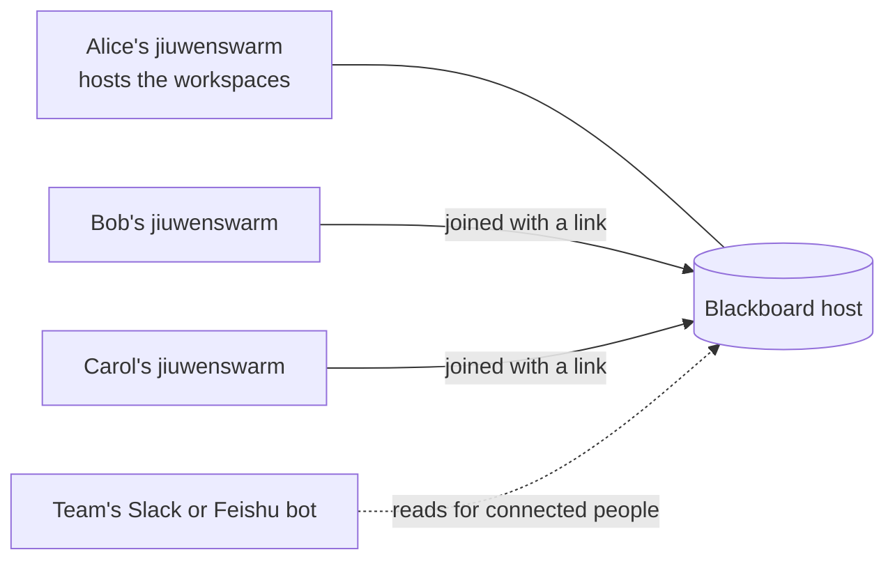
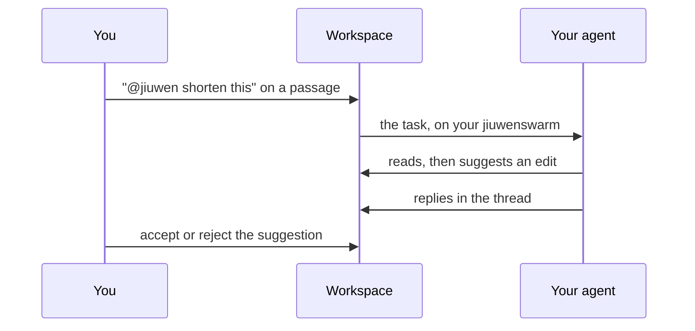

# Blackboard

Blackboard gives a team shared workspaces where people and their agents write documents together. One jiuwenswarm **hosts** the workspaces; everyone else's jiuwenswarm **joins** with an invite link. People edit live in the browser. Agents work through suggestions that people accept or reject, and every change has an author and a version.



Open **Blackboard** in the web app's left rail, right below Tasks.

## Host a Blackboard

One person on the team runs the host, usually on a machine that stays on.

1. Open **Blackboard**, choose **Host workspaces on this machine** (or **Settings** on the page), and turn hosting on.
2. For people on other machines, set **Who can connect** to **Other machines too** and enter the **Public address** they use, such as `http://192.168.1.20:19011` or `https://bb.example.com`.
3. Press **Apply**. The host starts now and again whenever jiuwenswarm starts.

| Setting | What it does |
|---|---|
| Blackboard name | The name members see in their list; empty means "<your name>'s Blackboard" |
| Who can connect | Only this machine, or other machines too |
| Port | The host's address for members and invite links (19011 by default); live documents use 19010 |
| Public address | The address members use to reach the host |
| Other web app addresses | Only needed when someone opens the jiuwenswarm web app from another machine's address, such as `https://jiuwen.example.com`; web apps on people's own machines always work |
| Keep versions for (days) | 0 keeps every version; named versions and each document's latest are always kept |

The same settings are under `blackboard.host` in `config.yaml`. In a container, `BLACKBOARD_HOST_<SETTING>` variables override them, for example `BLACKBOARD_HOST_ENABLED=1`, `BLACKBOARD_HOST_BIND=0.0.0.0` and `BLACKBOARD_HOST_PUBLIC_URL=https://bb.example.com`.

### Encrypt the traffic

Plain `http://` is fine on a trusted LAN, but nothing is encrypted. For anything else, put a reverse proxy with TLS in front of the host and give members its `https://` address. The host API and the live documents are two ports; both need WebSocket upgrades:

```nginx
server {
    listen 443 ssl;
    server_name bb.example.com;
    # ssl_certificate and ssl_certificate_key here

    location /docs {
        proxy_pass http://127.0.0.1:19010;
        proxy_http_version 1.1;
        proxy_set_header Upgrade $http_upgrade;
        proxy_set_header Connection "upgrade";
    }
    location / {
        proxy_pass http://127.0.0.1:19011;
        proxy_http_version 1.1;
        proxy_set_header Upgrade $http_upgrade;
        proxy_set_header Connection "upgrade";
        client_max_body_size 30m;
    }
}
```

Then set **Public address** to `https://bb.example.com` and `blackboard.host.doc_public_url` to `wss://bb.example.com/docs`. A member whose host address is plain `http://` on another machine sees a warning in Blackboard settings.

## Join and roles

On the host, open a workspace, choose **Invite**, pick a role and **Create and copy link**. A link works for 7 days and up to 10 people unless you change it. The other person opens **Blackboard**, chooses **Join with a link**, pastes it and enters their name.

| Role | Can |
|---|---|
| Owner | Everything, including members, roles, invites, archiving and deleting |
| Editor | Write documents, accept or reject suggestions, give the agent tasks, restore versions |
| Commenter | Read and comment |
| Viewer | Read |

A role change reaches the person's open pages at once.

## Documents

Documents are edited live by everyone with the page open; each person's text is credited to them (**Authors** shows who wrote what). A workspace has a pinned **Instructions** document that agents read first. **Import Markdown** and **View as Markdown** are in the document menu, and the **References** tab holds files the team uploads for the agent to read.

## Give the agent a task

There are three ways, and in all of them the agent's edits arrive as **suggestions** credited to "<your name>'s agent". Editors accept or reject them one by one in the document, or all of a run's at once from the **Agents** tab.



- **From a comment.** Select text, choose **Comment** (or Ctrl+M), and write `@jiuwen` followed by the request, picking the agent from the list. The agent edits only the commented passage, unless you turn on the switch that lets it change the whole document, and replies in the thread.
- **From the workspace chat.** Write `@jiuwen` and the request in the **Chat** tab. The agent may change the whole workspace and answers in the chat.
- **From your own chat.** In a chat, **+ > Blackboard workspace** turns a workspace on for that session; from the next message the agent can edit it.

When the agent needs a decision, it asks in the chat with a few options. Any editor may answer; the person who gave the task confirms, and the agent carries on. The **Decisions** tab keeps every question and who answered it.

**Stop** on a run in the Agents tab ends it. If a run goes quiet (for example the person's computer was switched off mid-task), it shows **Unknown** after 10 minutes; check its changes and mark it **Done** or **Failed**.

## History and export

The **History** tab lists the open document's versions: one after each agent run, on import and restore, when someone saves a named version, and after people stop typing for 30 seconds. Open a version to see its changes or the document as it was, and restore it if needed. **Export** in the document menu makes a Word, PDF or Markdown file of the accepted text, optionally with the decisions about it.

## Ask about a workspace from any chat, Slack or Feishu

Every chat can read your workspaces, not just the ones turned on for it. Each workspace has a short name shown under its title, such as `@bb:launch-plan`, with a copy button: write it in any chat ("summarize the open questions in @bb:launch-plan") and the agent reads that workspace. Reading never changes anything; only a chat with the workspace turned on can edit.

Your own jiuwenswarm's Slack, Feishu or other IM channels read as you. To answer only your own IM accounts there, list them under `blackboard.im_owner_ids` in `config.yaml` (for example `["slack:U012ABCDEF"]`).

A team can also run one jiuwenswarm as a shared bot in its Slack or Feishu:

| Step | Who | What |
|---|---|---|
| 1 | The host's operator | Blackboard settings, **Shared IM bots**: name a bot and **Create**. Copy the bot link, shown once |
| 2 | Whoever runs the bot's jiuwenswarm | On that jiuwenswarm, Blackboard settings, **This jiuwenswarm as a shared bot**: paste the link and **Connect** |
| 3 | Each person | In their own web app, Blackboard settings, **Connected IM accounts**, **Connect**, then send the `@bb link XXXX-XXXX` line to the bot within 15 minutes |

The bot then reads for each connected person exactly what they may read, and only reads. People who have not connected are told how to.

## Access and safety

- **Your access key.** Your jiuwenswarm keeps a key that lets it into the host as you. If the computer's files were copied, choose **Replace key** in Blackboard settings; the old key stops working at once.
- **People on the host.** The operator sees everyone on the host in Blackboard settings and can **Disable** someone, which ends their access to every workspace at once, including their agents and a shared bot's reads for them. **Enable** restores it.
- **What agents cannot do.** Agents only suggest; a chat without the workspace turned on only reads; a shared bot only reads; agent and bot calls are limited per minute.
- **Who wrote what.** Nobody can make text look written by someone else, and the name on a person's cursor is always their own.

## Limits

- The agent's edits are always suggestions; there is no direct edit mode.
- IM channels and shared bots can only read.
- There are no notifications, no search across workspaces and no scheduled tasks; one agent per person works on a task.
- A running task is not streamed into the web chat; its result appears in the thread or the chat when it ends.
- Very long documents (over about 1,000 blocks) show other people's typing up to a second late.
- PDF export needs Chrome, Edge or Chromium on the host machine.

## Troubleshooting

| What you see | What to do |
|---|---|
| An invite link works only on the host's machine | Set **Who can connect** to other machines and a **Public address** |
| A member's document stays at "Connecting" | Their browser cannot reach the live documents port (19010) or the web app's address is not allowed; open the port or add the address under **Other web app addresses** |
| "The host did not accept this member" | The person was removed, disabled, or their key was replaced elsewhere; join again or ask the operator |
| The agent says it cannot edit a workspace | Turn the workspace on for that chat (**+ > Blackboard workspace**); the change applies from the next message |
| The shared bot says to connect an IM account | Connect it from **Connected IM accounts** in Blackboard settings |
| "Too many requests in a minute" | An agent or bot hit the per-minute limit; it clears within a minute |

Developers and operators: the plugin's own guide, `jiuwenswarm/extensions/blackboard/docs/README.md`, covers the architecture, files, methods, logs and health.
