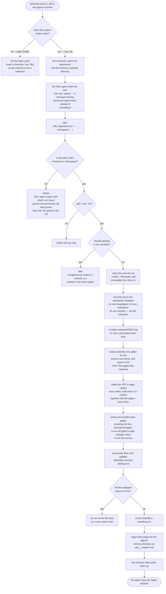
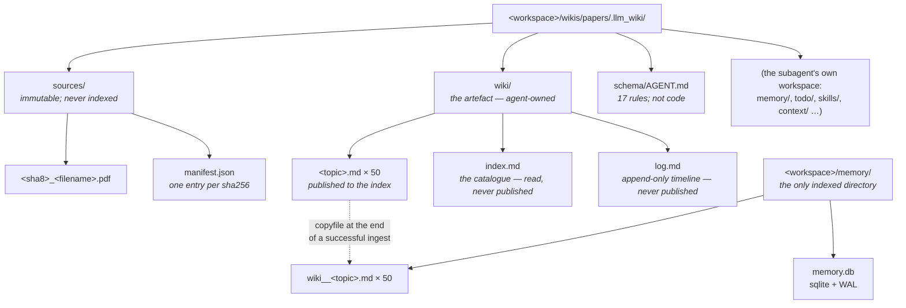
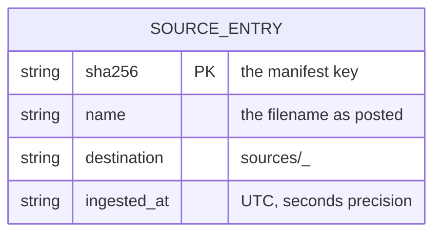
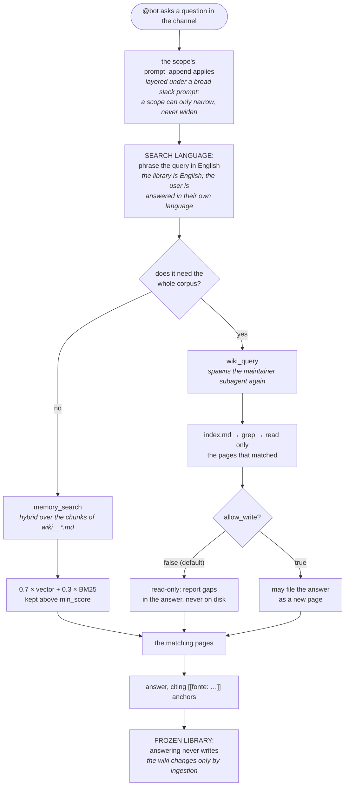

# Second brain (papers wiki) — data flow and storage schema

Three questions, three diagrams: what happens when a paper arrives, what is on disk
afterwards, and what happens when somebody asks a question.

Source of truth for everything below: `jiuwenswarm/agents/harness/common/tools/wiki_tools.py`,
`jiuwenswarm/server/runtime/agent_adapter/interface_deep.py` (tool registration and the
kernel patches), and the wiki's own `schema/AGENT.md`, which lives outside the repository.

This is the *compiling* half of a second brain: a model writes the artefact. A companion
document, `second-brain-architecture-miguel.md`, describes a *cataloguing* design over the
same problem, where the model writes only a summary and everything structural is derived.
Section 4 here compares them, because the two are not competitors so much as different
answers to "who is trusted to write what".

---

## 1. Ingestion — a paper arrives

A PDF posted in the papers channel becomes a conversation turn, unlike the cataloguing
design where ingestion is silent. That is deliberate and it is also the main cost: the
turn lasts minutes and the channel watches it happen.



**Three things worth knowing.**

- **The model writes the artefact, not a summary of it.** This is the whole bet. The
  maintainer does not describe the paper; it compiles the paper into topic pages that
  another paper can later contradict. The library therefore *compounds*: ingesting the
  second paper rewrote the first's pages to distinguish two senses of "recursive
  self-improvement", and the third produced a three-way comparison using the first's H1
  hypothesis as a ruler. Nothing in the design asked for that; it falls out of letting a
  writer own the pages.
- **Trust is bought with rules, not with structure.** Every substantive claim carries
  `[[fonte: <file> p.N]]` on the same line, with a ≤25-word blockquote of the source
  underneath, quoted as extracted — hyphenation artefacts and all. Rule 10 forbids
  inventing a page when a read returned no locator; rule 13 forbids inventing any value to
  fill a gap. Current state: 1276 anchors across 52 pages, 0 broken links. The weakness is
  structural: these are *instructions*, and an instruction can be disobeyed. See §4.
- **The manifest only records success.** A failed ingest leaves no entry, so a retry is
  clean — but a *rejection* leaves no entry either, so a re-posted PNG pays for its refusal
  every time. The cataloguing design memoises refusals; this one does not.

---

## 2. Storage — what is on disk

Two roots, and the second one is the surprise: the wiki root is also the maintainer
subagent's own agent workspace, so `.llm_wiki/` carries `AGENT.md`, `memory/`, `todo/` and
`skills/` alongside the three directories the design cares about.



> **`index.md` and `log.md` are deliberately not published.** They are navigation and
> bookkeeping, and indexing them puts a catalogue of every topic into competition with the
> topics themselves — a query for any subject matches the index line about it. They are read
> directly by path when the channel asks to see the library.

> **`copyfile`, never a move or a symlink.** The index's watcher has no `on_moved` handler,
> so a moved file is not reindexed; and `copyfile` rather than `copy2` so the copy gets a
> fresh mtime and change detection fires.

### `manifest.json` — one entry per set of bytes



Keyed by sha256 and written whole. Deliberately thin: it answers "have we seen these
bytes?" and nothing else. Everything a reader would want — what the paper claims, where a
claim came from — lives in `wiki/`, because that is the artefact. Note what is *absent*
and what that costs: no `slack_permalink`, no poster, no `posted_at`. A page can point at
page 11 of a PDF but not back at the message that brought it.

### `wiki/<topic>.md` — the indexed artefact

```
# <Title>

<one paragraph saying what this page covers>

## <a self-describing section heading>        ← rule 14: the index is built
                                                 from these without reading the page
<claim> [[fonte: bdfaa68d_1706.03762v7.pdf p.3]]
> the source text, ≤25 words, quoted as extracted
```

Four of the pages are **transversal** — `limitations-and-gaps.md`, `cost-and-scale.md`,
`disagreements.md`, `open-questions.md` — mandated by rules 15-17 and rewritten on every
ingest. They are what answers a question no single paper's page can ("where do these
disagree?", "what does this cost to run?"), and they are the mechanism by which the library
compounds rather than accumulates.

### `memory.db` — the kernel's `lite` schema

Unchanged from the kernel: `files`, `chunks` (~256-token chunks, 32 overlap),
`chunks_fts` (FTS5 trigram, BM25), `chunks_vec` (sqlite-vec), `embedding_cache`, `meta`.
Chunks, not pages, are the retrieval unit, so one page occupies several rows.

Two defects in that shared code were found by building on it and are patched from
`jiuwenswarm/server/runtime/memory/`: the FTS table was dropped on every restart and never
refilled, and the BM25 rank-to-score transform was inverted. Spec §15 has both.

---

## 3. Retrieval — a question arrives

There is no rail here. Retrieval is whatever the channel prompt tells the agent to do, and
the agent has two tools with very different costs.



### What the query is matched against

**The chunks of the wiki pages** — never the PDF. The PDF is read only during ingestion.
A reader who wants the source follows an anchor by hand; there is no drill-down tool that
seeks into the original.

### The two tools, and when each is right

| | `memory_search` | `wiki_query` |
|---|---|---|
| cost | one search | a whole subagent session, minutes |
| sees | the chunks that matched | index, grep, then whole pages |
| good for | "what is X?", "which benchmarks?" | "where do these disagree?" |
| writes | never | only if `allow_write=True` |

`allow_write` defaults to false, and that default was bought with a bug: the write-back was
unconditional, and the channel's FROZEN LIBRARY rule could not prevent it, because that rule
addresses the *main agent* while the write happened inside `wiki_query`'s subagent — a layer
the channel prompt never reaches. A question duly created a page, registered it in
`index.md` and appended to `log.md`. **A rule cannot be enforced from a layer that does not
control where the action happens**; the flag moved the decision to the caller, where it can
be seen.

### Containment

There is none, and this is the clearest gap. Papers are untrusted content arriving from a
shared channel, their text is read into the maintainer's context during ingestion, and their
content ends up inside wiki pages that are later injected into the answering agent's
context. Nothing fences that content, marks it as data, or neutralises instruction-shaped
text inside it. The cataloguing design's `<<<BRAIN_DOC>>>` fences — with `<<<`/`>>>` in the
body replaced by look-alike characters that cannot close a fence — are the reference for
what this needs.

---

## 4. The trade against the cataloguing design

Same problem, opposite answer to "who writes what".

| | this (compiling) | cataloguing |
|---|---|---|
| what the model writes | the pages, including cross-source synthesis | a summary, nothing else |
| provenance | rules the model must obey | derived from the file and from Slack |
| cross-document layer | four transversal pages, rewritten per ingest | none |
| ingestion cost | minutes, and a visible channel turn | seconds, two emoji |
| re-posting a rejected file | pays again | memoised |
| untrusted content | unfenced | fenced, and declared twice |

The honest summary: **the cataloguing design cannot send a reader to the wrong page; this
one can be told not to.** Rules 8-13 exist precisely because the failure is possible, and
the failure has been observed — the maintainer invented a `log.md` date when it could not
run `date`, and the library once claimed eight authors while anchoring four. Both were
caught, one by the agent itself reporting the gap rather than filling it.

What this design buys for that price is the thing the other cannot do: an artefact that
answers a question no single document contains, and that gets better as documents arrive
rather than merely larger. Whether that is worth an unfenced, model-written corpus depends
entirely on who is posting the documents.

The two compose, in principle: cataloguing as a cheap, safe, trustworthy ingestion layer,
compiling as a synthesis layer over it. Neither document has designed that seam.

---

## Debugging

| Question | Where to look |
|---|---|
| What is in the corpus? | `wiki/index.md`, and `sources/manifest.json` for what was ingested when |
| Did a page reach the search index? | `ls <workspace>/memory/wiki__*.md`, then count rows in `memory.db` |
| Is the lexical channel alive? | `chunks` vs `chunks_fts_docsize` in `memory.db` — if the second is 0, see spec §15.1 |
| Are the anchors intact? | `grep -c "\[\[fonte:" wiki/*.md`, and check that every `](*.md)` target exists |
| Why did an ingest take so long? | `~/.jiuwenswarm/logs/run/jiuwen.log`; a `timed out after 300.0s` means the patch of §15.1 is not in your checkout |
| What did the maintainer actually do? | `wiki/log.md` — one entry per ingest, capped at 30 lines, with the rules it could not satisfy |
