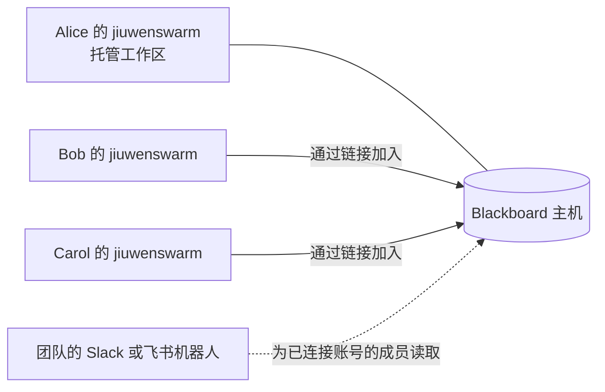
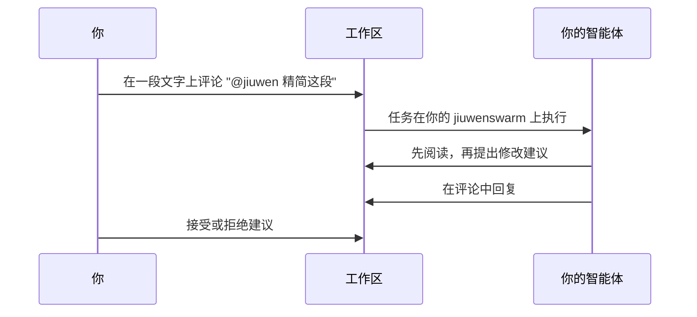

# Blackboard

Blackboard 为团队提供共享工作区，成员和各自的智能体在其中一起编写文档。由一个 jiuwenswarm **托管**工作区，其他人的 jiuwenswarm 通过邀请链接**加入**。成员在浏览器中实时编辑；智能体的修改以**建议**的形式出现，由成员接受或拒绝；每处修改都有作者和版本记录。



在网页应用左侧导航栏中打开 **Blackboard**（位于“任务”下方）。

## 托管 Blackboard

团队中由一人运行主机，通常选一台保持开机的电脑。

1. 打开 **Blackboard**，选择 **在本机托管工作区**（或页面上的 **设置**），打开托管开关。
2. 如需其他电脑上的成员加入，将 **谁可以连接** 设为 **其他电脑也可以**，并填写成员使用的 **公开地址**，例如 `http://192.168.1.20:19011` 或 `https://bb.example.com`。
3. 点击 **应用**。主机立即启动，并在每次 jiuwenswarm 启动时自动启动。

| 设置 | 作用 |
|---|---|
| Blackboard 名称 | 成员在列表中看到的名称；留空则为“<你的名字>'s Blackboard” |
| 谁可以连接 | 仅本机，或其他电脑也可以 |
| 端口 | 成员和邀请链接使用的主机地址端口（默认 19011）；实时文档使用 19010 |
| 公开地址 | 成员访问主机所用的地址 |
| 其他网页应用地址 | 仅当有人从其他电脑的地址打开 jiuwenswarm 网页应用时需要，例如 `https://jiuwen.example.com`；成员在自己电脑上打开的网页应用始终可用 |
| 版本保留天数 | 0 表示保留所有版本；命名版本和每个文档的最新版本始终保留 |

这些设置也位于 `config.yaml` 的 `blackboard.host` 下。在容器中可用 `BLACKBOARD_HOST_<设置名>` 环境变量覆盖，例如 `BLACKBOARD_HOST_ENABLED=1`、`BLACKBOARD_HOST_BIND=0.0.0.0` 和 `BLACKBOARD_HOST_PUBLIC_URL=https://bb.example.com`。

### 加密通信

在可信的局域网中使用 `http://` 即可，但通信未加密。其他情况下，请在主机前放置启用 TLS 的反向代理，并把代理的 `https://` 地址告诉成员。主机 API 和实时文档使用两个端口，都需要支持 WebSocket 升级：

```nginx
server {
    listen 443 ssl;
    server_name bb.example.com;
    # 在此配置 ssl_certificate 和 ssl_certificate_key

    location /docs {
        proxy_pass http://127.0.0.1:19010;
        proxy_http_version 1.1;
        proxy_set_header Upgrade $http_upgrade;
        proxy_set_header Connection "upgrade";
    }
    location / {
        proxy_pass http://127.0.0.1:19011;
        proxy_http_version 1.1;
        proxy_set_header Upgrade $http_upgrade;
        proxy_set_header Connection "upgrade";
        client_max_body_size 30m;
    }
}
```

然后将 **公开地址** 设为 `https://bb.example.com`，并将 `blackboard.host.doc_public_url` 设为 `wss://bb.example.com/docs`。如果成员连接的是其他电脑上的 `http://` 主机，Blackboard 设置中会显示提醒。

## 加入与角色

在主机上打开工作区，选择 **邀请**，选择角色后点击 **创建并复制链接**。链接默认 7 天内有效，最多 10 人使用，可以修改。对方打开 **Blackboard**，选择 **通过链接加入**，粘贴链接并填写名字。

| 角色 | 可以 |
|---|---|
| 所有者 | 全部操作，包括成员、角色、邀请、归档和删除 |
| 编辑者 | 编写文档、接受或拒绝建议、给智能体布置任务、恢复版本 |
| 评论者 | 阅读和评论 |
| 查看者 | 阅读 |

角色变更会立即反映到对方打开的页面上。

## 文档

打开同一文档的所有人实时共同编辑，每个人写的文字都记在其名下（**作者** 显示谁写了什么）。每个工作区都有一个置顶的 **说明** 文档，智能体会首先阅读它。文档菜单中有 **导入 Markdown** 和 **以 Markdown 查看**；**参考资料** 标签页存放团队上传、供智能体阅读的文件。

## 给智能体布置任务

有三种方式。无论哪种，智能体的修改都以**建议**的形式出现，记在“<你的名字>'s agent”名下。编辑者可以在文档中逐条接受或拒绝，也可以在 **智能体** 标签页中一次处理某次任务的全部建议。



- **通过评论。** 选中文字，点击 **评论**（或按 Ctrl+M），输入 `@jiuwen` 和要求，并从列表中选择智能体。智能体只修改被评论的段落（打开开关后可修改整篇文档），并在评论中回复。
- **通过工作区聊天。** 在 **聊天** 标签页中输入 `@jiuwen` 和要求。智能体可以修改整个工作区，并在聊天中回答。
- **通过你自己的对话。** 在对话中通过 **+ > Blackboard 工作区** 为该会话开启某个工作区；从下一条消息起，智能体就能编辑它。

当智能体需要决定时，会在聊天中提出问题并给出几个选项。任何编辑者都可以回答，由布置任务的人确认后，智能体继续执行。**决策** 标签页记录每个问题及回答者。

在智能体标签页中点击任务的 **停止** 即可结束任务。如果任务长时间没有动静（例如布置任务的人的电脑中途关机），10 分钟后显示为 **未知**；请检查其修改后标记为 **完成** 或 **失败**。

## 历史与导出

**历史** 标签页列出当前文档的版本：每次智能体任务后、导入和恢复时、有人保存命名版本时，以及成员停止输入 30 秒后都会生成版本。打开某个版本可查看其改动或当时的文档，需要时可以恢复。文档菜单中的 **导出** 可将已接受的文字导出为 Word、PDF 或 Markdown 文件，并可附上相关决策。

## 在任意对话、Slack 或飞书中询问工作区

每个对话都能读取你的工作区，而不只是为它开启的那些。每个工作区标题下方有一个短名称，例如 `@bb:launch-plan`，旁边有复制按钮：在任意对话中写上它（“总结 @bb:launch-plan 中尚未解决的问题”），智能体就会读取该工作区。读取不会做任何修改；只有开启了该工作区的对话才能编辑。

你自己的 jiuwenswarm 的 Slack、飞书或其他 IM 频道以你的身份读取。如只希望回应你自己的 IM 账号，请在 `config.yaml` 的 `blackboard.im_owner_ids` 中列出它们（例如 `["slack:U012ABCDEF"]`）。

团队也可以把一个 jiuwenswarm 作为共享机器人放在 Slack 或飞书中：

| 步骤 | 由谁 | 做什么 |
|---|---|---|
| 1 | 主机管理员 | Blackboard 设置中的 **共享 IM 机器人**：填写名称并 **创建**，复制仅显示一次的机器人链接 |
| 2 | 运行机器人 jiuwenswarm 的人 | 在该 jiuwenswarm 的 Blackboard 设置中的 **作为共享机器人**：粘贴链接并 **连接** |
| 3 | 每位成员 | 在自己的网页应用中，Blackboard 设置的 **已连接的 IM 账号**，点击 **连接**，并在 15 分钟内把 `@bb link XXXX-XXXX` 发给机器人 |

之后机器人会为每位已连接账号的成员读取其本人可读的内容，而且只读。尚未连接的人会收到连接方法。

## 访问与安全

- **你的访问密钥。** 你的 jiuwenswarm 保存着一个以你的身份进入主机的密钥。如果电脑上的文件被复制，请在 Blackboard 设置中点击 **更换密钥**，旧密钥会立即失效。
- **主机上的成员。** 管理员可在 Blackboard 设置中看到主机上的所有人，并可 **停用** 某人：立即终止其对所有工作区的访问，包括其智能体以及共享机器人为其进行的读取。**启用** 即可恢复。
- **智能体不能做的事。** 智能体只能提出建议；未开启工作区的对话只能读取；共享机器人只能读取；智能体和机器人的调用有每分钟次数限制。
- **谁写了什么。** 任何人都无法让文字看起来是别人写的，成员光标上显示的名字始终是其本人。

## 限制

- 智能体的修改始终是建议，没有直接修改模式。
- IM 频道和共享机器人只能读取。
- 暂无通知、跨工作区搜索和定时任务；一个任务由一个智能体完成。
- 运行中的任务不会实时显示在网页对话中；结束后结果出现在评论或聊天中。
- 很长的文档（约 1,000 个块以上）中，他人的输入可能延迟最多约一秒显示。
- 导出 PDF 需要主机上装有 Chrome、Edge 或 Chromium。

## 常见问题

| 现象 | 处理方法 |
|---|---|
| 邀请链接只能在主机所在电脑上使用 | 将 **谁可以连接** 设为其他电脑也可以，并填写 **公开地址** |
| 成员的文档一直显示“连接中” | 对方浏览器无法访问实时文档端口（19010），或网页应用地址未被允许；请开放端口或在 **其他网页应用地址** 中添加该地址 |
| “主机不接受此成员” | 此人已被移除、停用，或其密钥已在别处更换；请重新加入或联系管理员 |
| 智能体说无法编辑某个工作区 | 在该对话中开启该工作区（**+ > Blackboard 工作区**），从下一条消息起生效 |
| 共享机器人提示连接 IM 账号 | 在 Blackboard 设置的 **已连接的 IM 账号** 中连接 |
| “一分钟内请求过多” | 智能体或机器人达到每分钟上限，一分钟内自动恢复 |

开发者和运维人员请参阅插件自身的说明 `jiuwenswarm/extensions/blackboard/docs/README.md`，其中介绍了架构、文件、方法、日志和健康检查。
