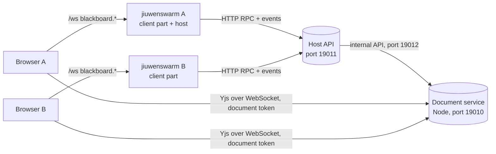
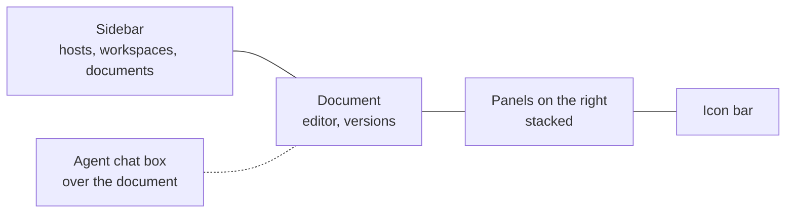
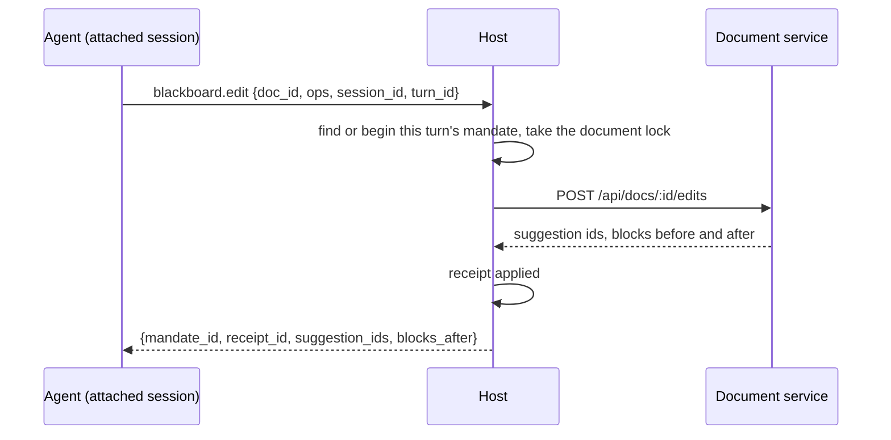

# Blackboard

Blackboard gives a team shared workspaces where people and agents write documents together. One jiuwenswarm instance runs the **host**: it keeps users, workspaces, members and invites, and serves an HTTP API. Every member's jiuwenswarm runs the **client part**: it keeps a link to each host the person joined and proxies the browser's calls. The browser only ever talks to its own jiuwenswarm.



Milestones 2 to 8 are built: the host, identity, workspaces, members, invites, live documents, references, Markdown in and out, agents that edit documents from a person's chat session, comments, the workspace chat and decisions (where `@jiuwen` gives the person's agent a task), version history with restore and export to Word, PDF and Markdown, reading workspaces from any chat, including Slack or Feishu through a team's shared bot, and the hardening for a team release (see [Security](#security) and [Operations](#operations)). The user guide is `docs/en/Blackboard.md` (and `docs/zh/Blackboard.md`) in the repository. The browser edits a document directly with the host's document service, using a short-lived document token that the host mints; everything else goes through the browser's own jiuwenswarm.

Blackboard is always on: it ships in the package's `extensions` folder, which every instance loads, and `is_enabled()` always returns true. In the rail it sits right below Tasks (`nav_after="chat"` on its page contribution) with its own chalkboard icon (`applicationPluginNavIcon`, exported from `frontend/index.tsx`). Both are general plugin features, so other built-in plugins can use them too.

## Layout

| Folder | What it holds |
|---|---|
| `extension.py` | The plugin: binds the web channel, starts the client part and, when enabled, the host |
| `common/` | Errors, ids, roles, tokens, settings, method and event names, the shared JSON file |
| `host/store/` | SQLite store (one worker thread), migrations, users, workspaces, memberships, invites |
| `host/api/` | FastAPI app: RPC dispatcher, method table, role checks, events WebSocket, join page, health |
| `host/runtime.py`, `host/controller.py` | Starting and stopping the host and its document service, applying settings, the operator's own host entry |
| `host/docservice_manager.py` | Finds Node, starts `host/docservice/dist/server.mjs`, restarts it when it exits (1 to 30 s backoff), stops it gracefully; `DocServiceClient` for its internal API |
| `host/api/documents.py`, `host/api/references.py` | Document and reference methods, the upload and download routes |
| `host/api/mandates.py`, `host/api/locks.py` | Agent edits: mandates, receipts, document locks and their wait queue, suggestion decisions, the idle sweeper |
| `host/api/comments.py`, `host/api/chat.py`, `host/api/decisions.py`, `host/api/feed.py` | Threads and comments, the workspace chat, the agent's questions, and posting replies, notices and summaries |
| `host/api/history.py` | Version history (list, one version, diff, save, restore), exports and their download links, and the endpoint where the document service announces versions |
| `host/api/identities.py`, `host/api/ratelimit.py`, `host/extract.py` | Shared bots and connected IM accounts, the per-minute limits, and the text of a reference file |
| `host/api/people.py`, `host/api/ops.py`, `common/origins.py` | Replacing a member token and the operator's people list; health and the metrics line; which web pages may open the host's WebSockets |
| `host/api/dispatch.py` | Tasks from comments and the chat: beginning and queueing them, offering turns, claim and report, the turn's material, the sweeper for turns nobody picked up |
| `host/docservice/` | The document service (TypeScript, run by Node 22.5+): Hocuspocus with SQLite, document tokens, the author guard, the shared Tiptap schema, Markdown in and out, the agent view. No npm project of its own: its packages are in the web app's `package.json` |
| `client/` | Known hosts (`hosts.json`), host links, joining with a link, local RPC proxies, reference uploads, bot links when this jiuwenswarm is a team's shared bot (`bots.py`), sessions attached to workspaces (`sessions.py`), the dispatcher that runs comment and chat tasks (`dispatcher.py`) and their prompt (`prompt.py`) |
| `client/toolkit/` | The agent's Blackboard tools and their bridge to openjiuwen, handed to the AgentServer through the `agent_tools` hook |
| `frontend/` | The page (bundled into the web app), its controller, dialogs, panels and rail icon. One controller lives for the app's lifetime and remembers the host, workspace, document and open panels in `localStorage` (`blackboard.selection`), so the page opens where it was left; `layout.ts` keeps the sizes |
| `frontend/components/Dock.tsx`, `Resizer.tsx`, `AgentChat.tsx`, `Shortcuts.tsx` | The icon bar and stacked panels, the resize handles, the agent chat box, and the keyboard shortcuts with their list and the document switcher |
| `frontend/chat/` | The + menu item and the input tag in the chat |
| `frontend/editor/` | The document editor, loaded lazily: the provider session, the author stamp, the authors legend, comment highlights and anchors (`comments.ts`) |
| `tests/backend/`, `tests/frontend/` | pytest and node:test suites |

## The page



- **Icon bar and panels.** An icon on the right edge shows its panel alone (chat, comments, decisions, history, agents, references, members); the same icon again, when its panel is the only one, closes it. Dragging an icon onto the upper or lower half of an open panel splits the side, so several panels stack (Ctrl+Alt+Shift with a digit does the same from the keyboard). Each folds to its header (its chevron, or a double-click), closes, moves by dragging its header (or Alt+Up and Alt+Down), and shares the height with the next one through the handle between them. `controller.panels` holds the open panels in order and `rail` the one last asked for (`showPanel`, `closePanel`, `movePanel`); code that asks for a panel (`selectRail`, following a chat's tag, opening a version or a detached thread) shows it in place of the current one, so a split the person made keeps its shape, and unfolds it.
- **Sizes.** The sidebar and the panels resize by dragging their inner edge (or focusing it and using the arrow keys), and each hides: the sidebar to a thin strip, the panels behind the last icon. `frontend/layout.ts` keeps the sizes, the folded panels and the chat box in `localStorage` (`blackboard.layout`); the open panels are part of `blackboard.selection`. The document column stops at 1,180 px so lines stay readable on a wide screen.
- **Agent chat box.** Choosing a session in the Agents panel (or **New agent session**) opens it in a chat box over the document, with a tab per session, instead of leaving for the chat page; **Open in the chat page** still goes there. The **+** after the tabs starts another session on the workspace, and a double-click on a tab renames its session. The box reads the app's own chat store (`useChatStore.runtimes[session]`), which receives every session's events, and loads a session's history with the app's `beginHistoryRestore` only when the store and the main chat do not have it already. It sends with `chat.send` (adding the person's message to the store first, as the main chat does) and stops with `chat.interrupt`. Each message carries `metadata.interaction_context`, which the AgentServer puts before the message for the model only: the workspace and the open document, and that a section or heading mentioned without a place is in that workspace, not in local files. The attached session's `blackboard_list_docs` description says the same, for turns from the chat page. A question from the agent (a permission prompt, an `ask_user` question) shows in the box and is answered there: the app's `InteractionSlot` and `InlineQuestionCard` take a `sessionId`, and `features/sessionAnswers.ts` lets the box answer through the app's `sendUserAnswer` for any session. The box grows from its left and top edges and its top left corner, and keeps its size. Messages from others in the workspace chat count on the chat icon while the chat panel is out of view.
- **Shortcuts.** Ctrl+Alt with a digit shows a panel alone, in icon order, and Ctrl+Alt+Shift with a digit adds it to the split or takes it out; Ctrl+Alt+S the sidebar, Ctrl+Alt+B the panels, Ctrl+Alt+J the chat box, Ctrl+Alt+O a document switcher, Ctrl+Alt+N a new document, and Ctrl+J in a document a task for the agent; `?` lists them all. They are matched by physical key and never fire with AltGr, so typing in any keyboard layout is unaffected (`frontend/components/Shortcuts.tsx`).

## Run a host

In the web app, open **Blackboard** and choose **Host workspaces on this machine**, or open **Settings** from the page. Turn hosting on, check the port and press **Apply**. The host starts at once and again with every Gateway start. The same settings live in `config.yaml`:

| Key under `blackboard.host` | Default | Meaning |
|---|---|---|
| `enabled` | `false` | Run the host in this instance |
| `name` | empty | The name members see in their list of Blackboards; empty means "<operator>'s Blackboard". A rename reaches members at once, or when their link reconnects |
| `bind` | `127.0.0.1` | `0.0.0.0` lets other machines connect |
| `port` | `19011` | Member API and invite links |
| `public_url` | empty | The address members use, such as `https://bb.example.com`; without it, links point at `http://127.0.0.1:<port>` |
| `operator_name` | empty | Name of the person running the host; defaults to the machine user |
| `doc_port` | `19010` | Document service for browsers (Yjs over WebSocket) |
| `doc_api_port` | `19012` | Document service's internal API, always on 127.0.0.1 |
| `doc_public_url` | empty | The address browsers use for documents, such as `wss://bb.example.com/docs`; without it, `ws://` or `wss://` on the `public_url` host with `doc_port` |
| `node_path` | empty | Node to run the document service with; empty means `node` on `PATH` |
| `max_upload_mb` | `25` | Largest reference file |
| `allowed_origins` | empty | Web pages besides loopback ones whose browsers may open the live documents and the events socket, such as `https://jiuwen.example.com` (see [Security](#security)) |
| `allow_any_origin` | `false` | Skip the origin check, for a LAN where web apps are opened at many addresses |
| `version_retention_days` | `0` | Remove versions older than this, except named ones and each document's latest; 0 keeps every version |

Members on other machines need `bind: 0.0.0.0` and a `public_url`, and their browsers must reach `doc_port` too (or `doc_public_url` behind the proxy). Plain `http://` works on a LAN, but the traffic is not encrypted; a reverse proxy with TLS in front of the host is the recommended team setup (the user guide has an nginx example), and a member's settings warn when their host address is plain `http://` on another machine.

`BLACKBOARD_HOST_<KEY>` environment variables override these keys, for containers: `BLACKBOARD_HOST_ENABLED=1`, `BLACKBOARD_HOST_BIND=0.0.0.0`, `BLACKBOARD_HOST_PUBLIC_URL=...`, `BLACKBOARD_HOST_ALLOWED_ORIGINS=https://a.example,https://b.example`. The host status lists the overridden keys (`env_overrides`), and the settings dialog says that changing them there has no effect. Both Dockerfiles expose ports 19011 and 19010.

## The document service

The host runs it as a child process with Node 22.5 or later (below 22.13 with `--experimental-sqlite`; the desktop builds bundle Node 22.11). It is one bundled file, `host/docservice/dist/server.mjs`, with no native modules (storage is `node:sqlite`), and `dist/THIRD_PARTY_NOTICES.txt` next to it holds the licenses of everything bundled.

There is no separate build step. The service's packages are in the web app's `package.json` and lockfile, and the web app's `npm run build` and `npm run dev` write the bundle too (a Vite plugin in `vite.config.ts` calls `host/docservice/build.mjs`). So the usual `npm install && npm run build` in `jiuwenswarm/channels/web/frontend`, which `scripts/build.sh` and the other release scripts already run, produces everything. The wheel and the desktop build ship the bundle and its notices, not the TypeScript sources; the PyInstaller spec stops when the bundle is missing.

From `jiuwenswarm/channels/web/frontend`:

```bash
npm run build:blackboard-docservice   # rebuild only the bundle, after changing the service
npm run test:blackboard-docservice    # type check and node:test suites, run from the TypeScript sources
```

Without Node or without the bundle the host still runs; the page says why documents are unavailable, and the host status and `/blackboard/health` report `docservice: {status, reason}` (`not_built`, `node_missing`, `node_too_old`, `start_failed`, `exited`). The service exits by itself when the Gateway process goes away.

Rules worth knowing:

- Only the host creates and deletes documents (internal API with the `api_secret`). A browser connects with a document token `{uid, ws, doc, role, iat, exp}` signed with the `doc_secret`, valid for one hour; viewers, commenters and archived documents or workspaces get a read-only connection.
- When a role changes or a member leaves, the host tells the service at once. The service applies the new role to open connections (or closes them) and ignores tokens issued before the change, so an old token cannot bring the old role back.
- The author guard: a person's update may not add text credited to anyone else, whether through author marks, suggestion authors or block-level suggestion marks. It compares credits before and after the update, so splitting, joining and moving other people's text still works. A ledger per open document (`CreditLedger` in `hooks/authorGuard.ts`) keeps a shadow copy and each top-level block's credits, and counts again only the blocks an update touches: 2 to 6 ms per keystroke on a 1,600-block document, where comparing whole copies took 110 to 240 ms and let a fast typist's updates queue up for seconds. The whole-document check stays as the reference the ledger is tested against.
- Carets: the service overwrites the `user` of every awareness state a person's connection sends with the id and name from their document token, so nobody can show another name or an agent's caret.
- In the browser, everything a person types or pastes carries their author mark; text that undo or redo brings back is credited to the person who undid.
- `@tiptap/y-tiptap` is a vendored copy with a patch that keeps node marks (whole-block suggestions) in Yjs: `vendor/y-tiptap-nodemarks.js`, produced by `node host/docservice/scripts/make-ytiptap-nodemarks.mjs` from the pinned package; a test fails when the copy no longer matches. The web app's Vite config points `@tiptap/y-tiptap` at the same file, and resolves bare imports in plugin code from the web app's own `node_modules`.

## Agents

A person with the editor role or above can let an agent work on a workspace. On the page's **Agents** panel, **New agent session** creates a chat session (named after the workspace, numbered after the first), attaches it to the workspace and opens it in the chat box; **Use an existing session** attaches one of the person's other sessions. The panel lists the attached sessions by their chat names, and the pencil beside one renames it (through the app's own `session.rename`, so its sidebar follows); the one tasks from comments and the chat run in is tagged **Tasks**. From the chat itself, **+ > Blackboard workspace** lists the workspaces the person can edit on every joined host, with a switch each: turning one on adds the workspace to the session (creating the session first for a new task), turning it off takes it away. A session can work on several workspaces, on one or more hosts; the attachments are recorded in `client/sessions.json`, so they survive restarts. An attached session shows a Blackboard icon in the chat input; hovering lists the workspaces, and a click opens the first on the Agents tab.

The chat parts use two general plugin exports from `frontend/index.tsx`: `applicationPluginTaskMenuItem` (an item in the chat's + menu, with its own panel) and `applicationPluginTaskInputTag` (a tag in the input toolbar). Both get `sessionId`, which is null until a new conversation has a session.

Every session has Blackboard's read tools (see [Ask about a workspace from any chat](#ask-about-a-workspace-from-any-chat-slack-or-feishu)). From the next turn on, an attached session also has `blackboard_edit` for the workspaces it is attached to. The tools call the host with the person's member token, return `{"ok": true, ...}` or `{"ok": false, code, message, details}` as JSON, and are declared `DIRECT` so progressive tool disclosure does not hide them.



Rules worth knowing:

- Every edit belongs to a mandate. The first `blackboard.edit` of a chat turn in a workspace begins one (origin `workspace_session`, instruction from the edit's note), later edits of the turn in that workspace reuse it, and the next turn's first edit ends the session's earlier runs. A sweeper ends session mandates idle for 2 minutes.
- One mandate writes a document at a time. Another waits up to 60 s in a queue and then gets `busy` with its queue position; a Markdown import is refused with `busy` while a document is locked. Ending a mandate releases its locks.
- Edits are suggestions credited to "<requester>'s agent" (author mark `{id: <requester's user id>, kind: 'agent', mandate}`), one suggestion per operation; a replacement is a deletion and an insertion under one id. A batch is refused as a whole when a block changed since it was read (`stale`) or holds someone else's pending suggestions (`pending_suggestions`). The agent's own pending suggestions in a block are replaced by its new text. A replace of a list, quote or table compares it child by child: unchanged items keep their ids, the changed run of items is replaced whole, and a single changed item is compared word by word. A suggestion that the accepted or proposed view cannot show is refused as `unsupported_edit` instead of being stored.
- Editors accept or reject a suggestion from its card in the editor, or everything one run suggested in a document from the Agents tab. Both go through the host (`blackboard.suggestion.decide`), which asks the document service to apply them.
- **Stop** on a run cancels its mandate. The agent's further edits in that turn and workspace are refused with `no_mandate`; the chat turn itself runs until it ends.
- While a mandate writes, the editor shows the agent's caret with a robot label; it goes away when the mandate ends.

## Comments, chat and decisions

A comment belongs to a thread anchored to a passage: two Yjs relative positions, the quoted text (at most 300 characters) and the block it starts in. When the Comments tab loads, the host asks the document service to resolve the open threads' anchors: `ok` when the positions still hold the quote, `drifted` when the passage is in place but its text changed, and otherwise the quote is searched in the same block, a block with the same digest, then the whole document; one match moves the anchor, anything else leaves it `orphaned` (listed under Detached). Text is compared in the accepted view, so a pending suggestion does not change a passage. The editor highlights open passages, drifted ones in a warning colour, and shows each open thread as a card in a margin beside the text, level with its passage (`frontend/editor/CommentMargin.tsx`); cards that would overlap are pushed apart, and the active one stays level with its passage. **Comment** on a selection, or Ctrl+M, opens a new card there. A selection of any length can be commented on (the host bounds the quote at 100,000 characters); a quote over 2,000 characters is left out of the agent's prompt, which has the passage anyway. A card shows the first and the latest comment until it or its passage is clicked. The Comments tab lists every thread, with the resolved and detached ones.

Ctrl+J in a document opens a box at the cursor (`editor/TaskBox.tsx`) for a task to the person's agent. It is sent as a workspace chat message to `@jiuwen` with a `place`: the document, the top-level blocks at the cursor and the selected words. The host keeps the place in the mandate's `origin_ref`, not in its scope, and the task prompt shows those blocks, with "here" and "this" meaning that place. While such a task is queued or running, three moving dots sit at the end of the text of its last block in the open document (a widget decoration in `editor/taskMarkers.ts`, found by block id, from `controller.workingPlaces`).

The workspace chat is one stream per workspace: people's messages, the agent's replies, question cards, one-line summaries of thread replies, and notices. Notices and summaries are stored as `{"code": ..., ...}` and rendered in each member's language (`blackboard.notices.*`).

Writing `@jiuwen` in a comment or a chat message, picked from the mention list, gives the person's own agent a task: the body must match `@jiuwen` and the structured mentions must name the agent. Commenters get a notice instead.

```mermaid
sequenceDiagram
    participant H as Host
    participant C as Requester's client part (dispatcher)
    participant A as AgentServer
    H-->>C: blackboard.mandate.run {mandate_id, workspace_id, session_id}
    C->>C: chosen session, or the workspace's default one; attach it
    C->>H: blackboard.mandate.claim {mandate_id, session_id}
    H-->>C: turn_id, instructions, passage, thread or chat context, answer
    C->>A: the prompt on channel __blackboard__
    A-->>C: final answer
    C->>H: blackboard.mandate.report {turn_id, status, text}
```

Rules worth knowing:

- A comment task may edit only the commented blocks, or the whole document when the composer's switch is on. It holds the document from the start; another comment task on the same document queues (at most 20, then `queue_full`) and starts when the first ends. Resolving a thread cancels its queued tasks.
- A chat task may edit the whole workspace. Its prompt includes people's chat messages since the agent's last chat task, newest 40 and at most 8,000 characters.
- The prompt fences the workspace's own words (instructions, passage, thread, chat, answer) with a random nonce, so the agent can tell material from instructions.
- The agent's final answer is its reply: in the thread (with a summary line in the chat) for a comment task, in the chat for a chat task.
- In these turns the agent also has `blackboard_ask {question, options, recommended?}`. The question appears as a card in the chat, the thread and the Decisions tab, and the task waits. Any editor may answer; the requester's answer is final, anyone else's is a proposal the requester accepts or replaces. The accepted answer starts the next turn in the same session. The requester or an editor can withdraw the question, which stops the task.
- The first task in a workspace creates a session named after it and records it as the workspace's default in `client/sessions.json`; the composer can pick another attached session.
- Tasks offered while the requester's jiuwenswarm is off are picked up when its link to the host is back; after 10 minutes unclaimed they fail. A claimed turn with no report after 10 minutes becomes Unknown, and an editor marks it Done or Failed from the Agents tab after checking its changes. Stop on a running task cancels the chat turn.

## History and export

Every document has a version history, kept by the document service in `docs.db` as full snapshots (suggestion and author marks included). A version is taken when the document is created, after each agent batch, on import and restore, when someone saves one by name, and 30 seconds after people stop editing, with everyone who edited since the last version as its authors. Nothing is recorded when the content did not change. The service announces each version to the host (`POST /blackboard/internal/versions` with the API secret), which pushes `blackboard.doc.versions` to the workspace.

The **History** tab lists the open document's versions by day. A version opens in place of the editor: **Changes** compares it with the version before (or a chosen older one) block by block, with the changed words marked; **Document** shows it as it read. Editors and owners restore a version (the document becomes that version again, pending suggestions included, and the restore is itself a version) or save a named one; anyone can download a version as Markdown.

**Export** in the document menu makes a Word (.docx), PDF or Markdown file of the accepted text, pending suggestions left out, optionally with a table of the answered decisions about the document. The host keeps the file under `exports/` and the browser downloads it through a link that works for an hour. PDF is printed by a local Chrome, Edge or Chromium in headless mode: set `BB_CHROMIUM_PATH` in the Gateway's environment to choose one, otherwise the usual install places and a Playwright download are tried.

## Ask about a workspace from any chat, Slack or Feishu

Every session of a jiuwenswarm that joined a host can read the person's workspaces, whether it is attached or not: a web chat, a task, or a message from one of the instance's IM channels. Only an attached session edits.

| Tool | Returns |
|---|---|
| `blackboard_list_workspaces` | Every workspace the person can read on every joined host: `@bb:<name>`, title, host, role, and whether this session may edit it |
| `blackboard_list_docs {workspace?}` | The documents of a workspace (all attached ones when left out) |
| `blackboard_read {doc, range?, workspace?}` | The agent view of a document, its pending suggestions in the range, and `read_only: true` when this session may not edit it |
| `blackboard_list_references {workspace?}`, `blackboard_read_reference {reference, workspace?}` | Reference files, and the text of one |
| `blackboard_list_decisions {workspace, status?}` | Questions asked in the workspace, with their options and answers |
| `blackboard_read_chat {workspace, limit?}` | The newest workspace chat messages (30 by default, at most 100) |

A workspace has a short name, shown under its title as `@bb:<name>` with a copy button. A person writes it in a message ("summarize @bb:launch-plan-q4") and the model passes it as `workspace`; the tools also take the plain name, the title or the id. A missing or unknown workspace gets `workspace_required` with the list to pick from, and a name used on two hosts gets `ambiguous_workspace` with the candidates. The list is cached for 5 minutes and fetched again on a miss.

The host extracts a reference's text, so every client gets the same: text files as they are, PDF with pdfplumber, Word (.docx) with python-docx, up to 200,000 characters (`truncated` says when it was cut). Images and other files get `unsupported_reference`. Agents' calls carry `X-BB-Agent` and are limited to 60 reads per minute per person and 600 per bot; more gets `rate_limited` (HTTP 429) until the minute passes. The browser's calls are not limited.

### A personal jiuwenswarm

The IM channels of a person's own jiuwenswarm read as that person, with the same member tokens as the web app. To answer only the owner's own IM accounts, list them in `config.yaml`:

```yaml
blackboard:
  im_owner_ids: ["slack:U012ABCDEF", "ou_7d8a6e"]   # <platform>:<user id>, or a bare user id
```

Empty means whoever the channel itself lets in (`allow_from`). Anyone else gets `not_linked` with a message naming the setting.

### A shared bot for the team

One jiuwenswarm can be installed as a bot in the team's Slack or Feishu, where many people talk to it. It must then read as the person who wrote, so each person connects their IM account to their user on the host once.

```mermaid
sequenceDiagram
    participant P as Alice's web app
    participant H as Host
    participant B as Bot jiuwenswarm
    participant S as Slack
    Note over H,B: once: the operator creates a bot; its link goes into the bot's settings
    P->>H: blackboard.identity.link_code
    H-->>P: @bb link 7K3M-2Q9F
    S->>B: "@bb link 7K3M-2Q9F" from U_ALICE
    B->>H: blackboard.identity.link {code, platform, external_id} with the bot token
    H-->>P: blackboard.me.updated (the account shows in Settings)
    S->>B: "summarize @bb:launch-plan-q4" from U_ALICE
    B->>H: blackboard.doc.read, bot token, X-BB-On-Behalf-Of: slack:U_ALICE
    H-->>B: what Alice may read
```

| Step | Who | Where |
|---|---|---|
| 1. Create a bot | The host's operator | Blackboard settings, **Shared IM bots**: name it and choose **Create**. The link, `<host address>/blackboard/bot#bbb_...`, is shown once |
| 2. Make the bot jiuwenswarm use it | Whoever runs the bot | On that jiuwenswarm, Blackboard settings, **This jiuwenswarm as a shared bot**: paste the link and choose **Connect**. It is checked with the host and kept in `client/bots.json`; the web app there keeps working as its owner |
| 3. Connect an IM account | Each person | In their own web app, Blackboard settings, **Connected IM accounts**: choose **Connect** and send the `@bb link XXXX-XXXX` line to the bot within 15 minutes. The account shows in the list at once; **Disconnect** removes it |

Rules worth knowing:

- On an instance with a bot link, every IM message goes through the bot. Its tools are the read tools plus `blackboard_link_identity`; the calls carry the bot token and `X-BB-On-Behalf-Of: <platform>:<user id>`, and the host authorizes them as that person's own. Member tokens are never used for IM messages there, so nobody reads through the owner's account.
- Bot calls may only read: `blackboard.me`, `.workspace.list`, `.doc.list`, `.doc.read`, `.suggestion.list`, `.reference.list`, `.reference.read`, `.decision.list` and `.chat.list`. Bots get no events, and the host records no mandate or chat message for them.
- A sender with no connected account gets `not_linked`, whose message says how to connect. A code works once, for 15 minutes, and only the newest one per person. Connecting an account that is already connected moves it to the new user.
- **Revoke** on the host makes the bot's token `unauthorized` at once. **Remove** on the bot instance makes it a personal instance again.
- IM channels are the ones whose id starts with `dingtalk`, `discord`, `feishu`, `slack`, `telegram`, `wechat`, `wecom`, `whatsapp` or `xiaoyi`.

## Security

| Item | How it is handled |
|---|---|
| Member tokens | `bbm_` plus 32 random bytes, stored on the host as a SHA-256 hash, kept by the client in `client/hosts.json` and never sent to a browser. **Replace key** in Blackboard settings (`blackboard.hosts.rotate_token`, which calls `blackboard.me.rotate_token` on the host) gives a new one at once; the old one stops working and its event connections are closed |
| Disabled people | The operator's **People on this host** list (`blackboard.user.list`, `.user.set_status`) turns a person off: every call gets `disabled`, their event connections close, their open documents lose access, and a shared bot's reads for them stop. Memberships stay, so enabling restores everything. When a refused link's next call works again, it reconnects at once instead of after 5 minutes |
| Bot tokens and link codes | See the shared bot section: operator-made, revocable, read methods only, always on behalf of a connected person; codes last 15 minutes, work once, and only the newest counts |
| Document and file tokens | HMAC-SHA256 with a host secret, one hour, bound to the person, workspace, document or file and role; a role change or removal takes effect on open connections at once. The host mints and checks them on its own machine and clock, so there is no clock skew to allow for |
| Author guard and carets | See the document service rules above |
| Document service API | On `127.0.0.1:doc_api_port` only, with the API secret; the host exposes no raw document operations |
| WebSocket origins | The live documents and the events socket accept connections without an `Origin` (members' instances) and from loopback pages (people's own web apps), plus `allowed_origins`; any other page gets 403 (documents) or 4403 (events), unless `allow_any_origin` is set |
| Rate limits (per minute) | An agent's reads: 60 per person and 60 per connected IM account; a bot: 600; an agent's edit batches: 10 per run; reference uploads: 5 per person. Over the limit gets `rate_limited` (HTTP 429). The browser's own calls are not limited |
| Logs | `blackboard.log` passes every line through a filter that replaces member and bot tokens, signed tokens, `t=` link tokens and bearer headers with `[redacted]` |
| Paths | Reference files and exports are stored and served by generated ids; names from uploads are only shown, never used as paths |
| TLS | A reverse proxy in front of the host (the user guide has an nginx example); members see a warning for a plain `http://` host on another machine |

## Operations

- **Logs.** `blackboard.log` (host and client, 20 MB, 5 files, tokens redacted) and `host/docservice.log` (the document service's output).
- **Health.** `GET /blackboard/health` gives the document service's status, open documents and connections, whether PDF export has a browser, the members connected to the events socket, the active agent runs by status, and the queue depth (comment tasks waiting for a document plus edits waiting for a lock). Counts only, no names. The settings dialog of the instance running the host shows the same in one line (`blackboard.host.health`).
- **Metrics.** Every 10 minutes the host writes one line to `blackboard.log`: runs finished by status, runs still active, edit batches applied and refused by reason, and the average run time.
- **Restart.** Documents, versions, locks, runs and receipts are in SQLite and survive a restart. A run that was working when its requester's jiuwenswarm or the host went away becomes Unknown once its turn goes quiet (10 minutes) and an editor resolves it; a workspace-session run ends 2 minutes after its last edit. People's unsaved changes come back when their browsers reconnect.
- **Retention.** Exports are removed after a day; versions are kept unless `version_retention_days` is set; archived workspaces stay until an owner deletes them.
- **Backup.** Stop the host (or jiuwenswarm) and copy `<data root>/blackboard`; restoring is copying it back.
- **Node and browsers.** The host runs the document service with `node` from `PATH` (the desktop builds put their bundled Node 22.11 first, and it runs with `--experimental-sqlite`) or `node_path`. PDF export looks for Chrome, Edge or Chromium, including a Playwright download; without one, health reports `pdf_export: false` and the settings line says so.
- **Performance.** On one machine with the scripted model, a keystroke reaches another editor in about 130 ms on documents up to a few hundred blocks. On a 1,600-block document it takes about 0.7 s with two editors, most of it the browser's y-tiptap rebuild of the whole document on every remote change (y-tiptap issue #54); take the upstream fix when it is released. `notes/blackboard/e2e/typing-bench.mjs` measures it.

## Join from a second instance on the same machine

Run a second jiuwenswarm with its own data folder and ports, either as a named instance:

```bash
jiuwenswarm-init --name bob
jiuwenswarm-start --name bob
```

or by hand, with `JIUWENSWARM_DATA_DIR` and a dotenv file that sets `AGENT_SERVER_PORT`, `WEB_PORT`, `GATEWAY_PORT` and `FRONTEND_PORT`, passed to `python -m jiuwenswarm.app --dotenv <file>` and `python -m jiuwenswarm.channels.web.app_web --dotenv <file>`.

On the host's page, open a workspace, choose **Invite**, pick the role and choose **Create and copy link**. Links work for 7 days and up to 10 people unless changed under **Change**. On the second instance, open **Blackboard**, choose **Join with a link**, paste it and enter a name.

## Files

Everything lives under `<data root>/blackboard` (`~/.jiuwenswarm/blackboard` for the default instance). Tokens and secrets stay out of `config.yaml`, so they do not appear wherever config is shown.

| File | Content |
|---|---|
| `client/hosts.json` | Joined hosts with the member token for each, and the default host |
| `client/sessions.json` | This person's chat sessions attached to a workspace, and each workspace's default session for tasks from comments and the chat |
| `client/bots.json` | Bot links, when this jiuwenswarm is a team's shared bot: the host and the bot token, one per host |
| `host/blackboard.db` | The host store (SQLite, WAL) |
| `host/secrets.json` | Secrets for document tokens and the document service's internal API |
| `host/docs.db` | Document contents (Yjs states) and their versions (SQLite, WAL), owned by the document service |
| `host/exports/<export id>/` | Exported files waiting to be downloaded; removed after a day |
| `host/docservice.log` | The document service's output |
| `host/references/<workspace id>/` | Uploaded reference files |
| `blackboard.log` | Blackboard's own log, rotated at 20 MB |

## Methods and events

The browser calls these on its own web channel; all are local-only.

| Method | Served by |
|---|---|
| `blackboard.hosts.list`, `.join {url, display_name}`, `.remove {host}`, `.set_default {host}` | client part |
| `blackboard.bots.list`, `.bots.connect {link}`, `.bots.remove {bot}` | client part; connecting checks the link with the host (`blackboard.bot.whoami`) |
| `blackboard.hosts.rotate_token {host}` | client part: a new member token from the host (`blackboard.me.rotate_token`), kept in `hosts.json`, and the host link reopened with it |
| `blackboard.host.health` | this instance's host: what `/blackboard/health` reports |
| `blackboard.user.list`, `.user.set_status {user_id, status: active \| disabled}` | the host, through the client part; the host's operator only |
| `blackboard.host.status`, `blackboard.host.set_settings {settings}` | this instance's host controller |
| `blackboard.me`, `.me.set_name`, `.workspace.list/create/rename/archive/unarchive/delete`, `.member.list/set_role/remove`, `.invite.create/list/revoke` | the host, through the client part; `params.host` picks the host, else the default one |
| `blackboard.doc.list/create/rename/archive/pin/set_instructions/import_markdown/token/read`, `blackboard.reference.list/url/read/remove/set_note` | the host, through the client part |
| `blackboard.identity.link_code`, `.identity.list`, `.identity.unlink {platform, external_id}`, and for the host's operator `blackboard.bot.create {name}`, `.bot.list`, `.bot.revoke {bot_id}` | the host, through the client part |
| `blackboard.reference.upload {workspace_id, name, mime, data, note?}` (the file as base64) | the client part, which posts it to the host as multipart |
| `blackboard.session.attach {host, workspace_id, session_id}`, `.session.detach {session_id, host?, workspace_id?}`, `.session.list {host?, workspace_id?, session_id?}` | client part; attaching adds a workspace to the session after asking the host for the person's role, and takes the workspace title from it; detaching without a workspace takes all of them; the list gives one row per session and workspace, with the host name and `is_default` for the workspace's task session |
| `blackboard.mandate.list {workspace_id}` (with receipts and the suggestions still pending), `.mandate.cancel {mandate_id}`, `.mandate.resolve_unknown {mandate_id, status}`, `blackboard.suggestion.list {doc_id}`, `.suggestion.decide {doc_id, suggestion_ids, action}` | the host, through the client part |
| `blackboard.comment.create {doc_id, anchor, body, mentions, scope_switch?, session_id?}`, `.comment.reply {thread_id, body, mentions, scope_switch?, session_id?}`, `.comment.edit {comment_id, body}`, `.comment.resolve/reopen {thread_id}`, `.comment.list {doc_id, include_resolved?}` | the host, through the client part |
| `blackboard.chat.post {workspace_id, body, mentions, session_id?}`, `.chat.list {workspace_id, before?, limit?}` (50 per page by default) | the host, through the client part |
| `blackboard.history.list {doc_id, before?, limit?}`, `.history.get {doc_id, version_id, format?}` (`markdown` for the accepted text), `.history.diff {doc_id, to, from?}`, `.history.save {doc_id, label?}`, `.history.restore {doc_id, version_id}`, `blackboard.doc.export {doc_id, format: md \| docx \| pdf, include_decisions?, version_id?}` | the host, through the client part |
| `blackboard.decision.list {workspace_id, status?}`, `.decision.get/accept/cancel {decision_id}`, `.decision.answer {decision_id, option? or text?}` | the host, through the client part |

`blackboard.invite.accept` is the only host method that needs no member token; the client part calls it while joining. `blackboard.edit` and `blackboard.decision.create` are only for the agent's tools, and `blackboard.mandate.claim`, `.report` and `.pending` only for the dispatcher; they call the host directly and the browser cannot reach them. `blackboard.identity.link` and `blackboard.bot.whoami` take a bot token and nothing else; `blackboard.me.rotate_token` is for the client part only, so a new token never reaches a browser. Errors come back as `{code, message, details}` with codes `unauthorized`, `not_member`, `forbidden`, `not_found`, `invalid`, `conflict`, `expired`, `disabled`, `unavailable`, `busy`, `queue_full`, `not_linked`, `rate_limited` and `internal`, from `blackboard.edit` also `stale`, `pending_suggestions`, `out_of_scope`, `unknown_block`, `unsupported_markdown` and `no_mandate`, and from `blackboard.reference.read` `unsupported_reference`. The agent's tools add `workspace_required`, `ambiguous_workspace` and `read_only`.

Events reach the browser with a `host` field: `blackboard.workspace.updated`, `blackboard.member.updated`, `blackboard.me.updated`, `blackboard.member.role_changed`, `blackboard.doc.updated`, `blackboard.reference.updated`, `blackboard.mandate.updated`, `blackboard.doc.suggestions_changed`, `blackboard.thread.updated`, `blackboard.chat.message`, `blackboard.decision.updated`, `blackboard.doc.versions`, and from the client part `blackboard.hosts.updated`, `blackboard.host.status_changed` and `blackboard.sessions.updated`. The host sends an event only to the members of the workspace concerned (and `blackboard.mandate.run` and `blackboard.mandate.stop` only to the requester's client part, which consumes them), except `blackboard.host.updated` (a new host name), which goes to every connected member; the client part turns it into an update of its host list.

The host also serves `POST /blackboard/files/<workspace id>` (multipart upload with the member token) and `GET /blackboard/files/<workspace id>/<reference id>?t=<file token>`; `blackboard.reference.url` returns such a link, valid for one hour. `blackboard.doc.export` returns a link of the same kind, `GET /blackboard/export/<export id>?t=<token>`, which also checks that the person is still a member. `POST /blackboard/internal/versions` is for the document service only (X-BB-Secret).

## Tests

```bash
# backend (pytest.ini collects only tests/, so pass the path)
.venv/Scripts/python.exe -m pytest jiuwenswarm/extensions/blackboard/tests/backend --no-cov
# the core hook for plugin tools
.venv/Scripts/python.exe -m pytest tests/unit_tests/test_application_plugin_tools.py --no-cov
# frontend (from jiuwenswarm/channels/web/frontend)
npm run test:blackboard
npm run test:blackboard-docservice
```

`tests/backend/conftest.py` runs hosts without Node unless a test asks for the `real_docservice` fixture, which skips when Node or the bundle is missing. The two-instance browser checks are in the planning notes (`notes/blackboard/e2e`).

## Troubleshooting

| What you see | Likely cause |
|---|---|
| Settings shows "Could not start: cannot listen on ..." | The port is taken; pick another and press Apply |
| Host status "The host did not accept this member" | The member was removed from the host or the token was replaced; join again with a new link |
| Host status "Offline, retrying" | The host is not running or its address changed; the link retries every few seconds, up to 30 s apart |
| An invite link works only on the host's machine | `bind` is `127.0.0.1` or `public_url` is empty |
| Creating an invite says "The host could not complete the request" | A host created early in milestone 2 had invites that needed an expiry and a use limit; migration 7 fixes the table when the host starts with this version |
| "Documents are unavailable: the document service is not built" | A source checkout whose web app was never built: run `npm install` and `npm run build` (or `npm run dev`) in `jiuwenswarm/channels/web/frontend` |
| "The document service did not start" | See `host/docservice.log`; often `doc_port` or `doc_api_port` is taken |
| A member's document stays at "Connecting" | Their browser cannot reach `doc_port` (firewall or proxy); set `doc_public_url`. If `host/docservice.log` says "refused a connection from origin", the web app is opened at an address the host does not allow: add it to `allowed_origins` |
| A member's page says the account is disabled | The operator disabled them under **People on this host**; enabling restores access at once |
| Replace key fails or the page shows "The host did not accept this member" afterwards | The key was replaced from another copy of `hosts.json`; join again with a new invite |
| The agent reports `rate_limited` on edits | More than 10 edit batches in a minute in one run; the agent should batch its operations |
| An edit stays at "Saving" | The service refused the update; `host/docservice.log` names the reason (`author_mismatch` for the author guard) |
| The agent says it has no Blackboard tools | This jiuwenswarm has joined no host (and has no bot link) |
| The agent reads a workspace but says it cannot edit it | The session is not attached to that workspace (see the Agents tab), or it was attached during the current turn; the edit tool arrives with the next message |
| The shared bot says to connect an IM account | The sender's account is not connected on that host, or was disconnected or moved to another user; connect it from **Connected IM accounts** |
| "This jiuwenswarm reads Blackboard only for its owner's IM accounts" | `blackboard.im_owner_ids` does not list the sender; add `<platform>:<user id>` |
| The shared bot says `unauthorized` | The bot was revoked on the host; ask the operator for a new bot link |
| The agent reports `rate_limited` | More than 60 reads in a minute for one person, or 600 for one bot; it clears within a minute |
| A reference cannot be read by the agent (`unsupported_reference`) | Images and other binary files have no text; open them from the References tab |
| An `@jiuwen` comment or message stays Queued or Running | Queued: another comment task holds the document. Running without a reply: the requester's jiuwenswarm is off or its link to the host is down; the task fails after 10 minutes |
| A task shows Unknown | The turn did not report within 10 minutes; check its changes on the Agents tab and mark it Done or Failed |
| PDF export says no browser was found | The host has no Chrome, Edge or Chromium in the usual places; set `BB_CHROMIUM_PATH` to one and restart jiuwenswarm |
| Restore says an agent is editing | A run holds the document; restore when it ends |
| The agent reports `busy` | Another agent's run holds the document; the lock frees when that run ends, about 2 minutes after its last edit |
