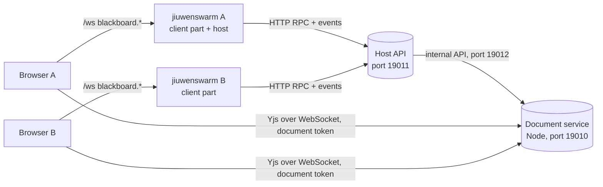
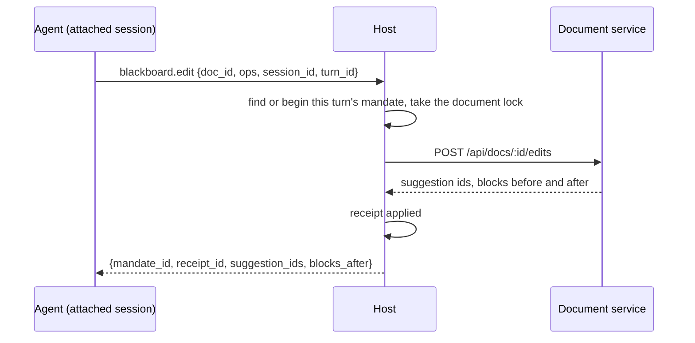

# Blackboard

Blackboard gives a team shared workspaces where people and agents write documents together. One jiuwenswarm instance runs the **host**: it keeps users, workspaces, members and invites, and serves an HTTP API. Every member's jiuwenswarm runs the **client part**: it keeps a link to each host the person joined and proxies the browser's calls. The browser only ever talks to its own jiuwenswarm.



Milestones 2 to 5 are built: the host, identity, workspaces, members, invites, live documents, references, Markdown in and out, agents that edit documents from a person's chat session, and comments, the workspace chat and decisions, where `@jiuwen` gives the person's agent a task. The browser edits a document directly with the host's document service, using a short-lived document token that the host mints; everything else goes through the browser's own jiuwenswarm.

Blackboard is always on: it ships in the package's `extensions` folder, which every instance loads, and `is_enabled()` always returns true. In the rail it sits right below Tasks (`nav_after="chat"` on its page contribution) with its own chalkboard icon (`applicationPluginNavIcon`, exported from `frontend/index.tsx`). Both are general plugin features, so other built-in plugins can use them too.

## Layout

| Folder | What it holds |
|---|---|
| `extension.py` | The plugin: binds the web channel, starts the client part and, when enabled, the host |
| `common/` | Errors, ids, roles, tokens, settings, method and event names, the shared JSON file |
| `host/store/` | SQLite store (one worker thread), migrations, users, workspaces, memberships, invites |
| `host/api/` | FastAPI app: RPC dispatcher, method table, role checks, events WebSocket, join page, health |
| `host/runtime.py`, `host/controller.py` | Starting and stopping the host and its document service, applying settings, the operator's own host entry |
| `host/docservice_manager.py` | Finds Node, starts `host/docservice/dist/server.mjs`, restarts it when it exits (1 to 30 s backoff), stops it gracefully; `DocServiceClient` for its internal API |
| `host/api/documents.py`, `host/api/references.py` | Document and reference methods, the upload and download routes |
| `host/api/mandates.py`, `host/api/locks.py` | Agent edits: mandates, receipts, document locks and their wait queue, suggestion decisions, the idle sweeper |
| `host/api/comments.py`, `host/api/chat.py`, `host/api/decisions.py`, `host/api/feed.py` | Threads and comments, the workspace chat, the agent's questions, and posting replies, notices and summaries |
| `host/api/dispatch.py` | Tasks from comments and the chat: beginning and queueing them, offering turns, claim and report, the turn's material, the sweeper for turns nobody picked up |
| `host/docservice/` | The document service (TypeScript, run by Node 22.5+): Hocuspocus with SQLite, document tokens, the author guard, the shared Tiptap schema, Markdown in and out, the agent view. No npm project of its own: its packages are in the web app's `package.json` |
| `client/` | Known hosts (`hosts.json`), host links, joining with a link, local RPC proxies, reference uploads, sessions attached to workspaces (`sessions.py`), the dispatcher that runs comment and chat tasks (`dispatcher.py`) and their prompt (`prompt.py`) |
| `client/toolkit/` | The agent's Blackboard tools and their bridge to openjiuwen, handed to the AgentServer through the `agent_tools` hook |
| `frontend/` | The page (bundled into the web app), its controller, dialogs, panels and rail icon. One controller lives for the app's lifetime and remembers the host, workspace, document and rail tab in `localStorage` (`blackboard.selection`), so the page opens where it was left |
| `frontend/chat/` | The + menu item and the input tag in the chat |
| `frontend/editor/` | The document editor, loaded lazily: the provider session, the author stamp, the authors legend, comment highlights and anchors (`comments.ts`) |
| `tests/backend/`, `tests/frontend/` | pytest and node:test suites |

## Run a host

In the web app, open **Blackboard** and choose **Host workspaces on this machine**, or open **Settings** from the page. Turn hosting on, check the port and press **Apply**. The host starts at once and again with every Gateway start. The same settings live in `config.yaml`:

| Key under `blackboard.host` | Default | Meaning |
|---|---|---|
| `enabled` | `false` | Run the host in this instance |
| `name` | empty | The name members see in their list of Blackboards; empty means "<operator>'s Blackboard". A rename reaches members at once, or when their link reconnects |
| `bind` | `127.0.0.1` | `0.0.0.0` lets other machines connect |
| `port` | `19011` | Member API and invite links |
| `public_url` | empty | The address members use, such as `https://bb.example.com`; without it, links point at `http://127.0.0.1:<port>` |
| `operator_name` | empty | Name of the person running the host; defaults to the machine user |
| `doc_port` | `19010` | Document service for browsers (Yjs over WebSocket) |
| `doc_api_port` | `19012` | Document service's internal API, always on 127.0.0.1 |
| `doc_public_url` | empty | The address browsers use for documents, such as `wss://bb.example.com/docs`; without it, `ws://` or `wss://` on the `public_url` host with `doc_port` |
| `node_path` | empty | Node to run the document service with; empty means `node` on `PATH` |
| `max_upload_mb` | `25` | Largest reference file |

Members on other machines need `bind: 0.0.0.0` and a `public_url`, and their browsers must reach `doc_port` too (or `doc_public_url` behind the proxy). Plain `http://` works on a LAN, but the traffic is not encrypted; a reverse proxy with TLS in front of the host is the recommended team setup.

## The document service

The host runs it as a child process with Node 22.5 or later (below 22.13 with `--experimental-sqlite`; the desktop builds bundle Node 22.11). It is one bundled file, `host/docservice/dist/server.mjs`, with no native modules (storage is `node:sqlite`), and `dist/THIRD_PARTY_NOTICES.txt` next to it holds the licenses of everything bundled.

There is no separate build step. The service's packages are in the web app's `package.json` and lockfile, and the web app's `npm run build` and `npm run dev` write the bundle too (a Vite plugin in `vite.config.ts` calls `host/docservice/build.mjs`). So the usual `npm install && npm run build` in `jiuwenswarm/channels/web/frontend`, which `scripts/build.sh` and the other release scripts already run, produces everything. The wheel and the desktop build ship the bundle and its notices, not the TypeScript sources; the PyInstaller spec stops when the bundle is missing.

From `jiuwenswarm/channels/web/frontend`:

```bash
npm run build:blackboard-docservice   # rebuild only the bundle, after changing the service
npm run test:blackboard-docservice    # type check and node:test suites, run from the TypeScript sources
```

Without Node or without the bundle the host still runs; the page says why documents are unavailable, and the host status and `/blackboard/health` report `docservice: {status, reason}` (`not_built`, `node_missing`, `node_too_old`, `start_failed`, `exited`). The service exits by itself when the Gateway process goes away.

Rules worth knowing:

- Only the host creates and deletes documents (internal API with the `api_secret`). A browser connects with a document token `{uid, ws, doc, role, iat, exp}` signed with the `doc_secret`, valid for one hour; viewers, commenters and archived documents or workspaces get a read-only connection.
- When a role changes or a member leaves, the host tells the service at once. The service applies the new role to open connections (or closes them) and ignores tokens issued before the change, so an old token cannot bring the old role back.
- The author guard: a person's update may not add text credited to anyone else, whether through author marks, suggestion authors or block-level suggestion marks. It compares credits before and after the update on a copy of the document, so splitting, joining and moving other people's text still works.
- In the browser, everything a person types or pastes carries their author mark; text that undo or redo brings back is credited to the person who undid.
- `@tiptap/y-tiptap` is a vendored copy with a patch that keeps node marks (whole-block suggestions) in Yjs: `vendor/y-tiptap-nodemarks.js`, produced by `node host/docservice/scripts/make-ytiptap-nodemarks.mjs` from the pinned package; a test fails when the copy no longer matches. The web app's Vite config points `@tiptap/y-tiptap` at the same file, and resolves bare imports in plugin code from the web app's own `node_modules`.

## Agents

A person with the editor role or above can let an agent work on a workspace. On the page's **Agents** tab, **New agent session** creates a chat session, attaches it to the workspace and opens it in the chat; **Use an existing session** attaches one of the person's other sessions. From the chat itself, **+ > Blackboard workspace** lists the workspaces the person can edit on every joined host, with a switch each: turning one on adds the workspace to the session (creating the session first for a new task), turning it off takes it away. A session can work on several workspaces, on one or more hosts; the attachments are recorded in `client/sessions.json`, so they survive restarts. An attached session shows a Blackboard icon in the chat input; hovering lists the workspaces, and a click opens the first on the Agents tab.

The chat parts use two general plugin exports from `frontend/index.tsx`: `applicationPluginTaskMenuItem` (an item in the chat's + menu, with its own panel) and `applicationPluginTaskInputTag` (a tag in the input toolbar). Both get `sessionId`, which is null until a new conversation has a session.

From the next turn on, the AgentServer gives an attached session five tools: `blackboard_list_docs`, `blackboard_read`, `blackboard_edit`, `blackboard_list_references` and `blackboard_read_reference`. The two list tools group their results by workspace and take an optional `workspace`; the others take a document or reference id and find its workspace and host themselves. They call the host with the person's member token, return `{"ok": true, ...}` or `{"ok": false, code, message, details}` as JSON, and are declared `DIRECT` so progressive tool disclosure does not hide them.



Rules worth knowing:

- Every edit belongs to a mandate. The first `blackboard.edit` of a chat turn in a workspace begins one (origin `workspace_session`, instruction from the edit's note), later edits of the turn in that workspace reuse it, and the next turn's first edit ends the session's earlier runs. A sweeper ends session mandates idle for 2 minutes.
- One mandate writes a document at a time. Another waits up to 60 s in a queue and then gets `busy` with its queue position; a Markdown import is refused with `busy` while a document is locked. Ending a mandate releases its locks.
- Edits are suggestions credited to "<requester>'s agent" (author mark `{id: <requester's user id>, kind: 'agent', mandate}`), one suggestion per operation; a replacement is a deletion and an insertion under one id. A batch is refused as a whole when a block changed since it was read (`stale`) or holds someone else's pending suggestions (`pending_suggestions`). The agent's own pending suggestions in a block are replaced by its new text.
- Editors accept or reject a suggestion from its card in the editor, or everything one run suggested in a document from the Agents tab. Both go through the host (`blackboard.suggestion.decide`), which asks the document service to apply them.
- **Stop** on a run cancels its mandate. The agent's further edits in that turn and workspace are refused with `no_mandate`; the chat turn itself runs until it ends.
- While a mandate writes, the editor shows the agent's caret with a robot label; it goes away when the mandate ends.

## Comments, chat and decisions

A comment belongs to a thread anchored to a passage: two Yjs relative positions, the quoted text (at most 300 characters) and the block it starts in. When the Comments tab loads, the host asks the document service to resolve the open threads' anchors: `ok` when the positions still hold the quote, `drifted` when the passage is in place but its text changed, and otherwise the quote is searched in the same block, a block with the same digest, then the whole document; one match moves the anchor, anything else leaves it `orphaned` (listed under Detached). Text is compared in the accepted view, so a pending suggestion does not change a passage. The editor highlights open passages, drifted ones in a warning colour, and shows each open thread as a card in a margin beside the text, level with its passage (`frontend/editor/CommentMargin.tsx`); cards that would overlap are pushed apart, and the active one stays level with its passage. **Comment** on a selection, or Ctrl+M, opens a new card there. A selection of any length can be commented on (the host bounds the quote at 100,000 characters); a quote over 2,000 characters is left out of the agent's prompt, which has the passage anyway. A card shows the first and the latest comment until it or its passage is clicked. The Comments tab lists every thread, with the resolved and detached ones.

The workspace chat is one stream per workspace: people's messages, the agent's replies, question cards, one-line summaries of thread replies, and notices. Notices and summaries are stored as `{"code": ..., ...}` and rendered in each member's language (`blackboard.notices.*`).

Writing `@jiuwen` in a comment or a chat message, picked from the mention list, gives the person's own agent a task: the body must match `@jiuwen` and the structured mentions must name the agent. Commenters get a notice instead.

```mermaid
sequenceDiagram
    participant H as Host
    participant C as Requester's client part (dispatcher)
    participant A as AgentServer
    H-->>C: blackboard.mandate.run {mandate_id, workspace_id, session_id}
    C->>C: chosen session, or the workspace's default one; attach it
    C->>H: blackboard.mandate.claim {mandate_id, session_id}
    H-->>C: turn_id, instructions, passage, thread or chat context, answer
    C->>A: the prompt on channel __blackboard__
    A-->>C: final answer
    C->>H: blackboard.mandate.report {turn_id, status, text}
```

Rules worth knowing:

- A comment task may edit only the commented blocks, or the whole document when the composer's switch is on. It holds the document from the start; another comment task on the same document queues (at most 20, then `queue_full`) and starts when the first ends. Resolving a thread cancels its queued tasks.
- A chat task may edit the whole workspace. Its prompt includes people's chat messages since the agent's last chat task, newest 40 and at most 8,000 characters.
- The prompt fences the workspace's own words (instructions, passage, thread, chat, answer) with a random nonce, so the agent can tell material from instructions.
- The agent's final answer is its reply: in the thread (with a summary line in the chat) for a comment task, in the chat for a chat task.
- In these turns the agent also has `blackboard_ask {question, options, recommended?}`. The question appears as a card in the chat, the thread and the Decisions tab, and the task waits. Any editor may answer; the requester's answer is final, anyone else's is a proposal the requester accepts or replaces. The accepted answer starts the next turn in the same session. The requester or an editor can withdraw the question, which stops the task.
- The first task in a workspace creates a session named after it and records it as the workspace's default in `client/sessions.json`; the composer can pick another attached session.
- Tasks offered while the requester's jiuwenswarm is off are picked up when its link to the host is back; after 10 minutes unclaimed they fail. A claimed turn with no report after 10 minutes becomes Unknown, and an editor marks it Done or Failed from the Agents tab after checking its changes. Stop on a running task cancels the chat turn.

## Join from a second instance on the same machine

Run a second jiuwenswarm with its own data folder and ports, either as a named instance:

```bash
jiuwenswarm-init --name bob
jiuwenswarm-start --name bob
```

or by hand, with `JIUWENSWARM_DATA_DIR` and a dotenv file that sets `AGENT_SERVER_PORT`, `WEB_PORT`, `GATEWAY_PORT` and `FRONTEND_PORT`, passed to `python -m jiuwenswarm.app --dotenv <file>` and `python -m jiuwenswarm.channels.web.app_web --dotenv <file>`.

On the host's page, open a workspace, choose **Invite**, pick the role and choose **Create and copy link**. Links work for 7 days and up to 10 people unless changed under **Change**. On the second instance, open **Blackboard**, choose **Join with a link**, paste it and enter a name.

## Files

Everything lives under `<data root>/blackboard` (`~/.jiuwenswarm/blackboard` for the default instance). Tokens and secrets stay out of `config.yaml`, so they do not appear wherever config is shown.

| File | Content |
|---|---|
| `client/hosts.json` | Joined hosts with the member token for each, and the default host |
| `client/sessions.json` | This person's chat sessions attached to a workspace, and each workspace's default session for tasks from comments and the chat |
| `host/blackboard.db` | The host store (SQLite, WAL) |
| `host/secrets.json` | Secrets for document tokens and the document service's internal API |
| `host/docs.db` | Document contents (Yjs states, SQLite, WAL), owned by the document service |
| `host/docservice.log` | The document service's output |
| `host/references/<workspace id>/` | Uploaded reference files |
| `blackboard.log` | Blackboard's own log, rotated at 20 MB |

## Methods and events

The browser calls these on its own web channel; all are local-only.

| Method | Served by |
|---|---|
| `blackboard.hosts.list`, `.join {url, display_name}`, `.remove {host}`, `.set_default {host}` | client part |
| `blackboard.host.status`, `blackboard.host.set_settings {settings}` | this instance's host controller |
| `blackboard.me`, `.me.set_name`, `.workspace.list/create/rename/archive/unarchive/delete`, `.member.list/set_role/remove`, `.invite.create/list/revoke` | the host, through the client part; `params.host` picks the host, else the default one |
| `blackboard.doc.list/create/rename/archive/pin/set_instructions/import_markdown/token/read`, `blackboard.reference.list/url/remove/set_note` | the host, through the client part |
| `blackboard.reference.upload {workspace_id, name, mime, data, note?}` (the file as base64) | the client part, which posts it to the host as multipart |
| `blackboard.session.attach {host, workspace_id, session_id}`, `.session.detach {session_id, host?, workspace_id?}`, `.session.list {host?, workspace_id?, session_id?}` | client part; attaching adds a workspace to the session after asking the host for the person's role, and takes the workspace title from it; detaching without a workspace takes all of them; the list gives one row per session and workspace, with the host name |
| `blackboard.mandate.list {workspace_id}` (with receipts and the suggestions still pending), `.mandate.cancel {mandate_id}`, `.mandate.resolve_unknown {mandate_id, status}`, `blackboard.suggestion.list {doc_id}`, `.suggestion.decide {doc_id, suggestion_ids, action}` | the host, through the client part |
| `blackboard.comment.create {doc_id, anchor, body, mentions, scope_switch?, session_id?}`, `.comment.reply {thread_id, body, mentions, scope_switch?, session_id?}`, `.comment.edit {comment_id, body}`, `.comment.resolve/reopen {thread_id}`, `.comment.list {doc_id, include_resolved?}` | the host, through the client part |
| `blackboard.chat.post {workspace_id, body, mentions, session_id?}`, `.chat.list {workspace_id, before?, limit?}` (50 per page by default) | the host, through the client part |
| `blackboard.decision.list {workspace_id, status?}`, `.decision.get/accept/cancel {decision_id}`, `.decision.answer {decision_id, option? or text?}` | the host, through the client part |

`blackboard.invite.accept` is the only host method that needs no member token; the client part calls it while joining. `blackboard.edit` and `blackboard.decision.create` are only for the agent's tools, and `blackboard.mandate.claim`, `.report` and `.pending` only for the dispatcher; they call the host directly and the browser cannot reach them. Errors come back as `{code, message, details}` with codes `unauthorized`, `not_member`, `forbidden`, `not_found`, `invalid`, `conflict`, `expired`, `disabled`, `unavailable`, `busy`, `queue_full` and `internal`, and from `blackboard.edit` also `stale`, `pending_suggestions`, `out_of_scope`, `unknown_block`, `unsupported_markdown` and `no_mandate`.

Events reach the browser with a `host` field: `blackboard.workspace.updated`, `blackboard.member.updated`, `blackboard.me.updated`, `blackboard.member.role_changed`, `blackboard.doc.updated`, `blackboard.reference.updated`, `blackboard.mandate.updated`, `blackboard.doc.suggestions_changed`, `blackboard.thread.updated`, `blackboard.chat.message`, `blackboard.decision.updated`, and from the client part `blackboard.hosts.updated`, `blackboard.host.status_changed` and `blackboard.sessions.updated`. The host sends an event only to the members of the workspace concerned (and `blackboard.mandate.run` and `blackboard.mandate.stop` only to the requester's client part, which consumes them), except `blackboard.host.updated` (a new host name), which goes to every connected member; the client part turns it into an update of its host list.

The host also serves `POST /blackboard/files/<workspace id>` (multipart upload with the member token) and `GET /blackboard/files/<workspace id>/<reference id>?t=<file token>`; `blackboard.reference.url` returns such a link, valid for one hour.

## Tests

```bash
# backend (pytest.ini collects only tests/, so pass the path)
.venv/Scripts/python.exe -m pytest jiuwenswarm/extensions/blackboard/tests/backend --no-cov
# the core hook for plugin tools
.venv/Scripts/python.exe -m pytest tests/unit_tests/test_application_plugin_tools.py --no-cov
# frontend (from jiuwenswarm/channels/web/frontend)
npm run test:blackboard
npm run test:blackboard-docservice
```

`tests/backend/conftest.py` runs hosts without Node unless a test asks for the `real_docservice` fixture, which skips when Node or the bundle is missing. The two-instance browser checks are in the planning notes (`notes/blackboard/e2e`).

## Troubleshooting

| What you see | Likely cause |
|---|---|
| Settings shows "Could not start: cannot listen on ..." | The port is taken; pick another and press Apply |
| Host status "The host did not accept this member" | The member was removed from the host or the token was replaced; join again with a new link |
| Host status "Offline, retrying" | The host is not running or its address changed; the link retries every few seconds, up to 30 s apart |
| An invite link works only on the host's machine | `bind` is `127.0.0.1` or `public_url` is empty |
| "Documents are unavailable: the document service is not built" | A source checkout whose web app was never built: run `npm install` and `npm run build` (or `npm run dev`) in `jiuwenswarm/channels/web/frontend` |
| "The document service did not start" | See `host/docservice.log`; often `doc_port` or `doc_api_port` is taken |
| A member's document stays at "Connecting" | Their browser cannot reach `doc_port` (firewall or proxy); set `doc_public_url` |
| An edit stays at "Saving" | The service refused the update; `host/docservice.log` names the reason (`author_mismatch` for the author guard) |
| The agent says it has no Blackboard tools | The session is not attached (see the Agents tab), or it was attached during the current turn; the tools arrive with the next message |
| An `@jiuwen` comment or message stays Queued or Running | Queued: another comment task holds the document. Running without a reply: the requester's jiuwenswarm is off or its link to the host is down; the task fails after 10 minutes |
| A task shows Unknown | The turn did not report within 10 minutes; check its changes on the Agents tab and mark it Done or Failed |
| The agent reports `busy` | Another agent's run holds the document; the lock frees when that run ends, about 2 minutes after its last edit |
