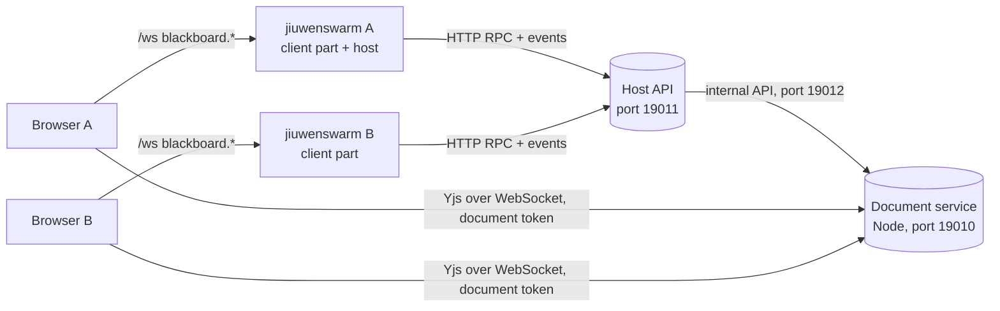

# Blackboard

Blackboard gives a team shared workspaces where people and agents write documents together. One jiuwenswarm instance runs the **host**: it keeps users, workspaces, members and invites, and serves an HTTP API. Every member's jiuwenswarm runs the **client part**: it keeps a link to each host the person joined and proxies the browser's calls. The browser only ever talks to its own jiuwenswarm.



Milestones 2 and 3 are built: the host, identity, workspaces, members, invites, live documents, references and Markdown in and out. The browser edits a document directly with the host's document service, using a short-lived document token that the host mints; everything else goes through the browser's own jiuwenswarm.

Blackboard is always on: it ships in the package's `extensions` folder, which every instance loads, and `is_enabled()` always returns true. In the rail it sits right below Tasks (`nav_after="chat"` on its page contribution) with its own chalkboard icon (`applicationPluginNavIcon`, exported from `frontend/index.tsx`). Both are general plugin features, so other built-in plugins can use them too.

## Layout

| Folder | What it holds |
|---|---|
| `extension.py` | The plugin: binds the web channel, starts the client part and, when enabled, the host |
| `common/` | Errors, ids, roles, tokens, settings, method and event names, the shared JSON file |
| `host/store/` | SQLite store (one worker thread), migrations, users, workspaces, memberships, invites |
| `host/api/` | FastAPI app: RPC dispatcher, method table, role checks, events WebSocket, join page, health |
| `host/runtime.py`, `host/controller.py` | Starting and stopping the host and its document service, applying settings, the operator's own host entry |
| `host/docservice_manager.py` | Finds Node, starts `host/docservice/dist/server.mjs`, restarts it when it exits (1 to 30 s backoff), stops it gracefully; `DocServiceClient` for its internal API |
| `host/api/documents.py`, `host/api/references.py` | Document and reference methods, the upload and download routes |
| `host/docservice/` | The document service (TypeScript, run by Node 22.5+): Hocuspocus with SQLite, document tokens, the author guard, the shared Tiptap schema, Markdown in and out, the agent view. No npm project of its own: its packages are in the web app's `package.json` |
| `client/` | Known hosts (`hosts.json`), host links, joining with a link, local RPC proxies, reference uploads |
| `frontend/` | The page (bundled into the web app), its controller, dialogs, panels and rail icon |
| `frontend/editor/` | The document editor, loaded lazily: the provider session, the author stamp, the authors legend |
| `tests/backend/`, `tests/frontend/` | pytest and node:test suites |

## Run a host

In the web app, open **Blackboard** and choose **Host workspaces on this machine**, or open **Settings** from the page. Turn hosting on, check the port and press **Apply**. The host starts at once and again with every Gateway start. The same settings live in `config.yaml`:

| Key under `blackboard.host` | Default | Meaning |
|---|---|---|
| `enabled` | `false` | Run the host in this instance |
| `name` | empty | The name members see in their list of Blackboards; empty means "<operator>'s Blackboard". A rename reaches members at once, or when their link reconnects |
| `bind` | `127.0.0.1` | `0.0.0.0` lets other machines connect |
| `port` | `19011` | Member API and invite links |
| `public_url` | empty | The address members use, such as `https://bb.example.com`; without it, links point at `http://127.0.0.1:<port>` |
| `operator_name` | empty | Name of the person running the host; defaults to the machine user |
| `doc_port` | `19010` | Document service for browsers (Yjs over WebSocket) |
| `doc_api_port` | `19012` | Document service's internal API, always on 127.0.0.1 |
| `doc_public_url` | empty | The address browsers use for documents, such as `wss://bb.example.com/docs`; without it, `ws://` or `wss://` on the `public_url` host with `doc_port` |
| `node_path` | empty | Node to run the document service with; empty means `node` on `PATH` |
| `max_upload_mb` | `25` | Largest reference file |

Members on other machines need `bind: 0.0.0.0` and a `public_url`, and their browsers must reach `doc_port` too (or `doc_public_url` behind the proxy). Plain `http://` works on a LAN, but the traffic is not encrypted; a reverse proxy with TLS in front of the host is the recommended team setup.

## The document service

The host runs it as a child process with Node 22.5 or later (below 22.13 with `--experimental-sqlite`; the desktop builds bundle Node 22.11). It is one bundled file, `host/docservice/dist/server.mjs`, with no native modules (storage is `node:sqlite`), and `dist/THIRD_PARTY_NOTICES.txt` next to it holds the licenses of everything bundled.

There is no separate build step. The service's packages are in the web app's `package.json` and lockfile, and the web app's `npm run build` and `npm run dev` write the bundle too (a Vite plugin in `vite.config.ts` calls `host/docservice/build.mjs`). So the usual `npm install && npm run build` in `jiuwenswarm/channels/web/frontend`, which `scripts/build.sh` and the other release scripts already run, produces everything. The wheel and the desktop build ship the bundle and its notices, not the TypeScript sources; the PyInstaller spec stops when the bundle is missing.

From `jiuwenswarm/channels/web/frontend`:

```bash
npm run build:blackboard-docservice   # rebuild only the bundle, after changing the service
npm run test:blackboard-docservice    # type check and node:test suites, run from the TypeScript sources
```

Without Node or without the bundle the host still runs; the page says why documents are unavailable, and the host status and `/blackboard/health` report `docservice: {status, reason}` (`not_built`, `node_missing`, `node_too_old`, `start_failed`, `exited`). The service exits by itself when the Gateway process goes away.

Rules worth knowing:

- Only the host creates and deletes documents (internal API with the `api_secret`). A browser connects with a document token `{uid, ws, doc, role, iat, exp}` signed with the `doc_secret`, valid for one hour; viewers, commenters and archived documents or workspaces get a read-only connection.
- When a role changes or a member leaves, the host tells the service at once. The service applies the new role to open connections (or closes them) and ignores tokens issued before the change, so an old token cannot bring the old role back.
- The author guard: a person's update may not add text credited to anyone else, whether through author marks, suggestion authors or block-level suggestion marks. It compares credits before and after the update on a copy of the document, so splitting, joining and moving other people's text still works.
- In the browser, everything a person types or pastes carries their author mark; text that undo or redo brings back is credited to the person who undid.
- `@tiptap/y-tiptap` is a vendored copy with a patch that keeps node marks (whole-block suggestions) in Yjs: `vendor/y-tiptap-nodemarks.js`, produced by `node host/docservice/scripts/make-ytiptap-nodemarks.mjs` from the pinned package; a test fails when the copy no longer matches. The web app's Vite config points `@tiptap/y-tiptap` at the same file, and resolves bare imports in plugin code from the web app's own `node_modules`.

## Join from a second instance on the same machine

Run a second jiuwenswarm with its own data folder and ports, either as a named instance:

```bash
jiuwenswarm-init --name bob
jiuwenswarm-start --name bob
```

or by hand, with `JIUWENSWARM_DATA_DIR` and a dotenv file that sets `AGENT_SERVER_PORT`, `WEB_PORT`, `GATEWAY_PORT` and `FRONTEND_PORT`, passed to `python -m jiuwenswarm.app --dotenv <file>` and `python -m jiuwenswarm.channels.web.app_web --dotenv <file>`.

On the host's page, open a workspace, choose **Invite**, pick the role and choose **Create and copy link**. Links work for 7 days and up to 10 people unless changed under **Change**. On the second instance, open **Blackboard**, choose **Join with a link**, paste it and enter a name.

## Files

Everything lives under `<data root>/blackboard` (`~/.jiuwenswarm/blackboard` for the default instance). Tokens and secrets stay out of `config.yaml`, so they do not appear wherever config is shown.

| File | Content |
|---|---|
| `client/hosts.json` | Joined hosts with the member token for each, and the default host |
| `host/blackboard.db` | The host store (SQLite, WAL) |
| `host/secrets.json` | Secrets for document tokens and the document service's internal API |
| `host/docs.db` | Document contents (Yjs states, SQLite, WAL), owned by the document service |
| `host/docservice.log` | The document service's output |
| `host/references/<workspace id>/` | Uploaded reference files |
| `blackboard.log` | Blackboard's own log, rotated at 20 MB |

## Methods and events

The browser calls these on its own web channel; all are local-only.

| Method | Served by |
|---|---|
| `blackboard.hosts.list`, `.join {url, display_name}`, `.remove {host}`, `.set_default {host}` | client part |
| `blackboard.host.status`, `blackboard.host.set_settings {settings}` | this instance's host controller |
| `blackboard.me`, `.me.set_name`, `.workspace.list/create/rename/archive/unarchive/delete`, `.member.list/set_role/remove`, `.invite.create/list/revoke` | the host, through the client part; `params.host` picks the host, else the default one |
| `blackboard.doc.list/create/rename/archive/pin/set_instructions/import_markdown/token/read`, `blackboard.reference.list/url/remove/set_note` | the host, through the client part |
| `blackboard.reference.upload {workspace_id, name, mime, data, note?}` (the file as base64) | the client part, which posts it to the host as multipart |

`blackboard.invite.accept` is the only host method that needs no member token; the client part calls it while joining. Errors come back as `{code, message, details}` with codes `unauthorized`, `not_member`, `forbidden`, `not_found`, `invalid`, `conflict`, `expired`, `disabled`, `unavailable` and `internal`.

Events reach the browser with a `host` field: `blackboard.workspace.updated`, `blackboard.member.updated`, `blackboard.me.updated`, `blackboard.member.role_changed`, `blackboard.doc.updated`, `blackboard.reference.updated`, and from the client part `blackboard.hosts.updated` and `blackboard.host.status_changed`. The host sends an event only to the members of the workspace concerned, except `blackboard.host.updated` (a new host name), which goes to every connected member; the client part turns it into an update of its host list.

The host also serves `POST /blackboard/files/<workspace id>` (multipart upload with the member token) and `GET /blackboard/files/<workspace id>/<reference id>?t=<file token>`; `blackboard.reference.url` returns such a link, valid for one hour.

## Tests

```bash
# backend (pytest.ini collects only tests/, so pass the path)
.venv/Scripts/python.exe -m pytest jiuwenswarm/extensions/blackboard/tests/backend --no-cov
# the core hook for plugin tools
.venv/Scripts/python.exe -m pytest tests/unit_tests/test_application_plugin_tools.py --no-cov
# frontend (from jiuwenswarm/channels/web/frontend)
npm run test:blackboard
npm run test:blackboard-docservice
```

`tests/backend/conftest.py` runs hosts without Node unless a test asks for the `real_docservice` fixture, which skips when Node or the bundle is missing. The two-instance browser checks are in the planning notes (`notes/blackboard/e2e`).

## Troubleshooting

| What you see | Likely cause |
|---|---|
| Settings shows "Could not start: cannot listen on ..." | The port is taken; pick another and press Apply |
| Host status "The host did not accept this member" | The member was removed from the host or the token was replaced; join again with a new link |
| Host status "Offline, retrying" | The host is not running or its address changed; the link retries every few seconds, up to 30 s apart |
| An invite link works only on the host's machine | `bind` is `127.0.0.1` or `public_url` is empty |
| "Documents are unavailable: the document service is not built" | A source checkout whose web app was never built: run `npm install` and `npm run build` (or `npm run dev`) in `jiuwenswarm/channels/web/frontend` |
| "The document service did not start" | See `host/docservice.log`; often `doc_port` or `doc_api_port` is taken |
| A member's document stays at "Connecting" | Their browser cannot reach `doc_port` (firewall or proxy); set `doc_public_url` |
| An edit stays at "Saving" | The service refused the update; `host/docservice.log` names the reason (`author_mismatch` for the author guard) |
