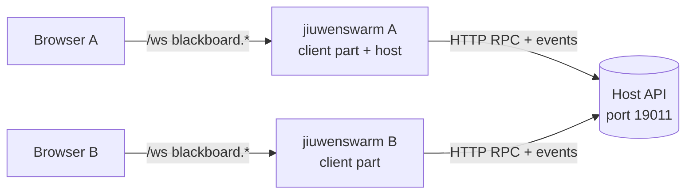

# Blackboard

Blackboard gives a team shared workspaces where people and agents write documents together. One jiuwenswarm instance runs the **host**: it keeps users, workspaces, members and invites, and serves an HTTP API. Every member's jiuwenswarm runs the **client part**: it keeps a link to each host the person joined and proxies the browser's calls. The browser only ever talks to its own jiuwenswarm.



Milestone 2 covers the host, identity, workspaces, members, invites and the page shell. Documents arrive in milestone 3.

Blackboard is always on: it ships in the package's `extensions` folder, which every instance loads, and `is_enabled()` always returns true. In the rail it sits right below Tasks (`nav_after="chat"` on its page contribution) with its own chalkboard icon (`applicationPluginNavIcon`, exported from `frontend/index.tsx`). Both are general plugin features, so other built-in plugins can use them too.

## Layout

| Folder | What it holds |
|---|---|
| `extension.py` | The plugin: binds the web channel, starts the client part and, when enabled, the host |
| `common/` | Errors, ids, roles, tokens, settings, method and event names, the shared JSON file |
| `host/store/` | SQLite store (one worker thread), migrations, users, workspaces, memberships, invites |
| `host/api/` | FastAPI app: RPC dispatcher, method table, role checks, events WebSocket, join page, health |
| `host/runtime.py`, `host/controller.py` | Starting and stopping the host, applying settings, the operator's own host entry |
| `client/` | Known hosts (`hosts.json`), host links, joining with a link, local RPC proxies |
| `frontend/` | The page (bundled into the web app), its controller, dialogs and rail icon |
| `tests/backend/`, `tests/frontend/` | pytest and node:test suites |

## Run a host

In the web app, open **Blackboard** and choose **Host workspaces on this machine**, or open **Settings** from the page. Turn hosting on, check the port and press **Apply**. The host starts at once and again with every Gateway start. The same settings live in `config.yaml`:

| Key under `blackboard.host` | Default | Meaning |
|---|---|---|
| `enabled` | `false` | Run the host in this instance |
| `name` | empty | The name members see in their list of Blackboards; empty means "<operator>'s Blackboard". A rename reaches members at once, or when their link reconnects |
| `bind` | `127.0.0.1` | `0.0.0.0` lets other machines connect |
| `port` | `19011` | Member API and invite links |
| `public_url` | empty | The address members use, such as `https://bb.example.com`; without it, links point at `http://127.0.0.1:<port>` |
| `operator_name` | empty | Name of the person running the host; defaults to the machine user |
| `doc_port`, `doc_api_port`, `doc_public_url`, `node_path`, `max_upload_mb` | | Used from milestone 3 |

Members on other machines need `bind: 0.0.0.0` and a `public_url`. Plain `http://` works on a LAN, but the traffic is not encrypted; a reverse proxy with TLS in front of the host is the recommended team setup.

## Join from a second instance on the same machine

Run a second jiuwenswarm with its own data folder and ports, either as a named instance:

```bash
jiuwenswarm-init --name bob
jiuwenswarm-start --name bob
```

or by hand, with `JIUWENSWARM_DATA_DIR` and a dotenv file that sets `AGENT_SERVER_PORT`, `WEB_PORT`, `GATEWAY_PORT` and `FRONTEND_PORT`, passed to `python -m jiuwenswarm.app --dotenv <file>` and `python -m jiuwenswarm.channels.web.app_web --dotenv <file>`.

On the host's page, open a workspace, choose **Invite**, pick the role and choose **Create and copy link**. Links work for 7 days and up to 10 people unless changed under **Change**. On the second instance, open **Blackboard**, choose **Join with a link**, paste it and enter a name.

## Files

Everything lives under `<data root>/blackboard` (`~/.jiuwenswarm/blackboard` for the default instance). Tokens and secrets stay out of `config.yaml`, so they do not appear wherever config is shown.

| File | Content |
|---|---|
| `client/hosts.json` | Joined hosts with the member token for each, and the default host |
| `host/blackboard.db` | The host store (SQLite, WAL) |
| `host/secrets.json` | Secrets for document tokens and the document service (milestone 3) |
| `blackboard.log` | Blackboard's own log, rotated at 20 MB |

## Methods and events

The browser calls these on its own web channel; all are local-only.

| Method | Served by |
|---|---|
| `blackboard.hosts.list`, `.join {url, display_name}`, `.remove {host}`, `.set_default {host}` | client part |
| `blackboard.host.status`, `blackboard.host.set_settings {settings}` | this instance's host controller |
| `blackboard.me`, `.me.set_name`, `.workspace.list/create/rename/archive/unarchive/delete`, `.member.list/set_role/remove`, `.invite.create/list/revoke` | the host, through the client part; `params.host` picks the host, else the default one |

`blackboard.invite.accept` is the only host method that needs no member token; the client part calls it while joining. Errors come back as `{code, message, details}` with codes `unauthorized`, `not_member`, `forbidden`, `not_found`, `invalid`, `conflict`, `expired`, `disabled`, `unavailable` and `internal`.

Events reach the browser with a `host` field: `blackboard.workspace.updated`, `blackboard.member.updated`, `blackboard.me.updated`, `blackboard.member.role_changed`, and from the client part `blackboard.hosts.updated` and `blackboard.host.status_changed`. The host sends an event only to the members of the workspace concerned, except `blackboard.host.updated` (a new host name), which goes to every connected member; the client part turns it into an update of its host list.

## Tests

```bash
# backend (pytest.ini collects only tests/, so pass the path)
.venv/Scripts/python.exe -m pytest jiuwenswarm/extensions/blackboard/tests/backend --no-cov
# the core hook for plugin tools
.venv/Scripts/python.exe -m pytest tests/unit_tests/test_application_plugin_tools.py --no-cov
# frontend (from jiuwenswarm/channels/web/frontend)
npm run test:blackboard
```

## Troubleshooting

| What you see | Likely cause |
|---|---|
| Settings shows "Could not start: cannot listen on ..." | The port is taken; pick another and press Apply |
| Host status "The host did not accept this member" | The member was removed from the host or the token was replaced; join again with a new link |
| Host status "Offline, retrying" | The host is not running or its address changed; the link retries every few seconds, up to 30 s apart |
| An invite link works only on the host's machine | `bind` is `127.0.0.1` or `public_url` is empty |
