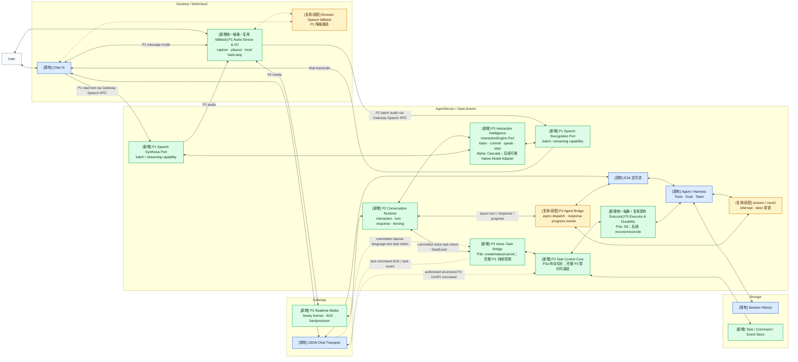

# JiuwenSwarm 实时语音交互：目标架构、核心任务与竞品对比

> **历史架构快照提示（2026-08-17）：** 本文保留 2026-07-30 接受时的 Windows Desktop / WebView2 载体、范围和估算，正文中的 Windows Alpha、X-WIN、Work Package、时间盒和交付顺序仅是历史设计事实。[D-055](../decisions/DECISIONS.md) 已将当前产品载体调整为 **Integrated Web Alpha**；[D-084](../decisions/DECISIONS.md) 进一步规定，当前完成边界、唯一能力矩阵和依赖路线只看 [STATUS](../STATUS.md)。本文只有第 2 节的 P1/P2/P3 能力边界及第 4–5 节的目标模块/契约继续作为稳定设计输入；第 3 节代码基线、第 6 节拆包/排期、第 7 节竞品时点证据以及其余载体描述均不得当作当前实现事实或排期。

- 日期：2026-07-30
- 首期产品：JiuwenSwarm Windows Desktop / WebView2
- 文档用途：架构与任务范围确认；不包含 API Schema、完整状态机和具体实现代码
- 证据口径：竞品信息截至 2026-07-30；闭源产品只评价公开可观察能力，不反推其内部实现

## 1. 执行摘要

JiuwenSwarm 不需要重写现有文字 Agent 主链，但需要在其旁边新增两个框架级能力面：P2 Realtime Interaction Plane 负责持续、可打断且历史一致的实时会话；P3 Agent Task Control Plane 负责独立、可寻址且可恢复演进的后台任务。P1 统一现有 Speech 能力，为两者提供稳定音频入口和输出。

Windows Alpha 的交付决策是：

- P1 复用现有 Speech 代码完成统一 Speech I/O，Browser Speech 只作为 fallback；
- P2 采用 Runtime 驱动的 Cascade Interaction Engine，交付媒体级和会话级全双工，同时保留 Native Interaction Model 替换接口；
- P3 先交付 P3α：稳定 `task_id`、D0 detached execution（定义见第 2.4 节）、状态查询/取消和进度回流，再演进到完整任务控制；
- P1、P2、P3α 可以并行，但必须共用 Identity、Event、Cancel、Capability、Error 和 Context Contract；
- 工程范围由十个运行时 Core Module、二十八个模块级 Work Package 和三个项目级交付包组成。

本文的阅读顺序是：能力与边界 → 当前差距 → 技术与架构 → 核心模块与契约 → 工程拆包与验收 → 竞品证据 → 最终建议。本文不包含完整 API Schema、完整状态机定义或具体实现代码。

## 2. 产品目标与能力边界

### 2.1 产品愿景与三阶段模型

Live Voice Interaction 的目标，是让语音成为人与 Agent 持续协作的入口：用户可以边想边说、补充和改口，系统将口语整理为目标、约束和任务；用户可以在保持交谈的同时启动后台任务、询问进度和修改方向，任务完成、阻塞或需要决策时再回到当前会话。语音还可以连接文件、IDE、浏览器和通信上下文，使用户从逐条提问者转变为持续协调 Agent 的负责人。

这一目标拆成三个可以独立验收、组合交付的阶段：

| Phase | 定义 | 解决的问题 |
|---|---|---|
| P1 Speech I/O | 稳定地听见用户、识别语音并播放回答 | 从“只有文字”升级为可用的语音输入输出 |
| P2 Realtime Voice Conversation | 把语音从一条消息升级为持续、双向、可插话、可修订的会话流 | 用户无需等待一轮结束；系统能够正确地听、说、停和修订 |
| P3 Voice-driven Agent Control（完整目标） | 用持续会话控制独立、持久的后台任务 | 前台交谈不阻塞后台工作；任务可按 ID 创建、查询、补充输入、修改、调整优先级、暂停、恢复和取消，并回流进度、阻塞、决策和结果 |

### 2.2 核心概念与 P2/P3 边界

| 概念 | 本文含义 |
|---|---|
| `interaction` | 一次持续实时会话的顶层生命周期 |
| `turn` | 用户输入形成的对话单元；只有 committed turn 可以触发 Agent、Tool 或 Task 副作用 |
| `response` | 针对当前交互产生的一次助手输出，拥有独立生成、播放、停止和失效生命周期 |
| `round` | Harness 处理某个 committed turn 的工作单元；可以异步执行，但通常仍依附当前 conversation/session |
| `task` | 拥有稳定 `task_id`、独立生命周期、状态和命令的后台工作，可与当前话题或语音连接解耦 |

P2 与 P3 是两个正交能力面：

- P2 管理 `interaction/turn/response/round`，回答“当前会话应该继续听、说什么、停止或修订哪条回答”。
- P3 管理独立 `task`，回答“哪个后台任务正在做什么，以及如何查询、修改或终止它”。
- P2 不规定 Harness 是同步、异步、单 Agent 或多 Agent；P3 也不是把 P2 从同步升级为异步。
- 多 Agent 不是 P3 的判定条件。即使只有一个 Executor，只要工作拥有稳定 `task_id`、独立生命周期和可恢复状态，就已经进入 P3。
- P2 不要求后台任务；P3 可以先由文字入口使用。完整 Voice Agent 需要两者通过 Voice–Task Bridge 组合，因此 P3 不能替代或跳过 P2。

在 P2 中，“检查这个仓库……改成先检查许可证”表示修订、取消或切换当前 conversational round。P2 可以异步执行并保持语音会话响应，但该工作仍属于当前交互。在 P3 中，“后台检查仓库，我们继续讨论许可证；稍后告诉我检查进度，并改成只报告问题”会创建具有独立 `task_id` 和生命周期的任务，用户可以切换话题或断开语音后再查询和修改它。如果某个被称为 P2 的实现已经提供这种能力，它实际上也已经实现了 P3 的核心。

P2 的历史一致性依赖两个关键语义：`generation fence` 保证 response 被取消后，迟到的 Token 或音频不能重新生效；`presented history` 只把用户实际看到或听到、且仍然有效的内容写入会话事实。Agent Control 可以首先通过文字实现；语音并不创造这些控制能力，而是为其提供更自然、高带宽、持续在线的操作入口。

### 2.3 全双工的项目口径

“全双工”不是一个布尔功能，本项目区分三个层次：

| 层次 | 定义 | Windows Alpha 是否承诺 |
|---|---|---:|
| Media duplex | Agent 播放语音时，麦克风仍持续采集和上传；上下行媒体并发且队列有界 | 是 |
| Conversation duplex | Agent 生成或播放期间，新输入仍被理解；系统能 barge-in、停止播放、取消或修订正确的 response，并处理迟到输出和 presented history | 是，构成 P2 核心 |
| Model-level duplex | 同一个原生 Interaction Model 持续消费按时间对齐的音频、文字或视频，并在生成期间反复决定继续听、沉默、说话、停止、修订或委托 | 否，属于可插拔的 model-native 升级路径 |

Windows Alpha 使用 Cascade Engine 交付前两层，不声称“模型本身全双工”。Model-level duplex 是 Interaction Intelligence 的一种模型原生实现方式，不能替代 Realtime Media、Conversation Runtime、Agent Bridge 或 P3 Task Control；具体替换路径见第 4.3 节。

### 2.4 完整 P3、P3α 与 Durability Level

- **完整 P3**：稳定 `task_id`；创建、查询、补充输入、修改目标或约束、调整优先级、暂停、恢复和取消；进度、阻塞、决策和结果回流；重连后的 replay/未读结果；按 Executor capability 支持 checkpoint、恢复和副作用 reconciliation。
- **P3α**：验证 Task 与语音连接/Session 生命周期解耦的首个纵向切片，只承诺 `create/get/list/status/cancel/events`、一个真实 Executor 的 D0 detached execution，以及 committed task intent 的安全桥接。

| Level | 承诺 |
|---|---|
| D0 | 应用/Executor 进程仍存活时，Task 不随语音连接或 Session 结束；进程重启后只协调持久记录与实际状态，不承诺执行续跑 |
| D1 | 可从 checkpoint 恢复无副作用或可安全重试的工作 |
| D2 | 对外部副作用执行 reconciliation，达到 exactly-once-equivalent outcome 或显式进入人工处理 |

P3α 只交付 D0。`provide_input/update/pause/resume/reprioritize`、自动重连 replay、进程重启后的执行续跑和副作用 reconciliation 属于完整 P3 的后续里程碑。P3α 可以回流 `blocked/decision_required`，但不承诺 `approve/provide_input`：首版只能通知用户，并由用户选择等待、取消或用新任务重新提交修订后的目标。

### 2.5 Context 与 Capability 的横切定位

文件、IDE、浏览器和通信上下文通过 P2/P3 共用的 `ContextRef` 接入；它不是第四个 Phase，也不是第十一个运行时模块。`ContextRef` 必须携带 source、stable ID/URI、version/snapshot、user/project scope、permission、expiry 和 redaction 信息。

本文中的 “Capability” 有三种明确含义：

| 类型 | 含义 |
|---|---|
| Product Capability | 用户在明确并发和失败条件下可稳定观察、可独立验证的行为；第 5.3 节核心表使用此含义 |
| Provider/Executor Capability | Adapter 声明的 batch/stream/cancel/recover 等技术能力，用于 negotiation 和 `unsupported` |
| Context/Permission Capability | 当前用户、项目和来源被允许访问或执行的资源与操作 |

## 3. JiuwenSwarm 当前基线与差距

### 3.1 Gap Matrix

当前稳定文字主路径是 `Chat UI → JSON Chat Transport → E2A → Agent/Harness → Session History`。实时语音方案保留这条路径，并按 Phase 复用现有能力：

| Phase | 当前状态 | 可复用基础 | 主要缺口 |
|---|---|---|---|
| P1 | 部分具备 | `useSpeech`、Browser Speech Recognition/Synthesis、手动 TTS | 统一 Audio/Speech Port、设备与权限生命周期、稳定输入输出和默认启用体验 |
| P2 | 不具备完整 Realtime Voice Conversation | 文字流式 E2A、Session History、interrupt/steer 原语 | Realtime Media、Conversation Runtime、Interaction Engine 和非阻塞 Agent Bridge |
| P3 | 有 Agent 控制与执行原语，但没有统一控制面 | Agent/Harness、Goal、Team、现有 Executor 与控制能力 | 稳定 task identity、命令/事件、状态权威、持久化、reconciliation 和 Voice–Task Bridge |

因此，P1 是统一和产品化现有 Speech 能力；P2 和 P3 则分别需要新增 Realtime Interaction Plane 与 Agent Task Control Plane。后续章节不再重复罗列当前代码基础，只描述目标架构和交付责任。

### 3.2 当前基线的代码证据

以下结论对应本地仓库提交 `69c026a6613279964146d317e164cf32c6900285`：

| 判断 | 可复核代码或测试 |
|---|---|
| 已有 Browser STT/TTS Hook | [`useSpeech.ts`](../../jiuwenswarm/channels/web/frontend/src/hooks/useSpeech.ts) 包含 `SpeechRecognition/webkitSpeechRecognition` 与 `speechSynthesis` |
| Web 语音输入尚未形成默认体验 | [`InputArea.tsx`](../../jiuwenswarm/channels/web/frontend/src/components/ChatPanel/InputArea.tsx) 中 `startListening`、pointer handlers 和 microphone JSX 仍被注释 |
| 助手消息已支持手动 TTS，自动朗读默认关闭 | [`MessageItem.tsx`](../../jiuwenswarm/channels/web/frontend/src/components/ChatPanel/MessageItem.tsx) 使用 TTS，`autoSpeak=false` |
| 已有文字流式 E2A 与 Session History | [`models.py`](../../jiuwenswarm/common/e2a/models.py)、[`adapters.py`](../../jiuwenswarm/common/e2a/adapters.py) 和 [`session_history.py`](../../jiuwenswarm/server/runtime/session/session_history.py) |
| 已有 session-scoped interrupt 与 steer/follow-up 原语 | [`interface.py`](../../jiuwenswarm/server/runtime/agent_adapter/interface.py)、[`interface_deep.py`](../../jiuwenswarm/server/runtime/agent_adapter/interface_deep.py) 及 [`test_interface_interrupts.py`](../../tests/unit_tests/agentserver/test_interface_interrupts.py) |
| 已有 Agent/Harness、Team 与任务工具基础 | [`team_manager.py`](../../jiuwenswarm/agents/harness/team/team_manager.py) 和 [`task_tools.py`](../../jiuwenswarm/agents/harness/common/tools/task_tools.py)；这些并不等于统一 P3 Task Control Plane |

## 4. 架构演进与技术策略

### 4.1 目标架构暨变更图

颜色同时表达“目标位置”和“相对当前 JiuwenSwarm 的变化”：

- <span style="color:#2563EB">蓝色 `[现有]`</span>：原样保留的主路径。
- <span style="color:#D97706">黄色 `[复用/适配]`</span>：已有代码或原语需要统一封装。
- <span style="color:#16A34A">绿色 `[新增]`</span>：当前缺失、需要新增的运行时能力。



### 4.2 架构变化与不变量

图中的核心变化是：

1. 现有 `Chat UI → JSON Chat Transport → E2A → Agent/Harness → Session History` 文字主路径保持不变；关闭 feature flag 或新增平面失败时，公开 API 和历史语义不受影响。
2. P1 在现有应用旁补齐统一的音频设备、STT 和 TTS Port。
3. P2 新增 Realtime Interaction Plane；Conversation Runtime 是会话和回答生命周期的权威。
4. P3 新增 Task Control Plane；Task Control Core 是后台任务生命周期的权威，Task 状态不写入 Session History。
5. 停止本地播放、取消当前回答、取消后台任务是三个不同作用域；语音断线不等于后台任务结束。
6. Realtime hot path 不同步等待慢检索、Memory、Tool、SwarmFlow、Team spawn 或长推理；Agent Bridge 异步提交工作，进度通过结构化事件回到 Conversation Runtime。

图中的 P1 Speech RPC 是随 Speech Recognition/Synthesis Port 一起交付的逻辑路径，不是额外运行时模块。原始音频必须与 E2A 文字流分开，不能放入现有 Chat JSON/E2A 消息。

P3 有两类输入路径：授权的结构化 UI/API 命令通过 Command Adapter 直接进入 Task Control Core；自然语言形式的文字或语音 task intent 必须先成为 committed intent，再经过 Voice–Task Bridge 的目标解析、歧义、权限和破坏性确认检查。文字 intent 及其 ACK/事件可由现有 Chat Transport 独立接入 Bridge，不依赖 P2 Conversation Runtime；语音 intent 及通知则由 Runtime 提交和仲裁。具体 Work Package 只负责实现和接线这些上游契约，不反向定义架构语义。

### 4.3 Interaction Intelligence：Cascade 与 Native 路径

首版不要求训练 Interaction Model，也不放弃模型原生路线。P2 通过稳定的 `InteractionEngine` 接口支持 Cascade 和 Native 两类实现：

```text
InteractionEngine
├─ Alpha: CascadeInteractionEngine
│  streaming STT + VAD/EOT + turn policy + streaming TTS
└─ Later: NativeInteractionEngine
   continuous audio/text/video → InteractionAction / frontstage response
```

首版 Cascade Runtime 借鉴 Thinking Machines approach 的系统思想：持续接收输入，以较短时间粒度处理 partial observation，并把结果表达为 `LISTEN / SILENCE / TURN_COMMIT / SPEAK / STOP / REVISE / DELEGATE` 等 `InteractionAction`，而不是等待一条完整消息结束后才开始下一轮。但这只是 Runtime 和 Engine 契约层面的借鉴，不是复现或训练了 Thinking Machines 的 Interaction Model，也不继承其延迟或质量指标；Alpha 的感知、轮次判断、Agent 生成和语音合成仍由多个 Provider、规则和模型协同完成。

Cascade 与 Native Engine 必须使用相同的 interaction/turn/response ID、`InteractionAction`、取消/fence 语义、presented-history 规则、capability negotiation、trace schema 和评测集。由此可以逐步替换端点判断或 turn policy，也可以最终接入能够直接产生前台 response delta/audio 的完整 Native Interaction Model。

Conversation Runtime 始终拥有 interaction/response 生命周期并验证、fence 所有输出。Cascade 需要调用 Jiuwen Agent 时走 `Conversation Runtime → Agent Bridge → Harness`；Native Engine 可以在声明相应 capability 后直接提出前台 response，但调用外部 Jiuwen Agent 仍必须经过 Agent Bridge，创建或控制后台任务仍必须经过 Voice–Task Bridge。任何 Engine 都不得私有修改 Session History 或 Task Control 状态。

## 5. 核心模块与共享契约

### 5.1 核心模块与 Alpha Scope

```text
P1 Speech I/O
├─ Audio Device & I/O
├─ Speech Recognition
└─ Speech Synthesis

P2 Realtime Voice Conversation
├─ Realtime Media
├─ Conversation Runtime
├─ Interaction Intelligence
└─ Agent Bridge

P3 Voice-driven Agent Control（完整目标；首个里程碑为 P3α）
├─ Task Control Core
├─ Executor & Durability
└─ Voice–Task Bridge
```

任务边界如下：

- P1 首期只要求 Windows；macOS 与 HarmonyOS 以后通过同一 Audio Port 接入。
- P1 优先复用现有 `useSpeech`、手动 TTS 和浏览器 Speech 能力，但将其作为 fallback；统一 Port 和生命周期仍需补齐。
- Speech Recognition/Synthesis 模块冻结统一 batch/streaming Port 并交付 P1 batch Adapter；其 P2 extension Work Package 分别交付首个 streaming STT/TTS Adapter。Interaction Intelligence 只消费这些 Port 并负责 Cascade 编排，不重新定义或重复实现 Speech Provider Adapter。
- UI、Tracing、Metrics、跨模块 E2E/Fault Tests、Windows Packaging 和权限 UX 不是新的运行时模块，作为第 6.2 节项目级 Work Package 排期；具体 Speech/Executor Provider Adapter 归属 SR、SS 或 ED Work Package。

### 5.2 共享架构契约

以下契约是上述十个 Core Module 并行实现时的共同约束，也是后续 API Schema、状态机和 conformance tests 的规范来源：

| 契约 | 必须统一的内容 |
|---|---|
| Identity & Event | `connection/media_session/track/interaction/turn/response/round/task/attempt` ID 的含义、父子关系和作用域；connection epoch 用于区分断线前后的媒体事件，即使 Alpha 不承诺业务 replay；版本化 EventEnvelope、sequence、correlation/causation ID 及统一时钟 |
| State Authority | Audio Device 执行物理播放与静音；Conversation Runtime 唯一拥有 interaction/turn/response；Harness/Agent Runtime 是 conversational round 执行状态的源权威，Agent Bridge 只映射；Task Control Core 唯一拥有 canonical task/command/event/attempt record；Executor 拥有实际 attempt execution 并报告标准事件，Task Control Core 根据事件和 reconciliation 更新 canonical record |
| Cancel Scope | `playback.stop`、`response.cancel`、`round.cancel`、`task.cancel` 是四个不同命令；barge-in 默认不得隐式升级为 round 或 task cancel |
| Commit & Side Effect | partial transcript 和未 committed intent 不得触发 Agent、Tool 或 Task；对话输入以 TurnCommit 为边界；自然语言形式的文字或语音 task intent 只能由 Voice–Task Bridge 转为 TaskCommand；授权的结构化 UI/API 命令由 Command Adapter 产生；两条路径统一进入 Task Control Core |
| Media & Audio | AudioFrame 的编码、采样率、声道、时钟和 timestamp；connection/media_session/track/epoch；Frame/ACK/control/backpressure 与 playback-stop confirmation；Transport 不拥有 conversation/task 状态 |
| Speech & Interaction | Speech Port 统一 batch/stream/cancel/capability/error；Cascade/Native Engine 统一 InteractionAction、fence、presented-history 和 capability 契约 |
| Task & Durability | P3α canonical state、合法 transition、幂等命令、TaskEvent append/query、D0 边界；不支持的 update/pause/recover 必须返回 `unsupported` |
| Hot Path & Work Progress | Realtime hot path 不同步等待慢 Harness；普通 round 与持久 task 统一投影为 `WorkProgressEvent(work_ref, state, outcome, summary, blocking_question, artifact_refs, urgency, speakability, seq)`，但底层生命周期仍分别由 round/task 权威管理。Alpha state 统一为 `accepted/running/blocked/decision_required/terminal`；`state=terminal` 时 outcome 必填且只能为 `completed/failed/cancelled/interrupted/unknown`。Bridge 只能映射带 provenance 的真实源事件，可增加 Harness Adapter instrumentation，但不得猜测百分比或伪造进度，缺失细节必须标为 `unknown` |
| Context & Permission | ContextRef 统一 source、stable ID/URI、version/snapshot、user/project scope、permission、expiry 和 redaction |
| Error & Observability | 统一错误分类、trace correlation、queue/cancel/fence 指标；Provider 类型不得越过 Adapter，原始音频默认不持久化 |
| Backward Compatibility | 关闭 Live Voice/P3α feature flag 后，原 Chat JSON/E2A、公开 API 和 Session History 语义不变；新增平面失败不得破坏文字路径 |

### 5.3 核心模块 Capability / Metric / Timebox

表中的 Capability 不是按钮或 API 清单，而是在明确作用域、并发和失败条件下可稳定完成、可被外部观察并可独立验证的行为。Timebox 是单个模块的日历上限，假设一名资深工程师配合 coding agent、Provider 和依赖已经可用，包含模块实现及模块测试，不包含跨模块总集成、Windows 安装包和完整产品 hardening。不同模块可并行执行，不能直接把 Timebox 相加为项目总工期。

所有带 `*` 的数值均为 Windows Alpha 暂定门槛，需要在固定设备、Provider、Region、音频格式和网络档位下跑出基线后冻结。每个关键场景至少 30 次，报告 p50、p95、失败数和样本量；跨作用域误取消、迟到输出、partial 触发副作用等安全不变量目标始终为 `0`。

| Phase | 核心任务 | 目标 / 解决的问题 | Alpha Capability / 交付边界 | Key Metric | Alpha Target | Calendar Timebox |
|---|---|---|---|---|---|---:|
| P1 | Audio Device & I/O | 为 P1/P2 提供同一套稳定音频入口和可立即停止的播放出口 | Windows 采集/播放；AEC/NS/AGC；设备和权限生命周期；带时间戳音频帧；执行并确认 Runtime 指定 `response_id` 的本地 hard-stop，但不自行决定取消对象 | 点击开始→首帧；frame loss；stop→静音；double-talk | 首帧 p95 `≤200ms*`；10 分钟 loss `<0.1%`；stop p95 `≤200ms*`；固定 double-talk 语料 CER 相对无播放退化 `≤5pp*`；静默失败 `0` | `3–5d` |
| P1 | Speech Recognition | 将语音可靠地变为用户可确认的文字消息，同时避免半句触发行为 | Provider-neutral batch STT；final/cancel/fallback；提交前可编辑；partial 永不触发 Agent 或 Task | stop→final；固定语料 CER/WER；Provider 劣化；partial 副作用 | p95 `≤1.5s*`；近场普通话 CER `≤10%*`；相对 Provider 劣化 `≤1pp`；partial 副作用 `0` | `2–3d` |
| P1 | Speech Synthesis | 稳定朗读回答，并能快速停止错误或过期音频 | Provider-neutral batch TTS；手动朗读；按 response 取消；Browser fallback | 点击→首个可播放音频；stop→静音；underrun/stale playback；发音抽测 | 首音 p95 `≤1.2s*`；stop p95 `≤200ms*`；错误/陈旧 response 播放 `0`；固定集可懂度 `≥95%*` | `2–3d` |
| P2 | Realtime Media | 让麦克风上行和语音下行真正并发，并在拥塞时保持有界 | 20ms 音频帧；双向并发；ACK、背压和有界队列；传递并确认 response stop/control，但取消策略由 Runtime 持有；Transport 可替换且不持有会话状态 | capture→Runtime ingress；late/drop/corruption；overflow/backlog；control ACK | ingress p95 `≤80ms*`；loss `<0.1%`；不可恢复 overflow `0`；backlog p95 `<150ms`；stop/control dispatch→ACK p95 `≤100ms*` | `3–5d` |
| P2 | Conversation Runtime | 在插话和并发输出中维护正确的会话、回答和历史，并保证后台工作不冻结前台交互 | `interaction/turn/response` 正交状态机；barge-in；cancel scope；generation fence；presented history；后台 round/task 运行时继续处理音频、新 Turn 和进度通知；默认不取消后台 task | 用户开口→本地静音；barge-in→cancel dispatch/ACK；fence 后旧输出；跨 scope 误取消；后台负载下 P2 延迟与媒体 backlog | 静音 p95 `≤400ms*`；barge-in detected→`response.cancel` dispatch p95 `≤50ms*`，可取消 Provider ACK p95 `≤250ms*`；fence 后旧事件应用 `0`；跨 response/round/task 误取消 `0`；后台负载场景仍满足 P2 各项 Alpha Target 且不可恢复 backlog `0` | `5–8d` |
| P2 | Interaction Intelligence | 判断何时继续听、提交、说话、停止、修订或委托，并允许以后替换为模型原生实现 | 稳定 `InteractionEngine`/`InteractionAction` Port；首版 `Cascade = streaming STT + VAD/EOT + turn policy + streaming TTS`，消费 Speech 模块交付的 streaming Adapter；支持 acknowledgement/working notice；消费经 Runtime fencing 的 response delta；Native 可声明直接前台 response capability，但所有输出仍由 Runtime 验证 | speech end→commit；commit→首音；false endpoint/interruption；回声/double-talk | commit p95 `≤700ms*`；首音 p95 `≤1.2s*`；两项误判率 `<5%*`；播放期插话成功率 `≥95%*` | `6–10d` |
| P2 | Agent Bridge | 将实时会话非阻塞地接到现有 Jiuwen Agent/Harness，同时保持文字 API 兼容 | 异步提交 committed conversational turn；E2A/Harness 双向映射；将普通 round 的 accepted/running/blocked/decision_required/terminal+outcome 转为结构化 WorkProgressEvent；capability negotiation；不产生 `TaskCommand`；现有文字 API 完全兼容 | 非阻塞 dispatch/event overhead；WorkProgressEvent 关联；ID/seq/outcome 保留；backpressure/unsupported；误取消；回归 | Realtime hot path 对慢 Harness 的同步等待 `0`；双向映射各 p95 `≤30ms*`；work_ref/ID/seq/outcome 关联 `100%`；误取消 `0`；核心文字回归 `100%` | `3–5d` |
| P3α | Task Control Core | 证明任务可寻址、可观察且不与语音/Session 生命周期绑定，为完整 P3 保留状态机演进空间 | 稳定独立 `task_id`；`create/get/list/status/cancel/events`；at-least-once 投递与幂等 reducer；持久 TaskEvent append/query；与 session 关联但生命周期解耦；启动时协调非终态记录 reconciliation；首版不承诺 cursor replay 或续跑 | 幂等；错误对象破坏性操作；ACK；D0 故障模型内事件完整性；启动 reconciliation | 幂等应用 `100%`；未经确认的破坏性错任务操作 `0`；ACK p95 `<150ms*`；已确认持久化的 TaskCommand/TaskEvent 缺失 `0`；重启后陈旧 `running` 状态 `0` | `4–6d` |
| P3α | Executor & Durability | 让后台工作不因语音连接结束而终止，并统一执行状态 | 新增统一 Executor Port；一个真实 Executor Adapter；D0 detached `start/status/cancel`；标准 accepted/running/blocked/decision_required/terminal，terminal 必带 outcome；能力如实声明；重启后只报告实际状态或 `interrupted/unknown`，不伪装续跑 | 语音断线后任务存活；cancel isolation/effect；capability/outcome 一致性；restart status resolution | 应用进程仍存活时，已启动 detached task 在语音/Session 断开后存活 `100%`；跨任务误取消 `0`；声明可取消的 Executor 从 cancel accepted→`terminal/cancelled` p95 `≤2s*`；声明、outcome 与实际行为一致 `100%`；无法确认的在途执行不得报告为 `running` | `3–5d` |
| P3α | Voice–Task Bridge | 把已确认的自然语言文字/语音意图安全映射为指定任务命令，并把任务状态带回原交互入口 | 只消费 committed intent；首版桥接 `create/status/cancel`；歧义澄清；破坏性确认；TaskEvent 不直接调用 TTS：voice origin 回到 Conversation Runtime 仲裁，text origin 回到现有 Chat/UI event adapter | partial 命令；错任务破坏性操作；目标 precision/recall；澄清/拒绝/dispatch 终态；Bridge overhead | partial 命令 `0`；未经确认的破坏性错任务操作 `0`；明确、授权且受支持意图 precision `≥95%*`、recall `≥90%*`；从 committed intent received 到 dispatched/clarification/rejected p95 `≤1.5s*`、硬超时 `≤5s*`；clarification 结束本次 resolution，用户回答形成新的 committed intent；纯 Bridge mapping p95 `<50ms`（不含 NLU） | `3–5d` |

## 6. 工程拆包与验收

本章回答“不同工程师如何并行交付，以及如何证明组合后的产品成立”。第 5.3 节是十个 Core Module 的 Goal、Capability、Metric、Target 和 Module Timebox 的唯一权威来源；本章不重新定义模块范围。

### 6.1 Architecture Contract Gate 与拆包规则

在连接多个真实模块前，架构评审必须先冻结第 5.2 节的规范性语义，包括必要字段、状态权威、作用域、版本和错误行为。该 Gate 不是可执行代码：`*-A` Work Package 负责把已经批准的规范落实为 Port/types、fake 和 conformance suite；`*-B`、`*-C` 在代码级 Contract Gate 通过后再连接真实 Provider、Harness 或 Executor。

Work Package 是可分派的交付单元，不是新模块。同一 Parent Module 下的 Work Package 共享唯一状态权威，不得各建一套契约。Package Timebox 沿用“一名资深工程师配合 coding agent、依赖可用”的估算口径，是单包活动的日历上限；可并行包不能机械相加为模块或项目总工期。

`SR-C`、`SS-C` 是由 P2 里程碑需要的 Speech 模块扩展，不计入第 5.3 节 P1 batch Alpha 的 Module Timebox；Interaction Intelligence 的 Timebox 假设这两个 Adapter 可按 Gate 提供，不包含重复实现 Provider Adapter。因此 P2 项目排期除四个 P2 Core Module 外，还必须把 SR-C、SS-C 作为关键依赖单独计入。

### 6.2 Implementation Work Breakdown

#### 6.2.1 Core Module Work Packages

| WP ID | Parent Module | Deliverable / Artifact | Dependency Gate 与并行条件 | Acceptance Evidence | Package Timebox |
|---|---|---|---|---|---:|
| AIO-A | Audio Device & I/O | 将 frozen AudioFrame/PlaybackControl Contract 落实为 Audio Port、时间戳 frame、fake 与 conformance suite | 通过 Identity、Clock、AudioFrame、PlaybackControl 和 Error Contract Gate；可与 SR-A、SS-A、RM-A 并行 | Port conformance；frame/clock/cancel 语义一致；Provider 或 OS 类型不泄漏 | `0.5–1d` |
| AIO-B | Audio Device & I/O | Windows capture/playout、设备与权限生命周期、AEC/NS/AGC Adapter | 依赖 AIO-A；可与 SR-B、SS-B 和 Gateway 工作并行 | Windows 真机矩阵；首帧、frame loss、设备切换和 double-talk 达到第 5.3 节 Target | `2–3d` |
| AIO-C | Audio Device & I/O | 按 `response_id` 本地 hard-stop、故障处理和真机性能基线 | 依赖 AIO-B 与 fake Runtime control；可与 P1 Speech 集成并行 | stop→静音、静默失败、设备拔插和恢复测试；不自行升级 cancel scope | `0.5–1d` |
| SR-A | Speech Recognition | Provider-neutral batch/stream Session Port、fake、cancel/capability/error conformance | 通过 Speech、Commit 和 Error Contract Gate；可与 SS-A、AIO-A 并行 | batch/stream/final/partial/cancel conformance；Provider 对象不越过 Adapter | `0.5–1d` |
| SR-B | Speech Recognition | P1 batch STT Adapter、Browser fallback 与 Gateway Speech RPC 接入 | 依赖 SR-A；可与 AIO-B、SS-B 和原文字 UI 回归并行 | stop→final、CER/WER、Provider 降级和 fallback；partial 副作用为 `0` | `1–2d` |
| SR-C | Speech Recognition | 首个满足相同 Port 的 P2 streaming STT Adapter 与固定语料基线 | 依赖 SR-A、Provider 可用和 streaming capability；可与 II-A、RM-B 并行 | partial/final/cancel 顺序、延迟和准确率基线；不判断 EOT、不提交 Turn | `2–3d` |
| SS-A | Speech Synthesis | Provider-neutral batch/stream Session Port、fake，以及 audio chunk 与 response/text span 契约 | 通过 Speech、Identity 和 Cancel Contract Gate；可与 SR-A、AIO-A 并行 | batch/stream/cancel conformance；chunk 可追溯到正确 response 与 text span | `0.5–1d` |
| SS-B | Speech Synthesis | P1 batch TTS Adapter、Browser fallback 与 Gateway Speech RPC 接入 | 依赖 SS-A；可与 AIO-B、SR-B 和原文字 UI 回归并行 | 首音、可懂度、fallback 和 stale response 测试；区分 synthesis cancel 与本地静音 | `1–2d` |
| SS-C | Speech Synthesis | 首个满足相同 Port 的 P2 streaming TTS Adapter、chunk cancel 与播放质量基线 | 依赖 SS-A、Provider 可用和 streaming capability；可与 II-A、RM-B 并行 | 首 chunk、取消、陈旧 chunk、underrun 和文本覆盖测试 | `2–3d` |
| RM-A | Realtime Media | 将 frozen Media Contract 落实为 MediaSession/AudioFrame/ACK/Control types、fake transport 与 conformance suite | 通过 Identity、Media、Cancel 和 Error Contract Gate；可与 AIO-A、CR-A 并行 | 上下行、ACK、stop/control 和 backpressure conformance；Transport 不持有会话状态 | `0.5–1d` |
| RM-B | Realtime Media | Desktop/WebView2↔Gateway binary transport、有界队列与背压实现 | 依赖 RM-A 和 AIO-A；可与 CR-A、SR-C、SS-C 并行 | 并发上下行、ingress、loss、backlog 和 overflow 达到第 5.3 节 Target | `2–3d` |
| RM-C | Realtime Media | late/drop/reorder/corruption、断线检测、可控关闭和网络档位性能实验 | 依赖 RM-B；可与 CR-B、II-B 的 fake-media 场景并行 | 故障矩阵和性能报告；不可恢复 overflow 为 `0`；不私自选择取消对象 | `0.5–1d` |
| CR-A | Conversation Runtime | 将 frozen Conversation Contract 落实为 `interaction/turn/response` types、事件 reducer、ID 关联与 cancel routing | 通过 Identity、State Authority 和 Cancel Contract Gate；可与 RM-A、II-A、AB-A 并行 | 合法 transition、重复/乱序事件、四类 cancel scope 和 reducer conformance | `2–3d` |
| CR-B | Conversation Runtime | Realtime event loop、barge-in、generation fence 和 produced/presented/invalidated history | 依赖 CR-A，可先接 fake Media/Engine/Bridge；可与 RM-B、II-B、AB-B 并行 | 插话、迟到输出、history repair、重复 cancel 和跨 scope 隔离达到第 5.3 节 Target | `3–4d` |
| CR-C | Conversation Runtime | WorkProgress 通知仲裁、后台负载下持续交互和竞态/性能 suite | 依赖 CR-A 与 WorkProgress Contract；可先接 fake Bridge/Task，后与 AB-B、VB-C 集成 | 后台负载不阻塞音频/新 Turn；播报、延后、仅显示和聚合策略可验证 | `2–3d` |
| II-A | Interaction Intelligence | 将 frozen Interaction Contract 落实为 `InteractionEngine`/`InteractionAction` Port、fake Engine 与 Cascade/Native 共用 golden evaluation | 通过 Speech、Interaction、Fence 和 Capability Contract Gate；可与 CR-A、SR-C、SS-C 并行 | LISTEN/SILENCE/COMMIT/SPEAK/STOP/REVISE/DELEGATE conformance；Engine 不拥有状态 | `1–2d` |
| II-B | Interaction Intelligence | Cascade 编排、VAD/EOT、短粒度 turn policy，并消费 SR-C/SS-C streaming Adapter | 单元开发依赖 II-A 和 fake Speech，可与 CR-B、RM-B 并行；真实集成 Gate 依赖 SR-C、SS-C | 停顿、改口、EOT、真/假插话、回声和 double-talk 评测达到第 5.3 节 Target | `3–5d` |
| II-C | Interaction Intelligence | acknowledgement/working notice、stop/revise/delegate 行为与 cancel/fence 集成 | 单元开发依赖 II-A 与 fake Runtime，可与 II-B、AB-B 并行；真实 Target Gate 依赖 SS-C、CR-B、RM-B 和 AIO-C | 首音、插话成功率、陈旧 action 拒绝和 Cascade/Native 共享评测集 | `2–3d` |
| AB-A | Agent Bridge | committed Turn/Response 与 E2A/Harness 双向映射、ID/seq 保留和 capability/error mapping | 通过 Identity、Commit 和 Error Contract Gate；可与 CR-A、TC-A 并行 | 双向 mapping conformance、unsupported 和 cancel scope；不产生 TaskCommand | `1–2d` |
| AB-B | Agent Bridge | 非阻塞 dispatch、backpressure、Harness 源事件 capability inventory/instrumentation，以及 observed round event→WorkProgressEvent | 依赖 AB-A 与 WorkProgress Contract；可先接 fake Harness，与 CR-C 并行 | 慢 Harness 同步等待为 `0`；accepted/running/blocked/decision_required/terminal+outcome 的 provenance、事件关联、并发 Session、steer/follow-up 和文字 API 回归；未知进度不伪造 | `2–3d` |
| TC-A | Task Control Core | 将 frozen Task Contract 落实为 `TaskCommand`/`TaskEvent` types、canonical reducer、稳定 `task_id` 与 fake Core conformance | 通过 Identity、State Authority、Task 和 Error Contract Gate；可与 CR-A、ED-A、VB-A 并行 | 合法 transition、幂等命令、错误 task 操作和 unsupported capability conformance | `1–2d` |
| TC-B | Task Control Core | Task/Command/Event Store、幂等 reducer、P3α API、授权 UI/API Command Adapter，以及启动时枚举非终态 attempt、调用 Executor status resolution 并 append reconciliation event | 依赖 TC-A；API/Store 可与 ED-B、VB-A 并行，restart reconciliation 的真实 Gate 依赖 ED-B | create/get/list/status/cancel/events、鉴权与 conformance、at-least-once 重试、持久事件完整性、ACK、Session 解耦和进程重启故障测试；陈旧 `running` 状态为 `0` | `2–3d` |
| TC-C | Task Control Core | event query/subscription，以及 duplicate/gap/reorder/concurrent-task 故障 suite | 依赖 TC-A，可与 TC-B 并行；不承诺 P3α cursor replay | 并发 task 隔离、事件查询、重复与 gap 可观察；不伪装 pause/resume/recover | `1–2d` |
| ED-A | Executor & Durability | Executor Port、fake Adapter、capability/failure model 与 conformance suite | 通过 Task、Error 和 Capability Contract Gate；可与 TC-A、VB-A 并行 | start/status/cancel/accepted/running/blocked/decision_required/terminal+outcome conformance；能力声明与行为一致 | `1–2d` |
| ED-B | Executor & Durability | 一个真实 Executor Adapter、D0 detached execution、取消/故障映射和重启后的 status resolution | 依赖 ED-A 与 TC-A；执行路径可与 TC-B、VB-B 并行，restart reconciliation 与 TC-B 联合验收 | Session/语音断开后存活、cancel isolation、实际状态映射达到第 5.3 节 Target；无法确认的在途执行必须映射为 `state=terminal`，且 `outcome=interrupted` 或 `unknown`，不得伪装续跑 | `2–3d` |
| VB-A | Voice–Task Bridge | committed natural-language text/voice task intent、目标解析与 `TaskCommand` mapping | 通过 Commit、Task 和 Identity Contract Gate；可用 fake Core 与 TC-A、ED-A 并行 | partial 不产生命令；文字/语音两种入口的明确目标 precision/recall、错指代与 command ACK 达到第 5.3 节 Target；每个 committed intent 进入 dispatched/clarification/rejected；dispatch overhead p95 `<50ms`（不含 NLU） | `1–2d` |
| VB-B | Voice–Task Bridge | 歧义澄清、破坏性确认，以及 ContextRef/capability/permission 检查 | 依赖 VB-A 与 Context Contract；可与 TC-B、ED-B 并行 | 澄清、拒绝和完成结果可观察；无权限或歧义时不猜测；未经确认的破坏性错任务操作为 `0` | `1–2d` |
| VB-C | Voice–Task Bridge | TaskEvent→WorkProgressEvent→原交互入口：voice 经 Conversation Runtime，text 经 Chat/UI event adapter | 依赖 VB-A、WorkProgress Contract 和 fake Runtime/Core；可与 CR-C、AB-B 并行 | 两种入口事件关联率 `100%`；TaskEvent received→WorkProgressEvent emitted p95 `<50ms`；Bridge 不直接调用 TTS、不持久化 task、不抢占话语权 | `1–2d` |

#### 6.2.2 Project-level Work Packages

以下三项不是新的运行时模块，也不进入竞品能力矩阵，但必须单独排期，不能假设十个 Core Module 会自然形成可发布产品：

| WP ID | Cross-cutting Package | Deliverable / Artifact | Dependency Gate 与并行条件 | Acceptance Evidence | Package Timebox |
|---|---|---|---|---|---:|
| X-OBS | Observability & Benchmark | 统一 trace/metric schema、延迟分段、队列/cancel/fence 指标、固定语料与可重复 benchmark runner | EventEnvelope 和关键 Metric 定义冻结后即可与所有模块并行 | 每个第 5.3 节 Target 可由 trace 或 benchmark 复现；报告 p50/p95、样本量和失败数 | `2–3d` |
| X-E2E | Vertical Integration & Fault Injection | P1、P2、P3α 纵向切片，网络/Provider/Harness/Executor 故障注入，以及 feature-flag 回归 | 各切片先接 fake，真实 Gate 分别依赖对应 B/C 包；与模块 conformance 并行 | 三个纵向切片和第 6.4 节全部通过；关闭功能后原文字路径回归通过 | `3–5d` |
| X-WIN | Windows Productization | Desktop/WebView2 语音 UI、权限与隐私提示、设备选择、状态/进度展示、显式 P3α 控件对 TC-B Command Adapter 的接线、安装包和诊断入口 | AIO/Speech Port 冻结后可用 fake 开发；真机 Gate 依赖 AIO-B/C、SR-B、SS-B，P2 UI 再依赖 RM-B/CR-B，P3α 控件依赖 TC-B | `.exe` 真机麦克风/播放/权限无静默失败；P1/P2/P3α feature flag、fallback、任务控件和安装升级路径可验证 | `3–5d` |

### 6.3 集成顺序与纵向切片

1. 共享 Schema、状态机、cancel scope、Port 和 fake 通过架构评审前，只允许独立 Spike，不连接多个真实模块。
2. 每个 Work Package 先对 fake 上下游通过 conformance tests，再连接真实 Provider、Harness 或 Executor。
3. `*-A` 包和 fake 通过后，P1、P2 Runtime、P3 Core 可以并行；状态写入、取消、commit 和兼容性始终遵守第 5.2 节。
4. P3α 先通过授权的结构化 UI/API Command Adapter 验收完整 `create/get/list/status/cancel/events`；Voice–Task Bridge 再分别验收 committed natural-language text/voice intent 的 `create/status/cancel`。P2 不依赖具体 Task Executor，两者只通过 TaskCommand/TaskEvent 组合。
5. 普通 round 和持久 task 可以统一回流 WorkProgressEvent，但 Conversation Runtime 只负责通知仲裁，不改变各自的生命周期权威。
6. 单模块指标达标不等于产品完成；最终还必须通过以下三个纵向切片和 Windows 安装包真机验收。

| Slice | 端到端路径 | 通过条件 |
|---|---|---|
| P1 Speech I/O | microphone → Audio I/O → batch STT → 现有 Chat/E2A → batch TTS → playout | 输入、编辑/提交、文字回答和朗读闭环；fallback、权限、设备异常和文字回归通过 |
| P2 Realtime Conversation | microphone → Realtime Media → Conversation Runtime/Interaction Engine → Agent Bridge/Harness → streaming TTS | 持续双向音频、自然 EOT、barge-in、fence、presented-history 和后台负载指标通过 |
| P3α Task Control | authorized structured UI/API command → Command Adapter → Task Control Core；或 committed natural-language text/voice intent → Voice–Task Bridge → Task Control Core；之后共同进入 Executor → TaskEvent/WorkProgressEvent → origin interaction surface（voice 经 Conversation Runtime，text 经 Chat/UI） | 结构化 UI/API slice 覆盖 create/get/list/status/cancel/events；自然语言 Text/Voice slice 均覆盖 create/status/cancel；共同通过 D0 断线存活、进度回流、错误 task 隔离和 restart reconciliation |

### 6.4 联合验收：Non-blocking Interaction & Progress Return

这是 P2/P3α 组合后的必过 Release Gate，不是新的运行时模块。

测试场景：

```text
同时启动一个持续运行的慢 Harness round 和一个 detached task
→ 两者产生 accepted / running，任务再产生 blocked 或 decision_required，最终各自产生 terminal + outcome
→ 期间用户继续多个语音 Turn、插话并修订当前 conversational round，同时查询或取消指定 detached task
→ Conversation Runtime 在合适时机显示或播报进度
```

验收必须同时满足：

- 麦克风和 Realtime Media 持续工作，没有因慢 Harness 产生不可恢复 backlog；
- 后台负载下仍满足 P2 的 capture ingress、TurnCommit、首音和插话静音指标；
- 用户插话只停止/修订正确 response，不误取消无关 round 或 task；
- 当前交互的新要求命中正确 `round_id`，P3α 的 status/cancel 命令命中正确 `task_id`，WorkProgressEvent 的 `work_ref/seq` 关联率为 `100%`；
- `accepted/running/blocked/decision_required/terminal` 不直接调用 TTS，所有通知均经过 Conversation Runtime 仲裁；terminal 的 outcome 必须准确区分 completed/failed/cancelled/interrupted/unknown；
- 慢 Harness 的同步等待和 partial transcript 引发的 Agent/Task 副作用均为 `0`；
- 关闭 Live Voice/P3α feature flag 后，原文字 Chat/E2A 路径回归通过。

## 7. 竞品对比与证据

### 7.1 方法与评分口径

- `●`：强覆盖该模块的主要目标。
- `△`：部分覆盖，或有能力但尚未形成该模块要求的完整闭环。
- `◇`：相邻构件，可以借鉴但不等于该模块。
- `—`：被检查的产品面未提供该能力；不表示技术上无法实现。
- `A`：公开源码或测试证据；`B`：官方 API/SDK 证据；`C`：闭源产品的官方说明或可观察产品行为。
- `A*`：公开代码证明 Runtime、Adapter 或协议；外部 STT/TTS/Interaction Model 本身不一定开源。

表格评价的是用户指定的产品面。`Claude` 仅指 Claude Voice，不拼接 Claude Code、Agent View 或 Cowork；`Gemini Live` 不拼接 Gemini Spark；`ChatGPT Live` 不借用 OpenAI Realtime API 反推内部实现。

### 7.2 P1：Speech I/O

| 产品 | Audio Device & I/O | Speech Recognition | Speech Synthesis |
|---|---:|---:|---:|
| ChatGPT Live | ● C | ● C | ● C |
| Codex Live | ● C | ● C | ● C |
| Claude | ● C | ● C | ● C |
| Gemini Live | ● C | ● C | ● C |
| OpenClaw | ● A | ● A* | ● A* |
| hermes-live-voice | ● A | ● A* | ● A* |
| LiveKit | ● A（Client SDK） | ● A* | ● A* |
| Qoder Voice | ● C | ● C（底层模型 B） | ● C（底层模型 B） |

P1 的关键不只是“有麦克风按钮”，而是设备、权限、识别、播放和取消是否形成稳定生命周期。API 只接收 PCM 不等于已经处理终端设备、AEC、权限或播放队列。

### 7.3 P2：Realtime Voice Conversation

| 产品 | Realtime Media | Conversation Runtime | Interaction Intelligence | Agent Bridge |
|---|---:|---:|---:|---:|
| ChatGPT Live | ● C | △ C：可插话；内部 fencing/history 未公开 | ● C | △ C：普通 Chat 能力 |
| Codex Live | ● A/C | △ A/C：可插话；完整 fencing/history 未公开 | ● C + A* 编排 | ● A/C |
| Claude | △ C | △ C | △ C | △ C：普通 Claude/Web Search |
| Gemini Live | ● C | △ C：内部一致性未公开 | ● C | △ C |
| OpenClaw | ● A | ● A | ● A* | ● A |
| hermes-live-voice | ● A | ● A | ● A* | ● A |
| LiveKit | ● A | ● A | ● A* | ● A |
| Qoder Voice | ● C（底层模型 B） | △ C：打断可见；内部 fencing/history 未公开 | ● C（底层模型 B） | ● C |

这里的 `△ Conversation Runtime` 不表示产品体验一定较差，只表示公开证据无法证明后端 Token 取消、generation fence、迟到输出丢弃和 presented-history 修复等内部正确性。LiveKit 是 P2 SDK/框架，不是完整终端产品。

### 7.4 P3：Voice-driven Agent Control

| 产品 | Task Control Core | Executor & Durability | Voice–Task Bridge |
|---|---:|---:|---:|
| ChatGPT Live | — | — | — |
| Codex Live | △ A/C | △ A/C | △ A/C |
| Claude | — | — | — |
| Gemini Live | — | — | ◇ C：语音 action 相邻能力 |
| OpenClaw | △ A | △ A（强）：ledger/reconciliation，执行恢复依赖具体 Executor | △ A |
| hermes-live-voice | △ A | △ A | △ A：较强原型 |
| LiveKit | ◇ A：session-local `AgentTask` | ◇ A：worker/job 构件 | — |
| Qoder Voice | △ C | △ C | △ C（强）：产品核心路径已覆盖创建、追问与调整 |

P3 按第 2.2、2.4 节的严格边界评分，尤其要求稳定独立 `task_id`、与会话解耦的生命周期，以及可验证的任务命令、事件和 durability 语义。由此可得：

- Codex Live 与 Qoder Voice 是八项中最接近“P2 实时交谈 + P3 后台工作控制”产品体验的参考，但公开信息仍不足以证明完整 Conversation Runtime 或 Task Control 契约。Qoder Voice 的 Voice–Task 主路径很强，之所以仍记为 `△`，是因为本表按完整模块边界评价，而不是只按可见功能打分。
- OpenClaw 的 task ledger、重启 reconciliation 和 delivery queue 证据较强，但不同 Executor 的在途工作并非都能恢复；语音也主要控制当前 active run，尚未形成对任意 `task_id` 的统一 Voice–Task Bridge。
- hermes-live-voice 是很清晰的 P2/P3 双平面开源原型，已有 task start/list/get/stop/follow-up、快照和通知，但 pause/resume/reprioritize、进程级恢复和副作用 reconciliation 不完整。
- LiveKit 是最值得复用或对照的 P2 工程框架之一；其 `AgentTask/TaskGroup` 是会话内工作流构件，不是本报告定义的持久 P3。
- ChatGPT Live、Claude Voice 和 Gemini Live 可以是完整的 Live Voice 产品，即使没有 P3；它们主要覆盖“voice in chat”，而不是“voice-driven background work”。

### 7.5 公开证据索引

以下来源用于确认产品能力或开源实现；对闭源产品，来源只证明文档描述和可观察行为。

#### ChatGPT Live / Codex Live

- [ChatGPT Voice](https://help.openai.com/en/articles/20001274/)：Voice in Chat 的持续语音、自然轮次与打断，以及与 Voice in Work/Codex 的产品边界。
- [Voice in Work and Codex](https://help.openai.com/en/articles/20001275/)：在保持交流时启动、协调和调整后台工作。
- Codex 固定提交 `1ae2b9880e8af5d465161a58f24a127aaa4b0040`：[Realtime Protocol](https://github.com/openai/codex/blob/1ae2b9880e8af5d465161a58f24a127aaa4b0040/codex-rs/app-server-protocol/src/protocol/v2/realtime.rs)与 [Realtime E2E Tests](https://github.com/openai/codex/blob/1ae2b9880e8af5d465161a58f24a127aaa4b0040/codex-rs/app-server/tests/suite/v2/realtime_conversation.rs)证明实验性实时协议和 active Background Agent 路径；不证明任意多个持久任务的完整控制面。

#### Claude

- [Claude Voice Mode](https://support.claude.com/en/articles/11101966-use-voice-mode)：持续监听、自然停顿、语音输出和用户重新说话时停止输出。
- 本文不使用 Claude Code Dictation、Agent View 或 Cowork 的能力补齐 Claude Voice 的 P2/P3 评分。

#### Gemini Live

- [Gemini Live 产品帮助](https://support.google.com/gemini/answer/15274899?hl=en)：证明持续会话、后台交谈、语音打断及 Connected Apps 等可观察产品能力。
- [Gemini Live API Capabilities](https://ai.google.dev/gemini-api/docs/live-api/capabilities)与 [Session Management](https://ai.google.dev/gemini-api/docs/live-api/session-management)：证明底层实时双向音频、轮次、中断和 Function Calling 构件；产品行仍只按 Gemini Live 可观察体验评分，不拼接 Spark，也不把 Function Calling 直接计为 P3。

#### OpenClaw

固定提交 `c63fdc631f03ee7efd49f2e1773b76ea69b9daf8`：

- [Realtime Voice Provider](https://github.com/openclaw/openclaw/blob/c63fdc631f03ee7efd49f2e1773b76ea69b9daf8/extensions/openai/realtime-voice-provider.ts)与 [Voice Active-run Control](https://github.com/openclaw/openclaw/blob/c63fdc631f03ee7efd49f2e1773b76ea69b9daf8/src/talk/agent-run-control.ts)证明 P1/P2 及当前活动 Run 的 status/cancel/steer/follow-up。
- [Task System](https://github.com/openclaw/openclaw/blob/c63fdc631f03ee7efd49f2e1773b76ea69b9daf8/docs/automation/tasks.md)与 [Restart Recovery](https://github.com/openclaw/openclaw/blob/c63fdc631f03ee7efd49f2e1773b76ea69b9daf8/docs/gateway/restart-recovery.md)证明持久任务记录和恢复协调；没有证明 Voice 对任意任务建立统一桥。

#### hermes-live-voice

固定提交 `3dd8af386b845a1486b05b088bbc2b5a642a5b28`：

- [README 与限制](https://github.com/bielcarpi/hermes-live-voice/blob/3dd8af386b845a1486b05b088bbc2b5a642a5b28/README.md)、[Realtime Adapter](https://github.com/bielcarpi/hermes-live-voice/blob/3dd8af386b845a1486b05b088bbc2b5a642a5b28/src/adapters/outbound/realtime/openai-realtime.adapter.ts)及 [Web Demo Tests](https://github.com/bielcarpi/hermes-live-voice/blob/3dd8af386b845a1486b05b088bbc2b5a642a5b28/test/web-demo.test.ts)证明 P1/P2。
- [Voice Task Tools](https://github.com/bielcarpi/hermes-live-voice/blob/3dd8af386b845a1486b05b088bbc2b5a642a5b28/src/application/live-gateway/tool-definitions.ts)与 [Task Supervisor Tests](https://github.com/bielcarpi/hermes-live-voice/blob/3dd8af386b845a1486b05b088bbc2b5a642a5b28/test/task-supervisor.test.ts)证明 P3 子集及其恢复限制。

#### LiveKit

- [AgentSession](https://github.com/livekit/agents/blob/97651f49bc2f58c83c481e21904de7964c17b7fb/livekit-agents/livekit/agents/voice/agent_session.py)、[Turn Handling](https://docs.livekit.io/agents/logic/turns/)和相关公开测试证明 P1/P2 SDK 的中断、停止播放、历史截断和 False Interruption 处理。
- [AgentTask/TaskGroup](https://docs.livekit.io/agents/logic/tasks/)是会话内结构化步骤；它不是可在会话外持续、按用户任务 ID 管理的后台 Task Control Plane。

#### Qoder Voice

- [Qoder Voice 官方发布](https://mp.weixin.qq.com/s/i5dpnKjXlZeCvSsgaBL7lQ)及用户提供的同内容 PDF：描述 Qwen-Audio-3.0-Realtime、实时双向语音、打断、追问、调整需求，以及语音创建并后台执行任务。
- [Qwen-Audio Realtime 官方文档](https://help.aliyun.com/en/model-studio/qwen-audio-realtime-user-guides)：证明底层全双工 WebSocket、流式音频、`smart_turn`、`response.cancel` 和 Function Calling；不能单独证明 Qoder 客户端的内部状态机。
- [Quest Task Management](https://docs.qoder.com/user-guide/quest/task-management)证明任务管理原语，但未公开稳定 `task_id`、幂等命令、事件 replay 和完整恢复契约，因此 P3 Core/Durability 保守记为部分覆盖。

## 8. 架构建议与下一 Gate

建议按本文冻结的边界进入下一轮 RFC，而不是直接让各模块自行定义接口：

1. 保留现有 Chat JSON/E2A 主链，以 feature flag 增量接入 P1、P2 和 P3α。
2. 先评审第 5.2 节的规范语义，再并行启动 `*-A` Contract/Fake 包；真实 Provider、Harness 和 Executor 只在 conformance 通过后接入。
3. P1、P2 和文字优先的 P3α 并行推进，分别通过第 6.3 节纵向切片，再通过第 6.4 节联合 Release Gate。
4. Windows Alpha 使用 Cascade Engine；Native Interaction Model 作为共享契约下的后续替换，不阻塞首版。
5. P3α 证明独立 Task 控制纵向切片，完整 P3 再增加 update/pause/resume/reprioritize、replay、D1/D2 和副作用 reconciliation。

进入实现前的下一份架构产物应包含：版本化 API/Event Schema、interaction/response 与 task 状态机、cancel/fence/presented-history 规则、WorkProgressEvent 与 ContextRef、模块依赖 DAG、首个 Provider/Executor 基线和 conformance test skeleton。完成这一 Gate 后，第 6.2 节 Work Package 才能安全分配给不同工程师并行实现。
