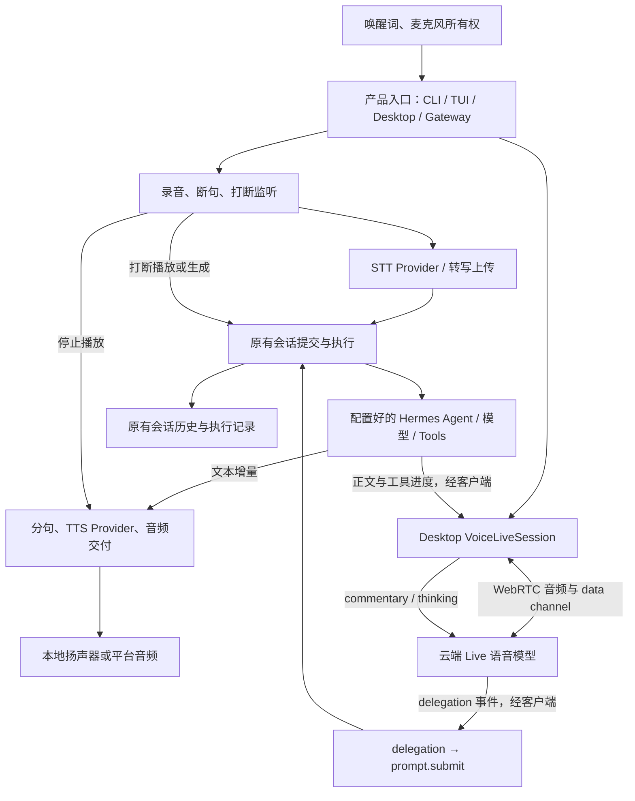

# Hermes Agent Voice：模块与代码调用流程

> 核对日期：2026-09-13。仓库：[NousResearch/hermes-agent](https://github.com/NousResearch/hermes-agent)。固定源码：`e151d0b3458e136729fe498b566deb795ffb6a42`（本次读取的 main）。
> 本文依据源文件、入口调用和相关测试代码；没有启动 Hermes、访问真实麦克风或运行 Provider。源码里的模型名、端点和默认参数是该版本的实现选择，不是对外部服务可用性的验证。
> 总对比：[三方功能与模块对比](VOICE_FEATURE_COMPARISON.md)。

## 1. 先区分三种语音路径

Hermes Voice 不是单一的“录音转文字”功能，也不是所有入口都使用同一种实时模型。

| 路径 | 使用入口 | 核心链路 | 是否另有语音模型 |
|---|---|---|---|
| Chained，默认模式 | CLI/TUI、Desktop 连续语音 | 录音/断句 → STT → 原有 Agent 会话 → 流式或文件 TTS → 播放 | STT/TTS 可分别选 Provider；推理和工具仍由业务 Agent 完成 |
| GPT-Live | 本次核对的 Desktop Voice Live 路径 | WebRTC 实时语音 → delegation → 普通 Hermes turn → commentary 回填 | 有；源码默认 `gpt-live-1`，配置为 `voice.voice_chat_mode: gpt-live` |
| Gateway 语音消息/语音频道 | 音频平台适配器；代码明确包含 Discord 频道路径 | 平台接收/转写 → MessageEvent → 正常 Agent 消息处理 → 平台语音交付 | 通常使用 STT/TTS；实际流式能力由平台 adapter 决定 |

Chained 也可以在模型生成或播放期间持续监听并打断。因此“存在全双工交互”不能直接推导出“使用原生 speech-to-speech”。GPT-Live 的接入在所查代码中是 Desktop 实现，不能据此声称所有平台都支持这一模式。[模式选择代码][H1]、[Desktop 组合入口][H2]、[Gateway 入口][H9]。

## 2. 模块图



图中 Live 音频直接在客户端与 Provider 之间传输；Hermes 后端负责带凭证交换 SDP 和执行委托。Chained 可以经后端音频中继，也支持有条件的客户端直连 STT/TTS，不能把图理解为所有音频必须穿过 Hermes Gateway。

## 3. 按职责拆成八个模块

### 模块 1：产品入口与模式组合

Desktop 的 `useComposerVoice` 挂接录音、Chained conversation、Live conversation、待朗读回复和唤醒暂停；`submitVoiceTurn` 走普通提交，`submitLiveDelegation` 增加 `surface: voice-live` 和 `voiceContext`。

CLI 的 `CLIVoiceMixin` 管理开启、关闭、连续录音和语音回复；TUI 的 `methods_voice.py` 暴露语音与唤醒 RPC。入口不同，但没有为语音另造 Hermes 推理核心。[H2]、[H3]、[H12]

### 模块 2：录音、断句与打断采集

CLI 的 `AudioRecorder` 使用本地音频流；`full_duplex_listen` 在生成和播放期间监听，保存 pre-roll，触发后继续采集完整插话再转写。`_BargeDetector` 使用能量、校准噪声基线、持续证据和播放宽限期。

Desktop 的 `useVoiceRecorder` 与 `voice-barge-in.ts` 使用浏览器媒体采集；后者在监听期间保留录音，避免打断触发之后才开始录音而丢失首字。它与 CLI 的实现不是同一份采集器。GPT-Live 则把输入轨道交给 WebRTC 会话，由 Provider 参与实时轮次处理。[H4]、[H5]

### 模块 3：STT Provider 与音频输入归一化

`transcribe_recording → transcribe_audio` 进入公共 STT 选择和派发。配置支持内置云端、本地、命令与插件路径；不能假定每个 Provider 都支持实时流式输入。

Desktop 后端上传入口 `/api/audio/transcribe` 处理文件后调用转写；开启 `voice.client_direct` 且 Provider 可直连时，客户端使用解析后的 STT 配置直接访问 Provider，其他情况回落中继。[H6]、[H7]、[H8]

### 模块 4：对话协调与原有 Agent 执行

Desktop Chained 的 `useVoiceConversation.handleTurn` 停止本轮录音、取得转写、检查完整停止短语，再 `onSubmit(transcript)`；打断捕获也进入相同提交责任。

Live 的 hook 把近期转写整理成“最后用户话语 + 最近口头上下文”，调用普通 `prompt.submit`。后端 `methods_prompt.py` 保存 surface 和受长度限制的 `voice_live_context`；`prompt_turn._invoke_agent` 最终调用已有 `agent.run_conversation`，并从同一执行流发出 `message.delta`。用户历史保存原始用户文字，语音风格和近期对话作为模型输入附注加入，二者不是同一份数据。[H10]、[H11]、[H13]、[H14]

### 模块 5：GPT-Live 会话与委托适配

`VoiceLiveSession.start` 建立 `RTCPeerConnection`、麦克风轨道和 `oai-events` data channel。`/api/audio/voice-live/session → create_webrtc_session` 在后端解析当前 profile 配置，提交 SDP，固定 `delegation.type=client`，返回 SDP answer。

收到 `session.delegation.created` 后，`useVoiceLiveConversation` 提交 Hermes turn；通过待回复正文和工具状态，把结果送为 `session.commentary.append`，把工具活动送为 `session.thinking.append`。该版本 hook 每 200 ms 检查回复增量，流式阶段优先发送完整句子，完成时补尾部。

源码中的 Live API 没有在本地直接挂载一套 Tools：工具在 Hermes 普通 Agent turn 内执行。问候可以由语音模型直接回应，真实业务是否委托仍受模型行为影响，提示词不是执行成功证据。[H1]、[H10]、[H15]

### 模块 6：TTS、分句与播放

`SentenceChunker` 把 Agent 文本增量变为可合成片段；`resolve_streaming_provider` 选择流式 Provider。CLI 的 `stream_tts_to_speaker` 使用流式 PCM 播放，非流式 Provider 走 `_SyncSentencePipeline`。

Desktop `startSpeechStream` 优先客户端直连，再尝试 `/api/audio/speak-stream`；没有可用流式路径时，由调用方回落完整文本合成。中继协议是文本 JSON 上行、PCM 二进制下行、start/end 控制；`stop` 或断开会终止当前合成消费。

Gateway 的 `StreamingTTSConsumer` 把相同分句能力接到 adapter 的 `begin/write/finish/abort_streaming_tts`。它记录 completed/partial 和是否抑制整段重播，避免已经播放部分音频后又从头发送文件。GPT-Live 不走这条独立 TTS 管线。[H16]、[H17]、[H18]、[H19]

### 模块 7：唤醒、停止与资源寿命

`wake_word.py` 管理唤醒引擎、输入来源、profile 短语和采集所有权，具体引擎放在 `wake_word_engines.py`。语音回合持有麦克风时暂停唤醒，释放后恢复；不是让两个采集循环自由争抢设备。

停止短语按完整话语匹配，避免把“stop the container”误认为只需退出语音。CLI 播放期插话还用 `is_tts_echo` 做文字相似性回声过滤；这是启发式保护，不是声学回声消除。Desktop 媒体约束请求浏览器 echo cancellation；请求该能力不等于实际设备效果已验证。[H20]、[H21]

### 模块 8：历史、进度与平台交付

普通 Hermes 会话保存用户文字、Agent 输出与执行过程。Live hook 的 `spokenLength` 是已经回填给语音模型的文字游标，不能解释为用户实际听到的字符数；远端 audio track 的电平用于 UI speaking 状态，也不是逐段播放确认账本。

Gateway 通过平台/会话/profile 路由，Discord 转写先检查来源授权与重复，再构造 `MessageEvent` 进入 `adapter.handle_message`。平台的 streaming handle 能记录可交付/部分输出事实，但这不等于 Live Voice 的 Host response/generation 展示账本。[H9]、[H10]、[H19]

## 4. 三条具体调用链

### 4.1 Desktop Chained

```text
useComposerVoice
  → useVoiceConversation → useVoiceRecorder / MediaRecorder
  → onTranscribeAudio → 客户端直连 STT 或 /api/audio/transcribe
  → onSubmit → prompt.submit → _run_prompt_submit → _invoke_agent
  → agent.run_conversation → message.delta / 完成事件
  → pendingResponse → startSpeechStream
  → 直连 TTS 或 speak-stream → PCM / 音频文件 → 播放
```

这是共享文字会话的语音适配；模型生成与 TTS 可以重叠，录音与输出也可以重叠，STT→业务 Agent→TTS 的职责顺序仍存在。

### 4.2 Desktop GPT-Live

```text
start → 麦克风轨道 + RTCPeerConnection + SDP offer
  → POST /api/audio/voice-live/session → create_webrtc_session
  → Provider /live/sessions → SDP answer → WebRTC 建立
  → session.input_transcript.delta / session.output_transcript.delta
  → 客户端近期口头上下文
  → session.delegation.created → delegationPrompt
  → prompt.submit(surface=voice-live, text, voice_context)
  → 原有 Hermes Agent / Tools
  → message.delta / 工具状态 → pendingResponse / activeToolLabel
  → commentary.append / thinking.append → Provider 组织语音 → 远端 audio track
```

新 delegation 在旧 turn 忙碌时调用 `onInterrupt` 并改为跟踪新 delegation；回填循环核对当前 session/delegation。**不能把这概括为支持多个持久后台任务独立完成并逐个播报**：当前 hook 以一个 active delegation 为中心，底层是否排队、重定向或停止由普通会话执行机制共同决定。

一个具体边界是：Live hook 以 `void onInterrupt()` 发起停止后继续提交，未在此回调内等待停止完成；回复来自当前页面的 pendingResponse，而不是后端携带 delegation_id 的强绑定结果。这与 Chained 捕获插话时等待 busy 结算、以及 Live Voice 的执行来源校验不同。这里记录实现差异，不以静态阅读断言已复现串音或错误执行。

### 4.3 Gateway 语音频道

```text
平台 adapter 采集和转写
  → GatewayVoiceMixin._handle_voice_channel_input
  → 来源授权 / 去重 / 平台会话上下文
  → MessageEvent(VOICE) → adapter.handle_message → 正常消息 Agent 流程
  → StreamingTTSConsumer → 平台 streaming audio handle
    或 _send_voice_reply → 文件合成 → 平台语音发送/播放
```

语音消息附件和实时语音频道应分别介绍；支持发送 voice message 不等于支持实时通话。

## 5. 打断和恢复的实际含义

| 情况 | 所查实现 |
|---|---|
| CLI Chained 生成期插话 | 触发 `agent.interrupt()`，停止旧 TTS 管线，转写插话作为下一条输入 |
| CLI Chained 播放期插话 | 先停止播放，记录 speech interrupted；转写后检查停止短语与可能回声 |
| Desktop Chained 插话 | 停播、捕获插话；生成期调用 interrupt，提交前等待 busy 结算，存在超时边界 |
| Desktop GPT-Live 插话 | 原生语音交互由 Provider/WebRTC 承担；新 delegation 可停止旧 Hermes turn；不是逐样本自行裁剪 |
| 关闭 GPT-Live | 发送 `session.close`，收到关闭或超时后释放轨道、data channel、peer 和播放资源 |
| 普通会话恢复 | 复用 Hermes 原有持久历史和 turn/crash marker 能力；本文不把它等同于专门的 Voice Task/Attempt/Outbox |

有启动 epoch、delegation 引用和播放 sequence 保护，不能据此声称跨进程、跨所有平台已经有完全一致的“已听历史”协议。此判断限定所追踪语音路径，不是否认 Hermes 其他任务、调度或恢复功能。

## 6. 配置与信任边界

Live 模式的项目密钥留在后端 SDP 交换阶段；媒体走客户端直达 Provider。**Chained client-direct 是另一种边界**：`voice_client_config._direct` 返回 Provider 凭证供受信客户端调用。因此不能统一介绍为“Hermes 所有语音凭证都不进入客户端”。配置按 profile 解析，未读取用户私有配置。

## 7. 代码证据和阅读范围

以下链接固定到本次 SHA。已沿主要函数读取实现，不以 README 或发布介绍代替代码；测试只作为设计边界佐证，本次未执行其测试。

| 编号 | 模块证据 |
|---|---|
| H1 | [voice_live.py：模式、配置、SDP 交换][H1] |
| H2–H5 | [Desktop 组合][H2]、[CLI 语音][H3]、[本地录音/VAD][H4]、[Desktop 打断采集][H5] |
| H6–H8 | [STT 派发][H6]、[音频 HTTP/WS 入口][H7]、[客户端直连配置][H8] |
| H9–H15 | [平台语音入口][H9]、[Live hook][H10]、[Chained hook][H11]、[TUI RPC][H12]、[prompt.submit][H13]、[Agent turn][H14]、[WebRTC 适配][H15] |
| H16–H21 | [分句/流式 TTS][H16]、[本地扬声器管线][H17]、[Desktop 播放][H18]、[平台流式消费][H19]、[唤醒][H20]、[停止词与回声过滤][H21] |
| 相关测试 | [Live 委托契约][HT1]、[Desktop Live 协调][HT2]、[流式 TTS 消费][HT3] |

[H1]: https://github.com/NousResearch/hermes-agent/blob/e151d0b3458e136729fe498b566deb795ffb6a42/tools/voice_live.py
[H2]: https://github.com/NousResearch/hermes-agent/blob/e151d0b3458e136729fe498b566deb795ffb6a42/apps/desktop/src/app/chat/composer/hooks/use-composer-voice.ts
[H3]: https://github.com/NousResearch/hermes-agent/blob/e151d0b3458e136729fe498b566deb795ffb6a42/hermes_cli/cli_voice_mixin.py
[H4]: https://github.com/NousResearch/hermes-agent/blob/e151d0b3458e136729fe498b566deb795ffb6a42/tools/voice_mode.py
[H5]: https://github.com/NousResearch/hermes-agent/blob/e151d0b3458e136729fe498b566deb795ffb6a42/apps/desktop/src/lib/voice-barge-in.ts
[H6]: https://github.com/NousResearch/hermes-agent/blob/e151d0b3458e136729fe498b566deb795ffb6a42/tools/transcription_tools.py
[H7]: https://github.com/NousResearch/hermes-agent/blob/e151d0b3458e136729fe498b566deb795ffb6a42/hermes_cli/web_routers/audio.py
[H8]: https://github.com/NousResearch/hermes-agent/blob/e151d0b3458e136729fe498b566deb795ffb6a42/tools/voice_client_config.py
[H9]: https://github.com/NousResearch/hermes-agent/blob/e151d0b3458e136729fe498b566deb795ffb6a42/gateway/run_voice.py
[H10]: https://github.com/NousResearch/hermes-agent/blob/e151d0b3458e136729fe498b566deb795ffb6a42/apps/desktop/src/app/chat/composer/hooks/use-voice-live-conversation.ts
[H11]: https://github.com/NousResearch/hermes-agent/blob/e151d0b3458e136729fe498b566deb795ffb6a42/apps/desktop/src/app/chat/composer/hooks/use-voice-conversation.ts
[H12]: https://github.com/NousResearch/hermes-agent/blob/e151d0b3458e136729fe498b566deb795ffb6a42/tui_gateway/methods_voice.py
[H13]: https://github.com/NousResearch/hermes-agent/blob/e151d0b3458e136729fe498b566deb795ffb6a42/tui_gateway/methods_prompt.py
[H14]: https://github.com/NousResearch/hermes-agent/blob/e151d0b3458e136729fe498b566deb795ffb6a42/tui_gateway/prompt_turn.py
[H15]: https://github.com/NousResearch/hermes-agent/blob/e151d0b3458e136729fe498b566deb795ffb6a42/apps/desktop/src/lib/voice-live.ts
[H16]: https://github.com/NousResearch/hermes-agent/blob/e151d0b3458e136729fe498b566deb795ffb6a42/tools/tts_streaming.py
[H17]: https://github.com/NousResearch/hermes-agent/blob/e151d0b3458e136729fe498b566deb795ffb6a42/tools/tts_tool_speaker.py
[H18]: https://github.com/NousResearch/hermes-agent/blob/e151d0b3458e136729fe498b566deb795ffb6a42/apps/desktop/src/lib/voice-playback.ts
[H19]: https://github.com/NousResearch/hermes-agent/blob/e151d0b3458e136729fe498b566deb795ffb6a42/gateway/streaming_tts_consumer.py
[H20]: https://github.com/NousResearch/hermes-agent/blob/e151d0b3458e136729fe498b566deb795ffb6a42/tools/wake_word.py
[H21]: https://github.com/NousResearch/hermes-agent/blob/e151d0b3458e136729fe498b566deb795ffb6a42/tools/voice_mode_transcript.py
[HT1]: https://github.com/NousResearch/hermes-agent/blob/e151d0b3458e136729fe498b566deb795ffb6a42/tests/tui_gateway/test_voice_live_delegation.py
[HT2]: https://github.com/NousResearch/hermes-agent/blob/e151d0b3458e136729fe498b566deb795ffb6a42/apps/desktop/src/app/chat/composer/hooks/use-voice-live-conversation.test.ts
[HT3]: https://github.com/NousResearch/hermes-agent/blob/e151d0b3458e136729fe498b566deb795ffb6a42/tests/gateway/test_streaming_tts_consumer.py
