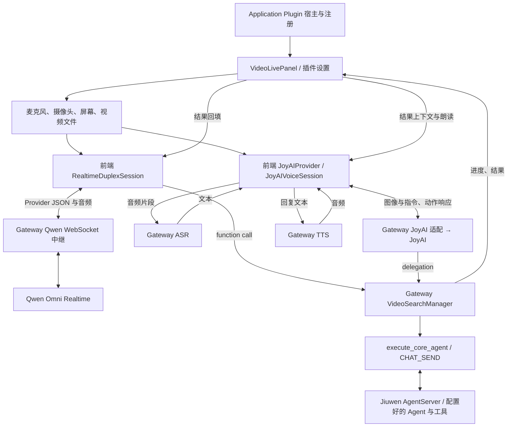

# JiuwenSwarm PR #2813：全双工音视频插件基础流程

> 核对日期：2026-09-13。[原 PR #2813](https://github.com/openJiuwen-ai/jiuwenswarm/pull/2813) 已合入；本地可复现的镜像合入提交是 `df5f89646227b05c6cbd90e1a0debe729ab2b26e`。GitHub PR API 返回的 head 为 `a66f2ebbf349fbe8df92c253526e11fdad1daecd`，与镜像提交不是同一 SHA。
> 本文以 `git show df5f8964:<path>` 核对最初实现，并用当前源文件追踪保留的模块。文内相对代码链接指向当前文件，已包含后续 #5301；历史行为以本节基线为准。增量另见 [#5301 流程](JIUWENSWARM_DUPLEX_PR5301_FLOW.md)，总览见[三方对比](VOICE_FEATURE_COMPARISON.md)。
> 本次是静态源码分析，未启动 Provider、摄像头或真实 Agent；PR 描述中的演示与测试成绩不作为本次实测结果。

## 1. 这个 PR 建立了什么

#2813 建立 Application Plugin 形式的 `video-duplex`：插件声明、设置、前端工作区、音视频采集、两种 Provider 接入、Core Agent 搜索委托和进度返回。

这里的“视频”主要是**输入画面**：摄像头、屏幕或视频文件抽帧后交给模型；输出是文字和语音。不能将它介绍为视频生成或多人视频会议系统。

两种 Provider 的协议明显不同：

- **Qwen Omni Realtime**：连续音频与抽样图像经 WebSocket 进入模型，原生接收转写、文字、音频和 function call。
- **JoyAI**：周期图像请求携带文本指令，通过 Chat Completions 风格接口返回 silence/response/delegation；语音另经 ASR 和 TTS。它是可并行运行的音视频交互组合，不是与 Qwen 相同的原生语音协议。

## 2. 模块图



Plugin 宿主负责发现、入口和生命周期装配；Provider 的实时对话调度主要在浏览器，后台查询任务由 Gateway 插件管理，实际工具执行进入 AgentServer。

## 3. 七个职责模块及代码调用

| 模块 | 责任、输入和输出 | 关键实现 |
|---|---|---|
| D1 插件宿主与配置 | 声明插件，绑定 Web channel 与 Agent client，挂载页面、设置 RPC 和媒体路由；输出可用入口与 Provider 配置 | [extension.py](../../jiuwenswarm/extensions/video_duplex/extension.py)、[application_host.py](../../jiuwenswarm/extensions/application_host.py)、[settings.py](../../jiuwenswarm/extensions/video_duplex/backend/settings.py) |
| D2 产品界面与媒体源 | 操作会话、选择媒体、抽帧；输出最新图像和麦克风音频，显示模型及后台结果 | [VideoLivePanel](../../jiuwenswarm/extensions/video_duplex/frontend/VideoLivePanel/index.tsx)、[videoSource.ts](../../jiuwenswarm/extensions/video_duplex/frontend/VideoLivePanel/videoSource.ts) |
| D3 Qwen 实时引擎与播放 | 建连、session.update、音频/图像序列、Provider 事件、function call、取消、下行音频播放 | [qwenOmniSession.ts](../../jiuwenswarm/extensions/video_duplex/frontend/VideoLivePanel/qwenOmniSession.ts)、[qwenOmniProtocol.ts](../../jiuwenswarm/extensions/video_duplex/frontend/VideoLivePanel/qwenOmniProtocol.ts)、[duplex-playback.js](../../jiuwenswarm/extensions/video_duplex/frontend/VideoLivePanel/duplex-playback.js) |
| D4 JoyAI 图像对话与独立语音 | 周期取最新图像、挂接用户文本；解析动作；把音频片段转写，把回复文本合成语音 | [joyaiProvider.ts](../../jiuwenswarm/extensions/video_duplex/frontend/VideoLivePanel/joyaiProvider.ts)、[joyaiVoice.ts](../../jiuwenswarm/extensions/video_duplex/frontend/VideoLivePanel/joyaiVoice.ts)、[joyai_provider.py](../../jiuwenswarm/extensions/video_duplex/backend/joyai_provider.py)、[video_voice.py](../../jiuwenswarm/extensions/video_duplex/backend/video_voice.py) |
| D5 Gateway 协议接入 | Qwen 原始 WS 双向中继；JoyAI/ASR/TTS/配置等应用 RPC；向前端返回错误与诊断 | [qwen_omni_gateway.py](../../jiuwenswarm/extensions/video_duplex/backend/qwen_omni_gateway.py)、[video_live.py](../../jiuwenswarm/extensions/video_duplex/backend/video_live.py) |
| D6 搜索任务与 Agent 桥接 | 接收研究提议、接受后台工作、并发限制、进度/结果；构造普通 CHAT_SEND 请求 | [qwen_omni_tools.py](../../jiuwenswarm/extensions/video_duplex/backend/qwen_omni_tools.py)、[video_search.py](../../jiuwenswarm/extensions/video_duplex/backend/video_search.py) |
| D7 结果呈现与上下文回填 | 用 job/call 关联进度，展示结果，把摘要或工具结果返回当前 Provider | [searchPresentation.ts](../../jiuwenswarm/extensions/video_duplex/frontend/VideoLivePanel/searchPresentation.ts)、[joyaiToolContext.ts](../../jiuwenswarm/extensions/video_duplex/frontend/VideoLivePanel/joyaiToolContext.ts)、[qwenOmniTools.ts](../../jiuwenswarm/extensions/video_duplex/frontend/VideoLivePanel/qwenOmniTools.ts) |

这些是责任模块，不是七个独立服务。`VideoLivePanel` 与两个前端 Provider 类仍承担相当多的会话编排。

## 4. 启动与配置链路

```text
插件发现 / registry.register_application_plugin
  → VideoDuplexApplicationPlugin.bind_web_channel
  → register_video_live_handler(channel, agent_client, normalize_media_attachments)
  → 注册 video.*、tts.* 等应用方法

websocket_routes
  → Web channel app 挂载 /ws/video/qwen-omni

前端 ApplicationPluginOutlet
  → VideoLivePanel → video.realtime.config
  → 选择 JoyAI 或 Qwen → 打开媒体与 Provider 会话
```

配置有独立的插件设置持久化；Provider 项目密钥在后端解析。`local_only=True` 在 Web channel 中的含义是**由 Gateway 本地方法处理，不再转发到 AgentServer**，不能把这个名字当成“只有本机用户能访问”的完整权限证明。Qwen 中继会用后端密钥连接上游，路由装配另有 Origin 检查；这也不等于 Live Voice 的 project/source/capability 校验体系。

## 5. Qwen 的声音与图像如何流动

```text
getUserMedia → capture AudioWorklet → PCM → 重采样/分批
  → RealtimeDuplexSession.sendAudio
  → QwenOmniMediaSequencer.createBatch
      input_audio_buffer.append
      input_image_buffer.append（已有先行音频后发送抽样图像）
  → /ws/video/qwen-omni → upstream WebSocket
  → Qwen 响应事件 → RealtimeDuplexSession
      转写/文字 → UI callbacks
      音频增量 → 解码 → playback AudioWorklet → 扬声器
      function call → 应用 RPC → Core Agent 搜索
```

`RealtimeVideoFrameScheduler` 把多图像源按整体约 1 fps 的节奏轮转。`QwenOmniMediaSequencer` 将图像延后一轮音频 flush，避免第一张图像到达时尚无音频片段；图像还有大小边界。它不是把整段摄像头视频作为高帧率媒体轨道直传。

Provider 协议和轮次处理在 `qwenOmniSession.ts`；Python `serve_qwen_omni_websocket` 主要是建连、凭证注入、双向 relay 和异常清理，没有把 Qwen 响应转换成 Live Voice 的 Native Runtime 协议。

## 6. JoyAI 的声音与图像如何流动

```text
麦克风 → JoyAIVoiceSession 收集一段语音
  → video.transcribe → ASR → transcript
  → JoyAIProvider.submitUserInstruction → 等待/结合最新画面

周期图像 → JoyAIProvider.requestFrame
  → video.joyai.frame → joyai_provider.request_completion
  → POST /chat/completions（图像 + 指令 + streaming-session 标识）
  → parse_action
      silence：保持安静
      response：展示文字 → TTS → 浏览器播放
      delegation：VideoSearchManager → AgentServer
```

JoyAI 周期请求在本地推理请求未结算时跳过重复调度，避免持续积压。相同会话通过 `x-streaming-session` 标识交给上游；不是前端保存一个完整视频再统一上传。

`video_voice.py` 提供转写和 TTS 接口；`joyai_provider.py` 还封装其专用语音通道。独立 TTS 有流开始、音频 chunk、完成、取消事件，所以视觉/任务处理可以与说话并行。

## 7. #2813 的业务边界：研究委托已经调用真实 Agent

原始版本的 Qwen 工具是 `jiuwen_research(query)`，参数上限为 500 字符，面向需要外部或时效性信息的查询。不是只有前端假搜索；调用链已是：

```text
Qwen function call / JoyAI delegation
  → VideoSearchManager.start → asyncio task / semaphore
  → execute_core_agent
  → e2a_from_agent_fields(CHAT_SEND, mode=agent, work_mode=work)
  → AgentServer client.send_request_stream（或 send_request 回退）
  → 正常 Agent 执行与工具输出
  → video.search.progress / completed / failed
  → 前端展示，回填 Provider
```

原始 `execute_core_agent` 每次创建新的 `video-tool-*` 内部会话。原始 Manager 用内存 jobs/tasks 和 semaphore 管理后台执行；**有异步工作与状态，不代表已经具备 Live Voice 正式 Task 的 Attempt/Outbox/文件恢复事务**。

## 8. #2813 与后续 #5301 的界线

| #2813 已建立 | #5301 后续扩展，不能倒写成 #2813 原有能力 |
|---|---|
| Application Plugin 工作区与设置 | 从常规任务输入区开启并绑定原生会话 |
| 两个 Provider、音视频采集与播放 | 独立普通任务 ASR；无需进入全双工 |
| `jiuwen_research` 和真实 Core Agent 搜索 | `jiuwen_delegate` 通用工作委托，保留旧工具兼容 |
| 内存异步 job 与进度 | 同 scope 队列、排序/抢占/取消确认、call_id 幂等 |
| Provider 文本和搜索结果展示 | 原生历史、标题、reasoning/tool/file 时间线接入 |
| 原有打断控制 | Silero 本地人声确认、迟到音频 generation 过滤等加强 |

当前 #5301 完成后的代码不能用来证明最初 #2813 就已拥有这些增强。复核历史的方式是读取 `df5f8964`，而不是只看今天的插件 README。

## 9. 给架构师和产品经理的介绍稿

> 这项能力把视频、声音和工具查询做成 JiuwenSwarm 的应用插件。浏览器负责媒体和实时交互，Gateway 负责模型接入，复杂查询交给已有 AgentServer。Qwen 是原生音视频实时模型路径；JoyAI 是图像对话加独立 ASR/TTS 的组合路径。两者共享界面和后台业务桥接，但协议和调度并不相同。最初 PR 建立插件基础；后来 #5301 才把它进一步接进常规任务工作流。
