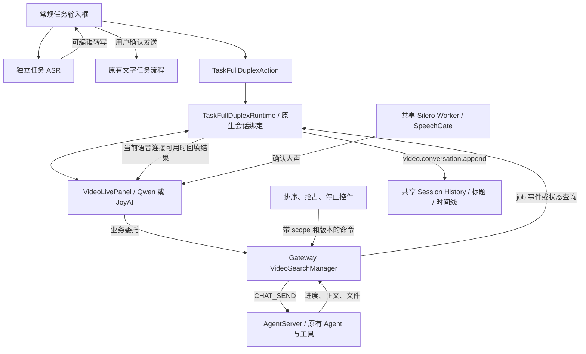

# JiuwenSwarm PR #5301：全双工接入常规任务的增量流程

> 核对日期：2026-09-13。[原 PR #5301](https://github.com/openJiuwen-ai/jiuwenswarm/pull/5301) 已合入。本地镜像合入提交：`b83923ae1f8cf0a315ce1f580e016edf48a02c2d`；以其父提交到该提交的差异区分新增行为。
> 插件源码复核：本次 Task/Work 统一后 `git diff b83923ae HEAD -- jiuwenswarm/extensions/video_duplex` 仍为空。插件保留同一实现；LiveVoice 已改用 AgentCore Task/Work，不代表此插件的 job 已自动改用它们。宿主代码另有后续变化。
> 基础媒体/Provider 流程见 [#2813 文档](JIUWENSWARM_DUPLEX_PR2813_FLOW.md)；本篇重点是增量。比较结论见[三方对比](VOICE_FEATURE_COMPARISON.md)。本次未运行真实音视频或 Agent 验收。

## 1. 它不是第二套全双工插件

#5301 在 #2813 上扩展了两种入口：普通任务输入框的录音转写，以及从常规任务会话开启持续音视频交互。后者把转写、回答、后台工具和文件结果接入原生任务时间线。

同时，研究工具扩为通用 Core Agent 委托，加入受控后台队列、版本检查、取消确认、并发结果归属、文件交付和更可靠的本地打断。

这里页面上的“Task/任务”不能直接理解为 Live Voice 的 `PersistentTaskCore` 对象。插件后台实体仍是 `VideoSearchManager` 管理的 job；名称保留了 search，但执行能力已经不限于搜索。

## 2. 增量模块图



这是“插件接入原有产品和 Agent”的方案。它没有把插件的 job 生命周期迁移到 Live Voice 的共享 Work/正式 Task 服务。

## 3. 六项主要增量

| 模块增量 | 代码责任与关键调用 | 实际变化 |
|---|---|---|
| P1 独立任务 ASR | `useTaskAsr → task.asr.transcribe → transcribe_task_audio` | 录音转成可编辑文字；不自动提交 Agent |
| P2 任务入口与连接生命周期 | `TaskFullDuplexAction → taskFullDuplexRuntimeStore → TaskFullDuplexRuntime → VideoLivePanel` | 绑定已有或新建的原生会话，协调启动、停止和切换 |
| P3 通用委托 | `jiuwen_delegate → handle_qwen_tool/start → execute_core_agent` | 从研究查询扩为配置 Agent 能执行的工作；附用户原始指令、画面和已有委托结果 |
| P4 受控 job 队列 | `VideoSearchManager._job_slot / handle_control / _cancel_job` | scope 内串行、跨 scope 并发限额、排序、抢占、等待真正取消回执 |
| P5 时间线与文件结果 | `TaskDuplexJobs → TaskFullDuplexRuntime → video.conversation.append → append_history_record` | 关联用户、模型、reasoning、tool、file 和结果；沿用原生历史/标题机制 |
| P6 人声打断与结果播报隔离 | `SileroVad → SpeechGate → interruptQwenResponse`；JoyAI speech epoch/TTS generation | 人声证据、取消旧响应、清空旧播放、阻止迟到音频；结果按 job/call 关联 |

## 4. 独立任务 ASR：它只是输入方式

```text
输入框麦克风
  → useTaskAsr：getUserMedia + MediaRecorder
  → 停止录音，Blob 转 base64
  → webRequest(task.asr.transcribe, audio_base64, mime_type)
  → Gateway transcribe_task_audio
  → 校验格式/大小/配置 → multipart 上传 ASR
  → transcript → onTranscript → 输入框
  → 用户编辑并发送 → 原有聊天/任务流程
```

使用 `ASR_API_BASE / ASR_API_KEY / ASR_MODEL_NAME` 这一用途的配置，不复用 JoyAI 插件 ASR。此功能不需要 Realtime，不涉及 TTS，也不等同于持续会话。

代码：[useTaskAsr](../../jiuwenswarm/channels/web/frontend/src/features/taskAsr/useTaskAsr.ts)、[task_asr.py](../../jiuwenswarm/gateway/channel_manager/web/task_asr.py)、[app_web_handlers.py](../../jiuwenswarm/gateway/channel_manager/web/app_web_handlers.py)。

## 5. 通用委托到底调用到哪里

Qwen 工具从 `jiuwen_research(query)` 扩为 `jiuwen_delegate(task)`。当前 schema 对外声明 task；解析器兼容 query/instruction/request 别名以及旧 research 调用，要求恰好一个任务字段。任务文字边界为 2,000 字符，call_id 也有格式长度校验。

```text
Realtime function call
  → 前端 onFunctionCall
  → video.qwen.tool(name, call_id, arguments, question,
                    search_session_id, turn_id, frame_data_url)
  → parse_qwen_omni_tool_call / 参数校验
  → 按 (search_session_id, call_id) 查重
  → VideoSearchManager.start：返回 queued 回执
  → _run_job → _job_slot → semaphore
  → execute_core_agent
  → E2A CHAT_SEND(mode=agent, work_mode=work, source=video_tool)
  → AgentServer client.send_request_stream
  → 既有 Agent 执行与工具
```

`execute_core_agent` 发送原始用户要求、Realtime 整理目标、画面线索、此前已完成委托上下文；有画面时通过共享附件归一化服务传入 Agent。它复用的是标准 AgentServer 请求入口，**不是直接调用 Live Voice 的 `RuntimeFormalAgentFacade`**。

同一 `search_session_id` 复用 Manager 保存的 `video-tool-*` 内部 Agent 会话。这个 ID 与页面的可见原生 session 不是同一个实体；前端 job 映射负责把结果送回正确页面会话。

JoyAI 路径仍通过 `video.joyai.frame` 解析 delegation，再进入同一个 Manager；不能把两种 Provider 都描述成相同的 function-call 协议。

这里还保留了实际的不对称：Qwen 新委托的 task 上限为 2,000 字符，并按 call_id 幂等；JoyAI 当前入口仍把 delegation/question 截到 500 字符，以同 scope 的归一化查询匹配运行中工作。接入同一个 Manager 不代表两个入口已统一请求完整性和去重语义。

代码：[工具契约](../../jiuwenswarm/extensions/video_duplex/backend/qwen_omni_tools.py)、[Manager 与执行桥](../../jiuwenswarm/extensions/video_duplex/backend/video_search.py)、[JoyAI 入口](../../jiuwenswarm/extensions/video_duplex/backend/video_live.py)。

## 6. job 队列与取消语义

Manager 持有 `_jobs / _queue / _active / _call_jobs / _session_states / _job_tasks`，并使用 condition、scope lock 和默认容量为 2 的 semaphore。

- `_job_slot`：同一 scope 只允许队首且无 active job 时执行；不同 scope 受全局并发限额约束。
- `handle_control`：支持 cancel、next、before、preempt；排序检查 queue_version，避免用旧页面顺序覆盖新队列。
- `_cancel_job`：运行中的 job 先发送 `CHAT_CANCEL`，等待 AgentServer 确认，再取消本地 runner 并发布 cancelled；若确认失败，恢复原状态。
- preempt：先调整队列，再停止 active job；停止失败会恢复待执行顺序，不直接启动抢占者。
- `(scope, call_id)` 幂等：相同 transport 请求复用 job，不把相似文字但不同 call_id 的工作合并。

这些都是实际实现，不是仅有按钮。相关测试覆盖取消确认失败、抢占回退、错误 scope、旧版本和未开始任务不执行。

**持久化边界必须保留：**该 Manager 的运行队列和会话上下文是内存字典；诊断 JSONL 与原生历史不构成此队列的 durable outbox，也未见本模块从日志重建执行队列。因此“页面历史可恢复”“同一进程可补查 job”不能替换成“服务重启后任务可可靠续跑”。

代码：[video_search.py](../../jiuwenswarm/extensions/video_duplex/backend/video_search.py)、[队列测试](../../jiuwenswarm/extensions/video_duplex/tests/backend/test_video_task_queue.py)。测试本次已阅读，未重跑。

## 7. 结果从 Agent 返回后发生什么

`execute_core_agent` 消费 `chat.delta / chat.final / chat.error`，把 tool、plan、reasoning、file 等转成进度；汇总为 `display_result` 与 `realtime_brief`。

摘要提取使用本次生成的 nonce 标记。没有合格模型摘要时，`present_core_agent_result` 走回退摘要；它是结果格式适配，不能据此宣称已经验证所有文件内容正确。

```text
Agent 事件
  → core_agent_progress / present_core_agent_result
  → video.search.progress / completed / failed / cancelled
  → TaskDuplexJobs：关联 job → 页面 session，进度去重
  → TaskFullDuplexRuntime：UI callbacks + persistTimelineEvent
  → video.conversation.append
  → append_history_record / 原生标题与历史

同时，如果目标 session 仍有当前语音连接：
  → panel.deliverToolResult
  → Qwen 工具结果回填或 JoyAI 结果朗读/上下文
```

Qwen 的 `dispatchQueuedToolResult` 在用户说话或模型仍生成时等待，但不要求已排队的声音全部播放完毕；`call_id / job_id / turn_id / responseId` 用于关联结果。它不会只因为来了新问题就无条件丢弃以前 job 的结果。

**展示/历史优先，播放可选**是此处的明确实现：`TaskFullDuplexRuntime` 先写入业务结果，再判断当前连接是否允许朗读。JoyAI `commitAndSpeak` 也先提交文字再检查是否可播放；Qwen 在取消时保留已收到文字。因此这些历史不是“用户已听记录”。

历史写入经前端按 session 排序的 Promise 队列发送。代码 catch 记录持久化错误；本次未发现该前端队列有磁盘重试日志，不能把发送动作等同于所有故障下已持久保存。

代码：[Task Runtime](../../jiuwenswarm/extensions/video_duplex/frontend/TaskFullDuplexRuntime.tsx)、[job 映射](../../jiuwenswarm/extensions/video_duplex/frontend/taskDuplexJobs.ts)、[历史 RPC](../../jiuwenswarm/extensions/video_duplex/backend/video_live.py)、[Qwen 结果调度](../../jiuwenswarm/extensions/video_duplex/frontend/VideoLivePanel/qwenOmniSession.ts)。

## 8. 人声检测、打断与播放

共享 `SileroVad` 在 Worker 中推理；`SpeechGate` 对 16 kHz 的 512 样本帧处理人声证据：当前实现以概率至少 0.8、能量至少 80 作为起始证据，10 帧窗口内至少 8 帧确认后进入 started。稳定结束另有较低概率门槛与静音保持。

Qwen 的本地 started 触发：

```text
SpeechGate.started
  → 建立 user turn id
  → interruptQwenResponse
      标记 interruptedResponseIds
      活跃生成时发送 response.cancel
      playbackGeneration++
      Worklet clear
      保留已收到文字
  → 迟到音频和异步解码完成时再次检查 response/generation
```

Provider 自己的 VAD 与本地人声检测不是同一个时钟/状态。当前 session.update 请求 semantic_vad；本地 Silero 用于快速阻止旧输出。JoyAI 则通过 speech epoch/TTS generation、stream_id 取消和迟到 chunk 检查处理打断。

Qwen 当前输入 16 kHz、输出 24 kHz，音频发送批次间隔 200 ms，播放模块目标初始等待 400 ms；短尾 drain 可以提前开始。**这些是代码参数，不是实测端到端时延，也不能直接相加得到总体延迟。**

Worklet 的 cleared/drained 报文带有 playedMs/underrunMs；当前 Qwen handler 主要消费清空/排空事件来更新前端状态，并未将这些计数接成 Live Voice 的 Host 已呈现历史准入。不能因为计数出现在报文里就声称已经闭环使用。

代码：[SpeechGate](../../jiuwenswarm/channels/web/frontend/src/utils/speechDetection/speechGate.ts)、[Silero](../../jiuwenswarm/channels/web/frontend/src/utils/speechDetection/sileroVad.ts)、[Qwen session](../../jiuwenswarm/extensions/video_duplex/frontend/VideoLivePanel/qwenOmniSession.ts)、[播放 Worklet](../../jiuwenswarm/extensions/video_duplex/frontend/VideoLivePanel/duplex-playback.js)、[打断/结果测试](../../jiuwenswarm/extensions/video_duplex/tests/frontend/realtimeDuplex.test.mjs)。

## 9. 如何向产品经理介绍

> 最初的全双工插件能看、听、说并调用 Agent 查询；这次把它放进日常任务会话。用户可以只用语音填写输入框，也可以开启持续音视频交流。需要真正执行的工作会排进后台队列，既有 Agent 返回进度、正文和文件，统一展示在原有历史中。说话可以打断朗读，但后台工作是否停止由独立任务控制决定。它实现了任务入口与结果的统一；运行队列仍由插件自己管理，和 Live Voice 的持久化正式任务服务不同。
