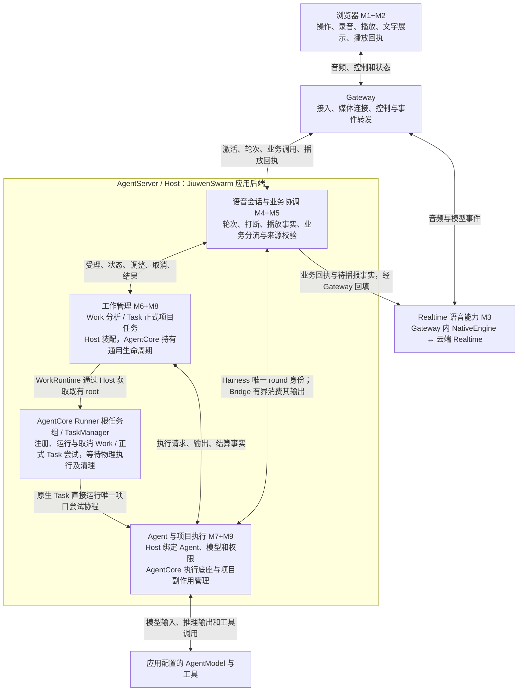
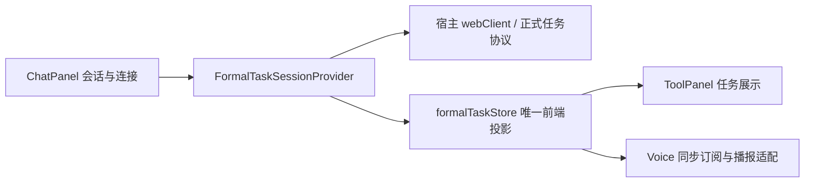

# LiveVoice：模块、运行位置与数据流

> 2026-09-14 正式 Task 原生执行收敛：AgentServer → P3 factory → AgentRuntime → 既有 Runner 根任务组 / TaskManager，原生 Task 直接运行唯一 `_run_attempt`。Harness 仍是前台 round 身份权威，Voice Bridge 只持有有界输出消费许可。
> 配套 SDK `0.1.17+livevoice.9`。Work 和正式 Task 尝试共用原生执行、取消及事件能力；Task journal/Store 的事务、副作用与恢复事实仍是业务权威，不用原生瞬时状态替代。AgentServer 是装配应用服务与执行依赖的运行容器。完整融合目标仍为 PARTIAL。
> 当前相同口径：Voice **112101** / Host **48048** / SDK **34307**，合计净增 **194456**；本批 **+181**，较初始 **−1224**。本批没有大批删除重复代码，不将接线和必要取消保护算作代码消除。[逐文件统计](../evidence/DEEP_FORMAL_NATIVE_COUNTS_20260914.json)、[合并模块统计](../evidence/DEEP_FORMAL_NATIVE_MODULES_20260914.json)。后文旧数字为历史阶段。
> M4+M5、M7+M9 保持合并。Hermes 和多模态方案未重新核验，保留原固定版本和静态证据边界；本批不形成性能、延迟或物理音频优势证据。

> 本文由 2026-09-13 的模块导读持续更新；早期 `.5` 阶段结论应结合上述当前调用关系阅读。
> 对应[统一记录](../reviews/TASK_WORK_UNIFICATION_20260913.md)和[代码量清单](UNIFIED_CODE_ACCOUNTING.md)。这是源码说明；当前产品验收边界仍由 [STATUS](../STATUS.md) 管理。

## 1. 介绍颗粒度

LiveVoice 是 JiuwenSwarm 的语音入口：用户说话，Realtime 负责实时听说；需要查事实或执行工作时，进入应用后端与 AgentCore；真实结果再交语音层播报。插话停止声音，与取消已受理的工作，是两种操作。

首次介绍采用四个顶层部分：**浏览器、Gateway、Realtime 语音能力、AgentServer**。AgentServer 内展开三组职责：**语音会话与业务协调（M4+M5）、工作管理（M6+M8）、Agent 与项目执行（M7+M9）**。M1+M2 统一称浏览器；原编号只用于定位。每组介绍责任、输入输出、状态归属和调用关系，不按每个类画框。

M4+M5、M7+M9 是介绍颗粒度的合并。代码仍保留必要的职责边界。Work/Task 在工作管理组内保留两种执行模式，共用 SDK 能力，并不强行共用一张状态表。Gateway 不能省略，否则会误解音频直接进入 AgentServer。配置、鉴权、历史、诊断作为横向责任，首次介绍无需独立展开。

## 2. 展示用模块图



这是职责图，框不等于进程。NativeEngine 实际在 Gateway，云端 Realtime 与它合为一组语音能力；排查延迟时再展开本地/云端边界。AgentCore 是 AgentServer 进程使用的 Python SDK，**不是新增网络服务**。AgentServer 是 JiuwenSwarm 的业务后端；Host 指承载并装配这些能力的应用宿主。业务后端不能用 AgentCore 来代称。

09-14 准入收敛：Registry/激活租约 → `AgentConversationRuntime.submit_committed_turn`
→ 单一 `_admissions` 记录 → Harness 预约/提交 → Bridge 预留消费容量并绑定真实 handle。删除无生产消费者的
`dispatch_committed_turn`、独立预留及双账本接管；同一结果 Future 和协调任务不再
由两份账本重复持有。保留语音轮次/播放事实，未将其混同正式 Task 状态。
Gateway 合成授权直接使用 BatchSpeech 已有摘要构建器，签发与校验共享字段绑定。
该变化收敛 M4+M5 与 Gateway 内部实现，不代表 M6+M8 已全面统一。
进一步删除无产品消费者的 effect claim/ACK 队列和重放账本；实际输出仍经通知
租约交付并由 PresentationAck 决定历史，关闭仍执行 CR.close 和通知 final-drain。
CR 的播放停止/响应取消事实及 Harness 精确 round 取消均保留。

Task 权威读取（`.5`）：Host 产品投影 → SDK Store 聚合分页 → 同一 SQLite
快照中的 Task / Attempt / admission / 事件头 / 结果。删除 Host 双读和三次收敛
重试；保留产品权限、能力与继承关系校验。M6+M8 的权威仍是既有 Store，未新增
任务状态或数据库。普通分页及正式命令的旧请求校验不变。

09-14 校验复用：Native carrier/runtime → 已有 `native_interaction_contract._identity`，
仅保留领域错误转换；SDK checkpoint/effect/recovery/prefix → 同一
`durability_identity` 文本、scope、profile 校验。独立 wire 模型及权限/执行状态
仍保留；解析值不等于获得执行权限。这次删除的是重复算法，不是移动整份文件。

当前普通 Agent 调用：`reserve_round → require_reservation → reserve_consumer → commit_round → attach_consumer → RuntimeFormalAgentFacade → AgentRuntime.stream_owned`。Harness 发起实际 Agent，Bridge 的并发限额只管理消费；它不再重新签发 round 身份。统一输入的 `after_dispatch` 持久化回调仍在首次让出事件循环之前完成，失败时先释放未消费队列项并回退未启动 round。播放确认和听到的历史仍归 CR/PresentationAck。

## 3. 每个模块怎样介绍

| 模块 | 一句话责任 | 输入 → 输出 | 关键代码与运行位置 |
|---|---|---|---|
| 浏览器 M1+M2 | 让用户操作会话，把声音采集进来并播放出去 | 点击、麦克风 → 控制/音频；下行音频/状态 → 播放、界面、播放进度回执 | `LiveVoiceIntegratedRoutePanel`、`browserAudioIOAdapter`、`browserDedicatedMediaRoute`；浏览器 |
| Gateway | 为正确会话接通媒体和控制，运行语音适配器 | 浏览器音频/命令 ↔ Provider 音频/事件；Host 通知 ↔ 客户端连接 | `dedicated_media_registration`、`dedicated_media_route`、`native_response_downlink`、`native_interaction_runtime_client`；Gateway |
| Realtime M3 | 与实时模型听说，把 Provider 事件接入内部协议 | 输入音频 → 回复音频、输入/输出转写、响应状态、结构化业务调用；接收业务结果和取消 | `OpenAIRealtimeNativeInteractionEngine`、`OpenAIRealtimeSession`；本地适配+云端模型 |
| 会话与业务协调 M4+M5 | 决定哪些语音事件有效、业务交给谁、结果何时可播 | 轮次/响应/播放回执/业务调用 → 准入、取消、上下文与工作请求、历史准入 | `NativeInteractionRuntimeOwner`、`NativeBusinessRouter`、`ProductCompositionRegistry`、呈现账本；AgentServer，浏览器/Gateway 配合 |
| 工作管理 M6+M8 | 保存受理和执行状态，提供可核对的真实结果 | 授权请求 → Work/Task 状态、版本、调整/取消回执与结果 | Host `HostWorkService` 和 Task 装配；SDK `WorkRuntime/SqliteWorkStore`、`PersistentTaskCore/SqliteTaskStore` |
| Agent 与项目执行 M7+M9 | 用配置好的 Agent 实际执行，项目任务额外核对文件副作用 | 执行上下文 → Agent 输出、工具效果、文件产物、结算/恢复事实 | Host `AgentRuntime.stream_owned` / `RuntimeSessionCoordinator`、Agent adapter、项目应用绑定；SDK Agent/工具底座、`DirectProjectCodeExecutorAdapter`、checkpoint、file-effect、durability |

代码入口：[Voice](../../jiuwenswarm/channels/live_voice/)、[Gateway](../../jiuwenswarm/gateway/live_voice/)、[应用工作管理](../../jiuwenswarm/server/runtime/work/)、[应用 Task 装配](../../jiuwenswarm/server/runtime/formal_tasks/)、[Agent 适配](../../jiuwenswarm/server/runtime/agent_adapter/)、[SDK Task/Work](../../../agent-core/openjiuwen/core/application/tasks/)。

当前生产 Native 工厂仍装配 OpenAI 实现；模型名可配置不等于已兼容其他厂商。Qwen/JoyAI 属于多模态插件的独立链路。Gateway 与云端模型合在展示组中，不代表可以仅替换 URL 就更换 Provider。

## 4. 三条具体流程

### 普通实时对话

```text
用户说话 → 浏览器采集 → Gateway 媒体入口 → NativeEngine → Realtime 音频输入
Realtime 回复音频 → NativeEngine → 有效响应准入 → Gateway 下行 → 浏览器播放
浏览器播放进度 → Gateway → Host 呈现账本 → 对应已播放内容/历史准入
```

Realtime 还输出输入转写和回复转写事件，适配器转交应用用于聊天展示。**文字内容来自模型，Gateway/Host 创建消息记录并组织流式展示。** 输入转写、模型回复、音频传输和播放回执是并行事件，不能假定严格先后，也不能把消息容器创建耗时当成首音延迟。无需工具的普通对话可以不进入 Work 或 Task。

### 已有事实查询与 Work 分析

```text
Realtime 业务调用 → Gateway → M4+M5 校验会话、项目、来源、对象
  ├─ 已有状态/结果：直接读取授权范围内事实 → 真实回执
  └─ 需要分析：HostWorkService → SDK WorkRuntime 先保存受理
       → HostWorkService.get_executor（宿主分配/代际/pin）
       → HostWorkAgentExecutor → 既有 JiuWenSwarmRoundHarness
       → RuntimeFormalAgentFacade → AgentRuntime.stream_owned → SDK Agent
       → SDK 保存结果和结算状态
真实回执/结果 → M4+M5 → Gateway/NativeEngine 回填 → Realtime 组织语音 → 播放/回执
```

Work 当前 Voice 入口用于只读分析、读取与查询，不能借分析权限修改项目。Work 不是每次状态查询都要创建的实体，也不是按“少于几秒”定义。日志可恢复事实，重启丢失执行归属时记录 UNKNOWN，不自动重新执行工具。普通 Work 不自动创建正式 Task 卡片；是否展示进度由应用策略决定，SDK 不控制 UI。

### 正式项目任务

```text
业务调用 → M4+M5 → Host 授权/项目/输入适配 → SDK PersistentTaskCore
  → Task/Attempt/命令持久化 → SDK 项目执行器
  → Host 提供 AgentRequest、模型/工具/权限绑定 → Agent 执行
  → SDK 核对文件影响、应用产物、记录恢复事实 → Task 权威结果
  → Host 通知与上下文 → 语音层播报 → 浏览器回执
```

项目执行器负责隔离基线、文件作用范围、执行尝试、取消/调整和失败恢复事实。Host 仍负责选择实际项目、应用的受保护路径、Agent 请求及配置；这是必须保留的集成责任。Task 的“完成”来自执行与结果事实；Realtime 说“完成了”不能使 Task 完成。持久化恢复也不保证所有中断都自动续跑。

## 5. 当前复用事实与保留边界

| 部分 | 统一后的唯一通用实现 | 应用必须保留的内容 |
|---|---|---|
| Task | SDK Task/Attempt、存储、命令投递、调整、事件、结果读取；项目执行器、checkpoint、文件影响与 durability | 项目/身份/来源授权适配、Agent 与模型绑定、对话上下文、UI 和通知 |
| Work | SDK 工作状态/版本、受理去重、取消结算、检查点 CAS、UNKNOWN 恢复、观察游标 | Host Agent producer 寿命与 pin、输入来源日志、呈现/抑制/Task 来源表 |
| 共用基础 | SDK Scope/Context 契约、只读取消等待、执行控制和观测接口；既有 Agent/工具能力 | 语音轮次、播放 ACK、Provider 协议和产品交互 |

Task 和 Work 的这些应用执行增强由 LiveVoice 开发后下沉，不应称为官方基线原本就有。AgentCore 已有 Controller Task、AgentTeam 工具异步运行等能力；它们与这里带权限、持久化尝试、项目副作用和 UNKNOWN 语义的对象不同。复用底座并补足 SDK，不把不同名字相近的 Task 生硬套在一起。

此前提取主要改变 JiuwenSwarm 对通用工作机制的所有权；不是把全部业务代码搬进 SDK，也不保证总行数大幅下降。Native/Cascade、语音编排和诊断仍属于本次未裁剪的 Voice 范围。详细两阶段与各模块统计见[代码量](UNIFIED_CODE_ACCOUNTING.md)。

## 6. 一分钟介绍稿

用户通过浏览器录音和播放，Gateway 接通媒体并运行 NativeEngine，NativeEngine 与云端 Realtime 合起来提供实时听说能力。普通对话由 Realtime 回复；业务请求进入 AgentServer 的语音会话与业务协调模块，查询已有事实，或交给工作管理。工作管理在 AgentCore 中保留 Work 分析和正式 Task 两种模式；Agent 与项目执行模块调用应用配置的 AgentModel 和工具，正式任务额外管理项目文件副作用。真实结果返回语音层，浏览器报告播放进度。业务完成、文字展示和音频播放分别记录。

三方横向比较见 [VOICE_FEATURE_COMPARISON](VOICE_FEATURE_COMPARISON.md)。

## 7. 深度融合审计补充（2026-09-13）

[代码审计](../reviews/DEEP_INTEGRATION_20260913.md)逐项区分原生调用、
迁移实现和仍未证明的统一。当前不能宣称 Controller/Team/Work/Task 的管理层
已合一：Controller 的会话状态、Team 的成员分工、持久交付的 Task/Attempt/outbox
和 Work 的 checkpoint/UNKNOWN 仍是不同实现。区别必须由取消结算、事务和副作用
保证证明，不能由名称或长短证明。

本轮删除无生产消费者的旧 Task 模型/映射入口、旧 scheduler carrier 的生命周期
分支，以及 Voice 自行关闭 Work 的备用路径。历史测试所需模型只在 tests/support；
正式产品命令只使用 SDK 契约。前端文字和语音入口共用
`copyNewConversationSelections`，继续通过 `createConversationSession` 调用
AgentServer 的 `session.create`，没有另一套语音产品会话。

前端正式任务读取器现由 ChatPanel 的 `FormalTaskSessionProvider` 管理，使用宿主
`webClient.request` 和现有 `formalTaskStore`。Voice 不再构造、关闭或轮询读取器，
也不再另存 React Task snapshot；它同步订阅宿主投影，保留播报进度和重验证屏障。
工具面板继续读取同一投影。断线保留原未决 RPC，重连仅重新读取；显式恢复才重发
完全相同的请求。卸载 Voice 消费者不会关闭宿主读取器，宿主生命周期结束也不会
取消服务端 Task。旧目标日志的失败关闭检查暂作为兼容适配保留。



这不是将正式 Task 转成插件 Task：插件视图没有尝试、UNKNOWN 和精确恢复语义，
其展示转换会丢失正式状态。正式协议适配因此保留，Work 也不被强制生成 Task 卡片。

普通语音 Agent/Work 的真实执行链是 `RuntimeFormalAgentFacade` →
`AgentRuntime.stream_owned` → `RuntimeSessionCoordinator` → 原有 Agent facade →
SDK Agent。正式 Task 则由持久 outbox 和 SDK 项目执行器管理独立 attempt，再调用
Host 的 `process_background_code_task_stream`；不能把这个路径画成普通会话队列。
AgentServer 装配 Runtime、Gateway WS、授权入口及通知转发；AgentCore 是进程内 SDK。

项目受理使用宿主会话元数据、项目注册和真实root/HEAD校验。D-120已明确取代早期
干净工作区限制；暂存、未暂存及未跟踪输入由SDK执行器快照和冲突保护处理。
Host中无调用的clean/managed检查及reader分配已删除；旧SDK只读证明API保留兼容，
不是当前授权来源。真实Git/SQLite验证覆盖原index与文件保留、写回冲突和恢复不重放。

checkpoint 现使用 SDK `AgentCallbackManager.execute` 的 `scoped_agent_rail` 与
`TaskCheckpointRail`。根 Agent registry-only 实验曾被错根回调绕过，已撤销；
最终实现使用可撤销的执行上下文，因此切换回调 Agent 仍会检查。工具检查先于
普通 tool/history 投影，模型调整采纳在原有上下文预处理之后。Host 只提供缓存
实例和会话身份适配，不再在展示 Rail 上安装动态 Task 回调。

Work 保留独立持久管理，不能等同于 Controller/Team 的任务对象。2026-09-14
producer 改为 HostWorkAgentExecutor，直接复用既有 Harness 的预留、运行、取消和
清理；不再创建 Voice AgentConversationRuntime、ConversationRuntimeLoop 或 Bridge。
HostWorkService 独占 producer 分配、代际检查、失败清理、寿命和 Agent pin；
Voice 不再持有其池/锁或分配实现。Voice 仅传已授权的 scope/project_dir，
Host 内部接口不替代入口授权。语音轮次结束不关闭它。
Harness 的结果收集只接受恰好一个非空 final 和成功终态；物理结算与结果有效性
分别检查，清理失败或超时保留 UNKNOWN。该执行路径已收敛，不代表所有持久管理
能力已与 Controller/Team 合一。

Registry 的当前输入受理由宿主 SqliteUnifiedCommittedInputJournal 的 fingerprint、
持久操作/effect checkpoint 与内存中正在执行的操作共同完成。09-14 删除了已无
写入的旧 P2 submit ledger、无调用的预留/预检和恒假 UNKNOWN 分支，共126行；
公开旧入口仍固定拒绝。这里没有将旧 ledger 搬成第三个输入管理服务。播放确认、
来源证明与宿主业务会话仍是不同事实，后续审查不能仅凭同名状态机械合并。

冻结输入的服务端代次和上下文引用现在由该 journal 在受理事务内独立固定，
以 fingerprint、scope 和摘要约束。普通 P3 与统一入口共用持久代次序列；统一入口
先拒绝指纹冲突，再分配代次。重建时仍先验证当前入口，再恢复这些服务端元数据，
最后执行现有 guard、语义摘要校验及正式授权；不从模型记录恢复授权。
原语义 commit 与 Agent 执行投影分开：Agent 只能使用当前正式上下文的内容。
旧 pending 行缺少身份元数据时拒绝执行，旧 completed 行仍可读且不回填。
这是既有受理 owner 的恢复增强，不是另起输入管理框架；不声称自动恢复 CR 历史。
代码审计复现了更具体的边界：P2 Agent 答复只在内存保存展示内容，重建后可恢复
接受回执但未恢复原答复。按用户 D-128 决定，原答复重投不再是本轮验收要求，
不新增答复持久化；仍验证任务不重做、已确认历史保留及未确认文本不伪造入史。
直接澄清另有 journal 展示检查点。Native delegate 使用
`native_result_only=True` 的独立结果路径，此 P2 证据不能推广为 Native 故障。
详见[展示恢复审计](../reviews/DEEP_INTEGRATION_20260913.md#reproduced-gap-and-scope-decision-2026-09-14)。

模型配置直接复用 Host `get_default_models(get_config())` 的格式兼容、环境变量
回退和 AgentOS 目录；AgentServer 删除了其后不可达的重复回退。正式任务仍由
`ServerModelCatalogResolver` 检查精确身份和整个目录版本，调用与普通 Adapter
相同的 `build_model_from_entry`；普通聊天缓存的宽松回退没有据此改变。


09-14 恢复订阅对应修复：P3 产品订阅直接使用 SDK TaskEventSubscription，
按 Store 的 task.recovery_accepted 读取 producer_attempt_id；重试仍读取
retry_of_attempt_id。真实 SQLite 恢复重开和旧 attempt 拒绝已验证，
订阅没有数据库写入。Host 持久消费分页已在后续 `.6` 批次接入同一 SDK 订阅管理器；
ACK游标验证、按需分页与完整前缀回放仍保留不同交付语义。
此项未重新核验 Hermes 或多模态外部实现，不改变其既有版本和证据边界。


09-14 `.6` 订阅管理实际调用：Host `TaskEventAuthorityProgressSource`
→ SDK `TaskEventSubscription(presentation_class="text"/"voice")`
→ 既有 `SqliteTaskStore.consumer_progress_authority_page`。
普通前缀模式也由同一SDK类管理，Host独立消费者订阅类已删除。
队列、授权、状态快照和关闭意图共用；分页验证及历史attempt终态区分作为模式保留。
ACK仍由Host展示/播放事实决定，读取和关闭均不写Task/outbox/消费水位。
这项仅证明订阅管理收敛，不能推导Controller、Team与Work已全面统一。


### 正式 Task 的实际执行所有者（.9）

AgentServer 在 P3 装配时传入 `AgentRuntime.ensure_background_task_group`；仅在新尝试准备执行时启动/取得现有 Runner 根任务组，配置关闭或读取旧结果不会启动它。TaskManager 同步 scheduled 回执交接 journal 对应的 OS 锁与 context，再释放分发锁；异步创建回调不能占锁等待执行结束。原生 Task 直接执行 `_run_attempt`，不是外包一层 observer 再运行另一套 asyncio worker。

创建/播报请求的 Voice 父任务身份被清除；语音调用者退出不取消已接受的后台执行。任务取消仍先经过原 Task 的绑定和 journal，再中止原生句柄。原生容器中断记录 INTERRUPTED，不能伪造用户取消。checkout/seed 的线程必须返回后才能移交目录；D2 准备后重新检查取消，只有 reserve/apply 临界段保护真实写入；清理期间使用 physical settlement 判断容量与关闭。

未配置宿主 owner 的 SDK 独立消费者及 Host custom initializer 保留 asyncio 调用模式，共用同一执行算法和 journal。这是已有消费者兼容模式；已配置 owner 失败时不降级。独立 cleanup coordinator 保留，因为线程、Git 子进程及延迟 Agent 释放不能由协程取消停止。TaskStore、attempt journal、D2 ledger、OS lock 各保存业务受理、尝试事实、副作用证据和进程所有权；不能用原生 Task 内存状态替代，也不能据此声称所有任务管理已合并。
