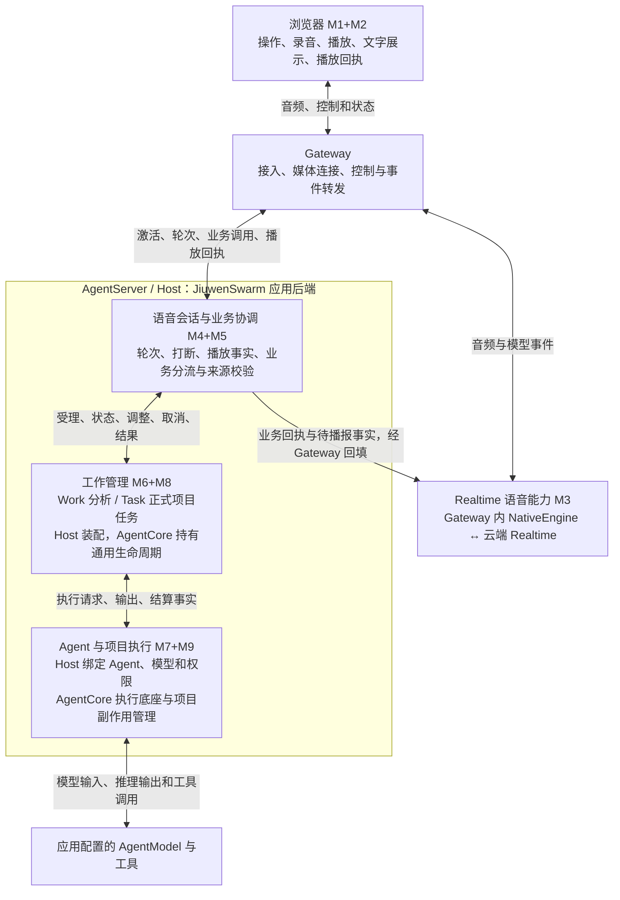

# LiveVoice：模块、运行位置与数据流

> 2026-09-13 Task/Work 统一后的代码导读。SDK 配套版本 `0.1.17+livevoice.3`。
> 对应[统一记录](../reviews/TASK_WORK_UNIFICATION_20260913.md)和[代码量清单](UNIFIED_CODE_ACCOUNTING.md)。这是源码说明；当前产品验收边界仍由 [STATUS](../STATUS.md) 管理。

## 1. 介绍颗粒度

LiveVoice 是 JiuwenSwarm 的语音入口：用户说话，Realtime 负责实时听说；需要查事实或执行工作时，进入应用后端与 AgentCore；真实结果再交语音层播报。插话停止声音，与取消已受理的工作，是两种操作。

首次介绍采用四个顶层部分：**浏览器、Gateway、Realtime 语音能力、AgentServer**。AgentServer 内展开三组职责：**语音会话与业务协调（M4+M5）、工作管理（M6+M8）、Agent 与项目执行（M7+M9）**。M1+M2 统一称浏览器；原编号只用于定位。每组介绍责任、输入输出、状态归属和调用关系，不按每个类画框。

M4+M5、M7+M9 是介绍颗粒度的合并。代码仍保留必要的职责边界。Work/Task 在工作管理组内保留两种执行模式，共用 SDK 能力，并不强行共用一张状态表。Gateway 不能省略，否则会误解音频直接进入 AgentServer。配置、鉴权、历史、诊断作为横向责任，首次介绍无需独立展开。

## 2. 展示用模块图



这是职责图，框不等于进程。NativeEngine 实际在 Gateway，云端 Realtime 与它合为一组语音能力；排查延迟时再展开本地/云端边界。AgentCore 是 AgentServer 进程使用的 Python SDK，**不是新增网络服务**。AgentServer 是 JiuwenSwarm 的业务后端；Host 指承载并装配这些能力的应用宿主。业务后端不能用 AgentCore 来代称。

## 3. 每个模块怎样介绍

| 模块 | 一句话责任 | 输入 → 输出 | 关键代码与运行位置 |
|---|---|---|---|
| 浏览器 M1+M2 | 让用户操作会话，把声音采集进来并播放出去 | 点击、麦克风 → 控制/音频；下行音频/状态 → 播放、界面、播放进度回执 | `LiveVoiceIntegratedRoutePanel`、`browserAudioIOAdapter`、`browserDedicatedMediaRoute`；浏览器 |
| Gateway | 为正确会话接通媒体和控制，运行语音适配器 | 浏览器音频/命令 ↔ Provider 音频/事件；Host 通知 ↔ 客户端连接 | `dedicated_media_registration`、`dedicated_media_route`、`native_response_downlink`、`native_interaction_runtime_client`；Gateway |
| Realtime M3 | 与实时模型听说，把 Provider 事件接入内部协议 | 输入音频 → 回复音频、输入/输出转写、响应状态、结构化业务调用；接收业务结果和取消 | `OpenAIRealtimeNativeInteractionEngine`、`OpenAIRealtimeSession`；本地适配+云端模型 |
| 会话与业务协调 M4+M5 | 决定哪些语音事件有效、业务交给谁、结果何时可播 | 轮次/响应/播放回执/业务调用 → 准入、取消、上下文与工作请求、历史准入 | `NativeInteractionRuntimeOwner`、`NativeBusinessRouter`、`ProductCompositionRegistry`、呈现账本；AgentServer，浏览器/Gateway 配合 |
| 工作管理 M6+M8 | 保存受理和执行状态，提供可核对的真实结果 | 授权请求 → Work/Task 状态、版本、调整/取消回执与结果 | Host `HostWorkService` 和 Task 装配；SDK `WorkRuntime/SqliteWorkStore`、`PersistentTaskCore/SqliteTaskStore` |
| Agent 与项目执行 M7+M9 | 用配置好的 Agent 实际执行，项目任务额外核对文件副作用 | 执行上下文 → Agent 输出、工具效果、文件产物、结算/恢复事实 | Host `SessionExecutionService`、Agent adapter、项目应用绑定；SDK Agent/工具底座、`DirectProjectCodeExecutorAdapter`、checkpoint、file-effect、durability |

代码入口：[Voice](../../jiuwenswarm/channels/live_voice/)、[Gateway](../../jiuwenswarm/gateway/live_voice/)、[应用工作管理](../../jiuwenswarm/server/runtime/work/)、[应用 Task 装配](../../jiuwenswarm/server/runtime/formal_tasks/)、[Agent 适配](../../jiuwenswarm/server/runtime/agent_adapter/)、[SDK Task/Work](../../../agent-core/openjiuwen/core/application/tasks/)。

当前生产 Native 工厂仍装配 OpenAI 实现；模型名可配置不等于已兼容其他厂商。Qwen/JoyAI 属于多模态插件的独立链路。Gateway 与云端模型合在展示组中，不代表可以仅替换 URL 就更换 Provider。

## 4. 三条具体流程

### 普通实时对话

```text
用户说话 → 浏览器采集 → Gateway 媒体入口 → NativeEngine → Realtime 音频输入
Realtime 回复音频 → NativeEngine → 有效响应准入 → Gateway 下行 → 浏览器播放
浏览器播放进度 → Gateway → Host 呈现账本 → 对应已播放内容/历史准入
```

Realtime 还输出输入转写和回复转写事件，适配器转交应用用于聊天展示。**文字内容来自模型，Gateway/Host 创建消息记录并组织流式展示。** 输入转写、模型回复、音频传输和播放回执是并行事件，不能假定严格先后，也不能把消息容器创建耗时当成首音延迟。无需工具的普通对话可以不进入 Work 或 Task。

### 已有事实查询与 Work 分析

```text
Realtime 业务调用 → Gateway → M4+M5 校验会话、项目、来源、对象
  ├─ 已有状态/结果：直接读取授权范围内事实 → 真实回执
  └─ 需要分析：HostWorkService → SDK WorkRuntime 先保存受理
       → Host 绑定的 Agent 执行 → SDK 保存结果和结算状态
真实回执/结果 → M4+M5 → Gateway/NativeEngine 回填 → Realtime 组织语音 → 播放/回执
```

Work 当前 Voice 入口用于只读分析、读取与查询，不能借分析权限修改项目。Work 不是每次状态查询都要创建的实体，也不是按“少于几秒”定义。日志可恢复事实，重启丢失执行归属时记录 UNKNOWN，不自动重新执行工具。普通 Work 不自动创建正式 Task 卡片；是否展示进度由应用策略决定，SDK 不控制 UI。

### 正式项目任务

```text
业务调用 → M4+M5 → Host 授权/项目/输入适配 → SDK PersistentTaskCore
  → Task/Attempt/命令持久化 → SDK 项目执行器
  → Host 提供 AgentRequest、模型/工具/权限绑定 → Agent 执行
  → SDK 核对文件影响、应用产物、记录恢复事实 → Task 权威结果
  → Host 通知与上下文 → 语音层播报 → 浏览器回执
```

项目执行器负责隔离基线、文件作用范围、执行尝试、取消/调整和失败恢复事实。Host 仍负责选择实际项目、应用的受保护路径、Agent 请求及配置；这是必须保留的集成责任。Task 的“完成”来自执行与结果事实；Realtime 说“完成了”不能使 Task 完成。持久化恢复也不保证所有中断都自动续跑。

## 5. 这次统一解决了什么

| 部分 | 统一后的唯一通用实现 | 应用必须保留的内容 |
|---|---|---|
| Task | SDK Task/Attempt、存储、命令投递、调整、事件、结果读取；项目执行器、checkpoint、文件影响与 durability | 项目/身份/来源授权适配、Agent 与模型绑定、对话上下文、UI 和通知 |
| Work | SDK 工作状态/版本、受理去重、取消结算、检查点 CAS、UNKNOWN 恢复、观察游标 | Host Agent producer 寿命与 pin、输入来源日志、呈现/抑制/Task 来源表 |
| 共用基础 | SDK Scope/Context 契约、只读取消等待、执行控制和观测接口；既有 Agent/工具能力 | 语音轮次、播放 ACK、Provider 协议和产品交互 |

Task 和 Work 的这些应用执行增强由 LiveVoice 开发后下沉，不应称为官方基线原本就有。AgentCore 已有 Controller Task、AgentTeam 工具异步运行等能力；它们与这里带权限、持久化尝试、项目副作用和 UNKNOWN 语义的对象不同。复用底座并补足 SDK，不把不同名字相近的 Task 生硬套在一起。

统一后减少的是 JiuwenSwarm 对通用工作机制的重复所有权；不是把全部业务代码搬进 SDK，也不保证总行数大幅下降。Native/Cascade、语音编排和诊断仍属于本次未裁剪的 Voice 范围。详细两阶段与各模块统计见[代码量](UNIFIED_CODE_ACCOUNTING.md)。

## 6. 一分钟介绍稿

用户通过浏览器录音和播放，Gateway 接通媒体并运行 NativeEngine，NativeEngine 与云端 Realtime 合起来提供实时听说能力。普通对话由 Realtime 回复；业务请求进入 AgentServer 的语音会话与业务协调模块，查询已有事实，或交给工作管理。工作管理在 AgentCore 中保留 Work 分析和正式 Task 两种模式；Agent 与项目执行模块调用应用配置的 AgentModel 和工具，正式任务额外管理项目文件副作用。真实结果返回语音层，浏览器报告播放进度。业务完成、文字展示和音频播放分别记录。

三方横向比较见 [VOICE_FEATURE_COMPARISON](VOICE_FEATURE_COMPARISON.md)。
