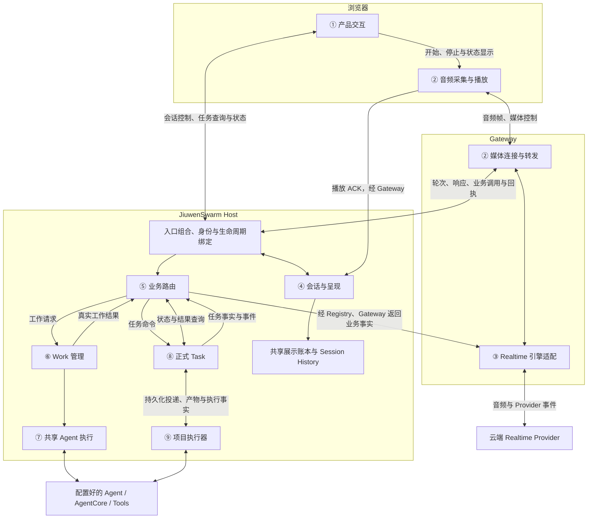

# Live Voice：面向架构师与产品经理的模块介绍

> 2026-09-13 Task 迁移更新：持久化 Task 内核现由 AgentCore 提供，AgentServer 负责装配和项目适配，Work 保持原实现。详见[迁移记录](../reviews/AGENTCORE_TASK_MIGRATION_20260913.md)。下文来源基线描述保留历史含义。

> 代码核对基线：`hx/0912_livevoice`，`5cb5303dd15d72a6b472406f89dfbf3db5e29eff`，2026-09-13。
> 本文是实现导读，不是新的设计决策、部署说明或产品验收结论。当前完成边界以 [STATUS](../STATUS.md) 为准，重构依据见[共享 Runtime 集成记录](../reviews/SHARED_RUNTIME_INTEGRATION_20260913.md)。

## 1. 先用一分钟说明 Live Voice 是什么

Live Voice 是 JiuwenSwarm 的实时语音交互入口。用户可以直接说话、听取回复、打断朗读，也可以通过语音发起查询、分析以及需要修改项目文件的正式任务。

系统同时处理两件事：一是及时、连贯地听说；二是在有权限、有明确执行对象和真实结果的前提下完成业务。普通对话可以由 Realtime 直接回复，需要业务执行的请求才进入 JiuwenSwarm 的 Work 或 Task 服务，底层复用配置好的 Agent 和 AgentCore 能力。

向不了解实现的人介绍时，先讲四组能力：

| 能力组 | 一句话说明 | 对应详细模块 |
|---|---|---|
| 用户交互与声音 | 用户怎样开启语音、说话、听取回复和查看结果 | ① 产品交互、② 音频与媒体传输 |
| 实时对话 | 系统怎样接入语音模型，管理轮次、打断和播放确认 | ③ Realtime 引擎、④ 会话与呈现 |
| 业务执行 | 语音请求怎样进入真实服务，并调用已配置的 Agent | ⑤ 业务路由、⑥ Work 管理、⑦ 共享 Agent 执行 |
| 正式任务与文件 | 工作怎样持久化、调整、恢复，并落实到项目文件 | ⑧ 正式 Task、⑨ 项目执行器 |

这四组是介绍视角，不是四个进程，也不是每次请求必经的四个步骤。

## 2. 保持什么颗粒度

建议采用“**四组能力 → 九个职责模块 → 必要时定位代码**”的三级介绍方式。

- **产品经理先听四组能力和三个场景。** 重点是用户能做什么、何时算接受或完成、打断与取消有什么区别。
- **架构师展开九个模块。** 每个模块只说明责任、输入、输出、状态归属和依赖；然后看进程与数据边界。
- **开发者最后看代码映射。** 类名和函数用于定位实现，不作为面向所有人的主叙事。

模块是逻辑职责边界，不要求一个模块只对应一个文件，也不表示九个模块已成为九个独立服务。当前部分适配与组合代码仍集中在 Registry、Router 和前端控制器中。

保留九个模块，是为了明确区分 **Work 生命周期**与**一次 Agent 执行**。如果版面必须压缩成八个，可以把⑥和⑦合称“Work 管理与共享 Agent 执行”，但介绍内部仍要保留两种责任。

## 3. 模块图：有什么，以及如何协作

图中编号对应下一节。箭头表示主要调用或数据传递，双向箭头包含反馈；为便于阅读，省略了部分内部转发和控制报文。



需要配合这张图说明三点：

1. **Gateway 与 Host 有不同责任。** Gateway 接入媒体和 Provider；Host 核对业务权限、持有工作与任务事实，并协调执行。
2. **代码目录不等于进程。** `channels/live_voice` 中的 Native Engine 由 Gateway 创建；其中的会话和业务适配还会在 Host 一侧使用。
3. **配置、鉴权、协议校验和诊断贯穿各模块。** 图里的 Registry 是组合入口，不是另一个模型或业务执行器。

## 4. 九个模块如何介绍

### ① 产品交互：把语音会话与真实业务状态呈现给用户

负责开启或结束语音、展示连接与恢复状态、对话反馈、工作和任务进度，以及必要的操作入口。结束语音不等于删除持久会话，也不自动取消已接受的业务工作。

- **输入：** 用户点击、输入，以及后端返回的状态、回执和结果。
- **输出：** 激活、提交、查询等控制请求，以及界面展示。
- **边界：** 前端不自行决定任务完成。任务状态来自 Host；播放状态来自音频模块。
- **实现：** `LiveVoiceIntegratedRoutePanel`、View、语音操作函数，以及共享 Task owner 和 `formalTaskStore`。

### ② 音频与媒体传输：连接麦克风、网络与扬声器

负责音频设备选择、采集、音频帧发送、接收下行音频、播放和停止，并回报播放事实。浏览器与 Gateway 共同完成这项职责。

- **输入：** 麦克风声音、媒体授权与连接身份、下行音频。
- **输出：** 音频帧、传输状态、播放完成或中断回报。
- **边界：** 这一层不解释用户想创建哪个任务。播放停止的实际动作在这里执行，响应是否失效由会话控制共同决定。
- **实现：** `browserAudioIOAdapter`、`browserDedicatedMediaRoute`、Gateway 的媒体基础模块与产品接入模块。

### ③ Realtime 引擎：组织实时语音模型交互

负责建立 Provider 会话，发送音频，接收转写、语音、响应结束和业务调用事件；把事件适配到内部协议，并协调响应取消和业务结果续接。

- **输入：** 用户音频、会话配置，以及 Host 返回的业务回执与结果。
- **输出：** 回复音频、转写、轮次/响应事件、结构化业务提议。
- **边界：** 普通对话可以直接产生语音；模型提出文件修改或任务操作时，仍须交给 Host 校验和执行。它不是单纯的音频格式转换器。
- **实现：** `OpenAIRealtimeNativeInteractionEngine`、`OpenAIRealtimeSession`，由 Gateway 接入代码实例化。

### ④ 会话与呈现：维护有效轮次和已确认的展示事实

负责管理用户轮次、响应、generation、打断、迟到输出、通知竞争和播放确认，并决定哪些内容可以作为已呈现事实进入历史。

- **输入：** Provider 事件、当前会话身份、任务通知和浏览器播放回报。
- **输出：** 有效响应、失效/截断控制、展示消费记录和历史写入许可。
- **边界：** “已生成”“已发送”“浏览器确认播放”不同。系统不能直接证明人的实际听觉；播放一半也不意味着必然能够生成精确的半段文字历史。Native 完整回复的历史接纳需要正常完成、有转写且相应音频展示完成。
- **实现：** Voice 的 `NativeInteractionRuntimeOwner`、Host 的展示账本与进度仲裁、语音历史适配，以及共享 `session_history`。

### ⑤ 业务路由：把结构化业务提议接到真实服务

负责核对调用来源、会话、项目、目标与版本，取得业务上下文，将请求交给查询、Work 或 Task 服务，再把真实回执转换为语音交互需要的信息。

- **输入：** 操作类型、目标 ID、预期版本、要求文本、上下文身份和来源绑定。
- **输出：** 经过校验的服务调用、接受/拒绝回执、结果与通知事实。
- **边界：** 模型参数是提议，不是权限或成功凭证。Router 会创建执行适配对象，但借用 Host 管理的服务与池，不独立拥有 Agent 核心或另一套 Work 生命周期。
- **实现：** `NativeBusinessRouter`、业务契约、上下文和来源适配；入口由 `AgentServerProductCompositionRegistry` 组合。

### ⑥ Work 管理：让会话工作有明确的状态和执行寿命

负责查询、分析等 Work 的接受、更新、取消、结果、版本、日志与执行结算，并持有借给语音层的执行适配器池。

- **输入：** 已校验的工作请求、工作 ID/版本，以及执行回调。
- **输出：** Work 状态、结果、变更事件和执行是否结算的事实。
- **边界：** Work 不等于一次模型调用，也不等于正式 Task。关闭语音不会自动销毁已接受的 Work；Host 负责清理。进程恢复只恢复事实，未确认执行可进入 `UNKNOWN`，不能直接重放以假装完成恢复。
- **实现：** `HostWorkService`、`NativeWorkRuntime`、`SqliteNativeWorkJournal`。

### ⑦ 共享 Agent 执行：在准确绑定的上下文和权限下运行 Agent

负责使用配置好的 Agent，并在校验模型、项目范围、来源、工具策略和执行身份后，通过已有 Runtime 机制启动执行、转发输出和处理取消。

- **输入：** 已提交文本、授权上下文、模型与工具策略、隔离执行身份。
- **输出：** Agent 输出流、工具调用结果和执行结束/失败事实。
- **边界：** 不处理麦克风或播放，也不替代 Task 持久化。Voice 与文字入口复用 Runtime 基础能力，但不代表公开接口、执行上下文和历史写入方式完全相同。
- **实现：** `RuntimeFormalAgentFacade → AgentRuntime.stream_owned → 已配置 Agent/既有 adapter → AgentCore`。当前实现没有 `SessionExecutionService`。

### ⑧ 正式 Task：管理跨时间的任务事实与可靠投递

负责正式任务的创建、确认、执行尝试、命令投递、调整、取消、结果、重试和恢复记录。

- **输入：** 有权限和明确身份的任务命令，以及执行器返回的观察结果。
- **输出：** Task/Attempt、持久化命令、任务事件、状态和权威结果。
- **边界：** 接受任务不等于执行器已完成。Task 负责协调执行，但不亲自实现每个文件操作。恢复可能是继续、拒绝重放或等待核对，不保证所有异常都自动续跑。
- **实现：** `PersistentTaskCore`、`task_store`、正式任务模型、确认组合和 `task_adjustment_queue`；Outbox 将已持久化命令投递给执行器。

### ⑨ 项目执行器：控制正式任务对项目与文件的实际副作用

负责准备项目执行环境、核验执行基线、调用 Agent、管理调整与取消，约束文件影响，并向 Task 返回产物、失败和恢复证据。

- **输入：** 精确的 Task/Attempt、项目绑定、任务规格、允许的副作用及恢复信息。
- **输出：** 执行观察、文件产物、结果记录、失败或待核对事实。
- **边界：** 它承担普通 Agent 调用之外的项目与文件责任。保护与核验机制不等于所有文件内容都已满足用户意图；证据不足时必须保留未知或冲突状态。
- **实现：** `DirectProjectCodeExecutorAdapter`、`file_effect_plan`、`durability`；保留 `process_background_code_task_stream` 项目执行通道。

## 5. 用三个场景讲清楚流程

### 场景 A：普通实时对话

用户问候或进行不需要业务工具的交流：

```text
麦克风 → Gateway → Realtime → 回复音频 → Gateway → 浏览器播放
                             ↕
                    会话有效性与播放确认
```

不需要创建 Work 或 Task。每个语音轮次也不一定都调用业务 Agent。

### 场景 B：需要查询或分析的 Work

用户提出需要 Agent/工具完成的工作：

```text
Realtime 业务提议 → 来源与权限校验 → Host Work → 共享 Agent 执行
                      ↑                          ↓
                 Work 状态/结果 ← 真实执行结果与工具输出
                      ↓
             Realtime 组织反馈 → 浏览器播放并回报
```

可以先返回接受回执，稍后再返回结果。“已经开始处理”不能冒充“已经查到答案”。Work 可以在语音关闭后继续由 Host 管理。

### 场景 C：修改项目文件的正式 Task

用户要求在项目里生成或调整文件：

```text
业务提议 → 权限/必要确认 → 正式 Task → 持久化命令投递
                                          ↓
                         项目执行器 → AgentCore/Tools
                                          ↓
                         文件产物与执行事实 → Task 结果
                                          ↓
                            页面查询与语音结果通知
```

项目执行器也调用 Agent，但不要求先经过 Work。用户后续调整必须绑定正确 Task、版本和执行尝试；任务完成与完成通知被播放是两个不同状态。

这三个场景用于解释代码路径，不保证自然语言必然被模型选择到指定路径。具体操作仍取决于业务提议、配置和权限检查。

## 6. 数据怎样流动

| 数据通道 | 主要载荷 | 谁解释、谁负责 |
|---|---|---|
| 浏览器 ↔ Gateway 媒体通道 | 音频帧、媒体身份、序号、连接与播放控制 | 音频模块与媒体接入；使用同源 `/ws/live-voice/media` |
| Gateway ↔ Realtime | 输入/输出音频、转写、Provider 事件、工具提议及工具结果 | Realtime 引擎负责适配 Provider 协议 |
| Gateway ↔ AgentServer/Registry | 轮次、响应、业务提议、来源和 capability、回执 | Registry/会话模块校验身份，Router 接入真实服务 |
| Host → Agent 执行 | 已提交文本、授权上下文、模型/工具策略、执行身份 | Runtime 与 Agent adapter；不直接传麦克风音频 |
| Task ↔ 项目执行器 | Task/Attempt、命令、任务规格、项目绑定、产物与恢复事实 | Task 持有生命周期事实，执行器负责项目副作用 |
| Host → 前端/语音反馈 | 工作状态、任务事件、接受回执、结果和通知事实 | 前端与 Realtime 展示事实，不自行制造成功 |
| 浏览器 → 展示与历史服务 | response/generation、展示单元、播放完成或中断回报 | 校验后更新展示消费，符合接纳条件才写历史 |

四类标识帮助架构师理解数据隔离：

- `session_id / project_id / scope`：属于谁、哪个会话和项目。
- `activation_id / generation`：属于哪次有效激活，防止旧连接影响新会话。
- `turn_id / response_id / provider_call_id`：把输入、回复、业务调用和音频关联起来。
- `work_id / task_id / attempt_id / revision / seq`：关联业务对象、执行尝试、版本及事件顺序。

携带标识不等于已授权；Host 仍须核对绑定、版本和权限。

## 7. 介绍时必须保留的区别

| 容易混淆的概念 | 准确表达 |
|---|---|
| Realtime 与业务 Agent | Realtime 也理解用户需求并提出业务操作；真实业务效果仍由 Host 授权并调用 Agent/Tools 执行 |
| Work 与 Task | Work 有会话工作生命周期；正式 Task 另有持久化命令、执行尝试与项目任务管理 |
| 打断朗读与取消任务 | 前者停止/失效语音输出；后者必须进入明确的业务取消与结算流程 |
| 接受与完成 | 接受是回执，完成需要权威执行结果 |
| 生成、发送与播放 | 不能用生成或网络发送成功代替浏览器播放确认 |
| 播放确认与实际听觉 | 浏览器回报是系统可取得的证据，不直接证明人实际听到或理解 |
| 可以恢复与一定自动恢复 | 证据不足时可能保持未知或等待核对 |
| 架构责任与产品验收 | 代码设置了责任和保护机制，不代表所有设备、延迟与任务质量场景都已验收 |

本文主体限定 Native/Realtime 路径。代码还保留 Cascade：`音频 → ASR → 已提交文本 → 业务/Agent → TTS → 播放确认`，这不改变共享 Host 服务的归属。

## 8. 当前代码映射：供架构师继续追踪

以下是基线代码的定位入口，不是要求听众记住的类名，也不是所有依赖文件的完整清单。

| 模块 | 当前主要入口 | 需要注意的实现事实 |
|---|---|---|
| ① 产品交互 | [Panel](../../jiuwenswarm/channels/web/frontend/src/components/ChatPanel/LiveVoiceIntegratedRoutePanel.tsx)、[View](../../jiuwenswarm/channels/web/frontend/src/components/ChatPanel/LiveVoiceIntegratedRoutePanelView.tsx)、[共享 Task owner](../../jiuwenswarm/channels/web/frontend/src/features/tasks/formalP3TaskExperience.ts) | UI 使用共享任务事实，不独立执行 Task |
| ② 音频与媒体 | [浏览器音频](../../jiuwenswarm/channels/web/frontend/src/features/live-voice/formal/adapters/browserAudioIOAdapter.ts)、[浏览器媒体通道](../../jiuwenswarm/channels/web/frontend/src/features/live-voice/formal/adapters/browserDedicatedMediaRoute.ts)、[Gateway 产品接入](../../jiuwenswarm/gateway/live_voice/dedicated_media_registration.py) | `dedicated_media_route` 是基础模块，不能单独代表已注册的产品入口 |
| ③ Realtime | [Native Engine](../../jiuwenswarm/channels/live_voice/openai_realtime_native_engine.py)、[Realtime Session](../../jiuwenswarm/channels/live_voice/openai_realtime_session.py) | Gateway 创建这些适配对象并连接 Provider |
| ④ 会话与呈现 | [Native Runtime owner](../../jiuwenswarm/channels/live_voice/native_interaction_runtime.py)、[共享账本](../../jiuwenswarm/server/runtime/presentation/presentation_ledger.py)、[历史适配](../../jiuwenswarm/channels/live_voice/formal_history_writer.py) | 语音逻辑、共享账本和共享历史共同完成该职责 |
| ⑤ 业务路由 | [Router](../../jiuwenswarm/channels/live_voice/native_business_router.py)、[Registry](../../jiuwenswarm/channels/live_voice/product_composition_registry.py)、[Gateway Host 客户端](../../jiuwenswarm/gateway/live_voice/native_interaction_runtime_client.py) | `_executor` 仍创建适配对象，池和最终清理由 Host 持有 |
| ⑥ Work 管理 | [HostWorkService](../../jiuwenswarm/server/runtime/work/service.py)、[NativeWorkRuntime](../../jiuwenswarm/server/runtime/work/native_work_runtime.py)、[Work 日志](../../jiuwenswarm/server/runtime/work/native_work_journal.py) | `execute_native_work` 实际在 [AgentConversationRuntime](../../jiuwenswarm/channels/live_voice/agent_conversation_runtime.py) 中，不在 `native_work_runtime` 文件里 |
| ⑦ 共享 Agent | [RuntimeFormalAgentFacade](../../jiuwenswarm/server/runtime/agent_adapter/runtime_formal.py)、[AgentRuntime](../../jiuwenswarm/runtime/service.py)、[既有 Agent adapter](../../jiuwenswarm/server/runtime/agent_adapter/interface_deep.py) | 复用 `stream_owned` 与既有 Runtime 机制；没有照搬来源分支的 `SessionExecutionService` |
| ⑧ 正式 Task | [PersistentTaskCore](../../../agent-core/openjiuwen/core/application/tasks/persistent_task_core.py)、[Task Store](../../../agent-core/openjiuwen/core/application/tasks/task_store.py)、[调整队列](../../../agent-core/openjiuwen/core/application/tasks/task_adjustment_queue.py) | `execute` 处理命令，`drain_outbox_once` 参与持久化执行投递 |
| ⑨ 项目执行 | [项目执行器](../../jiuwenswarm/server/runtime/formal_tasks/project_code_executor.py)、[文件副作用计划](../../../agent-core/openjiuwen/core/application/tasks/file_effect_plan.py)、[恢复事实](../../../agent-core/openjiuwen/core/application/tasks/durability/durability_recovery_facts.py) | 保留项目专用 Agent 执行通道，不能概括为所有任务都走普通聊天 |

基线中还保留了语音组合与执行适配代码。因此“通用服务归入 Host”不意味着 `channels/live_voice` 只剩纯 ASR/TTS，也不意味着已经拆成多个独立部署服务。

## 9. 可直接使用的两分钟介绍稿

> Live Voice 是 JiuwenSwarm 的实时语音入口。用户可以直接说话、听回复、打断朗读，也可以通过语音发起真正的业务工作。
>
> 我们先把它分成四组能力：用户交互与声音、实时对话、业务执行、正式任务与文件。展开后是九个职责模块，但介绍时不需要先讲类名。
>
> 普通交流由 Realtime 直接生成语音。会话模块负责轮次、打断和播放确认，确保旧回复不会随意影响新一轮对话。
>
> 遇到业务需求，Realtime 提出结构化请求，由 Host 核对身份、项目、权限与目标。查询分析类 Work 通过共享 Runtime 调用已配置的 Agent 和工具；需要持久化、调整和文件产出的正式 Task 则通过任务系统与项目执行器完成。项目执行器同样使用 Agent 能力，同时负责项目基线和文件副作用。
>
> 执行产生的真实结果会返回页面和语音层。我们分别记录任务是否完成、回复是否生成，以及浏览器是否确认播放。用户打断一句话，不等于取消已经接受的任务；模型说“完成了”，也不能替代后端的真实结果。
>
> 这样的划分让语音层专注实时交互，业务生命周期和执行能力由 JiuwenSwarm Host 与 AgentCore 提供。实际产品完成度和验证范围另有记录，不通过架构图宣称全部场景都已验收。
