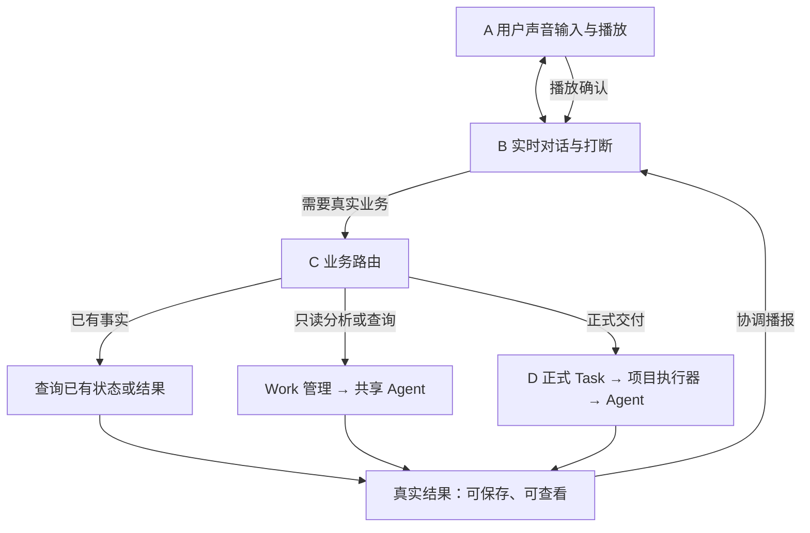
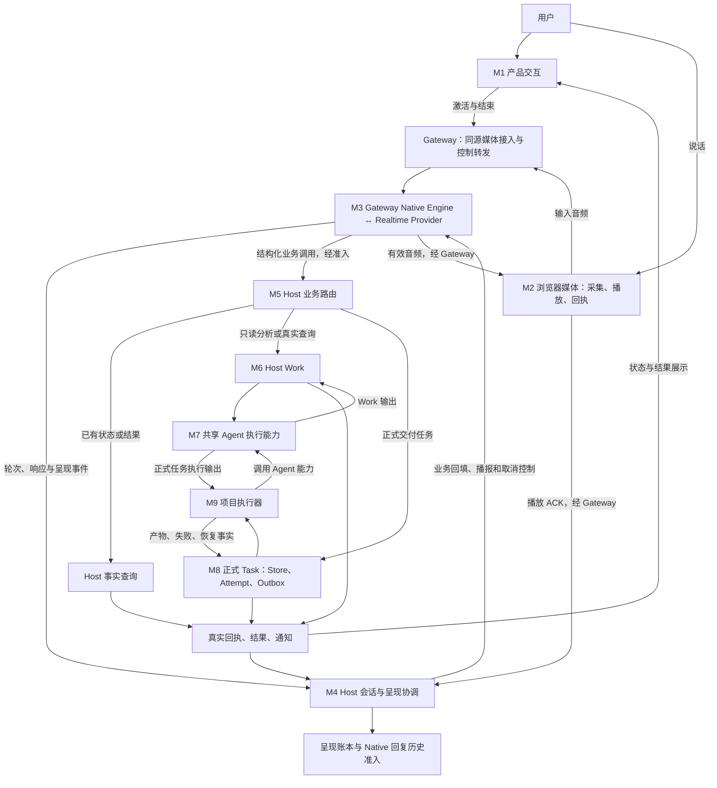

# 以 LiveVoice 流程为主线的三方模块对比

> 2026-09-13，基于实际代码的职责与调用分析。本文件不改变已接受设计，不代表部署或真实音视频验收；产品完成边界见 [STATUS](../STATUS.md)。
>
> 本文三个对象：**LiveVoice Native 主链、Hermes Voice、PR #2813 + #5301 合起来的多模态全双工插件**。后者简称“多模态插件”，不再拆成两套产品比较。

## 展示版：先讲四个能力块，不逐个讲九模块

**M1 产品交互可以不单独讲。** 对这次架构和能力对比，先用一句“用户在页面开启语音并查看结果”交代入口即可。它对产品可用性仍然重要，但不是本次三者核心执行链的主要区别。只有讨论恢复体验、多平台入口或任务页集成时，再展开 M1。

其他模块按“是否影响理解能力与行为差异”决定合并或展开，不按代码量取舍。推荐主介绍只讲下面四块；原有 M1–M9 保留为代码核对索引，不重新编号或改变职责归属。

| 展示时讲什么 | 对应代码职责 | 必须讲清的一句话 | 可暂时收起的细节 |
|---|---|---|---|
| A 媒体输入输出 | M2；M1 只作入口背景 | 能听、能说，以及能否持续看摄像头或屏幕 | UI 组件名、设备枚举、编码/采样率、Worklet、连接握手 |
| B 实时对话与打断 | M3 + M4 | 谁形成回答，插话停止什么，已生成与已播放如何区分 | Provider 事件名、generation/cursor 字段、轮次状态机函数 |
| C 业务接入与 Agent 执行 | M5 + M6 + M7 | 哪些直接回答，哪些查已有事实，哪些调用真实 Agent，谁管理后台工作 | Router/Facade 类名、请求封装、执行器池；首次不展开全部操作与版本字段 |
| D 正式交付与文件执行 | M8 + M9 | 普通 Agent 能写文件，与正式任务的调整、执行记录和恢复机制有什么区别 | Store 表、Attempt/Outbox 协议、文件影响计划与恢复算法 |

**合并讲解不等于合并模块。** C 仍须区分“路由决定交给谁”“Work 管状态”“Agent 真正执行”；D 仍须区分“Task 管生命周期”“项目执行器处理实际文件”。首次不必展开类名，但不能把这两组各说成一个没有内部责任的“Agent”。

### 展示用流程图

这是 LiveVoice Native 的概念流程图：普通对话留在 A/B，业务才进入 C；正式交付是 C 分流到 D，**不是所有请求都串行经过四块**。Gateway/Host 位置和具体传输箭头收在后面的架构图里。图中的播放确认是浏览器报告的播放事实，不证明人的主观听觉。

### 展示用横向对照

| 能力块 | LiveVoice | Hermes Voice | 多模态插件（两个 PR 合起来） | 展示时解释的差异 |
|---|---|---|---|---|
| A 媒体输入输出 | 当前主链是音频，经 Gateway 接入 | Live 用 WebRTC；Chained 及平台有各自录音/播放适配 | 音频加摄像头、屏幕、视频文件抽帧 | 基础采集播放职责共同；插件多出持续视频源输入，传输实现也不同 |
| B 实时对话与打断 | Realtime 对话；Host 协调轮次、播报和播放账本 | Live 是实时模型委托；Chained 是 STT → Agent → TTS；部分打断会中止 Agent turn | Qwen/JoyAI 编排；前端控制打断、旧音频过滤和结果播报 | 都能听说/打断，但模型结构、取消对象和“已播放”语义不同 |
| C 业务与执行 | 查事实、只读 Work、正式 Task 显式分流；复用 Jiuwen Agent | 主要接已有 Hermes 普通 Agent turn | Gateway 通用 job 队列接 Jiuwen AgentServer，可调用文件工具 | 都执行真实工具；Work、turn、job 的范围和状态管理不等价 |
| D 正式交付与文件 | 独立 Task 和项目执行层，记录调整、文件执行和恢复事实 | 普通 Agent 可做文件工作；所查 Voice 路径无同等独立协议层 | Core Agent 可写文件、展示产物；job 未接 PersistentTaskCore | 文件能力共有；LiveVoice 另有专门生命周期和副作用协议，不能据此声称其他两者不会做任务 |

### 哪些可以略过，哪些不能略过

| 原模块 | 主介绍处理方式 | 不能因精简而丢掉的内容 |
|---|---|---|
| M1 产品交互 | 略过独立模块框，用一句话交代 | 用户入口、结果可查看；比较多平台或恢复体验时再展开 |
| M2 媒体 | 保留能力，略过底层实现 | 音频还是音视频输入，以及播放出口 |
| M3 语音模型 | 保留核心区别 | 原生实时模型与 STT/Agent/TTS 的结构不同 |
| M4 会话与呈现 | 与 M3 合讲，不能完全略过 | 停声音不必然停任务；生成/保存/播放确认不同 |
| M5 业务路由 | 与 M6/M7 合讲，保留分流 | 直接对话、已有事实、真实执行、正式交付不是一条必经链 |
| M6 Work 管理 | 收入业务块，首次省去独立类名 | Work、普通 turn、plugin job 的工作范围和生命周期不同 |
| M7 Agent 执行 | 保留一句核心事实，省去 SDK 调用细节 | 真实模型/工具由既有 Agent 执行，两个 Jiuwen 入口共享部分底座 |
| M8 正式 Task | 与 M9 合讲，不能完全略过 | 任务状态、调整与恢复，不只是一个 UI 卡片 |
| M9 项目执行器 | 收入正式交付块，省去算法细节 | 工具写文件与项目副作用核对的区别 |

首次展示也可略过鉴权字段、诊断事件、数据库表和全部函数名；讨论部署、安全、延迟或恢复方案时再展开。唤醒词、多平台入口作为 Hermes 的补充差异，视频输入放在 A 主线中，不能为了简化而删掉。

**阅读建议：** 3–5 分钟介绍只用本节和第 9 节；架构讨论再读第 2–5 节；代码审查按 M1–M9 与第 10 节源码索引逐项核对。精简只改变介绍颗粒度，不表示已统一实现，也不改变当前完成边界。

## 1. 详细索引：四组能力、九个职责模块

**三者都有采集、对话、业务委托、真实 Agent 执行和播放；主要差异是媒体输入、业务分流、状态由谁管理，以及完成和恢复的含义。**

下面是需要展开时使用的代码职责索引，不是首次展示必须逐项讲完的清单。能力组用于归类，前面的 A–D 用于口头讲解；二者都映射回同一组 M1–M9。模块不代表独立进程，也不要求只对应一个文件。Gateway 是接入层和运行位置，不宜与“Agent 执行”这种职责直接并列。

| 能力组 | 模块 | 一句话责任 |
|---|---|---|
| 交互与媒体 | M1 产品交互 | 用户从哪里开始会话，在哪里看对话和工作结果 |
| 交互与媒体 | M2 媒体采集、传输与播放 | 把麦克风声音送入系统，把返回音频送到扬声器 |
| 实时对话 | M3 语音模型适配 | 与语音模型交互，转换声音、转写、响应和业务调用事件 |
| 实时对话 | M4 会话、打断与呈现 | 管理轮次、迟到输出、结果播报、播放确认和语音历史准入 |
| 业务执行 | M5 业务路由 | 校验业务请求并把它交给正确的真实服务 |
| 业务执行 | M6 Work 管理 | 管理一次 Agent 分析工作的状态、更新、取消和结果 |
| 业务执行 | M7 Agent 执行 | 用配置好的模型与工具真正执行工作 |
| 正式工作与结果 | M8 正式 Task 系统 | 管理交付任务、执行尝试、持久命令、调整和恢复事实 |
| 正式工作与结果 | M9 项目执行器 | 准备项目环境，执行文件工作并核对副作用 |

原先八模块描述没有独立列出 Work 管理，容易把 Work、Agent 和 Task 混为一谈；这里固定拆成九个，后续编号保持一致。

比较结论严格分三类：

- **共同职责**：都要解决同一件事，例如录音、播放、执行工具。
- **共同职责，内部不同**：都有对应模块，但协议、输入输出、状态管理或完成条件不同。这是大部分模块的情况。
- **无同等独立层／额外模块**：某方案有专门模块，另一个仅由通用 Agent 承担部分职责，或所查语音路径未见对应能力。

“职责相同”不等于实现相同，更不等于共享同一份代码。没有证据可以把三套方案的某个完整模块标为“完全一样”。

## 2. 先把 LiveVoice 的流程讲清楚

### 2.1 架构师展开用模块图

M7 表示共同的执行能力，Work 与 Task 的 Agent 入口不同。返回边表示各自所属执行的输出，不是一次输出同时发给 Work 和 Task。Host 参与关键事件和呈现准入，不表示每一块输入音频都要先经过 Host。

### 2.2 Realtime 后面是四个分支

| 请求 | LiveVoice 路径 | 是否新调用 AgentModel |
|---|---|---|
| 普通闲聊、稳定常识、改写用户已提供的文字 | M2 → M3 → M2；M4 管理轮次与呈现 | 不必 |
| 查询已存在的任务状态或结果 | M3 → M5 → Host 已有事实 → M4/M3 → M2 | 通常不必 |
| 读取文件分析、实际查询和核实 | M3 → M5 → M6 Work → M7 Agent → M6 → M4/M3 → M2 | 需要 |
| 修改保存文件、后台完成正式交付物 | M3 → M5 → M8 Task → M9 → M7 → M9 → M8 → M4/M3 → M2 | 需要 |

路由依据是请求需要的事实、权限和副作用，不是“Realtime 能不能猜一个答案”。明确要求查询或核实，应真实查询；正式后台交付物即使没有指定文件名，也走 Task。模型提出操作，Host 再校验和执行，提示词不能代替服务端边界。

**Work 和 Task 是两个分支，不是先 Work 再 Task。** M7 提供执行能力，M6/M8 管理不同生命周期。Work 只读分析是当前 LiveVoice 接入语义，不代表所有代码中名叫 work 的类型都只读。

### 2.3 回来时有两条线

**业务结果线：** Work/Task/事实服务 → 受理回执、进度、结果、产物引用、失败或调整事实 → 前端展示和持久记录。

**语音呈现线：** 真实业务结果 → Host 会话/通知协调 → Realtime 生成语音 → Gateway → 浏览器播放 → 播放 ACK 回 Host → 更新呈现与符合条件的 Native 回复历史。

任务完成、结果可查看、结果已交给语音模型、浏览器报告已播放，是四种事实。业务结果保存不必等待播放；ACK 也不能证明用户主观上听清了。

代码：[业务指令](../../jiuwenswarm/channels/live_voice/native_business_instructions.py)、[路由](../../jiuwenswarm/channels/live_voice/native_business_router.py)、[Native 会话](../../jiuwenswarm/channels/live_voice/native_interaction_runtime.py)。

## 3. 九模块横向总表

| 模块 | LiveVoice | Hermes Voice | 多模态插件：#2813 + #5301 | 判断 |
|---|---|---|---|---|
| M1 产品交互 | 专门语音面板、恢复与业务状态 | Desktop、CLI/TUI、平台语音入口 | 视频面板、常规任务入口、队列与文件时间线 | 共同职责，入口和工作对象不同 |
| M2 媒体 | 浏览器音频经同源 Gateway；播放与 ACK | Live WebRTC；Chained 录音/STT/TTS；平台适配 | Qwen 音图 WS；JoyAI 抽帧/ASR/TTS | 共同职责，拓扑不同；插件另有视频源模块 |
| M3 语音模型 | Gateway OpenAI Realtime Native Engine | Live 有独立语音模型；Chained 是 STT → Agent → TTS | Qwen Omni；JoyAI 图像对话与独立语音服务 | 部分结构对应；Chained 没有同等独立 Realtime 层 |
| M4 会话与呈现 | Host 轮次、响应失效、账本、通知、历史准入 | 客户端 delegation/播放序列；平台流式消费状态 | 前端 turn/response、Silero、播放 generation、结果注入与历史 | 共同职责，状态位置与完成定义不同 |
| M5 业务路由 | context/work/task 契约与项目/来源等校验 | Live delegation → 普通 prompt.submit；Chained 转写提交 turn | Qwen tool/JoyAI action → Gateway delegate/job | 共同职责，LiveVoice 显式业务分流更细 |
| M6 Work 管理 | HostWorkService、版本、日志、更新和取消 | 普通 turn 的 busy/interrupt/queue；活动 delegation | VideoSearchManager 内存 job、排序、抢占和取消 | 相近职责，工作范围与持久性不同 |
| M7 Agent 执行 | Work 走共享 Runtime；Task 走项目执行入口；底层 AgentCore | 原有 Hermes Agent 和工具 | 标准 CHAT_SEND → Jiuwen AgentServer/AgentCore | 共同职责；两个 Jiuwen 方案共享部分底座 |
| M8 正式 Task | Task/Attempt/持久命令/调整/恢复 | 所查 Voice 接入未见等价独立层；普通 turn 有持久化与恢复 | 任务页面 + plugin job，未调用 PersistentTaskCore | 无同等独立层 |
| M9 项目执行器 | 专门项目基线、文件影响、应用和恢复事实 | 普通 Agent 文件/执行工具 | 普通 Core Agent 工具与文件结果 | 文件能力共有，专门执行协议不同 |

**M8/M9 的不同不表示 Hermes 或插件不会修改文件。** 它们可以完成实际文件工作，未对应的是这里的独立正式生命周期和项目执行协议。

## 4. 每个模块具体差在哪里

### M1 产品交互：相同的是操作会话，不同的是入口和展示对象

LiveVoice 的 LiveVoiceIntegratedRoutePanel 负责开始、结束、恢复以及业务状态展示，真实工作结果由后端提供。

Hermes 对应 Desktop Composer hooks、CLI/TUI 和平台 adapter；额外职责是多入口和模式切换。插件对应 VideoLivePanel、TaskFullDuplexRuntime；额外职责是画面来源选择、常规任务页接入和 reasoning/tool/file 时间线。

**对用户的影响：** Hermes 侧重在不同入口使用同一个 Agent；插件可以边看画面边工作；LiveVoice 呈现专门语音会话及 Work/正式 Task 状态。插件界面里的 task/session 不能直接当成 M8 正式 Task，必须核对后端对象。

源码入口：[插件 TaskFullDuplexRuntime](../../jiuwenswarm/extensions/video_duplex/frontend/TaskFullDuplexRuntime.tsx)；Hermes use-composer-voice 的固定源码链接见文末 Hermes 流程。

### M2 媒体：相同的是采集和播放，不同的是数据与网络路径

| LiveVoice | Hermes | 多模态插件 |
|---|---|---|
| 浏览器采集音频 → 同源媒体连接 → Gateway Native Engine；下行播放并回报进度 | Live：WebRTC 麦克风与远端音轨直连 Provider，后端参与 SDP。Chained：录音交给 STT，独立 TTS 输出；可按配置走客户端或后端。CLI/平台另有适配 | Qwen：浏览器组织音频/图像 Provider 事件，Gateway WS relay。JoyAI：转写、图像 RPC、TTS 分开；还有摄像头、屏幕和视频文件抽帧 |

**为什么不同：** 发出去的可能是 WebRTC 媒体、录音文件、PCM 或带音图数据的 Provider 事件，连接端点、缓冲和编码位置不同，不能直接交换一个录音函数就完成统一。

插件的视频是持续抽帧输入，不等于输出视频或多人视频通话。当前 LiveVoice 主链和所查 Hermes Voice 模块未见同等视频源调度；不据此否认整个 Hermes 项目的其他视觉工具。

源码：[LiveVoice 媒体注册](../../jiuwenswarm/gateway/live_voice/dedicated_media_registration.py)、[Qwen relay](../../jiuwenswarm/extensions/video_duplex/backend/qwen_omni_gateway.py)；Hermes voice-live.ts/voice_mode.py；插件 videoSource.ts。

### M3 语音模型：不能把所有模式合成一条 Realtime 链

LiveVoice 的 OpenAIRealtimeNativeInteractionEngine/OpenAIRealtimeSession 维护实时会话，把 Provider 音频、转写、响应结束和业务调用转换为内部事件，Realtime 可以直接回答。

Hermes GPT-Live 有对应的 VoiceLiveSession，利用音轨与 DataChannel，接收 session.delegation.created。**Hermes Chained 没有同样独立的会说话的对话模型：STT 生成文字，普通 Hermes Agent 回答，TTS 合成声音。**

插件 Qwen 是前端原生 Omni session，支持音图输入与 function call；JoyAI 则通过图像对话请求返回 silence/response/delegation action，另接 ASR/TTS。JoyAI 与 Chained 都有独立语音服务，但前者还承担连续视觉观察和 action 决策，仍不能视为一样。

**为什么不同：** LiveVoice Native、Hermes Live、Qwen 的职责接近，但业务协议分别是 Native 事件、client delegation 和 function call；结果回填也不同。更换 Provider 需要事件和生命周期适配，不只是换 API Key。LiveVoice 保留 Cascade，但本文对齐用户关注的 Native 主链。

源码：[Native Engine](../../jiuwenswarm/channels/live_voice/openai_realtime_native_engine.py)、[Qwen session](../../jiuwenswarm/extensions/video_duplex/frontend/VideoLivePanel/qwenOmniSession.ts)、[JoyAI provider](../../jiuwenswarm/extensions/video_duplex/frontend/VideoLivePanel/joyaiProvider.ts)；Hermes voice_live.py/voice-live.ts。

### M4 会话、打断与呈现：三者都有状态机，但事实含义不同

| 责任 | LiveVoice | Hermes | 多模态插件 |
|---|---|---|---|
| 当前轮次和旧输出 | Host 维护响应/轮次有效性，配合客户端失效过滤 | Live hook 的会话/delegation 引用；Chained 播放序列 | 前端 turn/response/job 关联、解码和播放 generation |
| 用户插话 | 取消/失效旧语音，携带响应与播放 cursor；业务取消另处理 | Chained 生成期可 interrupt Agent，播放期停 TTS；Live 新 delegation 在 busy 时也可触发旧 turn interrupt | Silero 检测；Qwen response.cancel + 清播放；JoyAI 取消 TTS；job 取消独立 |
| 播放事实 | Host presentation ledger 和浏览器 ACK | 本地播放状态；平台 streaming handle 有 completed/partial；Live 文本回填游标 | Worklet 有计数及清空/排空状态；未接同等 Host 播放账本 |
| 历史写入 | 特定 Native 回复准入受完整呈现条件约束；业务事实独立保存 | 普通 Agent turn 持久历史；Live 口头输出与回填文字不是同一记录 | 文字结束/中断可保存收到的文字；工作结果先保存展示，再尝试播报 |

**四个差异必须解释：**

1. **停的对象不同。** 停声音、停一次 Agent 执行、取消 Work/Task 是不同动作。LiveVoice 已受理的后台工作不会仅因新的语音插话自动取消；Hermes 某些模式会中断普通 Agent turn。
2. **谁持有状态不同。** LiveVoice 关键呈现事实在 Host；其他所查主链更多在客户端/平台组件。都有 generation 并不等于同一协议。
3. **历史含义不同。** LiveVoice 的 Native 准入要求正常完成、未取消、有转写、对应音频呈现完成且记录为 PRESENTED；这是该回复准入路径，不是要求所有 Task 记录都等待播放。另两者的历史主要记录会话输出和收到/展示的内容。
4. **进度单位不同。** Hermes spokenLength 是回填给语音模型的文本长度；插件结果注入和播放器排空状态不是 Host 已听账本；LiveVoice ACK 也不证明人的真实听觉，不能自动推断半句话已经形成准确逐字历史。

源码：[Native 会话与历史准入](../../jiuwenswarm/channels/live_voice/native_interaction_runtime.py)、[呈现账本](../../jiuwenswarm/server/runtime/presentation/presentation_ledger.py)；Hermes use-voice-live-conversation/cli_voice_mixin；插件 Qwen/JoyAI Provider。

### M5 业务路由：相同的是接真实能力，不同的是操作契约

LiveVoice 的 NativeBusinessRouter 核对 session/project/source/capability 和相关对象版本，把请求分成已有事实、Work 和正式 Task，返回真实回执。

Hermes Live 将 delegation 的近期口头上下文经 delegationPrompt 整理为普通 prompt.submit；Chained 转写直接进入普通 turn。插件将 Qwen jiuwen_delegate 或 JoyAI delegation 交给 Gateway VideoSearchManager，再由通用 Agent 执行。

**为什么不同：** LiveVoice 执行前就区分查询、分析、创建交付物、调整、取消等业务对象操作；另外两者更多把自然语言委托交给普通 Agent，由既有工具完成工作。它们仍有自己的权限机制，只是没有走同样的 context/work/task 契约。

插件内部还有输入差异：Qwen task 支持 2,000 字符及 call_id 幂等；JoyAI 入口仍截取 500 字符并匹配运行中的同文本查询。共用一个 Manager 不意味着上下文完整性与幂等语义已统一。

LiveVoice Router 会创建执行适配对象；“不另建执行系统”指执行所有权交 Host，不是完全不创建对象。

源码：[NativeBusinessRouter](../../jiuwenswarm/channels/live_voice/native_business_router.py)、[插件 delegate](../../jiuwenswarm/extensions/video_duplex/backend/video_search.py)、[JoyAI 路由](../../jiuwenswarm/extensions/video_duplex/backend/video_live.py)；Hermes delegationPrompt/methods_prompt.py。

### M6 Work 管理：都有执行状态，但不是同一种后台工作

| LiveVoice | Hermes | 多模态插件 |
|---|---|---|
| HostWorkService 管理 Work 版本、更新、取消、结果、日志和执行寿命；当前入口用于只读分析/真实查询 | 相近职责由普通 turn 的 busy/interrupt/queue 承担；Live hook 跟踪一个活动 delegation，没有另建同等 Host Work 服务 | VideoSearchManager 管理内存 job/scope 队列、并发限制、排序、抢占和取消，并等待真实取消回执 |

**差异一，工作范围：** LiveVoice 当前 Work 是只读分析；插件 job 是通用执行，可以调用文件工具。把 plugin job 原样改接只读 Work 会改变功能。

**差异二，持久性：** LiveVoice Work 日志恢复的是事实；未确认的中断执行可为 UNKNOWN，不自动重放 Agent。插件 job/queue 主要在内存，JSONL 日志与持久聊天历史不等于可重放执行队列。Hermes 普通 turn 有持久历史和崩溃恢复，不能说“完全无恢复”，但不是同一 Work 协议。

**差异三，控制对象：** Work 更新绑定对象版本；插件队列控制绑定 job/scope/queue version，并有排序语义；Hermes 跟随普通 turn。三个 cancel/update 不能仅按名称互换。

源码：[HostWorkService](../../jiuwenswarm/server/runtime/work/service.py)、[Work 生命周期](../../jiuwenswarm/server/runtime/work/native_work_runtime.py)、[插件 Manager](../../jiuwenswarm/extensions/video_duplex/backend/video_search.py)；Hermes prompt_turn.py/Live hook。

### M7 Agent 执行：共同的是复用真正的 Agent，入口不相同

| LiveVoice | Hermes | 多模态插件 |
|---|---|---|
| Work：Router → AgentConversationRuntime.execute_native_work → RuntimeFormalAgentFacade → AgentRuntime.stream_owned。Task：项目执行器 → process_background_code_task_stream | prompt.submit → 普通 prompt turn → agent.run_conversation，使用 Hermes 自己的模型、工具和会话能力 | execute_core_agent → 标准 E2A CHAT_SEND → Jiuwen AgentServer/AgentCore，source=video_tool，内部 video-tool-* 会话 |

**为什么不同：** 两个 Jiuwen 特性共享配置 Agent、工具和部分 Runtime/AgentCore 基础能力，但请求封装、来源、工具会话和取消所有权不同。插件用了 AgentCore，不等于已接入 Host Work/Task。Hermes 是另一套 Agent，不是 Jiuwen AgentCore。

M7 管执行能力，M6/M8 管生命周期，二者不能合成一个“Agent 模块”后忽略状态归属。当前也不存在两套 Jiuwen 入口共同调用 SessionExecutionService 的事实。

源码：[Runtime Facade](../../jiuwenswarm/server/runtime/agent_adapter/runtime_formal.py)、[AgentRuntime](../../jiuwenswarm/runtime/service.py)、[插件 execute_core_agent](../../jiuwenswarm/extensions/video_duplex/backend/video_search.py)；Hermes prompt_turn.py。

### M8 正式 Task：有任务卡片不等于有同等任务系统

LiveVoice 的 PersistentTaskCore、Store、Attempt、Outbox 和调整队列记录正式交付任务与执行命令，区分受理、投递、某次执行、调整和结果恢复，把具体项目工作交给 M9。

Hermes 所查 Voice 流程接普通 turn，未见等价独立 Task/Attempt/Outbox 路径。插件 #5301 接入常规任务页、持久历史和文件时间线，但实际业务仍是 plugin job，未调用 PersistentTaskCore。

**为什么不同：** “已接收指令”“执行器确实收到”“调整作用于哪次执行”“产物已保存”“重启后如何核对”是不同状态。保存聊天记录或展示 completed，不会自动提供这套协议。

这是**无同等独立层**，不是“另两者不能完成任务”。LiveVoice 也不能因此宣称所有任务都能自动恢复或所有异常已验收。

源码：[PersistentTaskCore](../../jiuwenswarm/server/runtime/formal_tasks/persistent_task_core.py)；插件 TaskFullDuplexRuntime/video_search；Hermes prompt_turn.py。

### M9 项目执行器：文件工具共有，副作用协议不同

LiveVoice 的 DirectProjectCodeExecutorAdapter 准备项目与基线，调用 Agent，并结合 file_effect_plan/durability 管理文件影响、应用和失败后核对，再向 M8 返回事实。

Hermes 和插件都能通过普通 Agent 文件/执行工具读取或修改文件；插件还能将 file 事件、正文和下载资源放入时间线。但本文所查语音入口没有经过同等独立项目执行协议。

**为什么不同：** “模型说改好了”“工具实际写了文件”“文件变化符合允许范围且有可核对的应用记录”是不同保证。LiveVoice 增加的是显式项目责任，也引入项目绑定、授权和协调成本；不是更聪明的模型，也不保证产物语义一定符合全部意图。

取消任何语音或 Agent 响应都不等于回滚已经写入的文件，恢复应依据具体副作用记录。

源码：[项目执行器](../../jiuwenswarm/server/runtime/formal_tasks/project_code_executor.py)、[文件影响计划](../../jiuwenswarm/server/runtime/formal_tasks/file_effect_plan.py)；另两者见 M7。

## 5. 返回链路横向对齐：由谁变成声音，何时保存

| 路径 | 业务结果返回 | 变成声音 | 保存与播放的关系 |
|---|---|---|---|
| LiveVoice Native | Work/Task/事实服务 → Host 会话和通知协调 | Realtime → Gateway → 浏览器 → ACK 回 Host | 业务结果可先保存，特定 Native 回复另受呈现准入约束 |
| Hermes GPT-Live | Agent 正文和工具进度 → 客户端 Live hook | commentary/thinking 回填 Provider → WebRTC 音轨 | 普通 turn 有历史；回填长度不是播放确认 |
| Hermes Chained | Agent 文字 → 分句/流式 TTS | 独立 TTS → 本地/Desktop/平台播放器 | 普通 turn 历史和播放消费分开；平台有部分/完成状态 |
| 多模态 Qwen | AgentServer → Manager job → 前端保存展示 | 前端待注入队列 → Qwen tool result → 音频 → Worklet | 工作正文先保存；不以 Host 播放 ACK 为保存前提 |
| 多模态 JoyAI | AgentServer → Manager → 前端展示并保留结果上下文 | 已完成委托的 brief.summary 等待播报时机 → 独立 TTS | 不必每次再由 JoyAI 改写；显示保存可先于播放 |

等待条件也不同：Qwen 的 dispatchQueuedToolResult 等连接就绪、用户不在讲话、模型不在生成，**不要求所有排队音频先播完**。Hermes Live hook 约每 200 ms 检查新增正文并按句子边界回填。LiveVoice 还协调通知与播放消费事实。

因此“结果已注入”“文字已 append”“展示已确认”不能都写成“用户听到了”。也不能仅按云端 API 判断速度：本地 VAD、发送批次、结果队列、跨组件调度、STT/TTS 分段和播放缓冲均有影响。本文没有同条件延迟测量，不排序谁更快。

## 6. 九模块之外，谁有额外能力

| 能力 | 主要对应方案 | 与其他方案的具体区别 |
|---|---|---|
| 摄像头/屏幕/视频文件抽帧 | 多模态插件 | 扩展 M2 并向 M3 提供图像；LiveVoice 主链和所查 Hermes Voice 链未见等价持续视频源调度 |
| 唤醒词与监听所有权 | Hermes | 唤醒引擎、profile 和监听暂停/恢复；LiveVoice/插件所查链未见同等专门模块 |
| 多平台语音适配 | Hermes | CLI/Desktop/平台分别接媒体与 Agent；本文两个 Jiuwen 特性主要入口是 Web |
| 独立任务语音转文字 | 多模态 #5301 | 转写填入输入框后可编辑，不自动发送；与持续全双工不同。宿主已有此能力，不应归功于 LiveVoice 自己实现 |
| 公共 Silero 人声检测 | 插件 Qwen/JoyAI | 使用 Web 公共 speechDetection；不代表 LiveVoice 已调用。Hermes 所查持续插话监听主要有能量检测机制 |
| STT/TTS Provider 与输出适配面 | Hermes | 云端、本地、命令/插件等派发；LiveVoice 有 Cascade 接口不等于覆盖同样 Provider 集合 |
| 正式交付、项目副作用、播放消费协议 | LiveVoice 所接 Host 与语音层 | 分属 M8/M9/M4；另两者有普通执行、历史和播放机制，但接口和事实语义不同 |

配置、权限、协议校验、诊断和生命周期装配是横向能力，不是音频流程最后一个串行模块：

- LiveVoice 传递 session/project/source/capability 和 execution binding。
- 插件在 Gateway 配置 Provider 并接宿主执行权限；API Key 不下发不能代替完整业务授权。
- Hermes GPT-Live 的 key 留后端参与 SDP；Chained client-direct 可向受信客户端提供 Provider 凭证。不同模式不能使用同一个“密钥总在后端”的概括。

这不是全仓安全审计，不据结构差异推断漏洞或安全优劣。

## 7. 同一用户操作，三套流程分别怎样走

| 用户操作 | LiveVoice | Hermes | 多模态插件 |
|---|---|---|---|
| “你好” | Realtime 可直接回应，不建 Work/Task | Live 可直接回应；Chained 通常走 Agent turn 再 TTS | Qwen/JoyAI 可直接响应 |
| “读取 report.md 并分析” | 只读 Work → Agent → 结果回填播报 | 普通 Agent 读取工具；Live 由 delegation 进入 | delegate/job → Core Agent 读取工具 → 展示播报 |
| “修改 report.md 并保存” | 正式 Task → 项目执行器 → Agent → 文件执行事实 | 普通 Agent 文件工具；语音入口不额外建立同等 Task 协议 | 通用 job 调文件工具，显示文件结果，不进入 PersistentTaskCore |
| 执行中开始说另一句话 | 旧语音取消/失效，已受理后台工作不因此自动取消 | Chained 生成期可能 interrupt Agent；Live 新 delegation 可 interrupt 旧 turn | 停旧响应/播放；业务 job 取消是另一操作 |
| 结果播到一半关闭页面 | 业务事实与呈现消费分别管理，不能当 Native 回复已完整呈现 | 普通 turn 历史与实际口头播放分开 | 已存正文不依赖音频播完；job 的恢复另看后端生命周期 |
| “看我共享的屏幕” | 当前主链未接同等视频源 | 所查 Voice 链未见同等管线，不评价其他视觉工具 | 屏幕抽帧 → Qwen/JoyAI |

此表解释代码策略和调用路径，不是每条口令的真实设备验收记录。

## 8. 实际共享代码与仅仅相似，要明确区分

| 关系 | 当前事实 |
|---|---|
| 三者 M1/M2/M4/M5/M7 | 共同职责，内部实现不同，不是完全相同模块 |
| Hermes 与 Jiuwen | 本次未见直接源码/服务复用，是职责对应 |
| 两个 Jiuwen 特性的 M7 | 共享配置 Agent、工具和部分 Runtime/AgentCore 底座；入口契约不同 |
| 两个 Jiuwen 特性的历史底座 | 可到达共享 session_history，写入时机和 Native 准入不同 |
| 两个 Jiuwen 特性的 M6/M8 | 尚未统一：VideoSearchManager 与 HostWorkService/PersistentTaskCore 不同 |
| 两个 Jiuwen 特性的 M2/M3/M4 | 媒体协议、Provider 编排、播放器和呈现状态机尚未统一 |
| 插件的公共 Silero | Qwen/JoyAI 共用，不等于 LiveVoice 已接入 |
| 生产代码移到 Host | 表示通用责任归宿主，不表示其他语音入口已同时改用同一服务 |

若后续要统一，应先决定同一个业务对象由哪个 Host 服务管理，再接 Provider/UI/媒体适配。不能只合并目录、把通用可写 job 换成只读 Work，或把结果注入当作播放确认，然后声称功能不变。这是对比建议，不是本次实施内容。

## 9. 可直接对外介绍的版本

按“媒体 → 对话 → 业务 → 正式交付”讲，不逐个念 M1–M9 或类名。用户在页面开启语音并查看结果，作为一句入口背景即可。

> LiveVoice 通过浏览器和 Gateway 把声音交给 Realtime。需要真实业务时，Host 路由分成已有事实查询、只读 Work 和正式 Task。Work 调共享 Agent 做分析，Task 通过项目执行器管理交付与文件工作。真实结果返回后再生成语音，任务完成和播放确认分别记录。
>
> Hermes 有两条主要路线：Chained 把语音识别成文字后调用普通 Hermes Agent，再合成语音；GPT-Live 由实时语音模型在需要时委托同一个普通 Agent。它在多入口、唤醒和语音服务适配上覆盖较广，工作生命周期主要复用既有会话机制。
>
> 两个 Jiuwen PR 合起来的插件增加了摄像头、屏幕和视频文件输入，由前端 Qwen/JoyAI 编排对话，通过 Gateway job 队列调用 Jiuwen AgentServer。它能实际执行文件工作并接入原生时间线，但这套 job 尚未统一到 LiveVoice 使用的 Host Work/正式 Task。
>
> 三者共同拥有交互、媒体、模型、业务委托、Agent 和播放。核心区别是媒体怎么接、业务怎么分、谁持有状态、什么算完成，以及中断后保留和恢复哪些事实。

## 10. 固定源码基线与详细索引

| 对象 | 本次依据 | 流程和代码索引 |
|---|---|---|
| LiveVoice | 文档修订前 HEAD 639dd0a1；生产集成 5cb5303d | [LiveVoice 模块介绍](LIVE_VOICE_MODULE_GUIDE.md)及本文本地源码链接 |
| Hermes | NousResearch/hermes-agent@e151d0b3458e136729fe498b566deb795ffb6a42 | [Hermes 流程及固定 SHA 源码链接](HERMES_VOICE_CODE_FLOW.md) |
| PR #2813 | 本地镜像合入 df5f89646227b05c6cbd90e1a0debe729ab2b26e | [基础流程](JIUWENSWARM_DUPLEX_PR2813_FLOW.md) |
| PR #5301 | 本地镜像合入 b83923ae1f8cf0a315ce1f580e016edf48a02c2d | [增量流程](JIUWENSWARM_DUPLEX_PR5301_FLOW.md) |

#2813 建立音视频插件，#5301 增加通用委托、任务页集成、队列控制、历史/文件及语音检测等。本文比较它们合起来的能力；当前分支已包含两者。

本次沿用已读固定外部源码，重新核对业务分流、Work 恢复、Agent 入口、插件结果调度及 Hermes 委托回填等关键差异。未重新部署、调用真实模型、测试麦克风/摄像头或进行延迟 A/B。未见等价模块的结论限定已追踪语音路径，不等于整个项目没有相关通用能力。
