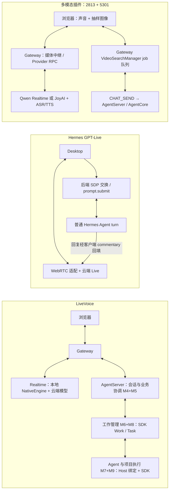

# LiveVoice、Hermes Voice 与多模态全双工：按同一模块比较

> 2026-09-13，LiveVoice Task/Work 统一到配套 AgentCore `.3` 后更新。
> LiveVoice 以当前两仓库源码为准；Hermes 固定 `e151d0b3458e136729fe498b566deb795ffb6a42`；多模态方案是 PR #2813 + #5301 的组合，插件代码对应 `b83923ae1f8cf0a315ce1f580e016edf48a02c2d`。这是模块级静态调用分析，不是三方性能或真实音视频实测。

## 1. 用什么颗粒度比较

统一按**浏览器/客户端、Gateway、Realtime 语音能力、会话与业务协调 M4+M5、工作管理 M6+M8、Agent 与项目执行 M7+M9**介绍。AgentServer 是 LiveVoice 后三组职责的应用容器，AgentCore 是其中使用的 SDK，不另画一个必经网络节点。M1+M2 合并；M4+M5、M7+M9 合并。原编号可用于代码索引，不再要求每个编号单独占一个模块。

“相同”分三种：复用同一源码底座；职责类似但算法/协议不同；本次语音链路没有对应模块。**不存在三方几乎完全相同的完整语音模块。** 两个 Jiuwen 方案的 AgentServer/AgentCore 执行底座最接近同一实现，但业务接入、权限封装与生命周期不同。Hermes 使用自己的 Agent 底座。

## 2. LiveVoice 主流程和横向模块图

图中省略回执细节：LiveVoice 的输入音频经 Gateway 到 Realtime，回复音频经 Gateway 回浏览器；业务调用和播放回执交 Host。已有状态查询可以直接返回；分析进入 Work，项目修改进入 Task。业务结果回填 Realtime 后生成声音，播放确认进入独立呈现账本。详见[模块导读](LIVE_VOICE_MODULE_GUIDE.md)。

Hermes 另有 Chained：客户端录音 → STT → 普通 Agent turn → 流式/文件 TTS → 播放。不能把它与 GPT-Live 混成一条链路。多模态 JoyAI 则是图像/文本请求决定 silence/response/delegation，语音由独立 ASR/TTS 配合；也不能等同于 Qwen 原生音图 Realtime。

## 3. 横向对照：相同职责，具体内容有什么不同

| 对齐模块 | LiveVoice | Hermes Voice | 多模态全双工（两个 PR 合并） | 相同程度与差异含义 |
|---|---|---|---|---|
| 客户端 M1+M2 | Web 开启/绑定语音、音频采集播放、文字/任务展示、播放 ACK | Desktop/CLI/平台多入口；Live 客户端持 WebRTC，Chained 录音转写与播放编排 | Web 还采集摄像头、屏幕、视频文件的抽样图像；普通任务输入框另有独立 ASR | 都有输入输出；LiveVoice 的 ACK、插件的视觉调度、Hermes 的多入口/唤醒不能互相省略 |
| Gateway 接入 | 媒体上下行路由、NativeEngine、Host 控制/通知转发 | Live 后端交换 SDP，媒体直达 Provider；Chained 可中继或按配置直连；平台有另外的 adapter | Qwen WS 双向中继；JoyAI/ASR/TTS RPC；还持有业务 job 队列 | 名称类似，网络拓扑和状态归属不同。LiveVoice 的 Gateway 不能从图中删掉，也不能假设所有方案音频都经 AgentServer |
| Realtime 能力 M3 | OpenAI Native 适配+云端语音模型，音频/转写/业务调用 | GPT-Live 适配+云端模型使用 delegation/commentary；Chained 没有这一独立 Realtime 层 | Qwen 音图 Realtime；JoyAI 是动作响应+独立 ASR/TTS | 原生听说职责类似，协议并不兼容。LiveVoice 当前 Native 工厂未接 Qwen/JoyAI；配置 URL 不足以替换 |
| 会话与业务协调 M4+M5 | Host 管轮次、旧响应失效、播放确认、通知仲裁、业务来源/项目校验；分状态读取、Work、Task | Live hook 管 delegation 与当前 turn，回复分句回填；新委托可能调用普通 turn 中断。Chained 本地打断采集、停止词和续听 | Qwen/JoyAI 前端管响应/播放 generation、VAD 和迟到输出；业务委托进入 Gateway job；结果回填按 call/job/turn 关联 | 都有打断和委托协调，但权威位置不同。LiveVoice 把语音失效与已受理工作取消分开；Hermes 新 delegation 可中断旧 Agent turn；插件清旧播放也不等于取消 job |
| 工作管理 M6+M8 | SDK Work 状态/版本/CAS/UNKNOWN；Task/Attempt/outbox/调整/恢复；Host 保留来源和产品装配 | 这条语音链复用普通 prompt/session turn；未见与此对应的独立持久项目 Task/Work 双模式管理层 | VideoSearchManager：按 scope 排队、排序/抢占、queue_version、call_id 去重、真实取消确认；主要运行状态在内存 | 插件 job 不是空壳，也不是 SDK 持久 Task。Hermes 未见此层不代表整个项目没有定时/后台工具；不能把工具能力等同于语音入口的生命周期体系 |
| Agent 与项目执行 M7+M9 | Host SessionExecution/Agent adapter 绑定配置；SDK 底座执行；正式 Task 增加项目基线、文件影响、checkpoint/durability、结果校验 | 普通 Hermes Agent/模型/工具，回复进入现有 turn 和历史 | execute_core_agent → E2A CHAT_SEND → AgentServer 普通 Agent/工具；画面通过附件归一化 | 两个 Jiuwen 方案复用同一底座，这是最接近“相同源码”的部分；LiveVoice 增加正式项目执行契约。插件不是调用 LiveVoice facade，Hermes 也不是 AgentCore |
| 历史与结果（归各模块，不另画框） | Task/Work 完成事实、聊天文字、音频呈现分别保存；已听记录依据播放回执 | 普通 Agent 历史、客户端 transcript/commentary 游标；未见对应 Host 音频 ACK 账本 | TaskFullDuplexRuntime 先写 UI/历史再按连接播放；JoyAI commitAndSpeak 先提交文字再决定 TTS | 都有历史，但“生成/展示”不是“已经播放”。LiveVoice 的 ACK 也只证明客户端报告播放进度，不证明人类确实听懂 |

## 4. 每个关键差异怎样解释

**媒体与 Provider。** LiveVoice 聚焦语音；插件持续输入抽样图像，因此增加媒体源、帧调度和画面上下文。Hermes Live 的浏览器到 Provider WebRTC 与 LiveVoice 的 Gateway 音频转发路径不同；Chained 和 JoyAI 各有独立 STT/TTS 边界。不能只凭“全双工”三个字判断首音、打断或成本优劣。

**业务分流。** LiveVoice 可以直接读取已有 Task/Work 事实，需要 Agent 分析才受理 Work，需要项目写入才进入正式 Task。Hermes GPT-Live 接收 `session.delegation.created` 后由 hook 整理 transcript context，经 `onSubmit` 接普通 `prompt.submit`；Agent 回复分句变为 `session.commentary.append`。插件 Qwen function call 和 JoyAI delegation 都进入 VideoSearchManager，再用 CHAT_SEND 执行。三者都能接真实 Agent，区别在委托前后的管理边界。

**打断与结果归属。** LiveVoice 校验 response/turn、停止/截断与播放确认，已受理 Work/Task 寿命独立于语音。Hermes Live 新 delegation 在 busy 时触发 `onInterrupt`，当前 delegation 检查阻止迟到结果回填；它与 LiveVoice 的独立工作策略不同。插件 Qwen 标记响应失效、递增播放 generation 并清 Worklet；JoyAI 递增 TTS generation、取消流。插件另有 job cancel，通过 CHAT_CANCEL 等待后端确认。这些机制都有价值，但没有同一套状态语义。

**持久化。** LiveVoice 的任务投递、尝试和副作用恢复在 SDK，Work 检查点可恢复到 UNKNOWN；不是保证随时无损续跑。插件在进程内维护 `_jobs/_queue/_active/_session_states`，诊断 JSONL 与聊天历史不构成队列的 durable outbox。Hermes 当前语音路径用普通 turn，不在这个入口增加同类项目任务账本。比较的是这些代码路径，不对其他工具的全部能力作否定结论。

**真实文件结果。** 三者 Agent 都可能调用文件工具。LiveVoice 正式项目路径额外要求基线、允许影响范围、产物哈希和恢复记录；这不是“Agent 会写文件”就自然具备。插件汇总 Agent 文件/正文和语音摘要，UI 显示/持久化后选择是否朗读；Hermes 把普通 Agent 回复交给 Live/TTS。模型说成功不应代替文件效果验证。

## 5. 哪些可以复用，哪些不能直接统一

| 结论 | 具体内容 |
|---|---|
| 已复用同一基础 | 两个 Jiuwen 方案使用应用 AgentServer 和 AgentCore 执行底座；LiveVoice Task/Work 这次把通用增强统一到 SDK |
| 职责相同，可研究共用接口但尚非共用实现 | 媒体采集播放、Provider 事件适配、业务委托、结果回填、取消、状态查询。需要先对齐 scope、时序、结果和取消语义 |
| 需要保留差异 | 插件视觉帧与 Qwen/JoyAI；Hermes 多入口和 Chained/Live；LiveVoice 播放事实、持久化 Task/Work 与项目副作用保护 |
| 本次没有做的集成 | 没有将 Hermes 或多模态插件改接 LiveVoice SDK Work/Task；没有新增 Provider，也没有统一三方 UI/媒体协议 |

因此“LiveVoice 已接 AgentCore”不等于“三个语音方案已经共享所有模块”。本次实现减少 LiveVoice 自建通用执行代码，并把新增通用能力提供给 SDK；其他入口是否采用需另行适配和验证。

## 6. 代码证据与流程导读

- LiveVoice：[模块/数据流](LIVE_VOICE_MODULE_GUIDE.md)、[Task/Work 统一证据](../reviews/TASK_WORK_UNIFICATION_20260913.md)、[代码量](UNIFIED_CODE_ACCOUNTING.md)。
- Hermes：[模块调用完整导读](HERMES_VOICE_CODE_FLOW.md)。本次复核 `voice_live.py`、Desktop `voice-live.ts`、Live/Chained hooks、`methods_voice.py`、`methods_prompt.py`、`tts_streaming.py`；来源均固定上述 SHA。
- 多模态：[2813 基础流程](JIUWENSWARM_DUPLEX_PR2813_FLOW.md)、[5301 增量流程](JIUWENSWARM_DUPLEX_PR5301_FLOW.md)。本次复核 [video_search.py](../../jiuwenswarm/extensions/video_duplex/backend/video_search.py)、[Qwen](../../jiuwenswarm/extensions/video_duplex/frontend/VideoLivePanel/qwenOmniSession.ts)、[JoyAI](../../jiuwenswarm/extensions/video_duplex/frontend/VideoLivePanel/joyaiProvider.ts)、[TaskFullDuplexRuntime](../../jiuwenswarm/extensions/video_duplex/frontend/TaskFullDuplexRuntime.tsx)。

面向产品经理可用第 2 节和三个例子：闲聊、分析文件、修改文件；架构师再看第 3–5 节。类与函数放在导读中，避免首次介绍变成源码目录清单。
