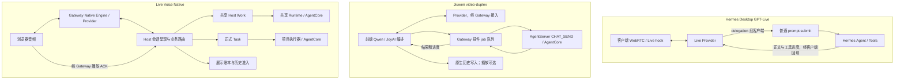

# Hermes Voice、Jiuwen 全双工插件与 Live Voice：功能和模块对比

> 代码核对日期：2026-09-13。本文件是实现分析与架构建议，不修改已接受设计，不代表部署或真实音视频验收。
> Live Voice 当前完成边界以 [STATUS](../STATUS.md) 为准；“代码存在”与“产品场景已验证”分开表述。

## 1. 先给结论

三者都在解决“让人用声音调用真正的 Agent”，但**语音引擎、状态归属和工作生命周期不是同一种设计**。

- **Hermes Voice**重在把声音接到已有 Hermes 会话和工具生态。既有可打断的 Chained STT/Agent/TTS，也有 Desktop GPT-Live 委托模式，以及平台语音适配。
- **Jiuwen 全双工插件**重在持续音视频理解，以及接入常规任务界面和 Agent。Provider 交互主要由前端编排，Gateway 插件持有后台 job 队列，AgentServer 负责真实执行。
- **当前 Live Voice**重在实时语音与 Host 业务事实协调：轮次、播放准入、Work、正式 Task 和项目副作用分开管理。通用执行复用 Jiuwen Runtime/AgentCore，同时保留专门的语音适配和较强的业务约束。

因此不能概括为“三套都是麦克风→模型→扬声器，只是供应商不同”；也不能按代码短长或是否叫 full-duplex 判断谁功能更完整。

## 2. 阅读顺序和来源基线

| 文档/对象 | 固定实现来源 | 本次阅读范围 |
|---|---|---|
| [Hermes 代码流程](HERMES_VOICE_CODE_FLOW.md) | `NousResearch/hermes-agent@e151d0b3458e136729fe498b566deb795ffb6a42` | Desktop Chained/Live、CLI/TUI、STT/TTS、平台入口、唤醒、Agent turn 与相关测试 |
| [PR #2813 基础流程](JIUWENSWARM_DUPLEX_PR2813_FLOW.md) | 本地镜像合入 `df5f89646227b05c6cbd90e1a0debe729ab2b26e` | 插件宿主、媒体、JoyAI、Qwen、原始 research 委托 |
| [PR #5301 增量流程](JIUWENSWARM_DUPLEX_PR5301_FLOW.md) | 本地镜像合入 `b83923ae1f8cf0a315ce1f580e016edf48a02c2d` | 独立 ASR、任务入口、delegate、队列/取消、历史/文件、Silero 与音频过滤 |
| [Live Voice 模块介绍](LIVE_VOICE_MODULE_GUIDE.md) | 当前 `hx/0912_livevoice@ae1aecde61948797ee36f824245b105120625af9`；生产集成 `5cb5303d` | 当前九模块及关键调用、Host Work、共享执行、Task、呈现准入 |

GitHub [#2813](https://github.com/openJiuwen-ai/jiuwenswarm/pull/2813) 和 [#5301](https://github.com/openJiuwen-ai/jiuwenswarm/pull/5301) 是前后递进的 PR，不是互相替代的两套产品。当前分支已包含两者，且插件目录与 #5301 的本地合入点无差异；**Live Voice 与 video-duplex 已在同一仓库中共存，但媒体和业务编排并没有因此自动统一。**

本次读取了实际代码和相关测试，并追踪调用；没有执行真实 Provider、摄像头、麦克风、Hermes 安装或延迟 A/B。关于未见某能力的判断限定本文所追踪语音路径，不能扩展为整个项目都没有该能力。

## 3. 应当按什么颗粒度比较

产品经理先看四组能力：**交互与媒体、实时对话、业务执行、工作与结果**。架构师再展开以下九个职责，加上媒体源/Provider/平台这些横向扩展。

保持职责颗粒度一致，避免拿 Hermes 的一个函数与 Live Voice 的整个正式任务系统比较。一个职责可以分布在浏览器和后端，也可以在一个类里与其他职责混合。

“相同”需要分成三类：

1. **职责相同**：都要播放或取消，并不说明协议与语义相同。
2. **机制相似**：都用 generation、call_id、队列来隔离迟到输出，但粒度与持久化范围可能不同。
3. **实际共享代码**：Jiuwen 两个入口确实可进入相同 Agent/Runtime、附件和历史基础设施；Hermes 是另外的代码库，仅有架构相似性。

## 4. 产品功能对比

| 功能 | Hermes Voice | Jiuwen 全双工（#2813 + #5301） | 当前 Live Voice |
|---|---|---|---|
| 连续听说 | Chained + 持续插话监听；Desktop 另有 GPT-Live WebRTC | Qwen 原生音视频；JoyAI 图像对话 + ASR/TTS | 主体 Native Realtime；另保留 Cascade |
| 普通问候直接回复 | Live 可不委托；Chained 通常仍走 Agent turn | Provider 可直接回复 | Native 可直接回复，不必建 Work/Task |
| 语音输入为可编辑文字 | 有录音/转写入口，行为依各 UI 模式 | #5301 有独立任务 ASR，转写后不自动发送 | 本文主链是持续交互；宿主已同时拥有 #5301 输入能力，不应计成 Live Voice 自己新增 |
| 摄像头/屏幕/视频文件输入 | 所查 Voice 模块未见等价的持续视频采样管线；不评价整个 Hermes 的视觉工具 | 有，抽帧进入视觉/Omni Provider | 当前 Native/Cascade 主链未接入同等视频源调度 |
| 原生语音模型 | Desktop GPT-Live；其他入口不能一概而论 | Qwen Omni；JoyAI 不是相同协议 | OpenAI Realtime Native |
| 独立 STT/TTS 扩展 | 云端、本地、命令/插件等多种派发；各模式支持程度不同 | JoyAI 语音通道/兼容 ASR/TTS；另有任务 ASR 配置 | Cascade 有 ASR/TTS 接口；不能据接口存在声称覆盖 Hermes 全部 Provider |
| 唤醒词、免手操作 | 有唤醒引擎、profile 路由、暂停/恢复所有权 | 本次插件链路未见等价唤醒模块 | 本次 Live Voice 主链未见等价唤醒模块 |
| 实际 Agent/工具调用 | 复用 Hermes 普通 turn | `CHAT_SEND` 进入 Jiuwen AgentServer | Host Work 经共享 Runtime；正式 Task 经项目执行器 |
| 多工作并行/队列 | 语音通常复用会话 busy/interrupt/queue；Live hook 跟踪一个 active delegation | scope 内顺序执行、跨 scope 并发限额，可排序/抢占/取消 | Work 生命周期与正式 Task 生命周期分别管理；不等于相同 UI 排序体验 |
| 正式文件任务生命周期 | 原有 Agent 可做文件工作；此 Voice 集成未专门提供相同 Task/Attempt/Outbox | Core Agent 可做文件工作并回传产物；插件 job 不是持久化正式 Task | 有正式 Task、Attempt、Outbox、调整和项目副作用/恢复模块 |
| 对话/结果历史 | 普通会话持久化；Live 口头上下文与普通 turn 历史分开 | 原生历史、reasoning/tool/file 时间线与标题 | 共享业务/会话历史，Native 回复另受展示准入约束 |
| 播放事实 | 本地播放状态、平台流式 completed/partial；Live 回填游标不是已听账本 | Worklet 有计数，handler 消费清空/排空状态；文本可先保存，未接 Host 已听准入 | Host presentation ledger + generation/response + ACK；不证明人的真实听觉 |

这些格子比较的是代码能力与责任，不是给三个项目打质量分。尤其“文件工具可执行”和“具备正式文件任务恢复协议”是不同层次。

## 5. 九个职责模块一一对应

| Live Voice 职责 | Hermes 对应 | Jiuwen 全双工对应 | 相同职责里的关键差异 |
|---|---|---|---|
| ① 产品交互 | Composer hooks、CLI/TUI、平台 adapter | Plugin Outlet、VideoLivePanel、TaskFullDuplexRuntime | Hermes 多入口；插件额外管理视频与原生任务面板；Live Voice 有专门激活/恢复/业务视图 |
| ② 音频/媒体 | AudioRecorder、browser recorder、WebRTC、平台音频 | capture/playback Worklet、视频抽帧、Qwen relay | 媒体拓扑、采样/编码、客户端直连和后端中继不同；插件额外有图像序列 |
| ③ Realtime 引擎 | GPT-Live 适配；Chained 没有相同独立语音模型层 | 前端 Qwen session；JoyAI 前后端组合 | Live API client delegation、Qwen function call、JoyAI action 与 Live Voice Native 协议不可互换 |
| ④ 会话与呈现 | conversation hook、active delegation、speech sequence、平台 handle | Provider 前端状态、speech epoch、playback generation、job-response 映射 | Live Voice 的有效性和展示事实更多在 Host；另外两者主要是客户端/平台状态，历史策略不同 |
| ⑤ 业务路由 | delegationPrompt → prompt.submit；平台 MessageEvent | qwen tool/joyai delegation → VideoSearchManager | Hermes 委托普通会话；插件委托通用 Agent；Live Voice 有 context/work/task 多操作契约与来源/项目绑定 |
| ⑥ Work 管理 | 原有 turn/queue/busy/interrupt；Live hook 不是独立 durable Work owner | Gateway 的内存 job 队列 | Live Voice 用共享 HostWorkService/日志/执行器池；plugin 自有队列尚未统一到该服务 |
| ⑦ 共享 Agent 执行 | 原有 `agent.run_conversation` | AgentServer `CHAT_SEND` / E2A | 都复用真实 Agent；Hermes 不是 AgentCore；两个 Jiuwen 入口复用基础能力但入口契约不同 |
| ⑧ 正式 Task | 本次 Voice 路径未见对应专门层 | UI task + plugin job，没有调用 PersistentTaskCore | Live Voice 提供不同于普通 turn/job 的持久化业务命令与执行尝试 |
| ⑨ 项目执行器 | 普通 Agent 工具执行文件工作 | 普通 Core Agent 工具与文件结果 | Live Voice 另有项目基线、文件影响计划、应用/恢复事实；这不意味着自动保证产物符合全部意图 |

Hermes 和插件不是“缺了两个类就不完整”：它们选择了不同产品边界。反过来，Live Voice 也不能因 Task/账本更多就声称视频、唤醒、多平台覆盖更强。

## 6. 三种实际调用拓扑

图省略控制中转与返回的部分箭头；不能从布局推断线程数或独立部署服务数量。Hermes Chained 和 JoyAI/Cascade 的分段流程分别见流程文档。

## 7. 相同模块内部究竟差在哪里

### 7.1 都采集与播放：传输位置不同

Hermes Live 的音频走客户端到 Provider 的 WebRTC，后端主要交换 SDP。Hermes Chained 可直连 STT/TTS，也可走后端上传和 PCM 中继。Jiuwen Qwen 的浏览器自己生成 Provider JSON，经 Python WS relay 发送；JoyAI 走图像 RPC、转写、TTS 组合。

Live Voice 浏览器连接同源专用媒体通道，Gateway Native Engine 适配 Provider，并把关键控制/业务事件送到 Host。这使 Host 能参与响应有效性判断，也引入跨组件的同步和调度成本。

证据：[Hermes 媒体与播放](HERMES_VOICE_CODE_FLOW.md#模块-5gpt-live-会话与委托适配)、[Qwen 中继](../../jiuwenswarm/extensions/video_duplex/backend/qwen_omni_gateway.py)、[Live Voice 媒体注册](../../jiuwenswarm/gateway/live_voice/dedicated_media_registration.py)。

### 7.2 都有“打断”：停止的对象不同

Hermes Chained 区分生成期和播放期：前者可 interrupt Agent，后者停 TTS 后转写插话；Live 新 delegation 也可中止旧 turn。插件主要由本地 Silero 确认讲话，Qwen 发 `response.cancel` 并清播放，JoyAI 取消 TTS；它的 job 取消走单独 `video.search.control`。

Live Voice 的 barge-in 还携带 response/generation/播放 cursor，协调失效、取消与呈现账本。**停止一句语音、停止一次 Agent 执行、取消正式 Task**必须分别说明。任何一方的打断都不能自动解释为撤销已经发生的文件副作用。

证据：[Hermes 打断语义](HERMES_VOICE_CODE_FLOW.md#5-打断和恢复的实际含义)、[Qwen interruptQwenResponse](../../jiuwenswarm/extensions/video_duplex/frontend/VideoLivePanel/qwenOmniSession.ts)、[Native barge_in](../../jiuwenswarm/channels/live_voice/native_interaction_runtime.py)。

### 7.3 都有历史：记录对象不同

插件在模型文字结束或中断时保存已收到文字，业务完成正文先展示/持久化，再尝试播放。它的目标是“工作和对话可查看”。Hermes 普通 turn 也有持久历史，但 Live voice model 的口头改写、后端正文、客户端回填游标并非同一个记录。

Live Voice 的 Native `_reconcile_history_locked` 要求回复未取消、正常完成、有转写、对应音频 presentation complete 且记录均为 PRESENTED，才产生该回复历史准入。**这一限制针对 Native 回复的该条接纳路径，不是说所有 Task 业务历史都必须等用户听完才能保存。**

这不是简单的“插件历史不真实，Live Voice 历史真实”：前者真实记录收到/显示的文字，后者对其中一类回复还约束已确认展示。二者可以同时存在，名称必须分开。

证据：[插件 Task Runtime](../../jiuwenswarm/extensions/video_duplex/frontend/TaskFullDuplexRuntime.tsx)、[插件 commitAndSpeak](../../jiuwenswarm/extensions/video_duplex/frontend/VideoLivePanel/joyaiProvider.ts)、[Native 历史准入](../../jiuwenswarm/channels/live_voice/native_interaction_runtime.py)、[共享历史实现](../../jiuwenswarm/server/runtime/session/session_history.py)。

### 7.4 都返回异步结果：调度和消费确认不同

Hermes Live hook 跟踪一个 active delegation，定期把新正文回填为 commentary；spokenLength 表示回填进度。插件按 job/call/turn 绑定结果，Qwen 在用户说话和模型生成时等待，但可以在已有音频仍排队播放时回填下一结果；旧任务不因新问题自动丢失。

Live Voice 另有 Host 通知协调、结果查询和展示消费记录，播放 ACK 可以影响通知是否已消费。插件的“结果已注入 Provider”、Hermes 的“已 append commentary”和 Live Voice 的“展示已确认”是三种不同事实，不能使用一个 delivered 布尔值混为一谈。

证据：[Hermes Live 流程](HERMES_VOICE_CODE_FLOW.md#42-desktop-gpt-live)、[插件 dispatchQueuedToolResult](../../jiuwenswarm/extensions/video_duplex/frontend/VideoLivePanel/qwenOmniSession.ts)、[Live Voice Registry](../../jiuwenswarm/channels/live_voice/product_composition_registry.py)、[共享展示账本](../../jiuwenswarm/server/runtime/presentation/presentation_ledger.py)。

### 7.5 都调用 Agent：进入的接口和隔离策略不同

Hermes 使用现有 `prompt.submit → agent.run_conversation`，复用本项目的模型、工具、审批与会话能力。Jiuwen 插件通过标准 E2A `CHAT_SEND`，`source=video_tool`，内部 `video-tool-*` 会话承载执行。

Live Voice Work 通过 `NativeBusinessRouter → AgentConversationRuntime → RuntimeFormalAgentFacade → AgentRuntime.stream_owned`。Facade 校验 retained execution、工具会话、来源字段和输出归属；正式 Task 另走 `DirectProjectCodeExecutorAdapter → process_background_code_task_stream`。

两个 Jiuwen 特性使用相同 AgentCore 基础能力，但 **“都经过 Runtime”不代表请求参数、上下文和取消归属已统一**；也不存在当前两者共同调用 `SessionExecutionService` 的事实。

同一插件内部也有差异：Qwen 委托支持 2,000 字符 task 和 call_id 幂等，JoyAI 入口仍截取 500 字符 delegation/question 并匹配运行中的同文本查询。通用执行器共享并没有消除入口语义的不一致。

证据：[插件 execute_core_agent](../../jiuwenswarm/extensions/video_duplex/backend/video_search.py)、[Live Voice Router](../../jiuwenswarm/channels/live_voice/native_business_router.py)、[Runtime Facade](../../jiuwenswarm/server/runtime/agent_adapter/runtime_formal.py)、[项目执行器](../../jiuwenswarm/server/runtime/formal_tasks/project_code_executor.py)。

### 7.6 都有任务状态：持久性不同

插件 Manager 的内存队列能排序、抢占、拒绝旧版本，并等待真实取消回执；这些是有价值的生命周期机制。Live Voice HostWorkService 另持有 Work 日志和执行池；正式 Task 进一步拥有持久命令、Attempt、调整和恢复事实。

Hermes 原有会话执行也有持久历史、崩溃标记和恢复机制，不能说它“无恢复”。但这些通用 turn 机制，与 Live Voice 的正式 Task/项目副作用恢复不是相同接口，也没有在所查 Voice hook 中重新构造等价系统。

证据：[插件 Manager](../../jiuwenswarm/extensions/video_duplex/backend/video_search.py)、[HostWorkService](../../jiuwenswarm/server/runtime/work/service.py)、[PersistentTaskCore](../../jiuwenswarm/server/runtime/formal_tasks/persistent_task_core.py)、[Hermes turn 证据](HERMES_VOICE_CODE_FLOW.md#7-代码证据和阅读范围)。

### 7.7 都能操作文件：业务保证不同

#5301 通用委托能通过 Core Agent 工具生成/读取/修改文件，并把 file 事件、正文、下载资源接回原生时间线。这已经是实际能力，不能说“只有搜索”。Hermes 也复用其普通文件与执行工具。

Live Voice 正式项目任务在此基础上额外管理项目基线、允许的文件影响、持久化记录和失败后核对。它增加的是显式项目责任，并非另一种更聪明的模型；文件语义质量仍需验收。Live Voice 当前还受项目授权等范围约束，不能默认拥有与通用委托完全相同的开放业务范围。

### 7.8 都有凭证与权限：边界不同

Hermes GPT-Live 密钥留后端，Chained client-direct 则可把解析后的 Provider 凭证交给受信客户端，按 profile 配置运行。Jiuwen 插件把 Provider 密钥放在 Gateway；常规业务执行继续受宿主权限机制约束。

Live Voice 还有明确的 session/project/source/capability 与 execution binding。不能把“API Key 不下发”“检查 Origin”“带 session_id”各自当成完整业务授权。本文没有进行全仓安全审计，也不据结构差异推断漏洞。

## 8. 真正共享了哪些代码，哪些只是相似

| 关系 | 当前事实 |
|---|---|
| Jiuwen 插件 ↔ 原有 AgentServer | 已共享标准请求/执行入口、配置 Agent 与工具能力，画面使用共享附件归一化 |
| Live Voice ↔ 原有 Runtime | Work 使用 `stream_owned` 等共享机制；任务/Work/展示通用模块已归 Host |
| 插件 ↔ Live Voice 的历史底座 | 都可到达共享 `session_history`，写入时机和准入规则不同 |
| 插件 ↔ Live Voice 的业务队列 | 尚未统一：`VideoSearchManager` 与 `HostWorkService / PersistentTaskCore` 是不同 owner |
| 插件 ↔ Live Voice 的 Provider 引擎 | 尚未统一：前端 Qwen/JoyAI 与 Gateway Native Engine 各有编排 |
| 插件 ↔ Live Voice 的播放器/协议 | 都有浏览器音频和失效过滤，但不是同一份播放协议或呈现账本 |
| 插件的共享 Silero | 位于 Web 前端公共 speechDetection 目录，Qwen/JoyAI 使用它；未据此确认 Live Voice 也已接入 |
| Hermes ↔ Jiuwen | 无本次核对范围内的直接源码/执行服务复用；相同的是职责或设计机制 |

特别要区分两种“代码已经在 Jiuwen 里”：**目录在仓库里**与**所有入口调用同一个权威服务**。#5301 把插件接入了产品和 Agent，但并未自动让它与 Live Voice 共享全部状态机。

## 9. 延迟不能从架构图直接排高低

| 路径 | 本地代码可见的延迟来源 |
|---|---|
| Hermes Chained | 断句、录音结束、STT 请求、Agent 首段文本、分句条件、TTS 首块和播放；生成/TTS 可重叠 |
| Hermes GPT-Live | Provider 轮次/委托判断、WebRTC、Hermes turn、hook 的 200 ms 回填检查和句子边界 |
| 插件 Qwen | 本地 Silero 确认、音频 200 ms 批次、Provider semantic VAD、解码、400 ms 初始播放等待等 |
| 插件 JoyAI | 语音断句/ASR、图像轮询与串行请求、模型响应、独立 TTS、speech epoch 过滤 |
| Live Voice Native | 音频批次/排队、Provider VAD、Gateway/Host 调度、业务初始化和执行、播放缓冲及呈现协调 |

数值是该基线代码的参数或检查周期，**不是端到端测量值，不应直接相加，也不能只归因云端 API**。比较首音和打断应使用同设备、同网络、同任务，并分别标记讲话结束、人声确认、取消发出、最后可闻样本、Provider 首音频、浏览器开始输出；否则比较到的可能是不同指标。

## 10. 对 Live Voice 后续统一和瘦身的建议

以下是基于代码的建议，不是新的实施授权或迁移决定。

1. **优先统一宿主业务入口与状态 owner。** 如果要让插件也具备可靠 Work/正式 Task，不要再扩充一套平行的 durable job；评估把现有插件任务控件、scope/版本/取消回执适配到共享 Host Work 或正式 Task 服务。保留队列排序的产品需求，避免只移动文件却改变能力。
2. **Provider 留在语音/多模态适配层。** 抽象的是音频、图像、转写、业务提议、结果回填和中断事件；不能强行用一个 Provider 的事件名覆盖 Live delegation、Qwen function call 和 JoyAI action。
3. **分开“收到/显示的内容”和“确认播放的内容”。** 复用统一历史底座，同时保留 Live Voice 展示账本的语义；不要拿插件 transcript.done 直接当音频 ACK，也不要让所有业务结果保存被播放阻塞。
4. **媒体基础组件可以评估复用。** 插件的 Silero Worker、视频源就绪/抽帧调度、迟到解码过滤有明确边界；复用前要确认 Native 采样率、响应身份和取消语义，不能直接替换现有麦克风/播放器。
5. **Hermes 值得借鉴的是入口薄适配和 Provider 扩展。** 普通 turn 复用、分句 TTS、平台 streaming handle、唤醒所有权都是可独立讨论的设计；不能照搬其单 active delegation 策略来覆盖 Live Voice 多 Work/Task 通知，也不默认引入客户端凭证直连。
6. **保留正式任务的独立责任。** 代码瘦身应来自共享执行和状态服务，不是删除项目副作用核对、Outbox 或播放准入后宣称功能等价。

最有价值的统一方向是：**不同语音/音视频 Provider 和 UI → 统一的 Host 业务能力与事实服务 → 各自适合的呈现方式**。媒体和说话方式可以不同；同一个业务对象的完成、取消、结果和恢复不应各由两套入口重新解释。

## 11. 一分钟介绍这三者

> Hermes 把语音接到自己已有的 Agent，会话和工具复用程度高，入口和语音 Provider 选择较多；最新代码还包含实时语音模型委托模式。
>
> Jiuwen 的两个全双工 PR 则先搭起音视频插件，再接入常规任务界面、后台委托队列和原生历史。它能看画面、听人说话，也能让真正的 Core Agent 执行并返回文件。
>
> Live Voice 同样复用 Jiuwen 和 AgentCore，但更明确地区分语音响应、播放事实、Work、正式 Task 和项目执行责任。三者都有采集、模型、Agent、播放和历史；区别主要在这些模块由谁持有状态、何时算完成，以及故障后能恢复到什么程度。
