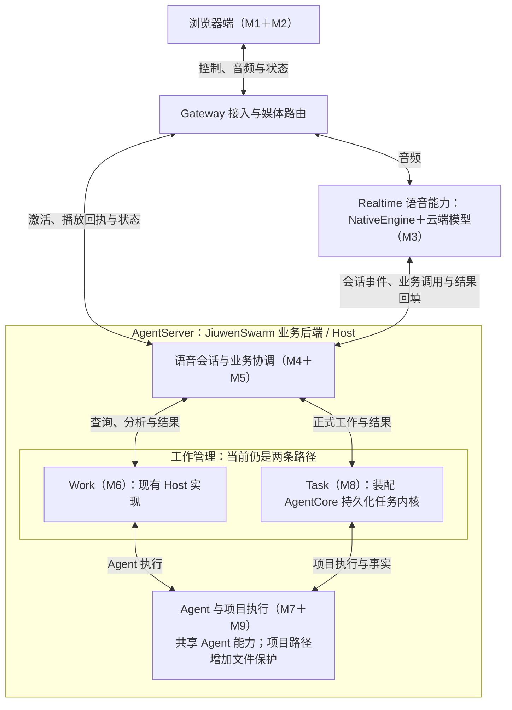
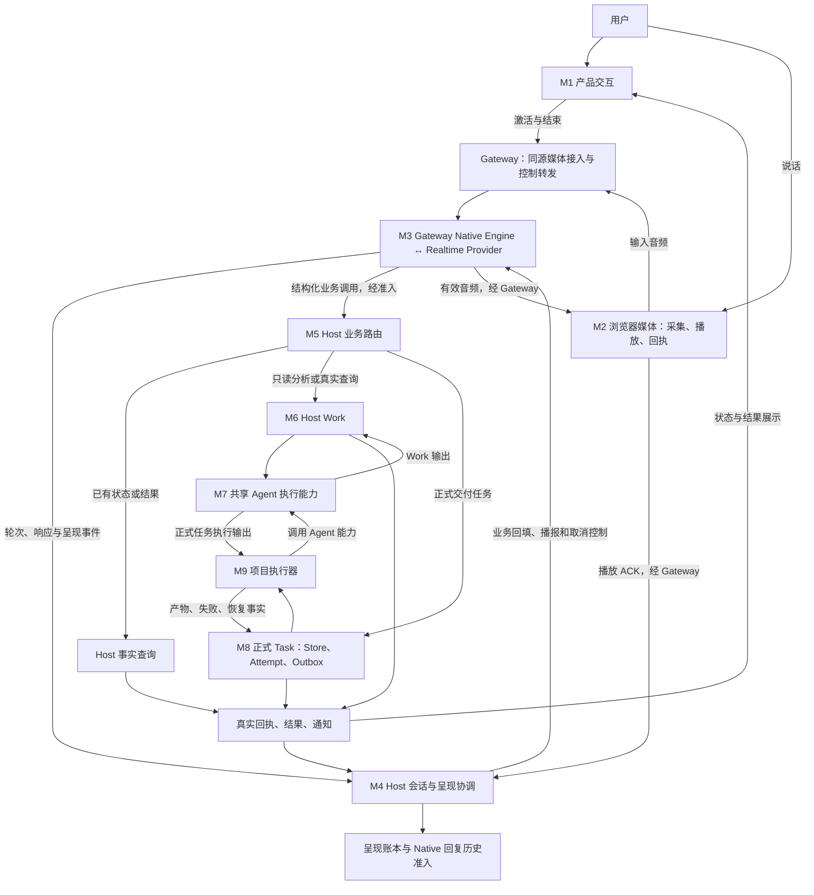

# 以 LiveVoice 流程为主线的三方模块对比

> 2026-09-13 Task 迁移更新：持久化 Task 内核现由 AgentCore 提供，AgentServer 负责装配和项目适配，Work 保持原实现。详见[迁移记录](../reviews/AGENTCORE_TASK_MIGRATION_20260913.md)。下文来源基线描述保留历史含义。

> 2026-09-13，基于实际代码的职责与调用分析。本文件不改变已接受设计，不代表部署或真实音视频验收；产品完成边界见 [STATUS](../STATUS.md)。
>
> 本文三个对象：**LiveVoice Native 主链、Hermes Voice、PR #2813 + #5301 合起来的多模态全双工插件**。后者简称“多模态插件”，不再拆成两套产品比较。

## 展示版：保留接入边界，再展开关键职责

**Gateway 接入层应保留为主介绍中的独立模块。** 它决定媒体经过哪里、Provider 连接由谁维护、业务请求怎样进入宿主、音频和控制如何返回。把它藏进“媒体输入输出”，会让听众误以为浏览器直连 Realtime，或误以为所有音频都先进入 AgentServer。

推荐采用两层颗粒度：顶层介绍**浏览器端、Gateway 接入层、Realtime 语音能力、Host/AgentServer**；Realtime 内部标出本地适配器与云端模型，Host 内部展开会话、业务、执行三组责任。职责分组与实际部署位置分别说明，AgentCore 则作为执行底座介绍，不把它们说成同一种独立服务。

### 主介绍需要交代的职责（可按下方分组合讲）

| 介绍模块 | 必须讲清的责任与数据 | 与原索引的关系 |
|---|---|---|
| 浏览器交互与媒体 | 用户开启/结束会话；采集音频、播放声音、显示文字和工作结果，并上报播放进度 | M1 + M2；界面细节可简讲，客户端不能消失 |
| Gateway 接入与媒体运行 | 接收音频和控制请求，维护媒体路由；Native Engine 在这里连接 Realtime；转发业务/呈现事件并交付下行音频 | 新增 G 接入职责；承接 M2 的服务端部分，运行 M3 适配器 |
| Realtime 语音模型适配 | 音频进入模型；返回语音、输入/输出转写和结构化业务调用；普通对话可直接回答 | M3；必须区分 Gateway 内的适配代码与云端模型 |
| 会话、打断与呈现 | 管理轮次、响应失效、通知播报和播放确认；区分生成、发送、播放与历史准入 | M4；关键事实在 Host，Gateway/浏览器配合执行 |
| 业务路由与事实查询 | 将请求分成查询已有事实、发起/控制 Work、创建/控制 Task，校验项目、来源及对象归属 | M5；不能省掉分流，否则容易误解“所有问题都调用 Agent” |
| Work 服务 | 管理当前语音入口的只读分析/查询工作及其状态、更新、取消和结果 | M6；不能与执行一次模型调用混为一谈 |
| 共享 Agent 执行 | 使用应用配置的 AgentModel 和工具真正完成工作；复用 Jiuwen Runtime/AgentCore 能力 | M7；AgentModel 与 Realtime 的职责必须分开 |
| 正式 Task 系统 | 保存交付任务、执行尝试、命令、调整和恢复事实；决定哪个结果属于当前任务 | M8；不是聊天框里的“任务完成”标签 |
| 项目执行器 | 准备项目环境，调用 Agent 做文件工作，核对文件影响并向 Task 返回执行事实 | M9；不能只用“Agent 写文件”概括 |

**Host/AgentServer 也必须介绍，但作为上述宿主模块的容器。** 在当前本地部署中，它是本机业务后端，不是云端语音模型。它承载会话准入、业务路由、Work、Task 和项目执行等责任，并连接共享 Agent 执行能力。Gateway 与 Host 分开运行；Work、Task、AgentCore 并不因此各自成为独立网络服务。

### 合并介绍的规则：能力可以分组，运行位置与责任仍要注明

**M1 + M2 统一叫“浏览器端”。** 首次介绍不再拆成两个模块框，内部说明操作与展示、录音与播放、控制与回执即可。M2 原来还包含服务端媒体传输；这部分留在 Gateway，不能因改名而声称全部媒体代码都在浏览器。

**“G 同源控制与媒体路由”改称“Gateway 接入层”。** 同源指页面、API 和媒体 WebSocket 使用同一页面来源；控制是激活、结束、通知拉取等请求，媒体路由是为正确会话建立音频连接并转送数据。它是访问和传输机制，不是理解语音或执行业务的模型。对外不用把“同源”放进模块名称。

**Gateway 接入层与 Native Engine 可以分开讲。** 前者负责接入、连接、媒体和请求转发；后者负责连接 Realtime、转换 Provider 事件、回填业务结果和执行语音取消等控制。当前 Native Engine 实际运行在 Gateway 进程中，拆成两个职责框不意味着需要新部署一个服务。

**Native Engine + 云端 Realtime 可以合称“Realtime 语音能力”。** 内部保留“本地适配器 ↔ 云端模型”这条边：模型听说和生成内容，适配器把它接入 LiveVoice 协议。功能介绍可以合并，分析网络、成本、时延、故障或更换 Provider 时再展开；不能把二者说成同一份代码或同一个运行位置。

### Native Engine 当前支持范围

| 问题 | 当前代码事实 |
|---|---|
| 已接哪些 Native Provider？ | 生产装配创建 `OpenAIRealtimeNativeInteractionEngine`，内部使用 `OpenAIRealtimeSession`；未接第二个厂商的 Native 实现 |
| 是否固定某一个 GPT 型号？ | 模型名通过 `LIVE_VOICE_NATIVE_REALTIME_MODEL` 配置，当前默认及已部署选择为 `gpt-realtime-2.1-mini`。可配置名字不证明每个型号都兼容或已验证 |
| 能否只改 URL 接其他 Realtime？ | 当前不能。Session 校验只接受官方 `https://api.openai.com/v1`，并使用 OpenAI 事件和控制协议 |
| 代码有扩展点吗？ | 有 factory 注入和内部事件/准入边界；当前装配和部分类型仍绑定 OpenAI。新增 Provider 需要适配事件、业务调用、取消与呈现等语义，再接配置与验证 |
| 仓库里的 Qwen/JoyAI 算支持吗？ | 它们属于多模态插件的另一条实现，未接进此 Native Engine。Cascade 也不是第二个 Native Realtime Provider |

源码：[引擎选择](../../jiuwenswarm/channels/live_voice/native_interaction_config.py)、[实际工厂装配](../../jiuwenswarm/gateway/channel_manager/web/app_web_handlers.py)、[OpenAI Native Engine](../../jiuwenswarm/channels/live_voice/openai_realtime_native_engine.py)、[Session 与端点校验](../../jiuwenswarm/channels/live_voice/openai_realtime_session.py)。这是当前代码的支持范围，不是外部模型可用性清单。

### AgentServer 内部按同一原则分成三组

| 展示分组 | 内部职责 | 为什么这样分，哪些区别要保留 |
|---|---|---|
| 语音会话与业务协调 | M4＋M5：轮次、播放状态、业务分流与已有事实查询 | 一个展示模块，内部保留语音时序与业务准入两类责任 |
| 工作管理 | M6 Work＋M8 正式 Task | 一个展示组，当前代码仍保留两条路径；Task 内核迁入 AgentCore，Work 本次不动 |
| Agent 与项目执行 | M7＋M9：共享 Agent 与项目执行适配 | 一个展示模块，项目路径增加基线、文件影响和恢复责任；普通 Work 不必经过项目执行器 |

历史、Work 日志、Task Store 等按拥有者归入这三组，不再各画一个业务模块。它们保存不同事实，不能合并成一个“聊天历史”概念。`ProductCompositionRegistry` 负责装配、入口和生命周期协调，首次介绍纳入 Host 即可，不必另列一个与 Work/Task 并列的模块。

特别区分：**Task 系统不执行每个文件操作，Agent 执行层不决定整个 Task 的持久生命周期；停止一句语音不等于取消已经受理的 Work/Task。** 可以减少展示框的数量，不能省掉这些行为含义。

### 展示用模块图：四个顶层部分，必要处展开内部职责




这是职责分组图：四个顶层部分为浏览器端、Gateway 接入层、Realtime 语音能力、AgentServer。**Realtime 在展示图中只占一个模块框；内部 Native Engine 运行在 Gateway，模型运行在云端。AgentCore 是执行依赖，不是另一个必经网络服务。** 实际部署仍是浏览器、Gateway、AgentServer 与外部模型服务。图中 Work 与 Task 是分支，普通实时对话不必进入业务执行。

### Host 模块用具体问题解释，并注明代码来源

**M5 是“已有事实查询”，不是“实时查询”。** 建议展示名为“业务分流与状态/结果查询”。例如“刚才的任务完成了吗”，它读取当前授权范围内已保存的 Task/Work 状态和结果；“读取文件并分析”才发起 Work，“修改并保存文件”交给正式 Task。M5 校验请求并调用相应服务，不自己生成业务答案，也不是一个联网搜索模型。`context.get` 还会读取允许的会话历史、工作事实和模型配置等上下文。

**M4 建议称“语音会话与播放状态管理”。** 它回答：当前是哪一轮、哪些模型输出仍有效、插话后哪些旧输出要失效、任务结果何时安排播报，以及浏览器确认播放到了哪里。比如回答只播了一半就被打断：不能因为模型生成完了，就记成已完整播放。它管理语音时序和呈现事实，既不是另一个回答模型，也不管理 Work/Task 的业务完成。实际停止声音由浏览器/媒体层执行，Provider 取消由 Native Engine 执行，Host 负责对应准入与事实协调。

| 对比 | Work（M6） | 正式 Task（M8） |
|---|---|---|
| 当前 Voice 入口用途 | 只读分析、读取与查询，例如分析现有文件 | 正式交付，例如修改并保存项目文件 |
| 管理对象 | 一次分析工作及其状态、版本、更新、取消、结果 | 一个持久任务及其执行尝试、命令投递、调整、结果和恢复事实 |
| 实际执行 | 借用共享 Agent 执行能力 | 通过项目执行器调用 Agent，并核对项目文件副作用 |
| 中断恢复 | Work 日志可恢复事实；执行结局不明可记 UNKNOWN，不自动重放 Agent | 保存 Task/Attempt、命令和副作用信息，按状态核对恢复；也不是保证任意失败都能自动续跑 |
| 来源与当前归属 | LiveVoice 开发出的工作管理能力，后续以 HostWorkService 等归入 JiuwenSwarm Runtime | LiveVoice 开发出的正式任务体系，后续迁入 JiuwenSwarm `server/runtime/formal_tasks` |

**这两套具体服务都不是 AgentCore 原生的 Work/Task 二选一接口。** AgentCore 提供底层 Agent/工具等能力，JiuwenSwarm 原有 AgentRuntime 提供宿主执行与会话基础；本分支的 Work/正式 Task 管理是在这些能力上增加的。JiuwenSwarm 或 AgentCore 中其他名为 task/work 的对象、普通任务页面或后台执行，不应直接等同于这里的两套协议。

**M9 与 M7 的区别是“项目责任”与“Agent 执行能力”。** M7 将请求交给配置好的 AgentModel 和工具，接收输出并处理执行取消等；M9 在正式 Task 路径上准备正确项目与基线，调用 M7，再核对文件影响、应用结果与失败恢复事实。M9 并不替代 Agent，也不是第二个独立推理模型。

```text
分析文件：M5 → M6 Work → M7 Agent 执行 → Work 结果
修改文件：M5 → M8 Task → M9 项目执行器 → M7 Agent 执行
                              ↑                 ↓
                         文件影响与执行事实 ← 执行输出
                              ↓
                         M8 Task 保存权威结果
```

| 模块 | 历史来源与当前实现归属 |
|---|---|
| M4 语音会话与播放状态 | 来自 LiveVoice；语音特定协调留在 channel，通用呈现账本等归入 Host。不能因在 AgentServer 执行就说它是上游原生能力 |
| M5 Native 业务路由 | LiveVoice 的业务接入适配，当前在 `channels/live_voice`，调用宿主服务 |
| M6 Work、M8 正式 Task、M9 项目执行器 | LiveVoice 增加/发展，后迁入宿主；HostWorkService 的共享所有权封装在集成时增加 |
| M7 Agent 执行 | 复用原有 AgentRuntime、Agent/模型/工具底座；Voice 所需的受控适配和部分专用执行入口是新增或改造的，不能把整条路径都说成上游原有 |

来源核对：所采用官方 develop `8c7bfecd` 中已有 `AgentRuntime`，没有这里的 `HostWorkService`、`PersistentTaskCore`、`NativeInteractionRuntimeOwner`、`DirectProjectCodeExecutorAdapter` 类。集成前 `cedb4e1b` 的 Native Work、Task Core、项目执行器和 Native 会话实现位于 `server/live_voice`；`5cb5303d` 将共享责任迁入宿主并接既有 Runtime。详见[集成记录](../reviews/SHARED_RUNTIME_INTEGRATION_20260913.md)。该结论限定这次集成的具体模块与固定基线，不是宣称上游没有任何工作/任务能力。

**“现在由 JiuwenSwarm 管理”不等于“上游原来就有”，也不等于其他语音入口已经改用同一实现。** 模块图说明当前职责；上述来源说明哪些是复用底座，哪些是本分支新增后共享化。

### Gateway 与同层级边界：三方横向对齐

| 边界 | LiveVoice Native | Hermes Voice | 多模态插件（#2813 + #5301） | 必须解释的差异 |
|---|---|---|---|---|
| 客户端 | Web 操作、采集、播放与 ACK；关键会话事实交 Host 管理 | Desktop/CLI/平台入口；Live 客户端管理 WebRTC 和 delegation，Chained 串接录音与播放 | Web 中编排 Qwen/JoyAI、视频源、打断和结果注入 | 都有客户端，但承担的会话逻辑不同；插件还持续输入图像 |
| 接入后端 / Gateway | 持有媒体路由和 Native Engine，音频经过 Gateway；业务与呈现事件走内部 Host 接口 | GPT-Live 后端负责带凭证交换 SDP，音轨走客户端 ↔ Provider；Chained 可中继，也可按配置直连；平台另有 Gateway adapter | Qwen 经 Gateway 做 WS 双向中继，主要会话编排在前端；JoyAI/ASR/TTS 走插件后端接口，业务 job 也由 Gateway 插件管理 | “都有 Gateway”不代表音频拓扑、模型适配位置或任务归属相同 |
| 云端语音服务 | 原生 Realtime 音频输入输出及转写，提出业务调用 | GPT-Live 为独立语音模型；Chained 是 STT + Agent + TTS | Qwen Omni 音图会话；JoyAI 图像对话加独立 ASR/TTS | 独立 Realtime 并非所有模式都有；视觉输入与语音服务组合不同 |
| 宿主业务后端 | AgentServer 承载会话/业务权威；Work、正式 Task 和项目执行为不同模块 | 复用 Hermes 普通 turn、Agent 与历史；并非 Jiuwen Host | Gateway 的 VideoSearchManager 持有 job，AgentServer 执行标准 CHAT_SEND | LiveVoice 的 Work/Task 与插件 job 不在同一管理层，不能只画一个“后端 Agent” |
| Agent 执行底座 | Work/Task 入口各异，底层使用 Jiuwen Agent 与 AgentCore 能力 | Hermes 自己的 Agent、模型和工具 | 通过通用消息入口到 Jiuwen AgentServer/AgentCore | 两个 Jiuwen 特性复用部分底座，但入口契约和生命周期尚未统一 |

详细业务模块仍按第 3–4 节 M1–M9 比较；新增的 G 负责补足接入边界，不重编号，也不重复计算 M2/M3 的代码归属。

### 什么可以简讲，什么不能删

- **M1 可以简讲，浏览器不能删。** 用一句话说明操作与结果展示，仍要保留采集、播放、文字展示和回执的客户端位置。
- **Gateway、Host、Realtime 语音能力必须出现在主图。** 否则无法解释传输、权限、延迟、断连恢复以及本地问题和模型问题的区别。
- **M4–M9 可以按 Host 的三组能力介绍，但必须交代内部责任。** Work/Task 保留分支，Task 管理与项目/Agent 执行保留上下游关系；不要求每个类或子模块都占一个顶层框。
- **历史与结果记录必须交代保存条件。** 业务完成、聊天展示、浏览器播放确认是不同事实；不必展开表结构。
- 配置鉴权、会话/项目绑定、协议校验、诊断与恢复作为横向责任简讲，分别指出谁校验、谁记录、谁恢复；不必逐项讲字段和函数。
- 组件名、采样参数、WebSocket 握手细节、数据库表和恢复算法可留到技术问答。视频源、Hermes 多入口/唤醒等差异按主题补充。

**阅读建议：** 产品介绍使用本节模块图、模块表和第 9 节；架构讨论补充第 2–5 节的路径与数据。颗粒度控制在“能说明责任、输入输出、运行位置、与相邻模块关系”，无需首次就讲到类和函数，也不再压缩到看不见关键边界。

## 1. 详细索引：四组能力、九个职责模块

**三者都有采集、对话、业务委托、真实 Agent 执行和播放；主要差异是媒体输入、业务分流、状态由谁管理，以及完成和恢复的含义。**

下面按四组能力整理 M1–M9 职责。展示时保留这些关键责任，并额外标明 G Gateway 接入模块以及 Browser/Gateway/Host/Provider 运行边界。职责模块不代表独立进程，也不要求只对应一个文件；Gateway 容器内部包含 G 接入、M2 服务端媒体与 M3 适配代码。

| 能力组 | 模块 | 一句话责任 |
|---|---|---|
| 交互与媒体 | M1 产品交互 | 用户从哪里开始会话，在哪里看对话和工作结果 |
| 交互与媒体 | M2 媒体采集、传输与播放 | 把麦克风声音送入系统，把返回音频送到扬声器 |
| 实时对话 | M3 语音模型适配 | 与语音模型交互，转换声音、转写、响应和业务调用事件 |
| 实时对话 | M4 会话、打断与呈现 | 管理轮次、迟到输出、结果播报、播放确认和语音历史准入 |
| 业务执行 | M5 业务路由 | 校验业务请求并把它交给正确的真实服务 |
| 业务执行 | M6 Work 管理 | 管理一次 Agent 分析工作的状态、更新、取消和结果 |
| 业务执行 | M7 Agent 执行 | 用配置好的模型与工具真正执行工作 |
| 正式工作与结果 | M8 正式 Task 系统 | 管理交付任务、执行尝试、持久命令、调整和恢复事实 |
| 正式工作与结果 | M9 项目执行器 | 准备项目环境，执行文件工作并核对副作用 |

原先八模块描述没有独立列出 Work 管理，容易把 Work、Agent 和 Task 混为一谈；保留九个职责编号，并以 G 补充原索引没有单列的 Gateway 接入责任。

比较结论严格分三类：

- **共同职责**：都要解决同一件事，例如录音、播放、执行工具。
- **共同职责，内部不同**：都有对应模块，但协议、输入输出、状态管理或完成条件不同。这是大部分模块的情况。
- **无同等独立层／额外模块**：某方案有专门模块，另一个仅由通用 Agent 承担部分职责，或所查语音路径未见对应能力。

“职责相同”不等于实现相同，更不等于共享同一份代码。没有证据可以把三套方案的某个完整模块标为“完全一样”。

## 2. 先把 LiveVoice 的流程讲清楚

### 2.1 架构师展开用模块图



M7 表示共同的执行能力，Work 与 Task 的 Agent 入口不同。返回边表示各自所属执行的输出，不是一次输出同时发给 Work 和 Task。Host 参与关键事件和呈现准入，不表示每一块输入音频都要先经过 Host。

### 2.2 Realtime 后面是四个分支

| 请求 | LiveVoice 路径 | 是否新调用 AgentModel |
|---|---|---|
| 普通闲聊、稳定常识、改写用户已提供的文字 | M2 → G/M3 → Realtime → G/M3 → M2；M4 管理轮次与呈现 | 不必 |
| 查询已存在的任务状态或结果 | Gateway M3 → Host M5 → 已有事实 → M4 → Gateway M3 → M2 | 通常不必 |
| 读取文件分析、实际查询和核实 | Gateway M3 → Host M5 → M6 Work → M7 Agent → M6 → M4 → Gateway M3 → M2 | 需要 |
| 修改保存文件、后台完成正式交付物 | Gateway M3 → Host M5 → M8 Task → M9 → M7 → M9 → M8 → M4 → Gateway M3 → M2 | 需要 |

路由依据是请求需要的事实、权限和副作用，不是“Realtime 能不能猜一个答案”。明确要求查询或核实，应真实查询；正式后台交付物即使没有指定文件名，也走 Task。模型提出操作，Host 再校验和执行，提示词不能代替服务端边界。

**Work 和 Task 是两个分支，不是先 Work 再 Task。** M7 提供执行能力，M6/M8 管理不同生命周期。Work 只读分析是当前 LiveVoice 接入语义，不代表所有代码中名叫 work 的类型都只读。

### 2.3 回来时有两条线

**业务结果线：** Host 的 Work/Task/事实服务保存受理回执、进度、结果、产物引用、失败或调整事实；通过 Gateway 将相应状态和结果投影返回前端。持久保存和前端展示是不同操作。

**语音呈现线：** 真实业务结果 → Host 会话/通知协调 → Realtime 生成语音 → Gateway → 浏览器播放 → 播放 ACK 回 Host → 更新呈现与符合条件的 Native 回复历史。

**不涉及业务的回复：** Realtime → Gateway Native Engine → 浏览器音频播放；Host 仍参与轮次与呈现准入。输入转写和回复转写由 Provider 提供，Gateway/Host 处理事件、记录与前端投影，不是由 Gateway 自己生成回答。文字展示与音频传输是两条相关但异步的路径，不能把文字到达时间当成首音播放时间。

任务完成、结果可查看、结果已交给语音模型、浏览器报告已播放，是四种事实。业务结果保存不必等待播放；ACK 也不能证明用户主观上听清了。

代码：[业务指令](../../jiuwenswarm/channels/live_voice/native_business_instructions.py)、[路由](../../jiuwenswarm/channels/live_voice/native_business_router.py)、[Native 会话](../../jiuwenswarm/channels/live_voice/native_interaction_runtime.py)。

## 3. Gateway 与九个职责模块横向总表

| 模块 | LiveVoice | Hermes Voice | 多模态插件：#2813 + #5301 | 判断 |
|---|---|---|---|---|
| M1 产品交互 | 专门语音面板、恢复与业务状态 | Desktop、CLI/TUI、平台语音入口 | 视频面板、常规任务入口、队列与文件时间线 | 共同职责，入口和工作对象不同 |
| G Gateway 接入 | 同源控制/媒体路由、Native Engine、内部 Host 桥接及通知交付 | Live 的 SDP 后端与媒体直连；Chained 中继/直连；平台 Gateway | Qwen WS 中继、JoyAI/语音 RPC、Gateway 内的 job 管理 | 共同接入职责，媒体是否经过后端、状态及业务队列归属不同 |
| M2 媒体 | 浏览器音频经同源 Gateway；播放与 ACK | Live WebRTC；Chained 录音/STT/TTS；平台适配 | Qwen 音图 WS；JoyAI 抽帧/ASR/TTS | 共同职责，拓扑不同；插件另有视频源模块 |
| M3 语音模型 | Gateway OpenAI Realtime Native Engine | Live 有独立语音模型；Chained 是 STT → Agent → TTS | Qwen Omni；JoyAI 图像对话与独立语音服务 | 部分结构对应；Chained 没有同等独立 Realtime 层 |
| M4 会话与呈现 | Host 轮次、响应失效、账本、通知、历史准入 | 客户端 delegation/播放序列；平台流式消费状态 | 前端 turn/response、Silero、播放 generation、结果注入与历史 | 共同职责，状态位置与完成定义不同 |
| M5 业务路由 | context/work/task 契约与项目/来源等校验 | Live delegation → 普通 prompt.submit；Chained 转写提交 turn | Qwen tool/JoyAI action → Gateway delegate/job | 共同职责，LiveVoice 显式业务分流更细 |
| M6 Work 管理 | HostWorkService、版本、日志、更新和取消 | 普通 turn 的 busy/interrupt/queue；活动 delegation | VideoSearchManager 内存 job、排序、抢占和取消 | 相近职责，工作范围与持久性不同 |
| M7 Agent 执行 | Work 走共享 Runtime；Task 走项目执行入口；底层 AgentCore | 原有 Hermes Agent 和工具 | 标准 CHAT_SEND → Jiuwen AgentServer/AgentCore | 共同职责；两个 Jiuwen 方案共享部分底座 |
| M8 正式 Task | Task/Attempt/持久命令/调整/恢复 | 所查 Voice 接入未见等价独立层；普通 turn 有持久化与恢复 | 任务页面 + plugin job，未调用 PersistentTaskCore | 无同等独立层 |
| M9 项目执行器 | 专门项目基线、文件影响、应用和恢复事实 | 普通 Agent 文件/执行工具 | 普通 Core Agent 工具与文件结果 | 文件能力共有，专门执行协议不同 |

**M8/M9 的不同不表示 Hermes 或插件不会修改文件。** 它们可以完成实际文件工作，未对应的是这里的独立正式生命周期和项目执行协议。

## 4. 每个模块具体差在哪里

### G Gateway：必须单独说明的接入与转发责任

LiveVoice Gateway 在客户端与云端模型、Host 之间承担四件事：

1. **接入控制。** 接收激活、关闭、通知拉取等请求，关联实际浏览器连接；向 Host 转发需要宿主处理的操作，将结果送回对应连接。
2. **承载媒体。** 管理专用媒体路由、票据、音频流和有界缓冲；输入音频送到本进程的 Native Engine，下行音频经媒体连接送回浏览器。
3. **桥接模型与宿主。** Native Engine 在 Gateway 内维护 Provider 连接；内部 Runtime Client 将轮次、业务调用、呈现等事件交给 Host，并将准入结果、业务回填和取消控制交回语音适配器。云端模型本身不运行在 Gateway。
4. **同步通知和恢复状态。** Gateway 可以直接交付本地已排队的 Native 音频等通知；未在本地交付的拉取再转发 Host。重新激活时从 Host 私有描述恢复通知序号，浏览器同步协调刷新与拉取，避免有效音频一直等不到下行消费者。

因此 Gateway 并非只做透明代理，也不是 Work/Task 的权威管理者。关键轮次和呈现准入、业务授权与工作生命周期仍交 Host；媒体到达 Gateway 不等于已经在浏览器播放。

**横向差异：** Hermes GPT-Live 的后端协助建立会话，持续音轨走客户端与 Provider 的 WebRTC；其平台 Gateway 与 Desktop 接入不能当作同一条媒体中继。多模态插件的 Qwen Gateway 主要中继 Provider WebSocket，实时编排在前端，VideoSearchManager 的 job 管理却在 Gateway 插件内。LiveVoice 将 Native 适配放在 Gateway、Work/Task 放在 Host。这些差异影响部署、延迟定位、重连恢复和后续模块复用，值得在主介绍中明确展示。

源码：[Gateway 分流](../../jiuwenswarm/gateway/app_gateway.py)、[Web 连接与回包](../../jiuwenswarm/gateway/channel_manager/web/web_connect.py)、[媒体登记与通知](../../jiuwenswarm/gateway/live_voice/dedicated_media_registration.py)、[内部 Runtime Client](../../jiuwenswarm/gateway/live_voice/native_interaction_runtime_client.py)、[插件 Qwen 中继](../../jiuwenswarm/extensions/video_duplex/backend/qwen_omni_gateway.py)。Hermes 固定源码见 [Live 会话和后端 SDP 链路](HERMES_VOICE_CODE_FLOW.md#模块-5gpt-live-会话与委托适配)。

### M1 产品交互：相同的是操作会话，不同的是入口和展示对象

LiveVoice 的 LiveVoiceIntegratedRoutePanel 负责开始、结束、恢复以及业务状态展示，真实工作结果由后端提供。

Hermes 对应 Desktop Composer hooks、CLI/TUI 和平台 adapter；额外职责是多入口和模式切换。插件对应 VideoLivePanel、TaskFullDuplexRuntime；额外职责是画面来源选择、常规任务页接入和 reasoning/tool/file 时间线。

**对用户的影响：** Hermes 侧重在不同入口使用同一个 Agent；插件可以边看画面边工作；LiveVoice 呈现专门语音会话及 Work/正式 Task 状态。插件界面里的 task/session 不能直接当成 M8 正式 Task，必须核对后端对象。

源码入口：[插件 TaskFullDuplexRuntime](../../jiuwenswarm/extensions/video_duplex/frontend/TaskFullDuplexRuntime.tsx)；Hermes use-composer-voice 的固定源码链接见文末 Hermes 流程。

### M2 媒体：相同的是采集和播放，不同的是数据与网络路径

| LiveVoice | Hermes | 多模态插件 |
|---|---|---|
| 浏览器采集音频 → 同源媒体连接 → Gateway Native Engine；下行播放并回报进度 | Live：WebRTC 麦克风与远端音轨直连 Provider，后端参与 SDP。Chained：录音交给 STT，独立 TTS 输出；可按配置走客户端或后端。CLI/平台另有适配 | Qwen：浏览器组织音频/图像 Provider 事件，Gateway WS relay。JoyAI：转写、图像 RPC、TTS 分开；还有摄像头、屏幕和视频文件抽帧 |

**为什么不同：** 发出去的可能是 WebRTC 媒体、录音文件、PCM 或带音图数据的 Provider 事件，连接端点、缓冲和编码位置不同，不能直接交换一个录音函数就完成统一。

插件的视频是持续抽帧输入，不等于输出视频或多人视频通话。当前 LiveVoice 主链和所查 Hermes Voice 模块未见同等视频源调度；不据此否认整个 Hermes 项目的其他视觉工具。

源码：[LiveVoice 媒体注册](../../jiuwenswarm/gateway/live_voice/dedicated_media_registration.py)、[Qwen relay](../../jiuwenswarm/extensions/video_duplex/backend/qwen_omni_gateway.py)；Hermes voice-live.ts/voice_mode.py；插件 videoSource.ts。

### M3 语音模型：不能把所有模式合成一条 Realtime 链

LiveVoice 的 OpenAIRealtimeNativeInteractionEngine/OpenAIRealtimeSession 维护实时会话，把 Provider 音频、转写、响应结束和业务调用转换为内部事件，Realtime 可以直接回答。

Hermes GPT-Live 有对应的 VoiceLiveSession，利用音轨与 DataChannel，接收 session.delegation.created。**Hermes Chained 没有同样独立的会说话的对话模型：STT 生成文字，普通 Hermes Agent 回答，TTS 合成声音。**

插件 Qwen 是前端原生 Omni session，支持音图输入与 function call；JoyAI 则通过图像对话请求返回 silence/response/delegation action，另接 ASR/TTS。JoyAI 与 Chained 都有独立语音服务，但前者还承担连续视觉观察和 action 决策，仍不能视为一样。

**为什么不同：** LiveVoice Native、Hermes Live、Qwen 的职责接近，但业务协议分别是 Native 事件、client delegation 和 function call；结果回填也不同。更换 Provider 需要事件和生命周期适配，不只是换 API Key。LiveVoice 保留 Cascade，但本文对齐用户关注的 Native 主链。

源码：[Native Engine](../../jiuwenswarm/channels/live_voice/openai_realtime_native_engine.py)、[Qwen session](../../jiuwenswarm/extensions/video_duplex/frontend/VideoLivePanel/qwenOmniSession.ts)、[JoyAI provider](../../jiuwenswarm/extensions/video_duplex/frontend/VideoLivePanel/joyaiProvider.ts)；Hermes voice_live.py/voice-live.ts。

### M4 会话、打断与呈现：三者都有状态机，但事实含义不同

| 责任 | LiveVoice | Hermes | 多模态插件 |
|---|---|---|---|
| 当前轮次和旧输出 | Host 维护响应/轮次有效性，配合客户端失效过滤 | Live hook 的会话/delegation 引用；Chained 播放序列 | 前端 turn/response/job 关联、解码和播放 generation |
| 用户插话 | 取消/失效旧语音，携带响应与播放 cursor；业务取消另处理 | Chained 生成期可 interrupt Agent，播放期停 TTS；Live 新 delegation 在 busy 时也可触发旧 turn interrupt | Silero 检测；Qwen response.cancel + 清播放；JoyAI 取消 TTS；job 取消独立 |
| 播放事实 | Host presentation ledger 和浏览器 ACK | 本地播放状态；平台 streaming handle 有 completed/partial；Live 文本回填游标 | Worklet 有计数及清空/排空状态；未接同等 Host 播放账本 |
| 历史写入 | 特定 Native 回复准入受完整呈现条件约束；业务事实独立保存 | 普通 Agent turn 持久历史；Live 口头输出与回填文字不是同一记录 | 文字结束/中断可保存收到的文字；工作结果先保存展示，再尝试播报 |

**四个差异必须解释：**

1. **停的对象不同。** 停声音、停一次 Agent 执行、取消 Work/Task 是不同动作。LiveVoice 已受理的后台工作不会仅因新的语音插话自动取消；Hermes 某些模式会中断普通 Agent turn。
2. **谁持有状态不同。** LiveVoice 关键呈现事实在 Host；其他所查主链更多在客户端/平台组件。都有 generation 并不等于同一协议。
3. **历史含义不同。** LiveVoice 的 Native 准入要求正常完成、未取消、有转写、对应音频呈现完成且记录为 PRESENTED；这是该回复准入路径，不是要求所有 Task 记录都等待播放。另两者的历史主要记录会话输出和收到/展示的内容。
4. **进度单位不同。** Hermes spokenLength 是回填给语音模型的文本长度；插件结果注入和播放器排空状态不是 Host 已听账本；LiveVoice ACK 也不证明人的真实听觉，不能自动推断半句话已经形成准确逐字历史。

源码：[Native 会话与历史准入](../../jiuwenswarm/channels/live_voice/native_interaction_runtime.py)、[呈现账本](../../jiuwenswarm/server/runtime/presentation/presentation_ledger.py)；Hermes use-voice-live-conversation/cli_voice_mixin；插件 Qwen/JoyAI Provider。

### M5 业务路由：相同的是接真实能力，不同的是操作契约

LiveVoice 的 NativeBusinessRouter 核对 session/project/source/capability 和相关对象版本，把请求分成已有事实、Work 和正式 Task，返回真实回执。

Hermes Live 将 delegation 的近期口头上下文经 delegationPrompt 整理为普通 prompt.submit；Chained 转写直接进入普通 turn。插件将 Qwen jiuwen_delegate 或 JoyAI delegation 交给 Gateway VideoSearchManager，再由通用 Agent 执行。

**为什么不同：** LiveVoice 执行前就区分查询、分析、创建交付物、调整、取消等业务对象操作；另外两者更多把自然语言委托交给普通 Agent，由既有工具完成工作。它们仍有自己的权限机制，只是没有走同样的 context/work/task 契约。

插件内部还有输入差异：Qwen task 支持 2,000 字符及 call_id 幂等；JoyAI 入口仍截取 500 字符并匹配运行中的同文本查询。共用一个 Manager 不意味着上下文完整性与幂等语义已统一。

LiveVoice Router 会创建执行适配对象；“不另建执行系统”指执行所有权交 Host，不是完全不创建对象。

源码：[NativeBusinessRouter](../../jiuwenswarm/channels/live_voice/native_business_router.py)、[插件 delegate](../../jiuwenswarm/extensions/video_duplex/backend/video_search.py)、[JoyAI 路由](../../jiuwenswarm/extensions/video_duplex/backend/video_live.py)；Hermes delegationPrompt/methods_prompt.py。

### M6 Work 管理：都有执行状态，但不是同一种后台工作

| LiveVoice | Hermes | 多模态插件 |
|---|---|---|
| HostWorkService 管理 Work 版本、更新、取消、结果、日志和执行寿命；当前入口用于只读分析/真实查询 | 相近职责由普通 turn 的 busy/interrupt/queue 承担；Live hook 跟踪一个活动 delegation，没有另建同等 Host Work 服务 | VideoSearchManager 管理内存 job/scope 队列、并发限制、排序、抢占和取消，并等待真实取消回执 |

**差异一，工作范围：** LiveVoice 当前 Work 是只读分析；插件 job 是通用执行，可以调用文件工具。把 plugin job 原样改接只读 Work 会改变功能。

**差异二，持久性：** LiveVoice Work 日志恢复的是事实；未确认的中断执行可为 UNKNOWN，不自动重放 Agent。插件 job/queue 主要在内存，JSONL 日志与持久聊天历史不等于可重放执行队列。Hermes 普通 turn 有持久历史和崩溃恢复，不能说“完全无恢复”，但不是同一 Work 协议。

**差异三，控制对象：** Work 更新绑定对象版本；插件队列控制绑定 job/scope/queue version，并有排序语义；Hermes 跟随普通 turn。三个 cancel/update 不能仅按名称互换。

源码：[HostWorkService](../../jiuwenswarm/server/runtime/work/service.py)、[Work 生命周期](../../jiuwenswarm/server/runtime/work/native_work_runtime.py)、[插件 Manager](../../jiuwenswarm/extensions/video_duplex/backend/video_search.py)；Hermes prompt_turn.py/Live hook。

### M7 Agent 执行：共同的是复用真正的 Agent，入口不相同

| LiveVoice | Hermes | 多模态插件 |
|---|---|---|
| Work：Router → AgentConversationRuntime.execute_native_work → RuntimeFormalAgentFacade → AgentRuntime.stream_owned。Task：项目执行器 → process_background_code_task_stream | prompt.submit → 普通 prompt turn → agent.run_conversation，使用 Hermes 自己的模型、工具和会话能力 | execute_core_agent → 标准 E2A CHAT_SEND → Jiuwen AgentServer/AgentCore，source=video_tool，内部 video-tool-* 会话 |

**为什么不同：** 两个 Jiuwen 特性共享配置 Agent、工具和部分 Runtime/AgentCore 基础能力，但请求封装、来源、工具会话和取消所有权不同。插件用了 AgentCore，不等于已接入 Host Work/Task。Hermes 是另一套 Agent，不是 Jiuwen AgentCore。

M7 管执行能力，M6/M8 管生命周期，二者不能合成一个“Agent 模块”后忽略状态归属。当前也不存在两套 Jiuwen 入口共同调用 SessionExecutionService 的事实。

源码：[Runtime Facade](../../jiuwenswarm/server/runtime/agent_adapter/runtime_formal.py)、[AgentRuntime](../../jiuwenswarm/runtime/service.py)、[插件 execute_core_agent](../../jiuwenswarm/extensions/video_duplex/backend/video_search.py)；Hermes prompt_turn.py。

### M8 正式 Task：有任务卡片不等于有同等任务系统

LiveVoice 的 PersistentTaskCore、Store、Attempt、Outbox 和调整队列记录正式交付任务与执行命令，区分受理、投递、某次执行、调整和结果恢复，把具体项目工作交给 M9。

Hermes 所查 Voice 流程接普通 turn，未见等价独立 Task/Attempt/Outbox 路径。插件 #5301 接入常规任务页、持久历史和文件时间线，但实际业务仍是 plugin job，未调用 PersistentTaskCore。

**为什么不同：** “已接收指令”“执行器确实收到”“调整作用于哪次执行”“产物已保存”“重启后如何核对”是不同状态。保存聊天记录或展示 completed，不会自动提供这套协议。

这是**无同等独立层**，不是“另两者不能完成任务”。LiveVoice 也不能因此宣称所有任务都能自动恢复或所有异常已验收。

源码：[PersistentTaskCore](../../../agent-core/openjiuwen/core/application/tasks/persistent_task_core.py)；插件 TaskFullDuplexRuntime/video_search；Hermes prompt_turn.py。

### M9 项目执行器：文件工具共有，副作用协议不同

LiveVoice 的 DirectProjectCodeExecutorAdapter 准备项目与基线，调用 Agent，并结合 file_effect_plan/durability 管理文件影响、应用和失败后核对，再向 M8 返回事实。

Hermes 和插件都能通过普通 Agent 文件/执行工具读取或修改文件；插件还能将 file 事件、正文和下载资源放入时间线。但本文所查语音入口没有经过同等独立项目执行协议。

**为什么不同：** “模型说改好了”“工具实际写了文件”“文件变化符合允许范围且有可核对的应用记录”是不同保证。LiveVoice 增加的是显式项目责任，也引入项目绑定、授权和协调成本；不是更聪明的模型，也不保证产物语义一定符合全部意图。

取消任何语音或 Agent 响应都不等于回滚已经写入的文件，恢复应依据具体副作用记录。

源码：[项目执行器](../../jiuwenswarm/server/runtime/formal_tasks/project_code_executor.py)、[文件影响计划](../../../agent-core/openjiuwen/core/application/tasks/file_effect_plan.py)；另两者见 M7。

## 5. 返回链路横向对齐：由谁变成声音，何时保存

| 路径 | 业务结果返回 | 变成声音 | 保存与播放的关系 |
|---|---|---|---|
| LiveVoice Native | Work/Task/事实服务 → Host 会话和通知协调 | Realtime → Gateway → 浏览器 → ACK 回 Host | 业务结果可先保存，特定 Native 回复另受呈现准入约束 |
| Hermes GPT-Live | Agent 正文和工具进度 → 客户端 Live hook | commentary/thinking 回填 Provider → WebRTC 音轨 | 普通 turn 有历史；回填长度不是播放确认 |
| Hermes Chained | Agent 文字 → 分句/流式 TTS | 独立 TTS → 本地/Desktop/平台播放器 | 普通 turn 历史和播放消费分开；平台有部分/完成状态 |
| 多模态 Qwen | AgentServer → Manager job → 前端保存展示 | 前端待注入队列 → Qwen tool result → 音频 → Worklet | 工作正文先保存；不以 Host 播放 ACK 为保存前提 |
| 多模态 JoyAI | AgentServer → Manager → 前端展示并保留结果上下文 | 已完成委托的 brief.summary 等待播报时机 → 独立 TTS | 不必每次再由 JoyAI 改写；显示保存可先于播放 |

等待条件也不同：Qwen 的 dispatchQueuedToolResult 等连接就绪、用户不在讲话、模型不在生成，**不要求所有排队音频先播完**。Hermes Live hook 约每 200 ms 检查新增正文并按句子边界回填。LiveVoice 还协调通知与播放消费事实。

因此“结果已注入”“文字已 append”“展示已确认”不能都写成“用户听到了”。也不能仅按云端 API 判断速度：本地 VAD、发送批次、结果队列、跨组件调度、STT/TTS 分段和播放缓冲均有影响。本文没有同条件延迟测量，不排序谁更快。

## 6. 九模块之外，谁有额外能力

| 能力 | 主要对应方案 | 与其他方案的具体区别 |
|---|---|---|
| 摄像头/屏幕/视频文件抽帧 | 多模态插件 | 扩展 M2 并向 M3 提供图像；LiveVoice 主链和所查 Hermes Voice 链未见等价持续视频源调度 |
| 唤醒词与监听所有权 | Hermes | 唤醒引擎、profile 和监听暂停/恢复；LiveVoice/插件所查链未见同等专门模块 |
| 多平台语音适配 | Hermes | CLI/Desktop/平台分别接媒体与 Agent；本文两个 Jiuwen 特性主要入口是 Web |
| 独立任务语音转文字 | 多模态 #5301 | 转写填入输入框后可编辑，不自动发送；与持续全双工不同。宿主已有此能力，不应归功于 LiveVoice 自己实现 |
| 公共 Silero 人声检测 | 插件 Qwen/JoyAI | 使用 Web 公共 speechDetection；不代表 LiveVoice 已调用。Hermes 所查持续插话监听主要有能量检测机制 |
| STT/TTS Provider 与输出适配面 | Hermes | 云端、本地、命令/插件等派发；LiveVoice 有 Cascade 接口不等于覆盖同样 Provider 集合 |
| 正式交付、项目副作用、播放消费协议 | LiveVoice 所接 Host 与语音层 | 分属 M8/M9/M4；另两者有普通执行、历史和播放机制，但接口和事实语义不同 |

配置、权限、协议校验、诊断和生命周期装配是横向能力，不是音频流程最后一个串行模块：

- LiveVoice 传递 session/project/source/capability 和 execution binding。
- 插件在 Gateway 配置 Provider 并接宿主执行权限；API Key 不下发不能代替完整业务授权。
- Hermes GPT-Live 的 key 留后端参与 SDP；Chained client-direct 可向受信客户端提供 Provider 凭证。不同模式不能使用同一个“密钥总在后端”的概括。

这不是全仓安全审计，不据结构差异推断漏洞或安全优劣。

## 7. 同一用户操作，三套流程分别怎样走

| 用户操作 | LiveVoice | Hermes | 多模态插件 |
|---|---|---|---|
| “你好” | Realtime 可直接回应，不建 Work/Task | Live 可直接回应；Chained 通常走 Agent turn 再 TTS | Qwen/JoyAI 可直接响应 |
| “读取 report.md 并分析” | 只读 Work → Agent → 结果回填播报 | 普通 Agent 读取工具；Live 由 delegation 进入 | delegate/job → Core Agent 读取工具 → 展示播报 |
| “修改 report.md 并保存” | 正式 Task → 项目执行器 → Agent → 文件执行事实 | 普通 Agent 文件工具；语音入口不额外建立同等 Task 协议 | 通用 job 调文件工具，显示文件结果，不进入 PersistentTaskCore |
| 执行中开始说另一句话 | 旧语音取消/失效，已受理后台工作不因此自动取消 | Chained 生成期可能 interrupt Agent；Live 新 delegation 可 interrupt 旧 turn | 停旧响应/播放；业务 job 取消是另一操作 |
| 结果播到一半关闭页面 | 业务事实与呈现消费分别管理，不能当 Native 回复已完整呈现 | 普通 turn 历史与实际口头播放分开 | 已存正文不依赖音频播完；job 的恢复另看后端生命周期 |
| “看我共享的屏幕” | 当前主链未接同等视频源 | 所查 Voice 链未见同等管线，不评价其他视觉工具 | 屏幕抽帧 → Qwen/JoyAI |

此表解释代码策略和调用路径，不是每条口令的真实设备验收记录。

## 8. 实际共享代码与仅仅相似，要明确区分

| 关系 | 当前事实 |
|---|---|
| 三者 G 接入、M1/M2/M4/M5/M7 | 共同职责，内部实现不同，不是完全相同模块 |
| Hermes 与 Jiuwen | 本次未见直接源码/服务复用，是职责对应 |
| 两个 Jiuwen 特性的 G | 复用宿主 Gateway 基础接入；Native 专用媒体/内部 Runtime 桥与插件 Qwen 中继、JoyAI RPC、job 管理各自实现 |
| 两个 Jiuwen 特性的 M7 | 共享配置 Agent、工具和部分 Runtime/AgentCore 底座；入口契约不同 |
| 两个 Jiuwen 特性的历史底座 | 可到达共享 session_history，写入时机和 Native 准入不同 |
| 两个 Jiuwen 特性的 M6/M8 | 尚未统一：VideoSearchManager 与 HostWorkService/PersistentTaskCore 不同 |
| 两个 Jiuwen 特性的 M2/M3/M4 | 媒体协议、Provider 编排、播放器和呈现状态机尚未统一 |
| 插件的公共 Silero | Qwen/JoyAI 共用，不等于 LiveVoice 已接入 |
| 生产代码移到 Host | 表示通用责任归宿主，不表示其他语音入口已同时改用同一服务 |

若后续要统一，应先决定同一个业务对象由哪个 Host 服务管理，再接 Provider/UI/媒体适配。不能只合并目录、把通用可写 job 换成只读 Work，或把结果注入当作播放确认，然后声称功能不变。这是对比建议，不是本次实施内容。

## 9. 可直接对外介绍的版本

先讲“浏览器端 → Gateway 接入层 → Realtime 语音能力，以及独立的 Host 业务后端”。Realtime 内部是本地 Native Engine 与云端模型；Host 内部分会话呈现、业务管理、执行三组，再说明 Work/Task 分支和 Agent/项目执行职责。每组讲清责任和输入输出，不必念类名。

> LiveVoice 的浏览器负责操作、录音、播放和结果展示；Gateway 负责媒体接入与控制转发，并运行连接云端 Realtime 的适配器。Realtime 负责听说、转写和提出业务调用，普通对话可以直接回复。Host 是独立的本地业务后端：会话呈现模块管理轮次、打断和播放事实，业务路由将请求交给已有事实查询、只读 Work 或正式 Task。Work 管分析工作的生命周期，共享 Agent 使用配置的 AgentModel 和工具执行；Task 管正式交付，项目执行器处理项目与文件副作用。结果经会话协调回填 Realtime，再通过 Gateway 回浏览器播放；业务结果、聊天记录和播放确认分别管理。
>
> Hermes 有两条主要路线：Chained 把语音识别成文字后调用普通 Hermes Agent，再合成语音；GPT-Live 由实时语音模型在需要时委托同一个普通 Agent。它在多入口、唤醒和语音服务适配上覆盖较广，工作生命周期主要复用既有会话机制。
>
> 两个 Jiuwen PR 合起来的插件增加了摄像头、屏幕和视频文件输入，由前端 Qwen/JoyAI 编排对话，通过 Gateway job 队列调用 Jiuwen AgentServer。它能实际执行文件工作并接入原生时间线，但这套 job 尚未统一到 LiveVoice 使用的 Host Work/正式 Task。
>
> 三者共同拥有交互、媒体、模型、业务委托、Agent 和播放。核心区别是媒体怎么接、业务怎么分、谁持有状态、什么算完成，以及中断后保留和恢复哪些事实。

## 10. 固定源码基线与详细索引

| 对象 | 本次依据 | 流程和代码索引 |
|---|---|---|
| LiveVoice | 本次核对 ec7d4f64（生产代码同 f9cee727）；含通知序号恢复修复 | [LiveVoice 模块介绍](LIVE_VOICE_MODULE_GUIDE.md)及本文本地源码链接 |
| Hermes | NousResearch/hermes-agent@e151d0b3458e136729fe498b566deb795ffb6a42 | [Hermes 流程及固定 SHA 源码链接](HERMES_VOICE_CODE_FLOW.md) |
| PR #2813 | 本地镜像合入 df5f89646227b05c6cbd90e1a0debe729ab2b26e | [基础流程](JIUWENSWARM_DUPLEX_PR2813_FLOW.md) |
| PR #5301 | 本地镜像合入 b83923ae1f8cf0a315ce1f580e016edf48a02c2d | [增量流程](JIUWENSWARM_DUPLEX_PR5301_FLOW.md) |

#2813 建立音视频插件，#5301 增加通用委托、任务页集成、队列控制、历史/文件及语音检测等。本文比较它们合起来的能力；当前分支已包含两者。

本次沿用已读固定外部源码，恢复 Gateway/Host/Provider 的主介绍边界，并核对本地接入、媒体适配和 Agent 桥接代码；外部方案仍以表中固定版本为依据。未重新部署、调用真实模型、测试麦克风/摄像头或进行延迟 A/B。未见等价模块的结论限定已追踪语音路径，不等于整个项目没有相关通用能力。
