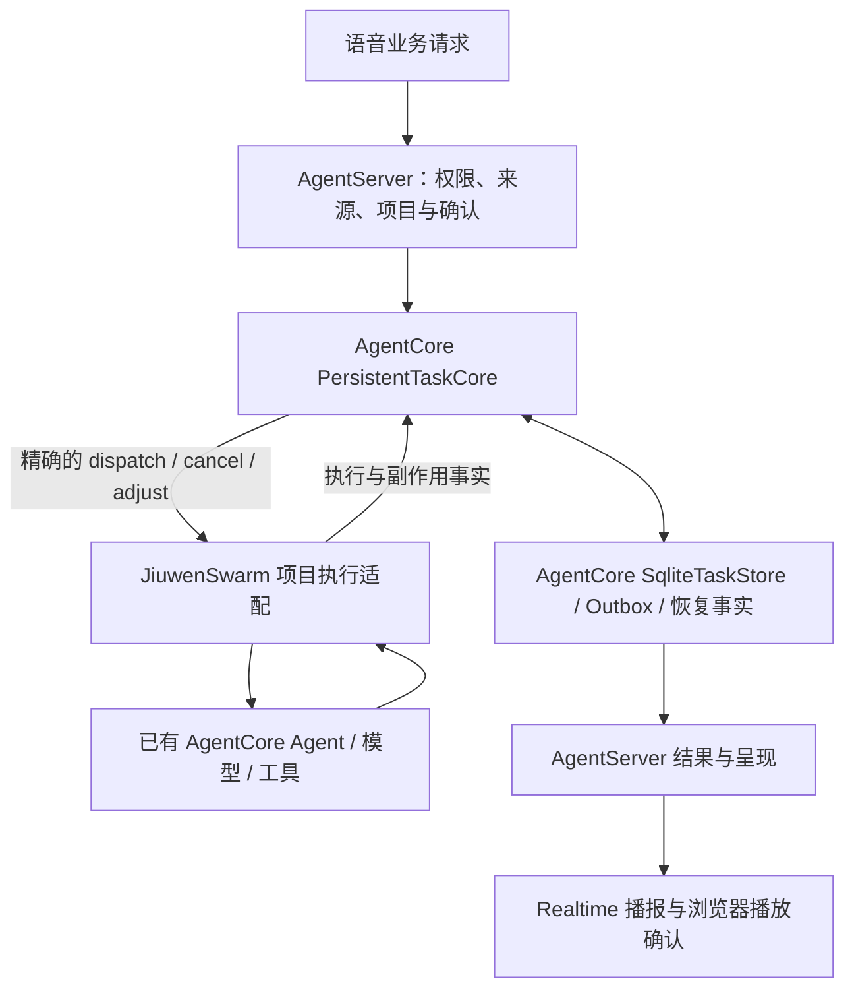

# AgentCore Task 迁移与复用记录

## 范围与结论

按用户要求，先迁移正式 Task，Work 保持原实现，等待本次迁移验收后再处理。
本次迁出可复用的任务内核；项目授权、具体 Agent/项目适配、语音与 UI 仍属于应用层。
不是把所有带 task 名称的应用代码都放进 SDK，也没有强制改写成团队子任务。

- JiuwenSwarm 基线：`f9c8e283e699402679909cbfedeb741360d76f66`。
- AgentCore 兼容基线：`b5f189ba1054a338d8fa3e009b13053776340e44`，与原 pyproject、锁文件和已安装 SDK 一致；已验证属于官方 develop 历史。
- AgentCore 路径：相邻的 `agent-core` 仓库；`origin` 是 `https://github.com/agtai/agent-core.git`，`upstream` 是 `https://github.com/openJiuwen-ai/agent-core.git`。
- 两个仓库都使用 `hx/0912_livevoice`。SDK 分支从兼容提交建立，而非最新 develop 顶端。
- SDK 唯一新增提交：`13493418b275bbdb812303f2c2375bfece0778e3` — `feat(tasks): add persistent application task delivery and recovery`。
- SDK 本地版本：`0.1.17+livevoice.1`；JiuwenSwarm 精确依赖该版本，uv 使用 `../agent-core` editable source。
- 未推送远端，未迁移生产数据库，未重启现有服务，不构成物理语音验收。

克隆保留 GitHub 远端。网络对象下载中断后，用本机 uv Git 缓存中同一提交的内容寻址对象补齐；没有用安装目录伪造 Git 基线。SDK 新分支尚未设置远端 tracking branch。

## 已有 Task 能力分析

| 能力 | 代码和职责 | 复用/适配判断 |
| --- | --- | --- |
| Controller Task | `core/controller/schema/task.py`、`modules/task_manager.py`、`modules/task_scheduler.py`；会话任务、优先级、层级、状态快照、按类型选择执行器并输出流 | 继续作为 Controller 的执行编排。其 Task 与本次带命令、执行尝试和恢复事实的交付记录不是同一个对象，不能仅重命名后覆盖原数据 |
| Team Task | `agent_teams/tools/task_manager.py`、`database/task_dao.py`；团队领取、依赖、成员分工、审核、事件 | 继续复用团队执行能力。不把所有用户工作强制变成多 Agent 团队任务，不另建团队调度器 |
| AsyncToolRuntime | `agent_teams/harness/async_tools.py`、`tools/tool_async.py`；后台工具执行、查询、取消、结果注入 | 保留原运行时；它不直接替代正式任务的持久命令和项目恢复语义。本次也不把 Work 接进来 |
| Agent/工具/Session | 既有 Agent、Runner、模型调用、工具及执行检查点 | 项目适配继续使用原真实 Agent 和工具；本次没有增加第二套模型/工具执行循环 |
| 持久交付缺口 | 接受与实际执行分离、幂等命令、执行尝试、调整截止与后继任务、未知结果、文件副作用恢复 | 将已有 LiveVoice/Host 实现去除应用反向依赖后，作为 SDK 的持久任务补强 |

详细 SDK 调用与模块说明见[持久应用任务说明](../../../agent-core/docs/dev/persistent-application-tasks.md)。
此处“统一”是任务内核只有一个代码所有者并由 Host 调用，不代表 AgentCore 所有历史 Task API 已合成同一数据库/状态机。

## 移到 AgentCore 的内容

统一位置：`openjiuwen/core/application/tasks/`。

| 模块 | 迁移内容 |
| --- | --- |
| `formal_task_models` | Task、Attempt、Result、授权、重试与恢复记录 |
| `persistent_task_core` | 任务命令准入、执行器投递、取消/调整、对账 |
| `task_store` | SQLite 事务、命令幂等、Task/Attempt/Outbox、结果与恢复事实 |
| `task_adjustment_queue` | 执行中调整及截止后后继任务；不改写已完成结果 |
| `task_event_subscription` | 授权范围内的任务事件与权威历史重放 |
| `executor_capabilities`、`file_effect_plan` | 执行器声明、能力与文件影响契约 |
| `durability/` | 检查点、外部影响、身份、前缀校验、恢复与操作授权 |
| `contracts` | 任务使用的共享命令/查询/结果/作用域/进度原语 |
| `source` | 应用提供的来源证据接口与受信 decoder 注册；未知来源必须拒绝 |

SDK 新增生产 Python 共 **17 文件、25,770 物理行**（含空行、注释）。JiuwenSwarm 生产 Python 净减少 **27,235 行**。
行数差异包含 SDK 格式化与 Host 导入/兼容导出调整，不代表删除同等业务能力。
原位置的 14 个实现/初始化文件已移除，不保留任务内核兼容副本。
5 组独立测试迁到 SDK，加上新的应用边界测试共 6 个测试文件。

共享基础类型由 Host 原契约模块重新导出，确保 `ScopeRef`、`CommandEnvelope`、异常等两边是同一个 Python 类。
具体 `IdentityRegistry`、`TurnCommit`、`TurnCommitLedger` 留在 Host；SDK 只依赖身份与已提交输入校验接口。

## 仍由 JiuwenSwarm 负责

- 业务来源/项目权限、用户确认、模型配置解析与后端装配。
- `DirectProjectCodeExecutorAdapter`：绑定 JiuwenSwarm 项目、Agent facade 和本地执行基线；使用 SDK 的任务、文件影响和恢复契约。
- `NativeTaskSource`：校验真实保留的语音证据，通过 SDK 来源接口参与序列化与验证。
- Task 的语音控制、结果播报、播放确认、前端视图及通知投影。
- Work：`server/runtime/work` 的生产文件没有改变，未合并、未隐藏 UI。

当前 SDK 任务准入仍保留原来的 **project_mutation** 要求，包括项目写权限和精确模型配置。
它不是已泛化的任意只读工作入口；这正是本次不提前迁移 Work 的边界。

## 兼容与验证

保留 SQLite schema v6、已有命令/任务/尝试 ID、幂等指纹和序列化字段。
`live-voice.contract.v2`、`native_source` 等既有 wire 字符串保留，避免静默数据迁移；SDK 没有反向导入 JiuwenSwarm。
来源异常沿用同一异常类身份和原默认 reason；present-null 不能降级为无来源。

| 验证组 | 结果 |
| --- | --- |
| SDK 独立应用任务测试 + 原 Controller TaskManager/TaskExecutor | 159 通过，其中新任务边界/迁入测试 102 项 |
| Host Task/store/调整/恢复/项目执行/文件影响 | 655 通过、2 项符号链接环境能力跳过；发现的 1 项异常类型兼容失败已修复并复测 |
| 来源与 SDK 集成复测 | 29 通过，包含上述兼容失败及类型同一性、无旧内核副本 |
| Work/journal/业务路由/AgentModel/后端装配回归 | 254 通过 |
| 公共契约、Native interaction/business 契约 | 113 通过 |
| 补充旧集成/AgentServer 策略检查 | 28 通过；1 条历史 S6 用例调用已退休 P2 submit，仍失败，见下文 |
| SDK Ruff lint / format、两仓库 diff check | 通过 |
| SDK 与 Host wheel 构建、版本元数据、旧内核残留检查 | 通过 |
| 两个 wheel 安装到独立目标目录后的真实 Host/SDK 装配导入 | 通过；不是只在 editable 环境检查 |

不同组存在场景交叉，不把数量相加作为独立业务覆盖证明。SDK测试使用真实临时 SQLite 和确定性执行事实；Host项目测试包含真实本地 Git/文件边界和 SDK 工具注册，不宣称运行了真实云端语音。
源码检出暴露 SDK 基线浏览器脚本字符串的 Python SyntaxWarning，pytest 原配置将其升为异常；测试命令仅对既有 SyntaxWarning 使用显式过滤，未修改无关 SDK 浏览器源码。

独立审查已完成并关闭三类问题：来源接口必需字段、具体语音账本不应迁入 SDK、普通官方版本号可能误满足安装依赖。未发现剩余权限/持久化/Work 回归问题。

额外检查的 `test_s6_joint_slow_conversation_detached_task_and_exact_cancel_domains`
在第一次调用旧入口时收到 `PRODUCT_P2_SUBMIT_RETIRED`。已用 AST 比较确认：
`handle_p2_submit` 的拒绝逻辑与 `f9c8e283` 完全一致；该用例除任务 Store
monkeypatch 导入路径外也与基线一致。这是已退休入口的历史测试漂移，未恢复旧产品入口、
未删除测试或改成成功断言。没有将这组结果称为全绿；旧 S6 迁往当前统一入口的测试维护
不属于本次 Task 内核迁移，记录为历史验收缺口。

主要日志保存在相邻 `livevoice-local-data/task-migration-*.log`，不进入源码提交。

## 本地复现

两个仓库按当前相邻目录布局检出上述兼容基线与 SDK 提交后，在 JiuwenSwarm 使用 `uv sync --locked`。
`uv.lock` 记录相邻 SDK 源，本文记录精确 Git 提交；普通官方 `0.1.17` 不满足本分支的 SDK 依赖。
也可同时安装本次构建的 `openjiuwen-0.1.17+livevoice.1` 与 `workswarm` wheel。
尚未发布或推送这个 SDK 版本，不能假定单独从公开包索引安装 Host 就能取得它。

本次完成的是源码、SDK/Host 集成和本地打包边界。现有运行服务未重启，原生产数据未修改；后续重新部署后的用户功能验收与 Work 统一另行进行。
