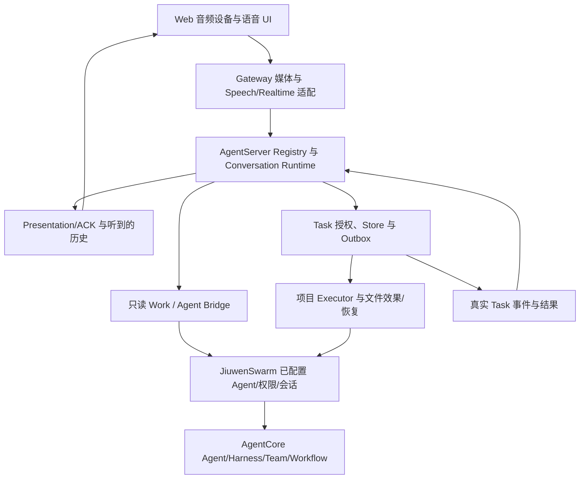

# Live Voice 代码、提交、瘦身与正式合入审计

> 2026-09-11；分析快照，不是新执行包或产品验收结论。
> 当前实现基线 `537c5d2c9fc595fe38b2ccd1f93b8984fce594a3`。
> 本次只新增审计文档，不删除实现、不更换依赖、不合并或发布。

## 1. 结论

Live Voice 已经不只是“语音输入输出”。它把实时音频、会话/播放状态、Agent 执行适配、独立 Work、持久 Task、项目文件交付、授权、通知、诊断和大量历史验证设施放在一个功能名之下。这是体量大的主要原因。

建议吸收 `codex/agentcore-unified-execution` 的共享执行方向，以及 AgentCore 12 个提交中的通用能力；**不建议把四个提交原样合到当前分支就宣布结束，也不建议用 AgentCore Goal/TaskManager 直接替换当前 P3 Task Store。**

最合理的终态：AgentCore 拥有 Agent/Goal/Team/Workflow 的执行原语；JiuwenSwarm 拥有已配置 Agent、授权、项目、任务持久化与交付；Live Voice 只拥有语音交互、媒体、播放事实和这些通用服务的语音适配。

已有证据支持先把约 5,756 行测试支撑/旧类移出生产边界；其中多数仍应保留为测试，并非仓库净删除。Task/Executor 两组 31,417 行可作为通用任务/执行服务重归属的主要对象；这也不是自动减少 31,417 行。当前不能有依据地承诺“删除 50% 而行为完全不变”。

完整代码量、170 个专用文件及共享入口见[逐文件清单](LIVEVOICE_CODE_INVENTORY_20260911.md)。本报告分别处理模块、16 个提交、死代码、重复功能、复用、目录落位和合入顺序。

## 2. 范围、方法与基线

### 2.1 已核实的 Git 事实

| 对象 | 审计事实 |
|---|---|
| 当前分支 | `hx/0812_live_voice_w3`；HEAD `537c5d2c` |
| 当前上游 | `origin/hx/0812_live_voice_w3`，ahead/behind 为 `0/0` |
| 当前工作区 | 开始时无跟踪文件改动；存在用户的 AGENT/HEARTBEAT/IDENTITY/SOUL/USER 等未跟踪文件及上下文目录，未触碰 |
| Host 候选分支 | `codex/agentcore-unified-execution`，HEAD `aff8261859f56194f49ba11c243eb3ba6d8ab6e6` |
| 共同基线 | `80d06b95fa8a2e4c58b551a56cd1bd61dce71ebe` |
| 双方独有提交 | 候选 4 个；当前 15 个。不能 fast-forward 当前分支到候选分支 |
| AgentCore 远端 | [agtai/agent-core 的 hx/0910_livevoice](https://github.com/agtai/agent-core/tree/hx/0910_livevoice)，`git ls-remote` 核实为 `ffeb1abcc5cc0bc72b5c813a3316d4334d39e15f` |
| AgentCore 提交范围 | `94e10cb6102c36fe78a64547957c0def97299273..ffeb1abc`，正好 12 个提交 |
| 候选源码内容 | tree `6f3826983ea8c15eb182ec7761705fd5058c1235`，与 Host 候选的 `agentcore-source.json` 完全相同 |
| 本机当前 Python | `.venv` 的 `openjiuwen` 实际解析到 `.deps/agent-core-w3`，其 HEAD 为 `dec128e5`，不是 `.deps/agent-core` 的完整 12 提交版本 |

因此，当前源码目录中“存在新 AgentCore”不等于当前 Live Voice 正在使用它。两个源码版本沿用 `0.1.16+jiuwenswarm.responses2`；仅检查这个版本字符串不够。

### 2.2 审计方法与证据强度

- 按 README 路由读当前 STATUS、能力模型、稳定架构、测试及文档规则；历史报告只用于候选提交及旧代码的具体来源。
- 用 Git 跟踪清单逐文件统计；解析 Python AST，检查顶层契约、类/函数范围、导入关系、巨型方法与完全相同的函数 AST；前端结合 imports、消费入口、feature flags 和测试引用审查。
- 深入检查主调用链、Task/Store/Executor 权威、Native Work、播放账本、关键 Gateway/前端入口及两组提交的实现/测试差异。
- 无生产静态进口的文件再用全文引用搜索复核。已发现 `sli_window_contract` 和 `telemetry_privacy_contract` 通过测试动态加载，说明“没有 import”不能等同“没有使用”。
- 做 `git merge-tree --write-tree HEAD codex/agentcore-unified-execution` 预演；只生成 Git 对象，不改分支、index 或工作区。
- 新跑 AgentCore 聚焦单元测试 365 个，全部通过；没有运行浏览器、真实 Provider 或用户项目 Agent 任务，也没有改当前环境的安装方式。

这是逐文件静态盘点与关键实现链路审查，**不是所有支持配置的动态可达性证明，也不是每一行都经独立安全审查的承诺**。下文区分确定的引用事实、推荐的重构和仍须验证的删除条件。

本次文档变更为 Tier 0：拥有两份审计文档；验收为路径/数字/Git 范围可复核、完整覆盖用户提出的分析维度、链接和 diff 检查通过。后续实现中的权限、协议与持久化变更应按根 TESTING 单独定级，不能因本报告是文档而降级。

## 3. Live Voice 实际如何工作



Native 路径由 Realtime Provider 做音频交互并提出结构化业务调用；Provider 不拥有 Task 授权，也不决定“结果已被听到”。Gateway 负责 Provider 和音频运输，Registry/Runtime 负责当前 activation、turn、response、generation 和业务调用是否合法。Task 返回的是真实 Store/Executor 状态，音频播放 ACK 再决定结果呈现与历史。

Cascade/P1 则通过 batch/streaming Speech Port、端点与提交边界、真实 Agent、TTS 串联。代码和启动参数仍支持这条路径；默认使用 Native 不意味着 Cascade 已死。

必须保留四种不同寿命：

1. 麦克风/媒体连接；
2. 一次可被打断的语音 response；
3. Agent 的实际执行与只读 Work；
4. 独立于语音会话的持久 Task/Attempt。

同理，“收到命令”“Agent 有输出”“Task 完成”“用户听到通知”不是同一个完成标志。以一个简单 bool 或一个 SDK stream EOF 代替它们，会重新引入错误完成、误取消和重复播报。

## 4. 每个模块的职责、体量与处理意见

统计单位是物理行，含空行和注释；不是严格 SLOC。专用源码共 **170 文件、193,362 行**。原始命名匹配为 164 文件、192,388 行，沿调用关系补入 6 个专用文件、974 行。完整的非空行与逐文件归属见附表。前端/后端共用的概念不重复累计。

| 模块 | 文件 | 行数 | 解释与结论 |
|---|---:|---:|---|
| 音频设备与浏览器 I/O | 5 | 4,656 | 实际设备选择、capture/playout、AudioWorklet、同浏览器所有权。保留；设备层不能交给 AgentCore |
| Speech Recognition / Synthesis | 10 | 15,045 | batch/streaming STT/TTS、Port、Provider/浏览器 fallback、P1 voice route。SR/SS 共用实现，因此合计而不伪造独立数字 |
| Realtime Media | 13 | 21,254 | Gateway 注册/transport/路由、Native RPC、预制音频和浏览器媒体桥。保留数据面；巨大注册器须拆装配逻辑 |
| Conversation / Presentation | 9 | 11,970 | 状态机、generation、通知仲裁、事件订阅、presentation ledger、history。保留语音权威，通用事件消费部分可下沉 |
| Native Provider / Interaction | 8 | 8,229 | Realtime WS、Provider 事件映射、Native 配置/载体、continuation、Interaction Port。Provider 适配与产品语义应分离 |
| Agent Bridge / Work | 12 | 10,976 | Bridge/Harness、只读 Work/journal、正式 facade、checkpoint hook、speculation。共享执行复用优先级最高 |
| Task Core / Store | 5 | 20,583 | 持久化 Core/SQLite、formal models、调整队列及混合旧 TaskCore。通用业务基础设施，不应永远挂在 Live Voice 名下 |
| Executor / Durability | 9 | 10,834 | 项目 Code Agent 适配、文件效果、D0/D2 恢复、checkpoint/effect 声明。先 Host 通用化，再提炼 SDK 原语 |
| Task Semantics / Business Bridge | 21 | 11,841 | NL 模型提案、committed input、目标/确认、Native business tools/router。入口特有的保留，Task 通用控制移出 |
| Product Composition / Authority | 8 | 27,101 | Registry、P3 authenticated composition、认证/项目 scope、P2 激活、P3 文本适配。最大集中点；拆按能力路由和 owner |
| Observability / Diagnostics | 21 | 13,245 | correlation、OTel、latency、音频/浏览器诊断。共用导出设施，不删除语音专有证据与隐私限制 |
| Protocol / Shared Contract | 4 | 7,311 | Python v1/v2 与前端 v2/装配契约。用 schema/codegen 减少两端漂移，保留 runtime 语义验证 |
| Web Product / Task UI | 28 | 22,783 | 集成面板、任务控制/结果、activation journal、旧 Demo 接入。把控制器从 JSX 提取，随后退出旧入口 |
| Configuration / Deployment | 5 | 2,528 | 配置声明、预算/限制常量、部署预检/观测；启动脚本另计。归应用层 |
| Legacy / Test Support | 12 | 5,006 | 无当前生产消费的旧原型、fake、验证支撑。迁移测试后从生产位置退出 |

### 4.1 最大维护热点

| 文件/方法 | 行数 | 判断 |
|---|---:|---|
| `product_composition_registry.py` | 16,162 | 同时处理激活、Native、语义、Task、进度、ACK、关闭；应按这些边界拆 handler，保留唯一 registry/owner |
| `task_store.py` | 15,224 | CRUD、迁移、schema 验证、lineage、结果、outbox、消费者游标聚集；按 transaction repository/codec/migration 拆分 |
| `LiveVoiceIntegratedRoutePanel.tsx` | 9,943 | 产品视图承载大量生命周期/恢复逻辑；提取 controller/hooks 与 Task panel，不复制状态 |
| `dedicated_media_registration.py` | 8,598 | 注册、转代、Provider/runtime 接合、音频回执等聚集；按 session owner 与 transport/provider adapter 拆 |
| `project_code_executor.py` | 7,092 | 文件快照、执行、效果/恢复、调整交付混合；提取 Host 项目效果与通用 attempt runner |
| `p3_authenticated_composition.py` | 5,417 | 认证、项目绑定、控制映射混合；可复用 Host session/agent resolution |
| `agent_conversation_runtime.py` | 5,103 | 桥接、对话、Native delegate/work 装配较重；候选分支已移除其中重复执行部分 |
| `task_store._verify_durable_lineage` | 1,221 | 一个方法本身就是子系统；应分语义验证器，但检查项不能因长而直接删掉 |
| `task_store._outbox_from_row` | 788 | 多代 carrier/完整性验证聚集；可把旧格式放独立迁移层 |

拆文件本身不等于瘦身。只有共同实现替代两套实现、删除已退出的产品路径、减少兼容格式或代码生成替代手写重复，才减少长期维护量。

## 5. Host 四个 commit：是否应该加到当前分支

候选相对共同基线净变更：162 文件，+29,769 / -2,536。里面包括约 9,911 行新增 SDK patch 文本、大量测试和证据；不能把全部新增行当运行时代码。

按生产目录分类，前三个提交累计 **+6,678 / -1,904，净增 4,774 行**。第三个提交确实净减 542 行；整个四提交方案是能力统一与扩展，不是仓库总量缩小。

| commit | 实际作用 | 建议 | 集成条件 |
|---|---|---|---|
| `66833d5c` build: use pinned AgentCore source and verify direct reuse | 新增源码安装/核验，调整依赖与 debug launcher；删除旧构建脚本 | 吸收源码身份/依赖可复现原则；不原样强制所有发布用户使用 editable checkout | 当前包安装决定需要明确迁移；正式包/容器应使用不可变 commit 或独立发布版本，不能依赖开发者本地 `.deps` |
| `20915742` feat(runtime): share configured AgentCore capability execution | SessionExecution、execution context、Goal/Team/Workflow/Agent input 公共执行；Web 和 Native 都接入；带 11 个后续 SDK patch | 吸收核心共享服务；拆解审查后集成，不能把它视作纯重构 | 先锁定 SDK；核对文字入口、history/工具权限、每种能力的授权和生命周期。新开放能力与去重复拆开，明确允许的产品范围 |
| `1108e8ec` refactor(live-voice): reuse shared execution and retire duplicate runtime | Native Work 改用共享 service，去掉独立 `_executors` 和多余 Conversation Runtime；统一 FormalAgentOutput、取消等待 | **最直接应采用的 Live Voice 去重改动** | 依赖前两个提交及相应 SDK；保留 Work journal/recovery truth、播放 ledger 和当前结果/调整修复，不可单独 cherry-pick 后忽略依赖 |
| `aff82618` build: isolate unified AgentCore workspace and runtime configuration | 指定 ConfigurationDirectory 时，保存的选择也归该目录；加候选分支启动入口/文档 | 吸收配置隔离修复；分支白名单条目与临时 runbook 不作为正式发布设计 | 解决启动脚本冲突；保留当前 Mini/VAD300 和本机隔离配置语义，正式入口不要靠分支名硬编码 |

### 5.1 已实际预演的冲突

`git merge-tree` 返回 1，只有以下四个文本冲突：

- `jiuwenswarm/server/live_voice/native_business_tools.py`
- `live-voice/STATUS.md`
- `live-voice/decisions/DECISIONS.md`
- `scripts/live_voice/start_hands_free_demo.ps1`

其他自动合并文件包括 `native_business_router.py`、`product_composition_registry.py`、前端 package.json 与部分测试。**自动合并成功只表示文本可拼接，不证明结果归属/声音/权限语义正确。**

当前独有提交包含 `a4029b7c` 文件字节/index 保留，`9e9e5ebc` Native context/media/prepared output，`c4755aa8` 指令统一，`1750387a` Work 结果与呈现归属，`57d3b29f` 调整截止/续接/结果真相，以及 `537c5d2c` deferred context 启动恢复。不能用候选分支同名文件覆盖当前文件。

具体冲突处理应当：保留 D-125 当前业务反馈与完整约束，再增加新工具描述；以当前 STATUS 表述为当前事实，候选旧验收归档；解决双方新增 decision 的编号/引用冲突；启动脚本同时保留当前默认值和显式配置目录隔离。

### 5.2 仍需防止的设计回退

共享 `SessionExecutionService` 是有界、进程内的 producer/observer 管理，不是 durable Task Store。它不能替代 Work/Task 的入账与恢复。

`execution_context.py` 保留 Host 权限与模型绑定，在真实 model/tool effect 前复核；SDK source metadata 只是来源标签，不能被用户请求伪造后变成授权。这个设计应保留。

候选共享 runtime 仍直接 import `agent_adapter.formal_live_voice`，`session_execution.py` 仍有 `start_formal/process_formal_live_voice_stream` 分支。说明它是可用的过渡抽象，尚非完全中立的执行 API；正式架构应逐步把通用 WorkRequest/Output 放共享模块，把语音 presentation contract 留在 adapter。

## 6. AgentCore 十二个 commit：逐项判断

这 12 个提交合计 67 文件，+6,913 / -243；它们已经与 Host 候选 manifest 的源码 tree 对上。**应作为 AgentCore 依赖吸收，不应再把同一实现复制进 Live Voice。** SDK 先集成，Host 消费其明确公开能力。

| commit | 代码能力与价值 | 当前 Live Voice / 正式合入判断 |
|---|---|---|
| `dec128e5` Responses context | MessageChunk metadata 和 ReactAgent 保留 Responses continuation 信息 | 当前安装源码已经包含；保留/上游化，不能重复打补丁。它是基础 Provider 兼容修复 |
| `1f03f1bb` exact Goal control / read-only observation | Goal ID + control_revision 精确控制，`peek()` 只读不修复损坏状态，effect 前授权 | 应纳入 SDK；共享 Goal 入口消费。GoalStore 扩展了 peek 协议，外部自定义 store 要兼容或明确版本变化 |
| `a43444ff` task settlement | 通用等待实际任务结束，取消后仍保留执行所有权；async tools/SwarmFlow 共同使用 | 应纳入，且直接减少 NativeWork 重复取消结算；timeout 仍应表现 unknown，不能释放尚未结束的实体槽位 |
| `fc12e445` Goal/output atomic admission | Goal set/resume 与 output lease 在同一受控流程准备，拒绝时释放新 reader 而不丢旧 work | 应纳入；与下一提交共同保护输出所有权。不能先执行 Goal 再临时抢输出 |
| `a3a1aee0` actual output owner | on_output_ready 回调在实际 lease admission 点通知 Host；finishing reader 不假装可用 | 应纳入；Host 正确绑定老/new reader、Goal output 与 request。单独有 Goal CAS 不足以替代它 |
| `f5039e60` exact SwarmFlow human input | pending correlation/目标绑定跨 TeamHarness、background controller、Runner/worker entry | 应纳入 SDK；只有开放 workflow.reply 的产品范围才接线。不是 P3 Task provide_input 已实现的证明 |
| `e8a1ea88` immutable work context | Goal attempt、RoundWorkItem、Session stream source 绑定实际 work context/来源 | 应纳入；这是不同请求模型、工具权限、历史归属不串线的基础，不能只在 Host stream 外层补标签 |
| `1aac45ec` model call guard | 在 Model input callbacks/transforms 后、原 client inference 前复核真实参数；限定 model/client/context | 应纳入通用 SDK；保留 invoke/stream、嵌套、异常、取消、client 替换测试。Provider 内部重试不在该 guard 的承诺内 |
| `e3a1f875` proven workflow checkpoint | resume_guard 和 checkpointer proof 在恢复副作用前验证；不支持的 provider 明确失败 | 应纳入作为 opt-in 能力；不能据此宣称所有 workflow、嵌套节点、旧 checkpoint 或流式恢复都已支持 |
| `e833aa42` exact Agent input | React/DeepAgent pending token、source work 和 input ID 绑定，旧/错问题不恢复另一任务 | 应纳入；特别适合文字/语音共用一个 Agent；不能将模型猜测的回答或工具许可当用户回答 |
| `a8822470` original supervisor admission | Team input 在原 supervisor 真正应用输入时再次 guard，防止等待期间 owner 漂移 | 应纳入；当前严格路径限定 resident/local leader 等条件，不能自动推广到全部远程 Team 模式 |
| `ffeb1abc` NativeHarness provenance compatibility | 只对 ActiveInteractionRound 读取 `.work`；NativeHarness 使用实际 task metadata | 应纳入；修正 DeepAgent 假设误用于 NativeHarness 的兼容问题，属于前述来源绑定的必要收尾 |

### 6.1 推荐 SDK 合入批次

保留原 12 提交的依赖顺序做集成验证。若准备上游 PR，可按可审查的能力批次组织：Responses；settlement；Goal/output/work provenance；model effect guard；workflow strict resume；Agent/Team exact input；NativeHarness 兼容。分组不代表能任意丢弃中间依赖；例如 Goal/output 和 work context 要一起验证。

应补的发布准备包括新公开参数/回调文档、自定义 GoalStore/Checkpointer 兼容说明、取消与同步/异步 callback 约束、可用能力声明，以及与 Host 分离的测试。不要把 JiuwenSwarm 项目目录、浏览器 ID、播放 ACK、特定 prompt 或数据库路径塞进 SDK。

## 7. 哪些是死代码、旧内容、可删除或移出

### 7.1 生产边界未发现消费的完整文件

| 文件 | 行数 | 已查到的消费者 | 推荐动作 |
|---|---:|---|---|
| `alpha_benchmark.py` | 633 | 对应 unit tests | 移到 tests/support 或显式 benchmark 工具；如已被现行 latency 工具覆盖，再删旧 runner |
| `alpha_privacy_conformance.py` | 1,025 | unit tests、`s7_real_probe_support.py` | 移到 validation/support；保留 canary 检查，不作为生产模块 |
| `executor_port.py` | 117 | fake_verticals 与旧 TaskCore tests | 随旧 deterministic executor fixture 退出生产位置 |
| `fake_verticals.py` | 404 | fake integration test | 移 tests/support；不应发布为真实执行能力 |
| `observability_fault_harness.py` | 391 | 对应 unit tests | 移测试故障注入目录 |
| `product_p2_readiness.py` | 262 | readiness tests，retirement manifest 路径断言 | 验证工具化；更新 manifest 和引用，不能只删文件 |
| `realtime_media.py` | 822 | 对应 unit tests；实际 Gateway 不消费它 | 旧 port/registration prototype；迁移仍独有的 bounded/ACK/epoch 断言到实际 media 实现后删除或 fixture 化 |
| `sli_window_contract.py` | 386 | `test_p3_8a_sli_privacy_contracts.py` 动态加载 | 未装配的 SLI 资产；接入当前指标或移离生产，不能将它算已运行监控 |
| `telemetry_privacy_contract.py` | 221 | 同一测试动态加载 | 未装配的声明资产；与实际 observability privacy 规则比较后保留唯一来源 |
| `formal/fakeP1Vertical.ts` | 104 | 前端 fake test，无 src 消费 | 移前端 tests/support |
| `formal/conversationRuntimeReplica.ts` | 258 | 前端测试，无 src 消费 | 移测试支撑；不要与生产 Runtime 维护第二套权威 |
| `formal/webLifecycleObservationRecorder.ts` | 383 | 前端观测测试，无 src 消费 | 移测试 recorder 或按需接入诊断工具 |
| **合计** | **5,006** | | 生产包移出量，不是直接销毁量 |

这里的“无生产消费”限定仓库静态引用、配置与现有入口；不把未声明的外部 Python import 当成已排除的事实。文件内纯验证不等于没价值，有些应继续存在于测试/验证包。

### 7.2 混合文件中的旧实现

- `task_core.py:215` 的 `TaskCore` 是 500 行旧内存执行器。生产装配实例化的是 `PersistentTaskCore`；生产仍 import 这个文件的 `TaskState/AttemptState/TaskCommand/TaskSpec`。**可以退旧 class，但不能整文件删。** 先把仍使用的模型投影迁入正式契约，迁移旧类的幂等/错 scope/终态测试。
- `interaction_engine.py:353` 的 `ScriptedCascadeInteractionEngine` 是 250 行 conformance fake，源代码 docstring 明确说明其性质；现有产品 imports 使用同文件公共 Port/Action 等。只将 fake 和专属辅助项移测试，不能删除 InteractionEnginePort 或误称整个 Cascade 已退役。

完整文件和这两个 class 合计 **5,756 行**，约占已统计专用源码 **2.98%**。未把可能连带移出的辅助函数重复计入，因此只是明确范围，不是重构后的精确净减量。

### 7.3 活着的旧 Demo：可以退役，但不是死代码

`ChatPanel/index.tsx:1242` 仍调用 `useLiveVoiceDemo`，正式 flags 不满足时仍选择旧 `LiveVoiceDemoBar`；`FEATURE_LIVE_VOICE_DEMO` 为 true。

旧 hook/core/message gate/turn lifecycle/streaming speech 五文件合计 **2,014 行**，主要在旧路径中互相消费。正式 `integratedP1Route.ts` 还从 `liveVoiceCore` 取类型；先迁移这个类型，再退役旧入口。此量不能叠加为已经确认可直接删的无行为变化节省。

`LiveVoiceDemoBar.tsx` 同时导出正式产品 wrapper，且正式 wrapper 复用它；不能因文件名带 Demo 就删掉整个 UI。可重命名保留公用控制视图，移除旧 props/hook/wiring。

### 7.4 不能因“看起来重复/过时”而删

| 对象 | 为什么仍须保留 |
|---|---|
| `critical_token_safety` | Registry 实际实例化并 evaluate/dispatch/release；即使想改为纯模型方案，也属于产品政策变更 |
| P1/Cascade batch/streaming Speech | 启动参数、配置和正式 route 仍支持；默认 Native 不是退出兼容的决定 |
| `task_adjustment_queue` | 当前修复解决截止后变更、successor 与超长 compiled context 启动阻塞，不能被旧分支覆盖 |
| TaskStore v1→v6 migration/验证 | 私有数据库可能仍有旧数据；只有迁移支持范围收缩后才可退出 runtime，不得通过删库或“先当无旧数据”来减代码 |
| D1/D2 值/事实代码 | D1 checkpoint 名称不能证明产品支持 D1，也不能证明没有调用；当前 executor/store 在用这些值保护 D2 lineage |
| Work journal 和 Task Store | 记录对象、寿命、工具权限与恢复承诺不同；统一存储接口可行，直接合表/删一套不可行 |
| presentation ledger / response fences | SDK 生成/执行不证明实际播放；删除会破坏 heard history、重播和打断边界 |
| rejection、stale、scope、generation、byte bounds 校验 | 位于不同信任边界的重复检查有意防止晚到/篡改；只可共享纯解析，不可去掉最后 effect 前复核 |

## 8. 重复功能与最大限度瘦身

### 8.1 真正的重复与合并位置

| 重复点 | 证据 | 处理 |
|---|---|---|
| Native Work 为分析再创建 ConversationRuntime/Harness executor | 当前 `NativeBusinessRouter._executor` 与候选 `1108e8ec` 的移除差异 | 用 SessionExecutionService 的同一已配置 Agent 执行；Work 保留 admission/result journal |
| Agent 输出校验、no-tool markup、final/error 结算 | RoundHarness 与 Native 执行路径；候选提取 FormalAgentOutput | 一个中立输出 parser/validator，入口传策略。不要为语音再维护整套 Agent adapter |
| cancellation/timeout/settlement wait | NativeWork 与 SDK async tools/controller | 复用 `wait_for_task_settlement`，业务 owner 仍记录 unknown 与保留实际槽位 |
| 多处 scope/hash/schema helper | AST 完全重复：`_synthesis_authorization_binding` 42 行、两个 `_canonical_bytes` 8 行、两个 `_stable_consumer_scope_matches` 8 行 | 这些三对最多消除 58 行重复主体，收益有限；先确认错误语义相同，再放中立契约模块 |
| 错误类的 9 行 `__init__` 完全相同 | Native carrier/contract | 不值得为了 9 行增加复杂继承；不同领域错误可保留 |
| Python/TS 手写契约与 operation fields | Python v2 4002 行，TS v2 2785 行，多个 tool/route/schema 映射 | 一个版本化 schema 生成结构、必填/枚举和普通解析；授权/状态/跨字段逻辑继续手写测试 |
| Registry/Panel 多阶段 handler 与恢复 glue | 16k Registry、近10k Panel、多个 journal/activation owner | 统一 lifecycle 操作结果与 controller，逐入口迁移，避免同时留旧新两套可执行路径 |

AST 完全相同函数的数量很少，并不支持“全部都是复制粘贴”的判断。更大的重复是**多个层各自启动/追踪相同业务 work，以及同一协议的多份手工维护**。

### 8.2 三种不同的瘦身数字

1. **生产位置退出**：5,756 行已定位范围；大多移测试，仓库净删除很小。此批最好先做，行为风险较低。
2. **能力归属压缩**：Task/Executor 31,417 行从 live_voice 重归属 Host 通用服务；再叠加共享 Agent 执行、通用授权、事件订阅等逐步迁移。Live Voice 目录会明显变小，但跨仓库总实现未必变小。
3. **真正净减**：退出旧 Demo、删被新断言覆盖的旧 runner、共享 validator/协议生成、依赖正式 AgentCore 后删本地 patch 副本和源码构建胶水。必须以迁移后的 diff 实测，不能预报一个无依据百分比。

候选还携带约 9,911 行新增 SDK patch。它们与 AgentCore 分支内容相同；正式依赖发布后应删除这些补丁副本，保留 lock/版本/兼容契约测试。没有 SDK 发布/固定版本前，不能先删唯一可复现构建输入。

**激进 Native-only 方案**还可退出 P1/Cascade fallback 与旧 Demo，但会改变支持矩阵、离线/Provider 故障体验及已接受能力。15,045 行 Speech 组不是可全删量：其中部分 P1 audio route 和共用机制仍被 Native 使用。先做专用构建依赖闭包，再报可删量。

### 8.3 不应采用的“瘦身”方式

删大量测试让目录好看；把源码挪进 AgentCore 后宣称总体减少；把 schema 版本全部删除并要求清空用户数据库；用 Goal 覆盖 durable Task；把 ack 当完成；把安全校验替成 prompt；单纯把大文件拆成几十个仍然互相读私有状态的小文件。以上均不解决真实维护成本。

## 9. JiuwenSwarm 与 AgentCore：应该复用什么

JiuwenSwarm 的 `AgentManager`、`agent_adapter/interface*.py`、SessionManager/History、project store/git、权限 rails、Swarm assembly/TeamManager 是产品宿主。它们已经在选择/装配模型、工具、权限、工作区和 Agent；Live Voice 应接入这些实际 owner。

AgentCore 的 `core.single_agent`、`harness.deep_agent`、Goal/TaskLoop、Runner、Team runtime、Workflow/checkpointer、Model/tools/sys_operation 是执行框架。SDK 提供工作如何执行与恢复的通用机制；它不自动决定用户能访问哪个 JiuwenSwarm 项目，更不知道音频是否被听到。

| Live Voice 部分 | 当前可复用程度 | 正确归属/下一步 |
|---|---|---|
| Agent 配置、模型、工具、权限和 warm instance 查找 | Host 已有；候选新增 exact session resolution | 直接复用 Host，删除 Native 私有 Agent 构造；必须维持 read-only/model binding |
| Agent 真实执行流与 Goal output | 候选共享 service + SDK 12 提交后可用 | 经薄 adapter 复用；通用 service 不持有音频 generation 或 durable Task 真相 |
| 取消等待/执行是否退出 | SDK settlement 已补齐 | 直接复用 primitive，保留上层业务状态转换 |
| Goal 操作 | SDK exact controls 已补齐 | 适配共享 Goal，不在 Live Voice 自建 GoalManager |
| Team/SwarmFlow/Workflow/Agent 人工输入 | SDK 与候选 Host 已有精确目标/guard | 按能力开启；Host 授权后传 exact pending ID，SDK 原 owner 最后复核 |
| 模型调用前重查与 source provenance | SDK 已补齐 guard/context/tagging | 不在 Live Voice monkey-patch provider client；Host 提供实际权限策略 |
| Durable Task、outbox、replay、revision、结果和未读游标 | SDK Goal/TaskManager 不等价；Host AutoHarness 也不等价 | 把现有实现通用化为 Host TaskService；未来各入口共同调用 |
| 文件工作区快照与应用结果 | Host ProjectGitService 与 SDK Workspace/sys_operation 可部分复用 | 共享路径/Git进程/文件操作基础；保留 admitted bytes、index、source preservation、manifest、effect receipt 等缺口 |
| D2 checkpoint/effect reconciliation | SDK workflow checkpoint 有局部能力，非当前文件效果模型的替代 | 先抽象 Host Executor/EffectJournal；若要 SDK 通用能力，再补公开接口与独立故障矩阵 |
| 历史 | Host SessionHistory 可复用存储 | Live Voice 仍决定哪些用户 final/播放片段进入 heard history，不能直接记录所有 generated chunks |
| Observability | SDK/Host 已有 trace 与日志设施 | 适配现有 exporter/context；语音 timestamps、PCM/ACK 等领域 facts 保留 |
| Browser audio、Realtime PCM、barge-in、presentation ACK | 没有等价 AgentCore 所有者 | 保留 Live Voice；浏览器与音频数据面不能下沉 Python 执行 SDK |

### 9.1 特别不能混同的三个“Task”

- AgentCore task loop / background task 是一次实际执行的生命周期。
- Goal 是跨 attempt 的目标状态与调度。
- Live Voice P3 Task 是应用级可寻址业务对象，含命令去重、权限、revision、outbox、重启恢复、结果和文件效果。

现有 AutoHarness task store/scheduler 主要服务定时任务和自演进流程，还含从日志提炼状态的语义；直接套在当前需要 canonical event/outbox 的 P3 上，会降低真实性。应逐步让两类入口复用中立 TaskService，而不是要求语音回退到旧 scheduler。

## 10. 为正式合入准备的代码与文档落位

### 10.1 建议目录边界（目标方案，不是本次已经移动）

```text
agent-core/
  openjiuwen/core/common/             settlement 等通用执行原语
  openjiuwen/core/foundation/llm/     ModelCallGuard
  openjiuwen/core/session/           source context、exact input、checkpoint proof
  openjiuwen/core/single_agent/      精确 Agent input/interrupt
  openjiuwen/harness/goal/           Goal CAS 与 output admission
  openjiuwen/harness/task_loop/      work provenance/原始执行 owner
  openjiuwen/agent_teams/            Team/SwarmFlow exact input
  tests/unit_tests/...               SDK 独立契约测试

jiuwenswarm/
  server/runtime/execution/          共享 SessionExecution/上下文/能力适配
  server/runtime/tasks/              TaskService、Store、outbox、结果、游标、调整
  server/runtime/executors/          ProjectCodeExecutor、file effects、恢复适配
  server/runtime/session/            继续复用项目、配置、SessionHistory
  server/live_voice/                 会话/播放/语音语义与薄业务适配
  gateway/live_voice/                媒体与 Provider session/transport
  common/schema/                    中立 work/task 合同 + 语音合同
  channels/web/frontend/src/features/live-voice/
                                     音频、controller、语音组件
  channels/web/frontend/src/features/tasks/
                                     可被文字/语音复用的 Task UI
  tests/support/live_voice/           fakes/recorders/fault injection
  scripts/live_voice/                必要诊断/开发工具
  docs/...                          正式用户文档和架构文档
```

先在 Host 提炼服务边界，再选择能在无 JiuwenSwarm 环境运行的原语进入 SDK。不要将依赖 Host scope、私有 DB、project grants 的完整 Task Store 放进 AgentCore。首轮正式合入也可保留现有目录名，只移动明确共用的执行能力，避免“目录大迁移 + 业务改造”同时发生。

核心依赖方向应为 `Web/Gateway → Host voice adapters → Host execution/tasks → AgentCore`；SDK 不反向 import JiuwenSwarm，通用 Task/Execution service 不反向依赖 Web/音频实现。中立协议应独立，不能通用 task 继续 import 一大份 voice-only contract 形成隐性耦合。

### 10.2 live-voice 文件夹具体怎么放

`live-voice/` 当前 242 个已跟踪文本/JSON 文件、49,837 行，其中只有文档和证据，不包含上述 Python/TS 运行实现。不能把整个目录当 SDK feature 拷入 AgentCore。

| 当前内容 | 文件/行数 | 正式去向 |
|---|---:|---|
| 根目录 | 49 / 11,030 | README/当前结构指引提炼入 Host 开发文档；大量 Dxxx/阶段 review 留 Git 历史或精选归档。STATUS 是开发状态，不是安装文档 |
| architecture | 3 / 1,358 | 稳定音频/Host 架构放 Host architecture；SDK 通用 contracts 另外提炼入 AgentCore API docs，不复制整份产品方案 |
| decisions | 1 / 2,267 | 生效的决定拆成 Host ADR；SDK API 决定进入 SDK 对应 ADR；失效/历史选择保留来源 |
| demo | 3 / 516 | 保留一份产品快速体验/示例，正式使用流程与内部验收脚本分开 |
| evidence | 83 / 11,966 | 精选兼容/验收证据作为版本关联资料；旧逐次 run 不进入用户文档；失败证据须保留可追溯来源 |
| reviews | 85 / 17,384 | 仅仍拥有回归/待办边界的审查保留活跃链接，已关闭批次归历史；本次报告也是分析资料，不成为新权威矩阵 |
| roadmap | 13 / 3,598 | 过期 S/W 阶段包归历史；当前需求用项目 issue/当前计划管理，不带旧并行任务到主分支 |
| runbooks | 2 / 937 | 参数化安装/运行/诊断放 Host 运维文档；拆本机路径、分支白名单和实验配置 |
| validation | 3 / 781 | 合同/验收放 Host tests 或 release acceptance docs；SDK 仅接收对应独立能力验收 |

最大文档减负来自历史 review/evidence/roadmap 和根目录阶段记录，但应先按当前入链/未关闭问题分类；本次没有给出未经逐链接迁移验证的“可全部删除”清单。Git 保存历史，删除工作树文档不等于删除失败事实。涉及移动/删除时更新 README/REFERENCE_INDEX/当前 authority links，避免留下断链或将旧测试成功当现版本成功。

### 10.3 测试和工具归属

`tests/unit_tests/live_voice` 按现行能力拆分，Task/Executor 通用化时测试一起到 runtime/tasks/executors；SDK tests 必须可以不 import JiuwenSwarm 运行。前端 fakes 留 frontend/tests/support；真实用户旅程留端到端测试。

`s7_alpha_verification.py` 2386 行、`s8_readiness.py` 3665 行、`p3_wave2_real_evidence_producer.py` 1978 行，以及 W2 旧 rehearsal 是优先整理对象。名字旧不等于断言无效；先枚举独有 scenario、迁到正式 owner、证明针对目标缺陷会失败，再删除旧 orchestration。不要恢复已退休的 signed W2 evidence Gate。

## 11. 推荐集成与瘦身执行顺序

1. **冻结双仓库基线与依赖**：当前 Host + SDK 12 提交的源码 tree；保持用户环境原状。明确采用源码试验安装还是正式包；正式发布赋可区分版本。
2. **SDK 通用能力闭合**：按第 6 节批次审查/测试，形成可固定消费的 SDK 版本；这一步不把声学产品内容搬到 SDK。
3. **Host 共享 execution 先接文字路径与适配层**：验证原有文字聊天/Goal/权限/历史没有变化。再接 Native Work/Agent delegate，删除重复 producer。
4. **在当前分支前进方向集成**：处理四个文本冲突，保留当前 15 个独有提交的行为。逐一检查 1750387a、57d3b29f、537c5d2c 对共享执行的语义影响。
5. **独立做退出生产包批次**：移 12 个测试支撑/原型和 2 个旧 class；迁移 unique oracles、更新 retirement manifest。不能把这批和 TaskStore schema 变更揉在一起。
6. **Host Task/Executor 归并**：先提供中立 API 和 facade，再搬实现；保持同一 DB authority/事务，避免短期双写或两个 executor 同时可达。
7. **清理旧 UI/runner/格式/补丁副本**：逐项确定支持范围，确认类型与 flags 消费者，再实际计算净删除。
8. **准备正式合入**：包安装、配置、迁移、文档、默认关闭/开启矩阵、目标分支差异和跨入口回归。依据当前 D-084，进 develop 的 feature-complete 条件尚未自动满足；不能将本审计当授权发布或已完成产品验收。

关键验证应覆盖：文字和语音共用同一配置 Agent；model/tool 后置 guard；旧 input/跨 scope/旧 revision 零副作用；取消后真实执行槽位；同一 Goal 的 output lease；Work/Task 结果不混；调整截止前后与大上下文启动恢复；源文件字节/index 保留；打断不取消后台 Task；未播结果重试和播放 ACK；feature-off 原文字路径；旧 DB 迁移/部分失败/重启 unknown。

只重跑发生变化的边界及必要集成检查，不为简单文件搬迁要求全套真实设备验收；但最终声学候选仍需要受控用户旅程，离线单测不能替代它。

## 12. 本次验证结果与限制

### 新执行

- `git status --short --branch`、`git rev-parse HEAD`、`git rev-list --left-right --count 'HEAD...@{upstream}'`：基线与同步状态如第 2 节。
- `git ls-remote https://github.com/agtai/agent-core.git refs/heads/hx/0910_livevoice`：远端匹配本地 `ffeb1abc`；SDK tree 匹配 Host manifest。
- `git merge-tree --write-tree HEAD codex/agentcore-unified-execution`：预演成功暴露四处冲突，未执行集成。
- AgentCore：task settlement / model call guard / Native task-loop compatibility 三文件 **53 passed**。
- AgentCore：Goal manager/schema/store/output admission、async tool settlement、exact SwarmFlow human reply、Session source metadata、strict workflow resume、exact React/DeepAgent input、guarded Team input 十一文件 **312 passed**。
- 合计 **365 passed**，有 Pydantic/DefaultResponse 弃用警告。测试使用当前 `.venv` 解释器，工作目录 `.deps/agent-core`，进程内 `sys.path.insert(0, '.')`，未修改安装；不是当前 Host 与候选 SDK 已集成的证明。
- 第二批首次命令错用了 React test 路径，报文件不存在、未运行测试；随后按实际 Git 文件位置修正并通过。路径错误未被算为产品失败或成功样本。
- 文档核验：170 个专用文件路径唯一、逐个物理行数与文件一致；两份报告共 199 个本地链接全部存在；`docs/zh/live-voice` 无跟踪重复文档；diff 空白检查通过。

可复跑方式：在 `.deps/agent-core` 使用宿主 `.venv/Scripts/python.exe -c`，先 `sys.path.insert(0, '.')`，再 `pytest.main(['-q', '-o', 'addopts=', ...])`。第一批文件：

```text
tests/unit_tests/core/common/test_task_settlement.py
tests/unit_tests/core/foundation/llm/test_model_call_guard.py
tests/unit_tests/harness/test_task_loop_native_compat.py
```

第二批文件：

```text
tests/unit_tests/harness/goal/test_goal_manager.py
tests/unit_tests/harness/goal/test_goal_schema.py
tests/unit_tests/harness/goal/test_goal_store.py
tests/unit_tests/harness/goal/test_goal_output_admission.py
tests/unit_tests/agent_teams/harness/test_async_tools_settlement.py
tests/unit_tests/agent_teams/workflow/test_exact_swarmflow_human_reply.py
tests/unit_tests/core/session/test_source_metadata.py
tests/unit_tests/core/workflow/test_workflow_strict_resume.py
tests/unit_tests/agent/react_agent/interrupt/test_exact_agent_input.py
tests/unit_tests/harness/test_deep_agent_exact_input.py
tests/unit_tests/agent_teams/harness/test_guarded_team_input.py
```

### 历史证据不能冒充本次通过

候选自己的 `AGENTCORE_FINAL_VERIFICATION_20260909.md` 记录 SDK broad run 5492 passed、16 failed、38 skipped、3 xfailed、4 collection errors；Host broad run 11038 passed、117 call failures、14 setup errors、30 skipped，另有 3 collection errors；前端 54 个脚本通过、2 个失败。它包含基线比较和修复归类，也明确不能视作全绿。

这些是候选保留的历史记录，本次未重跑/独立复现所有归类。365 个新通过的 SDK 单测提高了对所查通用能力的信心，但不关闭旧 Host/前端失败，不证明当前分支合并后可部署，更不证明新版本持续音频稳定。

最终建议是：**有选择地集成通用执行与 SDK 能力；先移出测试/旧原型，再将通用 Task/Executor 从 Live Voice 归并到 Host；最后退出不再支持的历史路径并做正式发布准备。** 每一步都有明确收益，且不会通过偷删能力来制造“瘦身”。
