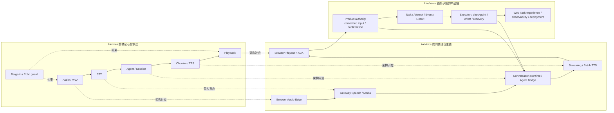
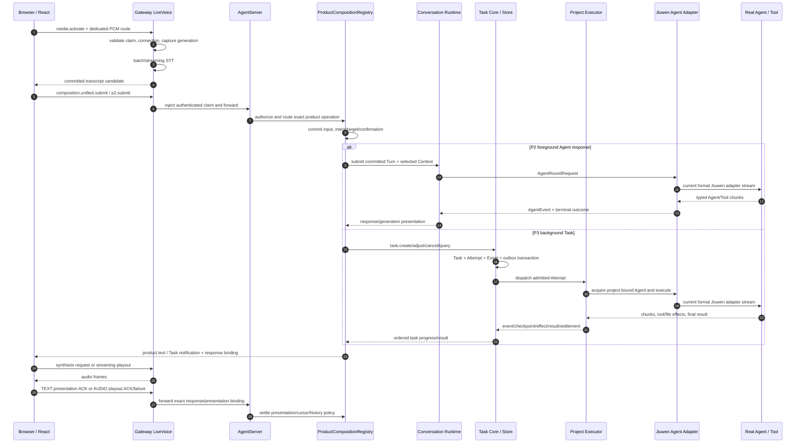
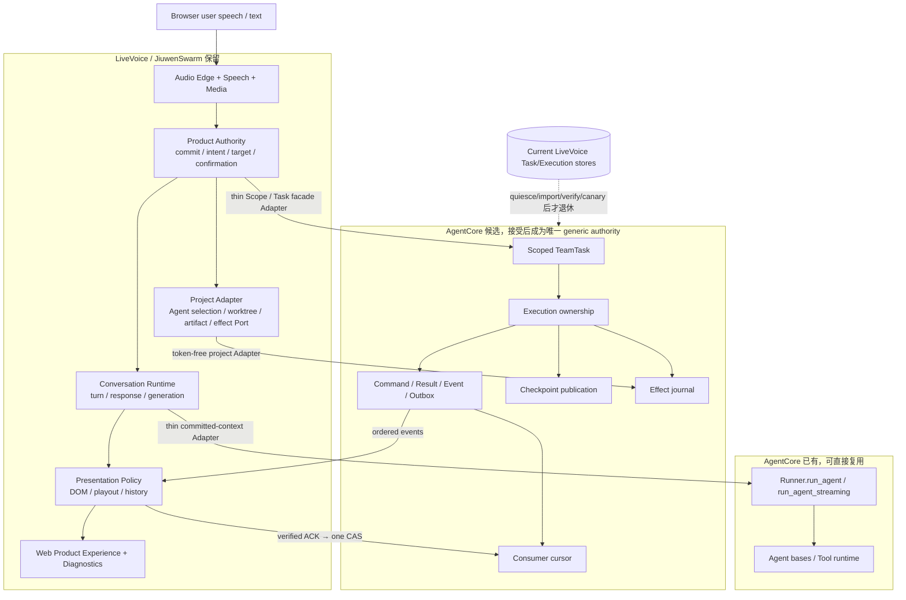

# LiveVoice 中文模块化架构视图：面向熟悉 Hermes 的读者 — 2026-08-31

状态：当前架构解释与瘦身准备视图。本文不执行迁移、不改变产品行为，
也不授予 AgentCore PR、双写、数据导入、canary、旧 Store 删除或默认开启信用。
可变的产品完成状态仍以 [`STATUS.md`](../STATUS.md) 为准。

风险：按根 [`TESTING.md`](../../TESTING.md) 属 Tier 0 文档变更。本文引用的
未来代码边界仍需独立定级、正向场景、负向零副作用证据和审查。

## 1. 先给 Hermes 读者的结论

如果把 Hermes Voice 理解成：

> Audio Edge → STT → Agent/Session → 生成 → 分句/TTS → 播放，旁边配
> barge-in、echo guard 和 platform Adapter

那么 LiveVoice 的语音主链并没有本质不同。LiveVoice 代码明显更多，主要是它
目前同时承载了另外四类产品责任：

1. **分布式 Web 媒体链**：浏览器、WebSocket、Gateway、AgentServer 和
   Provider 之间需要认证、绑定、背压、关闭和恢复；
2. **已提交输入与产品 authority**：浏览器识别出的文字不能直接成为 Agent
   或 Task 权限，必须经过 principal/project/session、提交、确认和目标选择；
3. **持久 Task/Executor 链**：后台 Agent/Tool 工作需要 Task、Attempt、Event、
   outbox、checkpoint、effect、cursor、重启恢复和不可变结果；
4. **可验证的呈现链**：服务端“生成完成”不等于用户“看到或听到”，因此还要
   区分 DOM adoption、audio playout、Presentation ACK、history 写入和重放恢复。

这些责任中有一部分是合理的 LiveVoice/JiuwenSwarm 产品复杂度，另一部分是
应该直接复用 AgentCore、经薄 Adapter 复用、准备下沉 AgentCore 或在 LiveVoice
内部收敛的重复实现。Hermes 是解释镜像，不是删除标准。



## 2. 口径、基线和阅读约定

### 2.1 精确基线

| 对象 | 本文观察基线 | 用途 |
|---|---|---|
| LiveVoice 产品 | `hx/0812_live_voice_w3@c019da1873762f496454ebec203dba4ba08d880b` | 当前模块、调用和产品事实；只读 |
| 瘦身准备分支 | `codex/livevoice-agentcore-hermes-prep@913ca3e4e1b4e1311090b5ead318a414f9ce4152`（本文修改前） | 文档、分类和本地候选证据 |
| AgentCore 本地候选 | `codex/oj-g2-local-base@50c065dc7fb5e0c21903128d1a033c52968be97e` | 已有 public API 与待准备 PR 的只读证据 |
| Hermes 镜像 | `main@fc9cbc872d8050c22f1192b16bc5ff4aed471e10` | 责任边界比较，不复制源码 |

从上一轮完整 152-path 审计基线 `acd873d0` 到当前产品 HEAD，仅有三个既有
生产路径和三个对应测试发生变化，没有新增或删除模块：

- `dedicated_media_registration.py` 加强 Task 通知合成授权的一次性转移；
- `product_composition_registry.py` 加强 Task audio 失败后的安全 text fallback；
- `LiveVoiceIntegratedRoutePanel.tsx` 加强前台响应占用期间的延迟呈现、ACK 和
  恢复绑定。

因此 152-path manifest 仍精确闭合，但 presentation/media authority 的说明要按
当前行为理解。本文不把文件行号当成长久架构定位。

### 2.2 三种状态必须分开

| 标记 | 含义 |
|---|---|
| **当前** | 产品分支已经存在并被调用的实现 |
| **目标** | 瘦身分析已经选定的责任边界，但尚未迁移 |
| **候选** | 本地 AgentCore PR 或 LiveVoice 原型证据；没有安装、合入或产品信用 |

“可直接复用”描述 public contract 已存在，不表示当前 LiveVoice 路径已经改为
调用它；“AgentCore PR 候选”也不表示 AgentCore 当前版本已经提供该能力。

## 3. 物理位置：代码实际分布在哪里

当前 manifest 覆盖 152 个生产路径。128 个是 LiveVoice 专用或专门承载文件，
24 个是 JiuwenSwarm 共享宿主中的 LiveVoice 片段。

| 物理层 | 路径/代表模块 | 文件数 | 当前职责 |
|---|---|---:|---|
| Browser 产品与 Audio Edge | `frontend/src/features/live-voice/**`、`LiveVoiceIntegratedRoutePanel.tsx` | 49 | 设备、采集、播放、页面 ownership、P1/P2/P3 UI、浏览器恢复和 ACK |
| Gateway LiveVoice | `jiuwenswarm/gateway/live_voice/**` | 8 | dedicated media、speech RPC、streaming recognition/synthesis 和产品媒体注册 |
| AgentServer LiveVoice | `jiuwenswarm/server/live_voice/**` | 66 | Conversation Runtime、Agent bridge、Task/Executor、产品 authority、presentation、composition 和 observability |
| LiveVoice shared schema | `live_voice_contract.py`、`live_voice_contract_v2.py` | 2 | 跨 Python 边界的 identity、command、event、response 和 media 合同 |
| Formal Agent Adapter | `server/runtime/agent_adapter/formal_live_voice.py` | 1 | 把已提交 Turn 和 CR 选定上下文冻结为 Agent 输入 |
| Web deployment | `live_voice_deployment_observer.py`、`live_voice_deployment_preflight.py` | 2 | 默认关闭、部署声明和 readiness 观测 |
| JiuwenSwarm 共享宿主 | `agent_ws_server.py`、`app_gateway.py`、Web handlers、ChatPanel、AgentManager、AutoHarness 等 | 24 | 只包含有边界的 LiveVoice 注册/路由/兼容片段，不能按整文件算作 LiveVoice |
| AgentCore 已有基础 | `openjiuwen.core.runner.Runner`、Agent bases、AgentTeams/AsyncTool 等 | 不计入 LiveVoice manifest | 通用 Agent/Tool/Team 执行基础；当前并非所有所需 durable public contract 都已存在 |

当前 128 个专用生产文件共 **158,729 physical LOC**。24 个共享宿主整文件共
57,588 行，但其中大量是非 LiveVoice 代码，不能与专用 LOC 相加后称为
LiveVoice 体量。Hermes 审计的 16 个聚焦 Voice/STT/TTS 文件共 15,495 行，
同时排除了它的大型 CLI、TUI、Gateway、platform base、Discord adapter 和
Web server 中的 Voice 片段，因此也不能用 `158,729 / 15,495` 得出有效倍数。

## 4. 逻辑模块视图

下表是主阅读入口。物理文件级的 152/152 解释、公开 symbol、authority、
Hermes relation、size driver 和处置仍在
[完整模块处置表](OPENJIUWEN_LIVEVOICE_MODULE_DISPOSITION_AND_HERMES_COMPARISON_2026-08-25.md)。

| 逻辑模块 | 当前主要位置 | 当前责任与调用结果 | Hermes 对应 | 为什么必须存在 | 当前瘦身方向 |
|---|---|---|---|---|---|
| M1 Browser Audio Edge | `browserAudioIOAdapter`、`browserAudioDeviceSelection`、`browserLiveVoiceOwnership`、`productP1VoiceRoute` | 选择输入/输出设备，独占页面采集，形成 capture/playout generation，采集 PCM 并播放下行帧 | `AudioRecorder`、Desktop mic/playback、VAD | 浏览器权限、热切换、同页/跨页 ownership、播放收据不能由服务器或 AgentCore 代替 | **保留并拆 UI 与 lifecycle**；统一 Audio Port、设备和 ownership |
| M2 Gateway Media Transport | `browser_gateway_media_transport.py`、`dedicated_media_route.py`、`dedicated_media_registration.py` | 建立 dedicated media route，校验 scope/connection/interaction，控制背压、序号、关闭和 playout receipt | platform Adapter、Discord receiver/mixer | LiveVoice 是跨 Browser/Gateway 的实时媒体，不是 Hermes 本地进程内流 | **保留**；把注册、授权转移、关闭委托收敛成一个 Gateway owner |
| M3 Speech Provider | `speech_ports.py`、`streaming_speech.py`、`batch_speech.py`、`openai_streaming_speech.py`、Gateway speech routes | provider-neutral STT/TTS，batch/streaming capability、fallback、取消和结果规范化 | STT/TTS provider registry、streaming TTS consumer | Provider 生命周期与 speech 协议是语音域，不属于 Agent/Task runtime | **保留并合并重复 contracts**；按 Port、provider、degradation 拆责 |
| M4 Committed Input 与 Product Authority | `unified_committed_input.py`、`product_authority.py`、`p3_*intent*`、`p3_*confirmation*`、`p3_model_resolution.py` | 把 voice/text final 绑定 principal/project/session，解析 intent/target，必要时确认，再允许 foreground Agent 或 Task mutation | Hermes 没有等价产品 authority | 浏览器文本和语音识别结果不是权限；跨 Task 操作不能靠 Session 猜测 | **JiuwenSwarm/LiveVoice 保留**；通用 Scope 只映射到 AgentCore，不上移产品策略 |
| M5 Conversation Runtime 与 Agent Bridge | `conversation_runtime*`、`agent_conversation_runtime.py`、`agent_bridge*`、`jiuwenswarm_round_harness.py`、`jiuwenswarm_agent_adapter.py` | 管理 interaction/turn/response/generation，冻结 context，驱动真实 Agent stream，隔离 cancel、late output 和 round terminal | Agent/session connection、generation stream | committed turn、foreground response 和 voice interruption 需要比普通 Chat 更精确的 generation fence | **保留 CR，替换通用 Agent launch**；Bridge 只留上下文与 observation 翻译 |
| M6 Task Core 与 Store | `formal_task_models.py`、`task_core.py`、`persistent_task_core.py`、`task_store.py` | 当前拥有 Task/Attempt/Command/Event/Result、admission、outbox 和 SQLite durable truth | Hermes 无 analogue | LiveVoice 当前还包括长任务产品，不只是同步语音聊天 | **准备下沉 AgentCore**；迁移前仍是当前 sole authority，禁止双写 |
| M7 Executor 与 Durability | `executor_port.py`、`executor_capabilities.py`、`project_code_executor.py`、`durability_*` | 分配 worktree/Agent，执行后台任务，保存 checkpoint/effect/recovery，产生不可变结果和清理证据 | Hermes 只有较轻的 Tool/Agent 调用 | 文件 Tool、重启和外部副作用存在 crash ambiguity，不能靠内存 Session 解释 | 通用 execution/checkpoint/effect 下沉 AgentCore；project/Git/patch/cleanup 保留薄 Adapter |
| M8 Voice–Task 与 Progress | `voice_task_bridge.py`、`voice_task_policy.py`、`task_event_subscription.py`、`task_progress_return.py`、`progress_notification_arbiter.py` | 决定语音指令作用于前台响应还是后台 Task，把 Task event 投影为 text/voice 通知并处理前台冲突 | Hermes 无 durable Task 对应；只有简单 spoken response | “停止说话”不能自动等于取消 Task；后台进度也不能打断当前前台响应 | generic event reader/cursor 下沉；保留 pure projector、语音通知与 barge policy |
| M9 Presentation 与 History | `presentation_ledger.py`、`formal_history_writer.py`、`p2_response_generation_store.py`、`productP2ActivationJournal.ts`、`productTaskProgressPresentation.ts` | 区分生成、TEXT DOM adoption、AUDIO playout、ACK、失败、重放和 history；保证 stale/voice-only 不误写历史 | Hermes streaming consumer/playback 是部分对应 | 网络发送成功不代表用户已看到/听到；跨 surface ACK 必须独立 | generic cursor 下沉；DOM/playout 证明、response generation 和 history policy 保留 |
| M10 Formal Web Product Experience | `LiveVoiceIntegratedRoutePanel.tsx`、`formalP3TaskExperience.ts`、intent/result/control routes | 展示 P1/P2/P3、Task 列表/状态/events/result、确认、恢复、诊断和安全披露 | Hermes Desktop hook/UI 是较小对应 | LiveVoice 是产品控制面，不只是 CLI voice mode | **拆分 7,402 行 Panel**为 shell、P1、P2、P3、presentation 和 diagnostics coordinators |
| M11 Composition、Config 与 Observability | `product_composition_registry.py`、`product_composition_root.py`、configuration/observability/privacy/SLI modules | 默认关闭地构建能力，校验配置，管理生命周期，投影 content-free diagnostics 和 privacy | Hermes 有局部注册/observer，无同等产品 composition | 多进程/多 feature Gate 的真实能力必须可声明、可关闭、可诊断且不泄露内容 | **拆分 14,016 行 Registry**；保留 product composition，复用通用 OTel/配置基础 |
| M12 Schema、Host Integration 与 Legacy | v1/v2 schema、`agent_ws_server.py`、Gateway/Web host 片段、`useLiveVoiceDemo.ts`、旧 Task client/bridge/monitor、AutoHarness 片段 | 跨层 wire vocabulary、入口注册、兼容与旧路径 | Hermes 合同分散且 legacy 结构不同 | 迁移期间需要兼容，但不应形成第二套永久 authority | 拆 v2 按 authority；移除无调用 v1；formal Gate 后退休 legacy Web/AutoHarness lane |

## 5. 当前真实调用：三个产品路径

### 5.1 当前调用总图



### 5.2 P1：媒体和 Speech 路径

1. `LiveVoiceIntegratedRoutePanel`/`productP1VoiceRoute` 请求
   `live_voice.media.activate`，建立 exact session/connection/interaction 媒体绑定；
2. Browser 通过 dedicated route 发送 PCM；Gateway 校验 frame format、sequence、
   capture generation、背压和关闭 authority；
3. `speech_rpc.py` 和 streaming routes 调用 batch 或 streaming Speech Provider；
4. final transcript 仍只是候选输入，必须进入 P2/P3 committed-input 路径；
5. 返回文本经 synthesis route 生成音频，Browser 播放后用
   `live_voice.media.playout_receipt` 证明 exact response/unit 已播放。

Hermes 通常在一个本地 voice loop 内完成 1–5；LiveVoice 把这些步骤分布在
Browser 和 Gateway，因此多了 wire identity、媒体授权和 receipt 模块。

### 5.3 P2：前台对话路径

| 公开操作族 | 当前入口 | 当前 owner |
|---|---|---|
| activate/close | `live_voice.composition.p2.activate` / `.close` | Product composition + CR activation |
| submit | `live_voice.composition.p2.submit`、`composition.unified.submit` | committed input、product authority、P2 Adapter |
| notification | `composition.p2.notification.next` | CR notification consumer + Registry route |
| presentation | `composition.p2.presentation.ack` / `.failed` | Browser proof → Registry → PresentationLedger/history |
| interruption | `composition.p2.barge_in` | exact response/generation cancel；不自动取消 Task |

当前 Agent 调用不是已经完成的 AgentCore `Runner` 直连。真实路径仍是：

`ConversationRuntime → AgentBridgeRuntime → JiuWenSwarmAgentAdapter →`
`HarnessRoundHandle → FormalAgentFacade.process_formal_live_voice_stream →`
`lower adapter.process_formal_live_voice_stream_impl`。

这个链条中，TurnCommit、ContextSnapshot、response/generation 和 cancellation
fence 属于 LiveVoice；通用 Agent 启动/stream lifecycle 应改为调用已有 AgentCore
Runner public boundary。

### 5.4 P3：后台 Task 路径

外部 wire 使用 `live_voice.task.create/get/list/status/cancel/events/result`，产品
composition 还提供 intent、confirmation、mutate、progress activate/ack/close。
当前写 authority 仍是 LiveVoice 的 `PersistentTaskCore + SqliteTaskStore`，执行由
`DirectProjectCodeExecutorAdapter` 驱动 project-bound Agent，事件再经
`TaskEventSubscription/TaskProgressReturnBridge` 返回 Web。

这条路径比 Hermes 多，不是因为 STT/TTS 更复杂，而是它实现了一个可恢复的
长任务系统。目前 AgentCore 已有部分 Task/Team/AsyncTool 基础，但锁定依赖没有
满足本文所需的 scoped Task、execution ownership、transactional event/outbox、
checkpoint publication、effect journal 和 cursor public contract，所以尚不能
把当前 Store 直接删除。

## 6. LiveVoice 如何调用 AgentCore：当前与目标

先区分 AgentCore 内部模块和准备中的 public seam：

| AgentCore 位置 | 当前/候选含义 | LiveVoice 是否应直接调用 |
|---|---|---|
| `openjiuwen/core/runner/runner.py` → `Runner` | **当前已有 public API**，负责 Agent/Team/Workflow 运行 | **是**，目标是经一个 committed-context 薄 Adapter 调 `run_agent*` |
| `openjiuwen/agent_teams/tools/task_manager.py`、`tools/database/task_dao.py` | 当前 AgentTeams Task 内部 owner，也是 Scope/Execution/Event 等候选的最小落点 | **否**，产品不能直接拿 Manager/DAO；应等 bound public facade |
| `openjiuwen/agent_teams/harness/async_tools.py` | 当前 background Tool runtime；本地 A1 候选加强 cancel/terminal fence | 只通过接受后的 runtime/public lifecycle 使用，不从 Browser 直调 |
| `openjiuwen/core/session/checkpointer/**` | 当前通用 opaque payload 保存基础 | 不能把 locator 当 resume authority；等 execution-bound publication seam |
| `openjiuwen/agent_teams/workflow/engine/journal.py` | 当前 business-neutral Workflow journal | 不能冒充 Task/effect canonical truth |
| `openjiuwen/agent_teams/task_authority.py`、`effect_authority.py` | **本地候选分支上的 PR 09/10 public seam** | 尚不可用；接受、安装并版本锁定后才由薄 Adapter 调用 |

这也是为什么“AgentCore 已经有相关类”不等于“LiveVoice 现在就能删掉自己的
Store”：内部 DAO、Checkpointer 或 Workflow Journal 不能被拼成一个未经审查的
产品 authority。

### 6.1 已有能力，可直接复用

已经确认可直接复用的唯一 generic launch boundary 是：

- `openjiuwen.core.runner.Runner.run_agent`；
- `openjiuwen.core.runner.Runner.run_agent_streaming`；
- 兼容的 public Agent construction/base classes。

目标调用形状如下，表示边界而非待合入实现：

```python
async for chunk in Runner.run_agent_streaming(
    agent=selected_project_agent,
    inputs=committed_agent_inputs,
    session=bound_agent_session,
):
    yield translate_agentcore_chunk(chunk)
```

调用前仍由 JiuwenSwarm 完成 authenticated principal/project/session 校验、Agent
选择、TurnCommit/ContextSnapshot 冻结和工具策略；调用后只翻译 stream
observation。Adapter 不再拥有第二套通用 launch state machine。Runner 的
start/stop 是宿主生命周期责任，不应由每个语音 turn 随意重启。

### 6.2 需要 AgentCore PR 后才能薄适配

| 通用 owner（目标） | AgentCore 准备项 | LiveVoice/JiuwenSwarm 最终只保留 |
|---|---|---|
| Mandatory TeamTask Scope | PR 01 / `SCOPE-01` | verified principal/project/session → immutable Scope 映射 |
| AsyncTool cancellation | PR 02 / `A1` | 产品 timeout/escalation 展示和资源清理 |
| Durable execution ownership | PR 03 / `A2` | project Agent 选择、worktree 和 artifact policy |
| Command replay + immutable result | PR 04 / `ADD-01` | intent/confirmation、chat/patch artifact 翻译 |
| Task events + dispatch outbox | PR 05 / `ADD-02` | transport 与 pure product progress projection |
| Checkpoint publication | PR 06 / `ADD-05` | codec、payload Port、compatibility/retention policy |
| External-effect journal | PR 07 / `ADD-04` | public `ProjectEffectPort`、credentials、probe/compensation policy |
| Consumer cursor | PR 08 / `ADD-03` | authentic DOM/playout proof 后的一次 cursor CAS |
| Bound Task/checkpoint facade | PR 09 | authentication envelope 和 discardable Web view |
| Bound effect facade | PR 10 | token-free trusted Adapter registration 与产品确认 |

PR 01–03 只有本地 technical candidate，PR 04–10 目前是 preflight/replay packet；
没有一个已安装到当前 LiveVoice，也没有远端 PR。

### 6.3 不能下沉 AgentCore 的责任

以下内容必须继续位于 JiuwenSwarm/LiveVoice：

- Audio/VAD/STT/TTS/media/playout 和 echo/interruption safety；
- principal/project/session、intent/target/confirmation 和 model/route policy；
- TurnCommit、response/generation、前台 Agent delivery 和 barge policy；
- project worktree、Git、patch/artifact、unsafe link、Tool credentials/probe/补偿；
- DOM/playout receipt、text/voice coordination 和 committed history；
- Browser UI、transport recovery、privacy、deployment 和 product diagnostics。

## 7. 与 Hermes 的同、异、多、少

| Hermes 责任簇 | LiveVoice 情况 | 判断 |
|---|---|---|
| AudioRecorder / Audio Edge | Browser Audio Port、设备选择、跨页 ownership、dedicated media | **同类但分布式且 fence 更强** |
| quiet-floor / pre-roll / VAD | P1 Browser capture 和 Provider turn detection 中存在相关责任 | **同类但 owner 尚需进一步收敛** |
| STT/TTS Provider Registry | batch/streaming ports、OpenAI adapter、Gateway routes | **同类，当前 contract/transport/degradation 有重复** |
| SentenceChunker | 没有一个清晰命名、Provider-neutral、覆盖中文/Markdown 的唯一 owner | **LiveVoice 当前少一个明确 owner**；应收敛，不为对齐而复制 Hermes |
| Streaming TTS Consumer | Gateway streaming synthesis + Browser queue/playout + receipt | **LiveVoice 更分布式，也更严格区分首音、late audio 和 ACK** |
| generation/playout barge-in | P2 response/playout 已有 exact generation fence；generation-time interruption 仍是当前开放边界 | **部分具备，不能用进程全局 stop 替代** |
| echo guard | Capture/playout generation、grace/fence 等分散存在；真实 AEC/物理 double-talk 仍需矩阵 | **不同实现，物理证据仍不足** |
| platform Adapter | 当前主产品聚焦 Browser/Gateway dedicated media | **Hermes 平台覆盖更宽**（CLI/TUI/Desktop/Discord 等），但并非同一产品范围 |
| Agent/session connection | CR + Agent Bridge + Formal Agent seam | **同类但 LiveVoice 增加 committed input 和 response identity** |
| Durable Task/Executor | Hermes voice focus 无对应 | **LiveVoice 多出的产品能力**，generic 部分应下沉 AgentCore |
| Product authority/presentation ACK | Hermes voice focus 无对应 | **LiveVoice 多出的可信 Web 产品边界**，应保留在 JiuwenSwarm |
| Observability/deployment/privacy | Hermes 有局部 observer/config，LiveVoice 有完整 default-off composition 和隐私诊断 | **LiveVoice 多出的运行治理**，内部需要拆分 |

Hermes 的优势是责任簇容易看懂；LiveVoice 的优势是分布式 authority、持久任务
和呈现证据更完整。LiveVoice 当前的问题不是“能力多，所以所有代码都合理”，
而是这些责任在历史演进中形成了大 Registry、大 Panel、双合同和 legacy carrier，
使合理复杂度与可消除复杂度混在一起。

## 8. 为什么模块和代码多很多

### 8.1 合理复杂度

| 原因 | 具体增加的模块 | 为什么不能因 Hermes 较小而删除 |
|---|---|---|
| 跨进程媒体 | Browser/Gateway route、registration、speech RPC、media receipt | 本地函数调用没有网络断连、claim、sequence、backpressure 和 reconnect 问题 |
| 多重 authority | product scope、committed input、response/generation、Task/Attempt | 不同 ID 解决不同 race；合并成一个 session_id 会造成跨任务或 stale mutation |
| 持久长任务 | Task Store、outbox、checkpoint、effect、recovery、result | crash/restart 和外部副作用不能由聊天历史或内存状态恢复 |
| 呈现真实性 | PresentationLedger、DOM/audio ACK、history writer、browser journal | server final 不等于用户已看到/听到；历史不能记录未呈现输出 |
| 产品策略 | intent、target、confirmation、model/route、progress arbiter | 语音可能创建/调整/取消后台任务，必须处理歧义与危险操作 |
| 运行治理 | composition、feature Gate、privacy、diagnostics、preflight | 当前仍 default-off；错误配置必须 fail closed，诊断不能泄露 transcript/audio |

### 8.2 可收敛复杂度

| 当前形态 | 规模/表现 | 收敛方向 |
|---|---:|---|
| `product_composition_registry.py` | 14,016 行 | 按 P2 route、P3 Task、presentation、configuration、lifecycle 拆 coordinator，Registry 只注册/路由 |
| `LiveVoiceIntegratedRoutePanel.tsx` | 7,402 行 | 拆 shell、Audio/P1、P2、P3、presentation recovery、diagnostics；只留一个页面 lifecycle owner |
| `project_code_executor.py` | 6,491 行 | generic execution/durability 下沉 AgentCore；保留 project/Git/Agent/artifact Adapter |
| `dedicated_media_registration.py` | 4,150 行 | transport registry、product authorization、speech composition、diagnostics 分责 |
| `live_voice_contract_v2.py` | 4,000 行 | generic Task/Event/Cursor/Effect 映射 AgentCore；voice/response/media contracts 留本地 |
| v1/v2、Python/TypeScript 重复 | 多份 schema/parser/validation | 建立一个 canonical contract + 生成/薄映射，删除无生产调用 v1 |
| formal 与 legacy Web lane 并存 | `useLiveVoiceDemo` + Task client/bridge/monitor + AutoHarness 片段 | formal P1/P2/P3 Gate 后迁移独有 oracle，再停止构建和删除 legacy lane |
| reference/fake/validation 与 composition 混放 | 生产路径中存在 fake/reference owners | 保留必要 conformance，测试支持 re-home；无生产 caller 的实现经 Gate 删除 |

所以“当前比 Hermes 多”应拆成两句话：

- 多出的 **产品能力和可信边界** 是有意设计，不能为了 LOC 对齐而删除；
- 多出的 **重复 authority、legacy carrier、合同重复和 god-file 编排** 是瘦身对象。

## 9. 目标瘦身架构



目标不是让 LiveVoice 只剩 STT/TTS，而是让它只拥有语音与 Jiuwen 产品语义，
不再拥有 AgentCore 应统一负责的 generic Task/Execution/Event/Effect/Cursor truth。

## 10. 模块处置总表

| 处置 | 当前结论 | 代表能力 |
|---|---|---|
| 直接复用 AgentCore | public Runner/Agent invocation | `EXE-05`、`BRIDGE-01` 的 generic launch 责任 |
| AgentCore 接受后薄适配 | Scope、Task/query/command/result、event/progress、checkpoint、effect、cursor | `SCOPE-01`、`TASK-*`、`EVT-*`、`D2-*`、`COMP-01` |
| 准备 AgentCore PR | PR 01–10 dependency series | Scope、A1/A2、ADD-01/02/03/04/05、bound facades |
| LiveVoice/JiuwenSwarm 保留 | Audio/Speech/Media、CR、product authority、project policy、presentation、Web/ops | M1–M5 的产品部分及 M8–M11 的产品部分 |
| LiveVoice 内部收敛 | Registry、Panel、schema、speech contracts、gateway registry | split/consolidate/extract；先不改变行为 |
| Gate 后退休 | v1、unused realtime-media reference、legacy Web Task lane、AutoHarness LiveVoice 片段 | 必须先迁移 caller 和独有测试 oracle |

任何未来迁移都必须遵循：建立目标 public contract → conformance → 冻结旧 writer
→ deterministic import/verify → 切换全部 caller → canary → 旧数据只读回滚窗口 →
最后删除。禁止同一 scoped entity 双写两套 authority。

## 11. 已解释范围与剩余问题

本文已经提供：

- Hermes 心智模型到 LiveVoice 的中文映射；
- 当前 12 个逻辑模块、152 个物理生产路径的索引关系；
- Browser、Gateway、AgentServer、JiuwenSwarm Runtime 和 AgentCore 的位置；
- P1/P2/P3 当前调用链；
- 当前 Agent 调用与目标 AgentCore Runner 调用的区别；
- “更多”中的合理复杂度与可收敛复杂度；
- 目标瘦身边界和模块处置。

仍然开放、不能在本文伪装为完成的事项：

1. generation-time interruption 仍需单独产品实现和物理证据；
2. Provider-neutral 中文/Markdown sentence chunker 的唯一 owner 尚未确定；
3. AgentCore PR 01–10 尚未形成全部可提交 source/test/docs 包，也未提交；
4. LiveVoice 当前没有迁移到 Runner/Task authority，旧 Store 仍是当前事实；
5. Registry/Panel/schema/legacy 的拆分与删除必须等移动特性分支稳定后单独执行；
6. 真实 Provider、设备、Bluetooth/采样率、噪声/远场/double-talk 和 AEC
   仍需要物理矩阵，Hermes 源码比较不能代替这些证据。

## 12. 详细证据入口

- [瘦身范围](OPENJIUWEN_AGENTCORE_HERMES_SLIMMING_SCOPE_2026-08-25.md)
- [收敛结论](OPENJIUWEN_LIVEVOICE_SLIMMING_FINAL_REVIEW_2026-08-25.md)
- [152-path 模块处置与 Hermes 对照](OPENJIUWEN_LIVEVOICE_MODULE_DISPOSITION_AND_HERMES_COMPARISON_2026-08-25.md)
- [symbol/capability 迁移映射](OPENJIUWEN_LIVEVOICE_SYMBOL_MIGRATION_MAP_2026-08-24.md)
- [AgentCore PR 准备审查](OPENJIUWEN_AGENTCORE_PR_PREPARATION_REVIEW_2026-08-25.md)
- [LiveVoice 原型裁决](OPENJIUWEN_LIVEVOICE_PROTOTYPE_ADJUDICATION_2026-08-25.md)
- [Hermes 源码镜像审计](OPENJIUWEN_REUSE_AND_HERMES_VOICE_MIRROR_AUDIT_2026-08-23.md)
