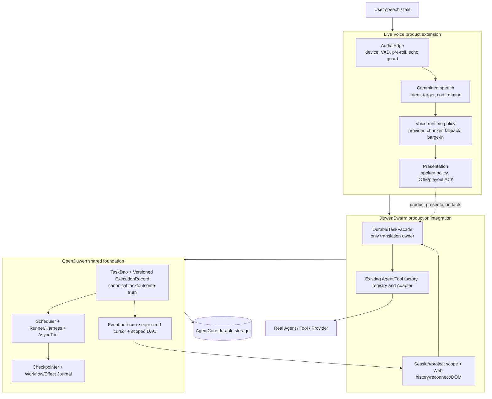

# OpenJiuwen 复用与 Hermes Voice 镜像审计

> 日期：2026-08-23
>
> 状态：只读架构、代码事实与候选 conformance 审计；不授予实现、替换、产品验收或物理验证信用
>
> Live Voice 审计基线：`c31e85ade1a69e934d05bfb9c277568a1238663c`

## 1. 结论

本轮结论不是“保留现有 Live Voice Durable Task Authority”，也不是
“立即删除 P3”。锁定版 OpenJiuwen 已经提供多个可组合基础模块，当前
JiuwenSwarm 也已经提供真实 Agent/Tool、Session 和 Web history/reconnect
接缝；但是这些基础在当前锁定版本上还不能直接满足 Live Voice 已冻结的
cancel race、持久命令幂等、跨重启 consumer cursor、D1/D2 和 scope
合同。正确路线是：

1. 以 OpenJiuwen 现有 Task、Runner、Checkpointer、Workflow Journal、
   Async Tool、Session/message 等模块作为 shared foundation；
2. 用六组需独立设计、定级和 conformance 的通用 AgentCore change series 补足稳定 execution identity、mutation
   idempotency、stream sequence/watermark、effect receipt/reconcile、scope
   hook 和 scheduler ordering，而不是把 Live Voice `TaskStore` 原样上移；
3. 在 JiuwenSwarm 保留一个 production factory + real Agent/Tool
   `DurableTaskFacade`/Adapter，且切换时只有一个 canonical truth；
4. 在 Live Voice 只保留 committed speech、语音歧义与确认、conversation/
   generation fence、spoken progress policy 和 browser playout ACK 等产品语义；
5. 任何 Live Voice 通用 P3 实现的删除必须等新组合在隔离 scope 通过 L2/L3/L4，
   并完成 quiesced cutover 后的 canary 复验 Gate。

因此，当前不应新增一套完整的 8K–12K `DurableTaskAuthority`，也不能把
OpenJiuwen 现有模块当成已经通过完整 P3 合同。候选首先是“组合复用 +
六组可审查的 AgentCore change series + 薄 Facade”，完整新模块仅在这些 conformance
测试证明组合仍有不可消除的通用缺口时重新评估。

同时，JiuwenSwarm 当前 5D RoutingKey 中的 `user_id` 可来自 browser query 或
未验证 header；它是 routing claim，不是已认证 principal。任何 scope 复用和
`session.switch` owner guard 都必须先建立 verified-principal boundary。

## 2. 范围、行为与排除项

本审计遵循 [STATUS](../STATUS.md) 的 D-084 完成边界和能力矩阵、
[稳定设计 §§2、4–5](../architecture/FULL_SOLUTION_2026-07-30.md) 以及根
`TESTING.md` 的风险/场景规则。

- **预期行为：** 用用户可观察结果重新定义复用边界；保持 committed
  input、ACK、D1/D2、scope、fence、幂等、replay 和零禁止副作用语义。
- **拥有的产品面：** OpenJiuwen/AgentCore 与 JiuwenSwarm 的只读能力
  审计；Live Voice 文件→能力→候选替代映射；Hermes Voice 模块镜像；
  候选测试与 LOC 去重估算。
- **允许的变化：** 本审计记录，以及使该记录可从当前状态权威发现的最小
  文档路由；不改生产代码、测试、协议、schema、迁移或产品策略。
- **明确排除：** 复制、迁移或依赖 Hermes 代码；改变 Provider/model/
  voice/billing；真实麦克风/TTS 物理运行；外部账号、部署或远端 ref 更新；
  在未过 L3 前删除现有 canonical 实现。
- **风险：** 文档本身 Tier 0；被审计的 authority/durability 替换候选仍是
  Tier 3。审计通过不降低未来实现包风险。

## 3. 精确版本基线

| 对象 | 锁定事实 | 用途 |
|---|---|---|
| Live Voice / JiuwenSwarm | `origin=https://github.com/agtai/jiuwenswarm.git`；分支 `hx/0812_live_voice_w3`；先从本地 `451599b4319c8b4a29054d75d8e2c8b051edae37` fast-forward-only 到 `c31e85ade1a69e934d05bfb9c277568a1238663c`；审计开始时 `HEAD...origin` 为 `0/0` | 本审计的实现事实 |
| OpenJiuwen 当前锁定依赖 | `openjiuwen 0.1.16`；`uv.lock:2931-2934` 固定 `https://gitcode.com/openJiuwen/agent-core.git?branch=develop#94e10cb6102c36fe78a64547957c0def97299273` | 只允许把该 commit 已有能力计为“当前可复用” |
| 本地 OpenJiuwen 源码 | `C:\Users\admin\Desktop\openjiuwen\agent-core`；分支 `agent/preserve-openai-tool-call-extra-content`；HEAD `dce9e0e12f04b903e7c59da807a4e2e83f7ab858` | 仅为未来 PR 基线；不得冒充锁定依赖已具备的能力 |
| Hermes 架构镜像 | `https://github.com/NousResearch/hermes-agent.git`；`main`；HEAD `fc9cbc872d8050c22f1192b16bc5ff4aed471e10`；审计时 `HEAD...origin/main=0/0` | 仅比较模块边界、职责、能力和规模 |
| 历史 Hermes Live Voice 证据 | `bielcarpi/hermes-live-voice@3dd8af386b845a1486b05b088bbc2b5a642a5b28`，仅使用仓库已有设计证据 | 不作为当前生产依赖或源码复用来源 |

Live Voice 的 fetch 只更新了远端跟踪 ref 并执行允许的 fast-forward；本轮
没有 fetch/rebase/merge OpenJiuwen 或 Hermes，也没有 push。

## 4. LOC 口径与当前基线

本节使用 **Git 跟踪文件的物理行数**，包含空行和注释。这样可由
`git ls-files` + `Get-Content` 重算，但不能等同于可删除 SLOC、复杂度或
价值。所有替代估算均为区间；共享大文件尚未拆分的重叠单独披露。

### 4.1 当前 Live Voice 生产面

| 生产面 | 文件数 | 物理行 |
|---|---:|---:|
| `jiuwenswarm/server/live_voice/*.py` | 65 | 98,639 |
| `jiuwenswarm/gateway/live_voice/*.py` | 8 | 10,880 |
| common Live Voice schema | 2 | 4,235 |
| Web deployment/preflight Python | 2 | 1,494 |
| formal Agent adapter | 1 | 163 |
| frontend `features/live-voice` | 40 | 29,764 |
| frontend Live Voice panels/ownership hook | 5 | 8,884 |
| **去重总计** | **123** | **154,059** |

测试另计：85 个匹配的 Python Live Voice 测试/支持文件约 118,762 行，39 个
匹配的 frontend 测试约 40,745 行。测试不能随生产实现删除；每个仍适用的
oracle 必须先迁移到 AgentCore、JiuwenSwarm Adapter 或 Live Voice 产品
owner。

### 4.2 当前通用 P3 重复面

当前明确以 Task/durability/event/cursor/presentation 为主责的 22 个文件约
37,663 行，包括：

- `task_store.py` 14,951 行；`SqliteTaskStore` 从
  `jiuwenswarm/server/live_voice/task_store.py:1095` 开始，schema/迁移位于
  `:2316` 起，create/cancel/recovery/retry/outbox/consumer ACK 分散在
  `:4223`、`:5249`、`:6208`、`:6439`、`:11067` 和 `:13570`；
- `project_code_executor.py` 6,491 行；真实 JiuwenSwarm 项目执行 Adapter
  从 `:2642` 开始，其中一部分应作为产品 Adapter 保留而非上移 AgentCore；
- `formal_task_models.py` 2,634 行、`persistent_task_core.py` 1,411 行、
  `task_event_subscription.py` 1,568 行、`presentation_ledger.py` 1,200 行；
- `durability_*` 六文件合计 2,953 行；
- 其余 executor/task/frontend generic control/result/monitor 文件合计
  6,455 行。

另有两个必须先拆责、不能粗暴计入删除量的 composition god-file：

- `product_composition_registry.py` 13,711 行，同时编排 P1/P2/P3；
- `LiveVoiceIntegratedRoutePanel.tsx` 7,024 行，同时拥有浏览器语音、P2
  notification、P3 control/replay/presentation UI。

在 4.1 节所列 Live Voice 专用生产面中，仅在
`project_code_executor.py:37` 发现一处直接 `openjiuwen` 导入。该数字只
描述依赖入口，不单独证明复用程度；复用缺口以第 8 节 symbol/outcome 矩阵为准。

## 5. 产品结果合同

所有候选均按同一组 D-032 维度验证：`P` positive、`N` negative、`B`
boundary、`S` state、`T` time/order、`C` concurrency、`R` retry/recovery、
`I` identity/isolation、`F` feature-off/fallback、`K` compatibility、`X`
real integration seam。共同不变量是：ACK/queued/timeout/unknown 不得伪装成
terminal/presented/success；wrong-target、rejected、stale 路径的 Agent、
Tool、Task、audio、history、store 和其他 scope 副作用必须为零。

| ID / outcome | P / N / B / S | T / C / R / I | F / K / X |
|---|---|---|---|
| C01 cancel race | **P:** 对精确 task/execution 的可取消工作只接受一次 cancel 并最终如实 settled；**N:** wrong-scope、stale execution、terminal 或 unsupported 均零作用；**B:** 覆盖 dispatch 前、已 claim、Tool 前后、terminal 边界；**S:** `cancel accepted` 不等于 `cancelled`，terminal 不复活 | **T:** duplicate/late/reordered cancel/result 被 disposition 与 sequence fence；**C:** cancel 与 completion/retry 只有一个线性化结果；**R:** ACK 丢失和 reopen 重放同一结果；**I:** owner/project/task/execution/correlation 精确绑定 | **F:** 无 cancel capability 返回稳定 unsupported；**K:** feature-off 与旧 text/runner 行为不变；**X:** 真实 Runner/Tool 在 cancel race 后无重复/跨任务作用 |
| C02 restart/reopen | **P:** 新进程只由持久事实重建 task/result/event；**N:** 腐坏、孤儿或伪造 running fail closed；**B:** 每个事务/outbox/receipt 前后 crash；**S:** terminal/tombstone 单调且不可复活 | **T:** 旧 lease/event 不覆盖新 owner；**C:** 两个 initializer/migrator 只能得到一个合法 schema；**R:** 多次 reopen/reconcile 幂等；**I:** scope、task、execution lineage 不漂移 | **F:** Store 不可用时不得退化为内存 truth；**K:** 支持的旧 schema 可迁移，未知 schema 拒绝；**X:** 真实 SQLite reopen 后不依赖旧 Python 对象 |
| C03 D1 checkpoint resume | **P:** 对可安全续跑工作从验证 checkpoint 产生新 execution generation；**N:** 缺失、损坏、wrong-profile/scope checkpoint 不 dispatch；**B:** checkpoint 写入与 resume claim 每个 crash 点；**S:** generation 单调、旧 generation 被 fence | **T:** 只选最新合法 checkpoint，late checkpoint 不倒退；**C:** resume 与 cancel/另一个 resume 单赢家；**R:** resume ACK 丢失后重放不创建第二执行；**I:** task/execution/checkpoint/profile/scope 精确绑定 | **F:** 未声明 D1 时稳定 unsupported；**K:** D0 行为不被伪装成 D1；**X:** 真实 Checkpointer + Runner 恢复无外部副作用工作 |
| C04 D2 external-effect reconciliation | **P:** effect intent/dispatch/receipt/observation 可对账为 exactly-once-equivalent outcome 或人工处理；**N:** unknown receipt 不盲重试；**B:** 外部调用前、调用后/receipt 前、settlement 前 crash；**S:** effect 状态单调且可进入 explicit manual/unknown | **T:** duplicate/reordered receipt 和 observation 不重复结算；**C:** 多个 reconciler 只有一个 effect lease；**R:** restart 后由持久 receipt 恢复；**I:** effect/task/execution/tool/scope identity 精确 | **F:** Provider/reconciler 不可用时 truthful unknown/manual；**K:** D0/D1 consumer 不必理解私有 receipt；**X:** 隔离真实 file Tool 注入故障后重复外部写入为零 |
| C05 scope isolation | **P:** 已认证 subject/project 只读写自己的 task；**N:** 错 scope 不披露存在性且零 mutation；**B:** path/case/Unicode/空值/过期授权；**S:** mutation 使用冻结授权而非事后可变 Session | **T:** 过期/stale grant 不能晚到生效；**C:** 两个 principal 同 command ID 不碰撞；**R:** reopen 不丢 scope；**I:** subject/project/session/task/execution 完整绑定 | **F:** authorizer 不可用 fail closed；**K:** 旧单用户接口仅在明确兼容层内；**X:** 真实项目 registry/authenticator + Store 查询/Tool |
| C06 event ordering/duplicate/late event | **P:** 权威事件有稳定单调 sequence 和 causation；**N:** gap、conflicting duplicate、wrong producer 拒绝；**B:** first/head/max page/terminal 后事件；**S:** late running 不覆盖 terminal | **T:** duplicate、late、reordered 由 reducer fence；**C:** 并发 producer append 有唯一顺序；**R:** reconnect/reopen 从持久 head 继续；**I:** stream/task/execution/producer 精确 | **F:** overflow/drop 必须显式可诊断；**K:** 版本化 envelope 支持旧 consumer；**X:** 真实 Runner stream 经 Web 投影保持顺序 |
| C07 consumer cursor | **P:** 每个稳定 consumer 独立读取/ACK；**N:** beyond-head、wrong-scope/class ACK 零作用；**B:** `-1`/first/head/page limit；**S:** watermark 单调持久 | **T:** append 与 ACK 并发不跳读；**C:** text/voice/多个 client 互不推进；**R:** ACK response 丢失可重放；**I:** consumer/surface/task/scope 精确 | **F:** cursor feature-off 不改变事件 truth；**K:** legacy no-cursor reader 保持只读；**X:** Web reconnect + Store reopen 只补未读 |
| C08 text/voice presentation ACK isolation | **P:** 只有真实 DOM adoption 或 browser playout receipt 推进相应 presentation class；**N:** synthesis/dispatch success、跨 class ACK 不算 presented；**B:** partial DOM/audio、失败/关闭；**S:** pending→leased→presented/failed 状态合法 | **T:** stale generation/late ACK 零作用；**C:** text 与 voice 同时消费互不吞读；**R:** lost ACK 重放同一 delivery；**I:** response/generation/task/event/delivery/surface 精确 | **F:** TTS 失败可回 text 但不伪造 voice ACK；**K:** 普通 chat history 不因语音开启被重写；**X:** 真实 DOM adoption 与 browser audio scheduling receipt |
| C09 Provider fallback/cancel | **P:** 按 capability/config 选择 Provider 并在允许边界 fallback；**N:** 无效配置或不允许 fallback 明确失败；**B:** 首音前、已有可闻音频后、timeout、空响应；**S:** provider route 只有一个 active owner | **T:** late token/audio/close ACK 被 generation fence；**C:** cancel 与 fallback 不产生双播放；**R:** 仅在 operation eligibility 允许时 retry；**I:** interaction/response/generation/stream 精确 | **F:** streaming→batch/browser fallback 结果如实；**K:** feature-off 文字路径不受影响；**X:** Provider protocol seam + cancel/failure 注入，物理结论另跑 |
| C10 generation/playout barge-in | **P:** 生成期或播放期新 committed speech hard-stop 精确 response，并按能力取消 generation；**N:** echo、stale/no-owner capture 不取消，barge-in 不升级为 task cancel；**B:** generation、首音前、playout、playout complete；**S:** response/generation/playout fence 一致 | **T:** cancel 后 late token/audio 应用为零；**C:** barge-in 与 terminal/playout ACK 单赢家；**R:** reconnect/takeover 不复活旧 owner；**I:** interaction/turn/response/generation/playout 精确 | **F:** Provider 不可取消时仍 local stop 并报告 degraded；**K:** text/background task 不被误取消；**X:** browser capture→Gateway→Runtime→Agent/TTS 真实 seam |
| C11 committed final speech | **P:** final speech 经显式 commit 恰好一次提交真实 Agent；**N:** partial、draft、编辑前、失败确认零 Agent/Tool/Task/history；**B:** empty/max/timeout 后 final；**S:** draft→final→committed 不可倒退 | **T:** stale/duplicate final 不二次提交；**C:** text/voice 同时提交由统一 owner 仲裁；**R:** submit ACK 丢失以 commit identity 去重；**I:** session/interaction/turn/commit/generation 精确 | **F:** ASR fallback 仍需 commit；**K:** 现有 text submit/history 保持；**X:** 真实注册 Agent + file Tool + committed history |
| C12 Agent/Tool zero forbidden effects | **P:** 明确、授权、已确认、受支持命令只产生预期效果；**N:** partial、歧义、wrong-target/scope、拒绝确认、stale command 全部零禁止作用；**B:** destructive command 与 decision-required 边界；**S:** 仅合法 task/execution state 可 mutation | **T:** duplicate/reordered mutation 不重复；**C:** confirmation/cancel/retry races 单赢家；**R:** unknown outcome fail closed/reconcile；**I:** origin/confirmation/task/execution/tool/scope 精确 | **F:** unsupported/feature-off 稳定零作用；**K:** 普通 Agent/Tool API 不受新 policy 影响；**X:** 隔离项目真实 file Tool，断言文件/Task/history/音频无越权变化 |

## 6. OpenJiuwen/AgentCore 模块能力清单

以下判断只以锁定 commit `94e10cb6` 为“当前可复用”。本地 `dce9e0e1`
只作为内容不同的未来 PR baseline，不能进入当前复用结论。

| 模块 | 身份、状态、持久/事务事实 | cancel / restart / event / effect / scope | 当前判定与扩展点 |
|---|---|---|---|
| core/common TaskManager | `core/common/task_manager/task.py:17` 的 `Task` 有 task/group/name/parent；`types.py:7` 共 6 个状态，其中 4 个终态为 COMPLETED/FAILED/CANCELLED/TIMEOUT；registry/lock/done event 全在内存 | `Task.wait/cancel` 在 `task.py:61/:76`；`manager.py:202` 级联 cancel；无持久、事务、checkpoint、cursor | **A（仅进程内生命周期）**。Runner 在 `core/runner/runner.py:137-171` 使用 root group；不能承担 durable truth |
| Controller TaskManager/Scheduler | `core/controller/schema/task.py:53` Task 绑定 session/task/parent；manager `modules/task_manager.py:108` 可 dump/load state；scheduler `task_scheduler.py:215` 有 executor registry | pause/cancel 在 `:639/:716`，但 completion/cancel 无终态 CAS；恢复的 WORKING 不会重调度；无 effect/sequence/cursor；TaskManager 被多 Session 整体 save/restore | **B+C**。复用 executor registry/进程内调度；PR 增 revision/CAS/reconcile。schema 说小值优先而 pop 用 `max`（manager `:394-398`），priority/FIFO 要单独校正 |
| AgentTeams TaskDao/TaskManager | `agent_teams/tools/models.py:103` TeamTask；动态 session DB 以 task_id 为 PK；`database/task_dao.py:346`；start/claim/reassign CAS 在 `:475/:525/:587`；graph mutation 单事务 `:975-1005`；状态转移在 `schema/status.py:274/:318` | 任务板可跨进程恢复；事件在 DB commit 后 best-effort publish `tools/task_manager.py:1340-1345`，无 outbox；board cancel 不终止 worker/tool；point operation 多数只按 task_id，可能跨 team | **B+C，首选 canonical store 扩展点**。直接复用任务板/依赖/claim/review；PR 加 scope predicate、outbox、execution/effect truth，不复制 Live Voice Store |
| TeamScheduler | `agent/scheduling/scheduler.py:94`；restart scan `:131/:186`；按 `(updated_at, task_id)` 选择并以 DAO CAS start | review dispatch/escalation/digest 去重仅内存；Task 状态提交与 handoff message 非事务 | **B+C**。FIFO scan 可复用；durable dispatch/outbox/restart dedup 要 PR |
| Agent/Team Runner | single Runner `core/runner/runner.py:62,408,438`；Team Runner `team_runner.py:115,151,212`；Session commit/save | single Runner 异常/取消可能跳过 `AgentSession.post_run`；Team Runner 多个 cleanup 在同一 try，前一步失败可阻止后续 save/close | **A+B+C**。真实 Agent 执行直接复用；cleanup isolation 与 execution outcome Adapter 要 PR |
| AgentTeams Runtime | `runtime/pool.py:37` RUNNING/PAUSED；`dispatch.py:48/:69` 决定 run action；manager activate/finalize/pause/stop `runtime/manager.py:115/:176/:329/:643` | DB、Session、pool 非同事务；pool 以 team_name 为进程内 key；metadata 有 pending resume，但不是 execution ledger | **B+C**。复用 dispatch/metadata；用 canonical ExecutionRecord 协调而非新增 parallel runtime truth |
| NativeHarness | `harness/state.py:22/:40/:93`；abort/pause/resume 在 `native_harness.py:545/:570/:588`；snapshot `snapshot_rail.py:48` | 模型阶段 pause 可回滚 snapshot；Tool 阶段等待不可逆 effect；active round/inbox seq/snapshot ID 是进程内 | **A+B**。pause boundary 与 cold-resume seam 可复用；必须配 Checkpointer/Journal/ExecutionRecord |
| AsyncToolRuntime | `harness/async_tools.py:81/:96`；launch/run/cancel/wait/inject 在 `:128/:162/:268/:288/:317` | 状态仅 running/completed/error；重复 ID 会覆盖；cancel signal 早于 coroutine unwind；无 generation/restart/effect receipt | **A（短生命）+C（durable）**。扩展现有 runtime，而不是新建 Live Voice async runtime |
| Checkpointer | `core/session/checkpointer/base.py:14`；Persistence storage save/recover 在 `persistence.py:172/:208`，workflow/graph 在 `:352/:417/:554/:650`；Redis extension 可用 | identity 为 `(session, namespace, entity)`；保存 context/state blob，无 revision/generation/CAS，也不与 Task DB/provider effect 事务化 | **A+B**。直接承担 context/checkpoint storage；task-level D1 claim 要 ExecutionRecord PR |
| Workflow Journal | `agent_teams/workflow/engine/journal.py:86`；结构路径+SHA call signature；load WAL `:141`、use/append `:162/:174`、snapshot/finalize `:189/:210` | completed-prefix replay、torn trailing WAL recovery；`flush` 无 `fsync`，in-flight call/effect 不记录 | **A+B（workflow D1）**。可直接复用 completed-prefix resume；不能冒充通用 D2 receipt |
| BackgroundTaskController | `runtime/background_task_controller.py:37`；pause/resume `:66/:99`；active/paused map 在内存 | restart 丢 handle；relaunch 失败仍返回 True；`workflow/tool_swarmflow.py:406-425` resume 复用已释放 governor ticket，漏计 `max_workflows` 且 formatter 退化 | **B+C**。修现有 controller/relaunch/governor，不另建 scheduler |
| WorkflowProgressEvent | `workflow/engine/progress.py:53`，含 workflow/phase/agent/correlation/node/resume-stable agent 与 token/budget facts；observer `workflow/observer.py:27/:34` | 无 event_id、producer seq、scope、cursor、dedup；Swarmflow 用未 await `create_task(publish)` 转发 | **A（payload）+C（authority rail）**。增加通用 envelope/outbox，不复制 Live Voice event schema |
| stream rail / event bus | 锁定版没有 JiuwenSwarm `stream_event_rail` producer；通用 `AgentRail` 在 `core/single_agent/rail/base.py:672`，OutputSchema 在 `core/session/stream/base.py:30` | 单进程 FIFO；index 由调用者给且不校验；bounded queue 满可能丢；无 replay/watermark | **扩展 seam，不是现成 durable 能力** |
| ConcurrencyGovernor | `workflow/concurrency.py:18/:105`；workflow admit/release/snapshot `:125/:140/:145` | ticket/semaphore 进程内且无 scope；Background resume 有 admission 漏计 | **A（进程内）+C（resume accounting）** |
| AgentSession / VCS | Session `core/session/agent.py:31`，pre/post/commit/create `:204/:229/:238/:276`；可选 VCS `vcs/manager.py:44` 有 append/commit/snapshot/restore/rewind/fork/history | parent/source 运行期关系不自动进 checkpoint；VCS 未自动接 Runner/Session，也不捕获 active Task/effect | **B**。Session 和 opt-in VCS 可组合；不能当默认 task runtime |
| message/read watermark | `agent_teams/tools/models.py:299` ReadStatus；`database/message_dao.py:28`，mark/batch mark `:328/:400/:414` | direct read boolean + broadcast `read_at` 毫秒 watermark；同毫秒可能过度 ACK；无 presentation class 或 durable event seq；publish best-effort | **A（聊天 read）+C（泛化 cursor）**。抽取 `(scope, consumer, channel, seq)`，不要直接拿 timestamp 充 cursor |
| common schema/observability | `core/common/logging/events.py:230` 有 event UUID/time/session/trace/correlation；ToolEvent 有 tool_call_id，StreamEvent 有 stream/chunk index；OTel rail `agent_teams/observability/rail.py:173` | 日志模型不是 canonical event；monitor receive-time timestamp，无 transport seq/outbox/replay | **A（观测）**；只复用 schema/trace，不用于控制 truth |

以上 60 个明确关键生产文件约 **23,017 physical LOC**，36 个对应测试文件
约 **14,757 physical LOC**。这是已经存在、应被复用的 shared foundation，
不是要迁入 Live Voice 的代码量。

本地 PR baseline `dce9e0e1` 不是锁定版简单超集：多数关键 Task/Scheduler/
Journal/Background/Governor 文件与锁定版散列相同、缺口仍在；同时该 baseline
不包含锁定版的部分 progress 字段、Session parent/cache 和 MessageDao 能力。
未来 PR 必须显式保留锁定 API，不能直接假设本地 HEAD 包含当前依赖全部能力。

### 6.1 锁定版 production/test evidence index

生产路径相对锁定源码根；测试列为便于阅读可省略公共
`tests/unit_tests/` 前缀，精确可执行路径见第 11 节。主表已经给出
identity/state/persistence/transaction/relation/cancel/restart/event/cursor/
effect/scope/extension 事实；这里补齐生产接缝、实际候选测试与不可用维度。
`—` 表示该维度在锁定版没有可计能力，不是“尚未搜索”。

| 模块 | production seam | 本轮 384 项内的相关测试 | 锁定版不可用维度 / availability |
|---|---|---|---|
| common TaskManager | `core/runner/runner.py` root task group | `tests/unit_tests/core/common/test_task_manager.py` | durable store/transaction/restart/cursor/effect/scope —；仅进程内 **available** |
| Controller Task/Scheduler | `core/controller/base.py` restore/save，executor registry | `core/controller/test_task_manager.py`、`test_task_executor.py`、选定 concurrency node | terminal CAS、WORKING reconcile、scope-safe persistence、effect/cursor —；调度 seam **available** |
| AgentTeams TaskDao/Manager | TeamTaskManager/TeamScheduler production DB path | `agent_teams/test_task_manager.py`、选定 `test_database_concurrency.py` nodes | scoped point predicate、outbox、runtime cancel/effect —；DB/claim/graph **available** |
| TeamScheduler | `agent_teams/runtime` task dispatch/handoff | `agent_teams/agent/test_team_scheduler.py` | durable dispatch/message atomicity/restart dedup —；FIFO scan/CAS **available** |
| Agent/Team Runner | public single/team run and streaming entrypoints | **未进入本轮 384 项聚焦集；源码审计 only** | cleanup isolation、durable outcome/effect —；真实 Agent execution seam **available** |
| AgentTeams Runtime | Team Runner activate/finalize/pause/stop | `runtime/test_gate.py`、`runtime/test_dispatch.py` | DB/session/pool atomicity、durable execution —；进程内 dispatch **available** |
| NativeHarness | Agent execution, pause/abort/snapshot rail | `harness/test_pause.py`、`test_abort.py`、state/regression tests | active-round restart、Tool effect rollback —；model pause boundary **available** |
| AsyncToolRuntime | NativeHarness 与 `workflow/tool_swarmflow.py` | `harness/test_async_tools.py` | duplicate/generation/restart/receipt —；短生命 launch/cancel/wait **available** |
| Checkpointer | Agent/Team/Workflow persistence hooks | checkpointer in-memory/persistence tests | revision/CAS、Task/effect transaction —；context/blob storage **available** |
| Workflow Journal | workflow runner/engine | `workflow/test_journal.py`、`test_pause_resume.py` | fsync guarantee、in-flight/effect facts —；completed-prefix replay **available** |
| Background controller | `workflow/tool_swarmflow.py` pause/relaunch | `runtime/test_background_task_controller.py` | restart handle、failure truth、resume admission —；happy-path orchestration **available** |
| WorkflowProgressEvent | workflow observer and Swarmflow publish | `workflow/test_engine.py` | authoritative seq/outbox/cursor/scope —；payload/correlation **available** |
| stream rail / event bus | AgentRail/StreamEmitter extension seam | `core/session/test_stream_output.py` | durable producer/replay/watermark —；进程内 stream **available** |
| ConcurrencyGovernor | Swarmflow workflow/agent admission | `workflow/test_concurrency_governor.py` | durable/scope ticket 与 resume accounting —；进程内 capacity **available** |
| AgentSession / VCS | Runner Session lifecycle；VCS opt-in only | VCS manager/crash/integration tests | VCS 自动 wiring、active Task/effect snapshot —；Session/VCS primitives **available** |
| message/read watermark | Team message manager/DAO | `agent_teams/test_message_manager.py` 与选定 DB concurrency nodes | durable seq/presentation class/outbox —；聊天 read watermark **available** |
| schema/observability | logging/OTel/monitor rails | **未进入本轮 384 项聚焦集；源码审计 only** | canonical control/replay/cursor —；trace/log schema **available** |

## 7. JiuwenSwarm Harness/Web 复用清单

| 能力 | 当前代码事实 | 可直接/组合复用 | 仍缺失或 PR seam |
|---|---|---|---|
| Stable routing identity | `gateway/routing/keys.py:33-61` 的 5D `RoutingKey(user, channel, app, agent_ref, session)`；`:109-120` 的物理 `ws_id`；`agents/swarm/context.py:23-70` 携带 session/request/channel/project/team | 作为 routing claim/delivery binding；不能再发明一套 Voice routing identity，但它不是认证或授权事实 | `ws_id` 每连接重建；Web request ID 是本地时间+序号；没有 verified principal 或 canonical execution/effect identity |
| Harness/Agent factory | `agents/swarm/registry.py:152-187` 注册 provider；`config_specs.py:738-845` 生成 declarative spec；`providers/runtime_tools.py:3-18` 交给 OpenJiuwen `create_deep_agent` | 真实 Agent、ToolCard、rail、subagent、factory/registry 原样复用 | Durable facade 只应注入 execution/event/effect context，不复制 Agent 构建逻辑 |
| Session metadata | `session_metadata.py:360-412` 原子 replace 与 identity 覆盖保护，`:532-583` 初始化 user/project/mode，`:1042-1116` delivery context | 恢复已提交 session binding；为 scope authorizer 提供输入 | active execution、mutation、effect 不在 metadata；不能当 Task truth |
| History persistence | `session_history.py:326-399,627-727` JSONL history；project store 在 `project_store.py:51-108,216-245` 有跨进程锁、fsync、atomic replace | 已提交 text history/reopen；project store 可作为实现模式参考 | history `${request_id}:${role}` 无唯一约束；full rewrite 非原子且不是 event journal/cursor |
| Cancel/wait | `agent_adapters.py:77-79 process_interrupt`；`session_manager.py:50-199` cancel/close/wait，`:275-283` 防止旧 processor 删除新 generation；`stream_event_rail.py:914-961` Tool 前 pause/abort | conversational round 的 cancel seam、Tool-before abort、in-process generation fence | 都是内存执行；Web `AbortSignal` 只删本地 Promise，不发 server cancel；缺 durable command CAS/settlement |
| Agent recreate | `agent_manager.py:1289-1369` drop/rebuild Agent；create token 在 `:655-698` 内存去重 | 可重建 Agent resource/config | 不是 D1 execution resume；失败无事务回滚，旧 in-flight work 不恢复 |
| Event delivery | `base_ws_channel.py:45-55,256-314` per-ws writer 串行；`web_connect.py:367-395 send_event(seq, stream_id)` 有扩展 seam | 同一连接的有序投递、event metadata 注入点 | history sequence 在 `agent_ws_server.py:5226-5273` 生成后未进入 `AgentResponseChunk`/E2A/Gateway/Web；跨重连无 sequence/dedup |
| Cursor/reconnect | team history `agent_ws_server.py:5149-5192` 有 offset cursor；Web disconnect/reconnect 在 `webClient.ts:194-219,496-508`；App 切 Session 主动 `history.get` | 已提交 history 分页和 socket 重建 | offset 不是 durable consumer watermark；pending 不 replay，事件 gap 不补，active execution 不 reopen |
| Tool observation | `stream_event_rail.py:914-1006` 在 Tool 前后发 `chat.tool_call/result`，保留 call ID、异常/失败 | 映射可见进度和未来 receipt Adapter 的真实 Tool seam | 事件是 volatile presentation，不是有唯一索引的 intent/receipt/reconcile truth |
| Scope | 5D routing；connection user 覆盖 message payload spoof；project cwd/trusted dirs/team MCP scope 在 `assembly.py:42-53,95-134`；runtime Tool 使用 request/channel/session context | project/team Tool binding 可复用；但 `app_gateway.py:572-609` 的 connection user 可来自 browser query 或未验证 `X-User-Id`，只能算 routing claim | 先新增 verified-principal boundary，再让 `agent_ws_server.py:3364-3438 session.switch` 以该 principal 校验 `:3282-3338` 的目标 metadata owner；verifier 缺失时多用户入口 fail closed |
| Web/DOM | `main.tsx:41-44` mount App；`App.tsx:2374-2400` mount ChatPanel；`ChatPanel/index.tsx:1414-1424,1565,1595-1600` mount Live Voice | 真实 DOM carrier 与 existing text UI/history 可复用 | 目前是硬编码 composition，不是 extension registry；不能把 mounted 产品测试算 shared foundation |
| Presented ACK | `connection.ack` 仅表示 AgentServer ready，见 `agent_ws_server.py:1684-1694`；`chat.final` 无服务端 presented 回执 | 无 outcome 级直接复用 | 需要 `(consumer, class, event/message)` 隔离的通用 watermark；browser playout/render policy 仍属于 Live Voice |

共享主基础 28 个文件约 **13,291 physical / 11,512 nonblank LOC**；对应
15 个测试文件约 **5,879 / 4,816**。另有 10 个大型混合 carrier 文件毛量
31,399 physical LOC，仅引用上表 symbol ranges，没有把整文件算成 shared
foundation。

动态验证结果：共享 8 文件批次收集 223 项，`221 passed / 1 failed /
1 skipped`。唯一失败是 Windows 上测试手工植入 Unix cache key
`code:normal:/tmp/shared-project`，而生产 `_make_agent_cache_key` 会规范化为
Windows 绝对路径；单独复跑仍失败，判为跨平台 fixture 问题，不能证明生产
same-key lock 缺陷。补充 history/session.switch/E2A 30 项全过，frontend
`history-pagination` 5/5 通过；合计 `256 passed / 1 failed / 1 skipped`。
这些测试证明真实 Agent 构建和真实 Tool 注册，但没有让 Agent 实际调用
file Tool，不能替代 L3。

## 8. Live Voice 替代矩阵

分类含义：`A` 直接复用；`B` 组合复用；`C` AgentCore PR 补差；`D` 组合后
仍完全缺失；`E` Live Voice 产品专用。一个 outcome 可以同时包含 B/C/E，
但每一行必须指定唯一 canonical truth。

LOC 使用 4.2 节的共享池：`G=37,663` 通用 P3、`P=21,824` P3 产品语义、
`V=45,317` P1/P2 Voice Edge、`C=42,235` composition/observability/ops、
`S=7,020` shared contract/schema。五池去重合计 154,059；同一池在下表多行
复用，**不得按 outcome 相加**。

| Outcome | 当前 Live Voice owner / 证据 | OpenJiuwen + JiuwenSwarm candidate | 分类 | Conformance Gate 与 LOC disposition |
|---|---|---|---|---|
| C01 cancel race | `task_store.py:5249`、`persistent_task_core.py:1202`、`project_code_executor.py:5441`；测试 `test_persistent_task_core.py` | TaskDao CAS + Controller/TeamScheduler + Runtime/AsyncTool cancel + Jiuwen `process_interrupt` | **B+C** | PR 后跑 complete/cancel/retry 全交错和真实 Tool；属于共享 `G` 可移除池，不能单列叠加；Facade 必须保留 exact Agent/Tool cancel Adapter |
| C02 restart/reopen | Store migration/schema `task_store.py:2316+`，recovery `:6208`；`persistent_task_core.py:1202` reconcile | AgentTeams DB + Checkpointer + Journal + Session metadata/history + runtime dispatch | **B+C** | crash point、双 initializer、WORKING orphan、corrupt state；当前 `G` 中 schema/Store/core 是主要候选移除，旧 DB 只保留一次性 importer/read-only verifier |
| C03 D1 checkpoint resume | `durability_checkpoint.py:169`、Store `:1434/:6208`、Direct executor | Workflow Journal completed-prefix + NativeHarness snapshot/pause + Checkpointer + versioned ExecutionRecord | **A/B（workflow）+C（generic task）** | 无 effect workload、cancel/resume single winner、new generation；`G` 中 durability checkpoint/core 可移除，Jiuwen project checkpoint codec/Adapter 保留 |
| C04 D2 external effect | `durability_effects.py:196-823`、Store `:1613/:1716`、Direct executor `:4032` | AsyncToolRuntime + Workflow Journal + new generic EffectJournal/probe/reconcile hook + Harness Tool observation | **C** | file Tool 在 send 前/后、receipt 前 crash，unknown→manual，重复外部写为零；`G` effect facts/Store 可移除，Provider/file Tool reconcile Adapter 保留 |
| C05 scope isolation | `product_authority.py:631`、`p3_authenticated_composition.py:1153`、Store consumer scope `task_store.py:14059` | verified principal boundary + 5D routing claim + Session metadata/project/team scope + TaskDao/MessageDao scoped predicates | **B+C** | forged query/header、缺 verifier、跨 team 已知 ID、wrong owner `session.switch`、过期 grant全部零披露/作用；`G/P` 的通用 scope ledger 进入共享层，语音 target/confirmation policy 留 Live Voice |
| C06 ordering/duplicate/late | `formal_task_models.py:1591`、Store unique event/index `task_store.py:2366`、subscription `task_event_subscription.py:165` | WorkflowProgressEvent payload + EventEnvelope/outbox + Web `send_event(seq, stream_id)` | **A（payload/同连接）+C** | business state/outbox 原子、gap/duplicate/late、reconnect replay；`G` event/subscription 通用部分可移除，Web projection Adapter 保留 |
| C07 consumer cursor | Store `consumer_progress_authority_page` `task_store.py:13392`、ACK `:13570` | 独立 CursorStore `(scope, stream, consumer, channel)→seq` + MessageDao compatibility Adapter + Jiuwen reconnect/history | **C** | two consumers/text/voice、append/ACK race、ACK loss/reopen；`G` cursor/consumer ledger 可移除，产品 channel/presentation binding 保留 |
| C08 text/voice presentation ACK | `presentation_ledger.py:118/:713`、`progress_notification_arbiter.py:441`、React panel `:1318+` | Generic cursor only；真实 DOM carrier复用；browser scheduling/render receipt 仍由 Live Voice | **C+E** | DOM adoption、audio scheduled/rendered、cross-class/stale ACK 零作用；共享 cursor 计入 `G`，P2 speech/presentation policy 与 Web receipt 留 `P/V/C` |
| C09 Provider fallback/cancel | `openai_streaming_speech.py:823/:2146`、`batch_speech.py:639/:1351`、Browser Speech Adapter | AgentCore `ModelBackupRail` 仅覆盖 LLM；Jiuwen AgentAdapter 有 cancel seam；STT/TTS registry/policy 是 Voice Edge | **局部 A + E** | 首音前/后 failure、阻塞 call cancel、fallback eligibility/provenance、无双播放；Hermes 只给模块镜像，`V` **不计可删除** |
| C10 generation/playout barge-in | `conversation_runtime_loop.py:133`、`agent_conversation_runtime.py:555`、registry `handle_p2_barge_in :8087`、browser ownership/P1 route | Agent/Harness interrupt seam；Audio Edge、generation/response/playout fence 全属 Live Voice | **E** | 生成期、首音前、播放中、完成 race；禁止 Task cancel；保留 `V/C`，只做职责拆分，Hermes LOC 不形成删除量 |
| C11 committed final speech | `unified_committed_input.py:42`、`agent_conversation_runtime.py:931/:1044`、frontend `unifiedCommittedInputOwner.ts` | 真实 Agent/Tool submit 与 history 复用；commit/draft/final/confirmation 属 Live Voice | **E** | partial/draft/stale final/ACK loss/text-voice arbitration；保留 `P/V` 产品 owner，shared submit Adapter 应很薄 |
| C12 Agent/Tool zero forbidden effects | `critical_token_safety.py`、P3 intent/confirmation、Store/outbox、Direct executor；643 项聚焦集覆盖现 authority | TaskDao scoped CAS + Harness Tool-before abort + EffectJournal + Jiuwen real Agent/Tool/permission | **B+C+E policy** | L3 隔离真实 file Tool，wrong target/scope/confirmation/cancel/retry 所有副作用为零；通用 ledger 属 `G/P` 可移除池，语音歧义/确认保留 |

替代顺序的核心判断：

- C01–C07/C12 的完整 outcome 当前没有纯 A；已有 A 都是可组合子能力。
- D1 对 Workflow 是已有 A/B，对任意 Task 的通用 resume claim 仍是 C。
- D2 不是需要全新 Durable Authority 的 D：AsyncTool、Journal、TaskDao 和
  Tool observation 提供了可接入的执行、调用与持久化接缝；effect canonical
  facts、receipt 与 reconcile protocol 整体仍缺，因此归为通用 AgentCore PR
  的 C，而不是现成组合能力。
- C09–C11 及 C08 的浏览器播放部分是 E；Hermes 不改变这些合同。
- 在 G0–G4 全部完成前，可删除生产 LOC 为 **0**。

为满足文件/能力迁移核算而不重复累计 outcome，矩阵的数值 disposition 统一
落在以下互斥切片；每行的 retained 数包含 JiuwenSwarm execution/Tool/Web
Adapter 或 Live Voice 产品 projection，不包含 AgentCore 已有源码：

| Outcome 主集合 / 当前文件切片 | 当前 LOC | G0–G4 后规划可移除 | retained Adapter / product | 临时迁移 |
|---|---:|---:|---:|---:|
| C01–C03/C05：Store、formal model、persistent core 与 recovery | 18,996 | 14K–17K | 1K–4K | 1K–3K |
| C03–C04/C12：project executor 与六个 checkpoint/effect/durability 文件 | 9,444 | 3K–4K | 4K–6K | 1K–2K |
| C06–C08/C12：event subscription、presentation ledger 与 generic control/result UI | 9,223 | 3K–4K | 4K–6K | 0K–2K |
| C05/C08/C11/C12：P3 产品语义池 | 21,824 | 3K–6K shared 化 | 13K–18K | 0K–5K 拆责/迁移误差 |
| C09–C11：Voice Edge；以及 composition/shared schema | 94,572 | 0 headline credit | 94,572，先模块化/归属再审 | 0 |

前三行恰好构成 `G=37,663`；它们的移除区间合计 20K–25K。加上第四行
3K–6K 得到第 12 节 23K–31K planning-hypothesis range。区间端点不能与 retained/临时列的
另一端机械相加；最终以实际 symbol attribution 和迁移 diff 为准。

## 9. AgentCore PR 候选

这些是六组 Tier-3 候选 change series；每组还要在实现 packet 中继续拆成表中
可独立 review 的 PR，不能把跨 owner 工作包装成一个“小 PR”。它们扩展现有
owner，不创建平行 Live Voice durable 子系统。每个 PR 先在 AgentCore 通过
通用 conformance，再由 JiuwenSwarm 做版本锁定、Facade 与真实集成验证。

| Series / reviewable PR | 扩展的现有模块 | 为什么通用且不留 Live Voice | backward compatibility | 必须通过的 AgentCore 验收 |
|---|---|---|---|---|
| AC-1a ExecutionRecord protocol/backend | 在 AgentTeams TaskDao 旁定义 scoped `execution_id/generation/revision`、terminal CAS、command disposition、lease/settlement 的唯一 backend | 任意 Agent/Workflow/Tool 的重试、取消和终态需要；不含 speech/playout/confirmation | 旧 Task API 经显式 single-scope Adapter；新 durable API fail closed | complete/cancel/retry/resume 全交错、duplicate mutation、restart orphan、terminal 不复活 |
| AC-1b relation adapters | Controller task、TeamTask、AsyncTool、Workflow run 各保留自己的 ID，通过显式 relation 绑定 ExecutionRecord | 避免强迫不同模块共用一个 `task_id`，也避免 Live Voice 自造 Attempt truth | Adapter feature-off 时旧模块行为不变；relation schema 版本化 | wrong relation/scope/generation 零作用；两个 claimant 单赢家；reopen lineage 不漂移 |
| AC-2a EventEnvelope schema | 扩展 `WorkflowProgressEvent/EventMessage` 的兼容 envelope：scope/stream/seq/producer/causation | 所有断线 consumer 都需要稳定事件 identity；Voice 只解释产品 payload | 旧字段保留，旧 consumer 可忽略新 envelope | version decode、gap/conflicting duplicate/late event、producer identity |
| AC-2b store-local transactional outbox | **每个 authoritative store 自己**在业务事务内写 outbox；先从 TaskDao backend 开始 | 原子 publish 是通用 durability；不声称 WorkflowProgress 与 TaskDao 可跨存储原子 | 无 outbox 的旧 producer 经明确 volatile Adapter；不得伪装 durable | state+outbox crash points、并发 append 唯一序、publish ACK loss/reopen |
| AC-2c CursorStore protocol/backend | 新增独立唯一 owner，key 为 `(scope, stream, consumer, channel)`，value 为单调 sequence；MessageDao 只接 compatibility Adapter | text/Web/worker 都需要独立 watermark；Voice 决定 presentation class | 旧 `read_at` 只作聊天 projection，不拥有通用 cursor truth | append/ACK race、beyond-head、cross-consumer/class/scope、reopen |
| AC-3a EffectJournal protocol/backend | 新增**唯一 canonical EffectJournal store**，定义 planned/dispatched/receipt/observed/verified/unknown/compensated 与 idempotency/probe/reconcile/compensate | file/API/MCP 等任意外部 Tool 都有 crash ambiguity；放在 Voice 会让普通 Agent 重复造 ledger | 不可探测 Adapter 可声明 manual/unknown；旧 Tool 不自动获得 D2 claim | 调用/receipt 各 crash 点、多 reconciler 单 lease、重复 effect 为零 |
| AC-3b effect hooks | AsyncToolRuntime、Workflow Journal、Tool callback 只调用 AC-3a hook，不分别保存 effect truth | 复用真实执行 seam，同时守住单 canonical owner | feature-off 保持旧短生命行为；receipt schema 版本化 | duplicate/reordered receipt、wrong execution/scope、hook failure truth |
| AC-4 scoped DAO predicates | TaskDao/MessageDao point operations 强制携带 scope predicate | 多 team 的 Task/Message ownership 是通用数据约束 | 旧无 scope overload 仅受信内部兼容并标记弃用 | 跨 team 已知 ID 零披露/零 mutation；并发 claim 仍单 winner |
| AC-5a durable AsyncTool identity | AsyncToolRuntime 增 duplicate guard、generation 与 AC-1 relation/store Adapter | background Tool identity/restart 对所有 Harness workload通用 | 未配置 durable Adapter 时保留进程内模式 | duplicate ID、cancel unwind 后终态、restart orphan |
| AC-5b Background resume/governor | 修复 relaunch failure truth、paused handle retention、重新取得 governor ticket 和 formatter | Workflow resume/capacity 不是 Voice 规则 | happy-path API 不变，失败 disposition 新增且稳定 | failed relaunch retry、restart、capacity cap、cancel/resume race |
| AC-5c Runner cleanup isolation | single/team Runner 各 cleanup phase 独立执行并汇总 truthful outcome | Session save/gate close 影响所有 Agent/Team run | 成功返回保持；异常聚合规则版本化 | 任一 cleanup 失败不阻止其余 save/close；cancel/error paths |
| AC-6 scheduler priority/FIFO | 只校正 Controller scheduler“小值优先”与当前 `max` 不一致，并定义稳定 FIFO | priority/FIFO 是通用 Task admission 规则；durable disposition 已由 AC-1/AC-2 拥有 | 版本化 ordering policy；旧默认只在显式 flag 下保留 | 同/异 priority、stable tie、restart scan、capacity/cancel race |

JiuwenSwarm integration 也拆为三个独立 packet：**JS-0 verified principal**
只接受已验证 token 或明确受信反代上下文，browser query/header 不直接成为
authority，verifier 缺失时多用户入口 fail closed；**JS-1 owner guard** 用该
principal 校验 `session.switch` 目标 Session metadata owner，覆盖 forged
query/header、已知他人 ID、payload 伪造、跨 project/team 和零 history/Agent/
Tool 副作用；**JS-2 sequence carriage**
把 AgentServer 的 sequence/stream identity 经 E2A/Gateway 一直带到 Web，并验证
reconnect/dedup。DOM adoption、browser playout receipt、语音确认和
spoken-progress policy 不进入这些 shared PR。

## 10. Hermes Voice 参考矩阵

Hermes 只提供架构镜像；下表不授予代码复用或 Live Voice 合同替代信用。

审计对象是当前 NousResearch Hermes `fc9cbc87`。仓库历史设计在
`FULL_SOLUTION_2026-07-30.md:501-506` 引用的
`bielcarpi/hermes-live-voice@3dd8af38` 是另一个仓库和 commit；当前 checkout
不含该对象，所以历史评分不能反向证明本节代码事实。

| 用户能力 | Hermes 边界与证据 | 可借鉴点 | Live Voice 必须保留/补强的差异 |
|---|---|---|---|
| AudioRecorder / Audio Edge | `tools/voice_mode.py:812 AudioRecorder` 保持一个 `sounddevice.InputStream`；`:277 detect_audio_environment` 探测 SSH/container/WSL/Termux/PortAudio；Desktop `use-mic-recorder.ts:62` 使用 MediaRecorder/Web Audio | 设备/平台探测与常驻输入流是清晰 edge 职责 | Hermes 普通录音仍用固定阈值；Desktop 只请求 AEC/NS，未验证实际约束。Live Voice 仍需设备 authority、ACK、热插拔、采样率与权限矩阵 |
| quiet-floor / pre-roll / VAD | `tools/voice_mode.py:2021 full_duplex_listen`：30ms block、450ms quiet calibration、p90 floor、1.2s pre-roll、500ms playback grace、1250ms EOT；Desktop `voice-barge-in.ts:55` 有相似本地算法 | quiet-floor + pre-roll + sustained speech 可形成独立 VAD 模块，而非散落 UI | 没有真正 AEC；Desktop 核心算法无直接测试。Live Voice 需要固定 corpus、double-talk、provider speech-start、capture generation 和物理矩阵 |
| STT Provider Registry | `agent/transcription_provider.py:61` 是插件 ABC；`transcription_registry.py:41,58,114` 保留 8 个 built-in 名并与 dispatcher 列表同步，built-in 不是 registry object；`transcription_tools.py:3175` 并行 dispatch | 可借鉴 provider separation/registration pattern | registry 是 process/profile 级；built-in/plugin 入口与 fallback 不统一。Live Voice 选择、fallback、cancel、attempt provenance 必须 response/generation scoped |
| TTS Provider Registry | `agent/tts_provider.py:64` 是插件 ABC；`tts_registry.py:49,69,124` 保留 11 个 built-in 名；`tts_tool.py:3142` 的 built-in dispatch 与 `tts_streaming.py:175-213` 四个真流式 streamer registry 是并行表面 | 可借鉴 provider separation/registration pattern，不声称已有统一 provider abstraction | 未知 provider 可静默落 Edge，弱于 fail-closed；阻塞 Provider 调用不能被 stop event 抢占。Live Voice 需显式 capability/config 和 cancel ACK |
| SentenceChunker | `tools/tts_streaming.py:89 SentenceChunker` 增量消费 token delta，最短 20 字符并跨 delta 去除 `<think>` | 句子切分应成为独立、可测、Provider-neutral 模块 | `:84-85` 只认 `. ! ?` + whitespace/空行，不覆盖中文标点、无空格语言、缩写和 Markdown fence；不能直接替代当前 committed/render fence |
| Streaming TTS Consumer | `gateway/streaming_tts_consumer.py:55`；`:156 on_delta`、`:218 _run`、`:384 abort`、`:413 wait_complete`；首次 audible 前失败允许 whole-file fallback，audible 后禁止整段重播 | “首音前可 fallback、首音后禁止重播”和 bounded queue 是正确模块合同 | 生产 platform adapter 没有 override `supports_streaming_tts/begin_streaming_tts`，当前主要由 fake 测试；只有进程内 `session_key:turn_marker`，没有 browser rendered/presented ACK |
| 本机 streaming TTS | `tts_tool.py:3940 _SyncSentencePipeline`、`:4032 stream_tts_to_speaker`，synthesis/playback 双 worker、lookahead 2；真流式 Provider 列表在 `tts_streaming.py:175-213` | synthesis 与 playback pipeline 可拆责；FIFO/prefetch 易测试 | cancel 仅在 chunk/句子边界检查；缺少 response/generation/playout identity 与 late-audio fence |
| generation/playout barge-in | CLI `cli.py:14762`、`14826-14866`、`14875`；Desktop `use-voice-conversation.ts:303-406`；播放在本地立刻 stop | generation 与 playout 都需要可插话；本地 hard-stop 不能等待服务器 | TUI `tui_gateway/server.py:14487-14500` 会中断所有 running sessions；多个 latch/slot 是进程全局。Live Voice 必须精确 response cancel，且不得升级为 Task cancel |
| echo guard | `voice_mode.py:551` 进程级 speaker-output 计数；`:1337 is_tts_echo` 是 CLI playback-phase transcript heuristic，调用在 `cli.py:14888-14901`；Discord legacy playback 在 `plugins/platforms/discord/adapter.py:4683-4732` 暂停 receiver | energy/grace/pause 与 transcript heuristic 应作为不同 Audio Edge signal 暴露 | Desktop 与 Discord mixer 无等价 transcript guard，mixer 也不暂停 receiver；全局 speaker state 会跨 session 串扰，所有路径都没有真实 AEC |
| platform Adapter | `gateway/platforms/base.py:591 AudioFormat`、`:604 StreamingTTSHandle`；Discord `VoiceReceiver` 在 `plugins/platforms/discord/adapter.py:565` | 平台只负责媒体收发，Provider 与 Agent 可在上层组合 | 除 Discord 外没有完整实时入站；18 个真实 `send_voice` override 仍是 whole-file。Live Voice Web 需要 binary media、backpressure 和 playout receipt |
| Agent/session connection | Gateway 从 `gateway/run.py:18084` 入站，经 `:24648` STT、`:5840` Agent delta、`:28610` TTS；Discord voice 与绑定 text channel 共用 SessionSource | Voice 应复用既有 Agent/session 主路径 | 没有 task_id/task ownership、durable cursor、response/generation fence；不能承载 C01–C08/C12 |

Hermes 审计选取的 16 个 Voice/STT/TTS/registry supporting files 共
**15,495 physical LOC**；选择性的 16 个聚焦测试文件共 **7,312 physical
LOC**。前者包含共享的完整 `tts_tool.py/transcription_tools.py`，同时排除了
`cli.py`、TUI、Gateway、platform base、Discord adapter 和 Web server 的
Voice symbol 区间，因此既不是纯 Voice SLOC，也不是完整 Voice footprint，
不能与 Live Voice LOC 作比率比较或作为删除分布式 authority 的理由。

生产 manifest：

```text
tools/voice_mode.py
tools/tts_streaming.py
tools/tts_tool.py
tools/transcription_tools.py
agent/transcription_provider.py
agent/transcription_registry.py
agent/tts_provider.py
agent/tts_registry.py
gateway/streaming_tts_consumer.py
plugins/platforms/discord/voice_mixer.py
hermes_cli/voice.py
apps/desktop/src/app/chat/composer/hooks/use-mic-recorder.ts
apps/desktop/src/app/chat/composer/hooks/use-voice-recorder.ts
apps/desktop/src/app/chat/composer/hooks/use-voice-conversation.ts
apps/desktop/src/lib/voice-barge-in.ts
apps/desktop/src/lib/voice-playback.ts
```

测试 manifest：

```text
tests/tools/test_voice_mode.py
tests/tools/test_voice_tts_echo_guard.py
tests/tools/test_tts_streaming.py
tests/gateway/test_streaming_tts_consumer.py
tests/gateway/test_streaming_tts_gateway_regression.py
tests/agent/test_transcription_registry.py
tests/agent/test_tts_registry.py
tests/integration/test_voice_channel_flow.py
tests/gateway/test_discord_voice_mixer.py
tests/tools/test_voice_cli_integration.py
tests/tools/test_voice_stop_phrase.py
tests/hermes_cli/test_voice_wrapper.py
tests/tools/test_transcription_plugin_dispatch.py
tests/tools/test_tts_plugin_dispatch.py
apps/desktop/src/app/chat/composer/hooks/use-voice-conversation.test.tsx
apps/desktop/src/app/chat/composer/hooks/use-voice-conversation-rearm.test.tsx
```

重算使用 `[IO.File]::ReadAllLines((Resolve-Path -LiteralPath $file)).Length`，
明确计入空行；不是可能漏空行的 `Measure-Object -Line` 口径。

Hermes 镜像暴露的 Live Voice 架构债务是：

1. P1/P2/P3 composition 分散在 13.7K Python registry 与 7.0K React panel，
   应按 Audio Edge、Provider Registry、Sentence Chunker、Streaming Consumer、
   Runtime policy、platform receipt 拆责；
2. 当前 Live Voice 缺少一个明确命名、Provider-neutral、覆盖中文/Markdown
   的 sentence chunker owner；
3. generation-time barge-in 仍是当前 STATUS 的真实缺口，不能用 Hermes 的
   process-global interrupt 代替；
4. Provider/device matrix 应增加 real Provider、首音前/后 failure、阻塞调用
   cancel、热插拔、Bluetooth/采样率漂移、噪声/远场/double-talk；
5. 所有借鉴都必须落到 Live Voice 的 session/interaction/turn/response/
   generation/capture/playout identity、ACK 和零副作用合同。

Hermes 聚焦测试按其根 `AGENTS.md` 的 runner 尝试，但 checkout 没有可用
`.venv`/`venv`，Desktop 也没有 `node_modules/.bin/vitest.cmd`。本轮没有为
外部镜像安装依赖，因此没有 Hermes 运行通过数；源码/测试清单仍是只读
证据，不能算动态 conformance PASS。

## 11. 分层验证

| 层级 | 本轮结果 | 能证明什么 | 不能证明什么 |
|---|---|---|---|
| L1 OpenJiuwen 单模块 | **PASS（候选范围）**：锁定 `94e10cb6` 分 5 组运行 Task/Controller/AgentTeams DB、scheduler、message、Runtime/Harness、AsyncTool、Checkpointer、Journal、Background/Governor/VCS/stream，共 **384 passed** | 被清点的现有基础在锁定源码上可运行；直接/组合 seam 不是纸面猜测 | 未运行 Runner 聚焦测试、完整 suite、Redis、外部 provider/network；没有 AC-1–AC-6 series，所以不证明完整 C01–C07/C12 |
| L2 组合 Contract | **NOT RUN / PARTIAL baseline**：当前 Live Voice 14 个聚焦文件 **643 passed** | 当前 canonical authority 的 task/durability/cursor/committed-input/conversation/TTS/formal-adapter oracle 仍绿 | `DurableTaskFacade` 尚未实现；这些通过不能转移给未来 AgentCore 组合 |
| L3 JiuwenSwarm real Agent + Tool | **NOT RUN for candidate**。共享构建测试实际创建 OpenJiuwen Agent 并注册 `fs.write_file/read_file/execute_cmd/...` ToolCard | production registry/factory 与真实工具注册 seam 存在 | 测试没有让 Agent 调用 file Tool，没有 candidate reopen/cancel/effect 故障注入；删除信用仍为 0 |
| L4 Web | **PASS for current baseline**：`npm run test:live-voice-integrated-web` 为 **472 pass / 0 fail**；共享 `history-pagination` **5/5** | 当前 DOM/route/ownership/history Web 基线未被审计文档改变 | 没有 candidate event sequence、cursor 或 playout receipt，不能证明新组合 |
| L5 physical voice | **NOT RUN** | 无 | 麦克风、扬声器、browser permission、真实 ASR/TTS/provider、噪声/远场/Bluetooth、热插拔、generation/playout barge-in 均需机器私有环境重新验收 |

JiuwenSwarm 共享 Python 8 文件批次为 `221 passed / 1 failed / 1 skipped`，
补充 history/session-switch/E2A 为 30 passed；连同 frontend 5 项，共
`256 passed / 1 failed / 1 skipped`。唯一失败在 Windows 上由测试手工植入
Unix cache key `/tmp/shared-project`，与生产路径规范化后的 key 不相等；它是
跨平台 fixture 缺陷，不被改写成生产锁 PASS，也不影响上述 `session.switch`
owner guard 缺口。默认 pytest 收尾还报告了已有 `.coverage` schema warning。

AgentCore 五批测试选择集来自锁定源码目录
`C:\Users\admin\AppData\Local\uv\cache\git-v0\checkouts\f5ca8852211336f0\94e10cb6`
。以下先固定复现环境：

```powershell
$env:PYTHONPATH='C:\Users\admin\AppData\Local\uv\cache\git-v0\checkouts\f5ca8852211336f0\94e10cb6'
$env:PYTHONDONTWRITEBYTECODE='1'
$py='C:\Users\admin\Desktop\live voice hx\.venv\Scripts\python.exe'
```

以下是五个互不重复选择集的统一、无报告副作用复现命令。原始第一批曾使用
repository 默认 addopts 并产生 ignored report 输出；后四批使用禁用 addopts
的聚焦入口。统一命令不改变 test item 或 `123+118+73+36+34=384` 结果：

```powershell
# 123 passed
& $py -m pytest -q -p no:cacheprovider -o addopts='' --disable-warnings `
  tests/unit_tests/core/common/test_task_manager.py `
  tests/unit_tests/agent_teams/runtime/test_gate.py `
  tests/unit_tests/agent_teams/runtime/test_dispatch.py `
  tests/unit_tests/agent_teams/runtime/test_background_task_controller.py `
  tests/unit_tests/agent_teams/workflow/test_concurrency_governor.py `
  tests/unit_tests/agent_teams/harness/test_async_tools.py `
  tests/unit_tests/agent_teams/workflow/test_journal.py

# 118 passed
& $py -m pytest -q -p no:cacheprovider -o addopts='' --disable-warnings `
  tests/unit_tests/core/controller/test_task_manager.py `
  tests/unit_tests/core/controller/test_task_executor.py `
  tests/unit_tests/core/controller/test_controller_concurrency_and_exception.py::TestConcurrentSessionIsolation `
  tests/unit_tests/core/controller/test_controller_concurrency_and_exception.py::TestControllerConfig::test_timeout_vs_manual_cancel `
  tests/unit_tests/agent_teams/agent/test_team_scheduler.py `
  tests/unit_tests/agent_teams/test_message_manager.py

# 73 passed
& $py -m pytest -q -p no:cacheprovider -o addopts='' --disable-warnings `
  tests/unit_tests/agent_teams/test_database_concurrency.py::test_concurrent_claim_same_task_single_winner `
  tests/unit_tests/agent_teams/test_database_concurrency.py::test_write_lock_serializes_writes `
  tests/unit_tests/agent_teams/test_database_concurrency.py::test_mark_messages_read_batch_direct_and_broadcast `
  tests/unit_tests/agent_teams/test_database_concurrency.py::test_mark_messages_read_batch_multiple_broadcasts `
  tests/unit_tests/agent_teams/test_task_manager.py

# 36 passed
& $py -m pytest -q -p no:cacheprovider -o addopts='' --disable-warnings `
  tests/unit_tests/core/session/checkpointer/test_inmemory_storage.py `
  tests/unit_tests/core/session/checkpointer/test_persistence_storage.py `
  tests/unit_tests/core/session/vcs/test_manager.py `
  tests/unit_tests/core/session/vcs/test_crash_recovery.py `
  tests/unit_tests/core/session/vcs/test_integration.py `
  tests/unit_tests/core/session/test_stream_output.py `
  tests/unit_tests/agent_teams/workflow/test_pause_resume.py `
  tests/unit_tests/agent_teams/workflow/test_engine.py

# 34 passed
& $py -m pytest -q -p no:cacheprovider -o addopts='' --disable-warnings `
  tests/unit_tests/agent_teams/harness/test_pause.py `
  tests/unit_tests/agent_teams/harness/test_abort.py `
  tests/unit_tests/agent_teams/harness/test_native_state_events.py `
  tests/unit_tests/agent_teams/harness/test_state_transitions.py `
  tests/unit_tests/agent_teams/harness/test_critical_regressions.py
```

当前 Live Voice 聚焦命令覆盖：

```powershell
.\.venv\Scripts\python.exe -m pytest -q `
  tests/unit_tests/live_voice/test_task_core.py `
  tests/unit_tests/live_voice/test_persistent_task_core.py `
  tests/unit_tests/live_voice/test_p3_4_durability_store.py `
  tests/unit_tests/live_voice/test_p3_4_durability_runtime.py `
  tests/unit_tests/live_voice/test_durability_checkpoint.py `
  tests/unit_tests/live_voice/test_durability_effects.py `
  tests/unit_tests/live_voice/test_durability_recovery_facts.py `
  tests/unit_tests/live_voice/test_task_event_subscription.py `
  tests/unit_tests/live_voice/test_task_presentation_consumption.py `
  tests/unit_tests/live_voice/test_presentation_ack_oracles.py `
  tests/unit_tests/live_voice/test_unified_committed_input.py `
  tests/unit_tests/live_voice/test_conversation_runtime_loop.py `
  tests/unit_tests/live_voice/test_openai_streaming_speech.py `
  tests/integration/live_voice/test_formal_task_executor_adapter.py
```

Live Voice Web 的 472 项在 `jiuwenswarm/channels/web/frontend` 运行
`npm.cmd run test:live-voice-integrated-web`。

JiuwenSwarm 223 项共享批次从仓库根使用默认 repository addopts/coverage：

```powershell
.\.venv\Scripts\python.exe -m pytest -q `
  tests/agents/swarm/test_manifest_catalog.py `
  tests/agents/swarm/test_swarm_assembly.py `
  tests/unit_tests/agentserver/test_agent_manager_session_cleanup.py `
  tests/unit_tests/agentserver/test_session_manager_lifecycle.py `
  tests/unit_tests/agentserver/test_session_history_path_safety.py `
  tests/unit_tests/channel/test_web_channel_user_id.py `
  tests/unit_tests/channel/test_web_channel_ws_sessions.py `
  tests/unit_tests/channel/test_web_channel_stream_coalescing.py
```

结果为 221 pass / 1 fail / 1 skip；失败 selector 随后用同一 Python、
`-o addopts=''` 单独复跑仍失败。30 项补充批次明确禁用 repo addopts：

```powershell
.\.venv\Scripts\python.exe -m pytest -q -o addopts='' `
  tests/unit_tests/agentserver/test_history_payload_limits.py `
  tests/unit_tests/agentserver/test_agentserver_acp.py::test_handle_session_switch_delegates_product_lifecycle `
  tests/unit_tests/agentserver/test_agentserver_acp.py::test_handle_session_switch_acks_before_async_kvc `
  tests/unit_tests/agentserver/test_agentserver_acp.py::test_handle_session_switch_serializes_reentrant_requests `
  tests/unit_tests/e2a/test_gateway_normalize.py `
  tests/unit_tests/e2a/test_wire_codec.py
```

其中第一个 `session.switch` selector 参数化为 2 项。Frontend history 5 项在
`jiuwenswarm/channels/web/frontend` 运行 `npm.cmd run test:history-pagination`。

Hermes checkout 没有可用 Python venv 或 Desktop `node_modules`，本轮未安装
外部依赖、未运行 Hermes tests；其矩阵只有源码/测试清单证据。

## 12. 去重 LOC 估算

以下是迁移规划区间，不是当前可删除清单。估算只在 4.2 节五个互斥池内
分配，避免同一 `TaskStore` 或 god-file 被多个 outcome 重复计算。

| 池 | 当前 LOC | 首轮收敛处置 | 估算与限制 |
|---|---:|---|---|
| `G` generic P3/durability | 37,663 | AC-1–AC-6 series + Facade 完成 G0–G4 后，Task schema/state/event/cursor/effect/recovery 的 canonical truth 才可迁到 AgentCore；Jiuwen execution/Tool Adapter 留本仓库 | **20K–25K 规划假设**；**6K–9K** Jiuwen Adapter/executor、**4K–6K** product mapping/presentation、**1K–3K** importer/verifier。区间有重叠误差，不逐项相加 |
| `P` P3 product semantics | 21,824 | auth intent、target resolution、confirmation、voice presentation policy 留 Live Voice；通用 scope/mutation/cursor ledger 才能下沉 | **3K–6K 可移除/共享化**；约 13K–18K 产品语义保留，其余是迁移或 god-file 拆责误差 |
| `V` P1/P2 Voice Edge | 45,317 | Audio/VAD/STT/TTS/chunker/runtime/playout 模块化，但不因 Hermes 而替换 | **0 删除信用**；职责拆分首先按 LOC-neutral 处理 |
| `C` composition/observability/ops | 42,235 | 先拆 13,711 行 Python registry 和 7,024 行 React panel，再做 symbol attribution | 本轮 headline **不计删除量**。拆分后可能发现 5K–10K 重复编排，但与 `G/P` 的投影代码高度可能重叠，必须另审 |
| `S` shared schema/contracts | 7,020 | 版本化映射到 AgentCore Event/Execution schema，保留 Live Voice identity/product contract | 本轮 **0 删除信用**；schema 迁移前不能按文件删除 |

所以 23K–31K（`G 20K–25K` + `P 3K–6K`）只是首轮**迁移规划假设**，不是
审计信用、承诺包络或当前可删除量。它必须由 symbol-level replacement map、
Facade spike、隔离 L2/L3/L4、迁移 diff 与 G4 canary 逐步校准；在 G0–G4 前，
headline 始终是 **0 可删除**。若假设最终成立，154,059 行的场景性余量约为
123K–131K 行，尚未扣除独立 composition 清理，也不表示这些行都是最终形态。

复用信用应这样解释：AgentCore 的 23,017 行与 JiuwenSwarm shared foundation
的 13,291 行证明已有模块提供可复用接缝和子能力；AgentCore change series
的净新增 LOC 尚未知。它们不是从 Live Voice 立即删除的行数。A/direct 与
B/compose 在 Facade/Gate 前都给 **0** 删除信用；C/change series 只有完成
G0–G4 后才可取得经实际 diff 校准的信用；E/product 始终留在 Live Voice。
两个 god-file 的 20,735 行只披露风险，不进入 headline。

## 13. 最终模块图与迁移 Gate



Session chat history 仍由 JiuwenSwarm history owner 管理；它不是 task truth。
Live Voice 不拥有第二套 Task/Event/Effect 数据库，AgentCore 也不解释语音歧义、
确认、fallback 可闻边界或 playout policy。

迁移必须按以下 Gate 顺序，禁止双写 canonical truth：

1. **G0 — shared conformance：** AC-1–AC-6 series 分别在锁定兼容 baseline
   上通过 P/N/B/S/T/C/R/I/F/K/X 适用维度；JiuwenSwarm 完成 JS-0 verified
   principal、JS-1 `session.switch` owner guard 和 JS-2 sequence carriage。
2. **G1 — isolated composition：** 在隔离 DB/项目中实现薄 Facade；现有
   Live Voice Store 仍是生产 truth，候选只服务测试流量，不对同一 task 双写；
   通过 L2。
3. **G2 — isolated real/Web integration：** 用 production factory 创建真实 JiuwenSwarm
   Agent 与隔离 file Tool，覆盖 committed speech、cancel/restart、D1、D2
   crash window、verified scope、cursor/reopen，并断言重复/禁止外部写入为零；
   在同一隔离 candidate 上通过 L3 和 L4 的 reconnect、独立 ACK、DOM adoption。
4. **G3 — quiesced migration/cutover：** 停止旧 authority 接受 mutation，做
   一次性 importer，按 scope/task/execution/event/effect 数量与 digest 验证；
   旧库改只读后原子切换配置，但普通 mutation/流量继续关闭。不能同时启用
   两个 canonical writer。
5. **G4 — post-cutover canary：** 仅以保留的 canary scope 在新 authority
   重跑 L2/L3/L4；全部通过后才开放普通 mutation/流量，并授予由实际 diff
   证明的删除信用。失败须在产生普通新 mutation 前回滚。
6. **G5 — physical closure：** 在目标机器重跑 L5 device/provider/noise/
   barge-in matrix，记录权限、音频设备、Provider 与网络事实。

若 canary 已产生新 mutation，回滚必须先 quiesce 新 authority 并做经过验证的
反向迁移；不得把旧库直接重新设为 writer，也不得用临时双写掩盖分歧。
