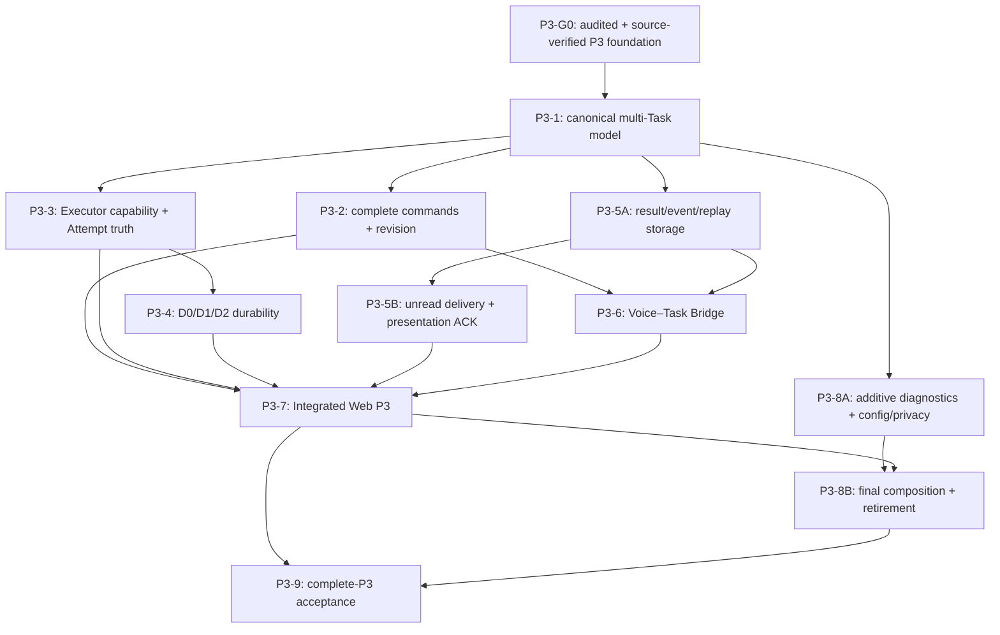

# Complete P3 execution plan

> Status: **PREPARATORY EXECUTION CONTRACT — NOT AN ACTIVE STATUS OR COMPLETION
> CLAIM.** Current product judgement, capability status and the active packet
> remain owned by [STATUS](../STATUS.md). The D-085
> [module code-fact audit](../reviews/MODULE_CODE_FACT_AUDIT_2026-08-17.md) is
> complete and synchronized; its P3 findings are the evidence baseline for
> sizing and activating this plan. This document defines the complete P3
> outcome, coherent workload, dependencies, implementation method and
> acceptance boundary; it does not award implementation, test, review or
> product credit.
>
> Date: 2026-08-18
>
> Sequencing record (2026-08-19): [D-086](../decisions/DECISIONS.md) records
> P3-G0 PASS for the audited/source-verified P3 authority-foundation Gate and
> transfers the failed post-TTS hands-free continuation and combined physical
> candidate Journey to later cumulative P1/P2/P3 acceptance. P3-1 is accepted
> at `d40e0ee391fdf162faa9d9938eb9b9610020c1a7`; STATUS then activated P3-2
> in Wave 2, and D-087 froze its six-item command contract. The additive P3-8A
> asset boundary was recorded separately.
> This does not convert `f24dd17d` into a controlled-candidate PASS or grant
> P3-2 implementation credit.
>
> Sequencing record (2026-08-21): D-088 Wave 2 and D-089/D-090 Wave 3 are
> closed on their exact scoped sources. Their applicable P3-2 through P3-6
> implementations now satisfy the dependency entrance to P3-7, but no P3-7 or
> other next packet is activated by this plan. The deferred P1/P2 continuation
> defect still blocks a later controlled-candidate or feature-complete claim.
> Mutable selection remains only in [STATUS](../STATUS.md).

## 1. Purpose and required product outcome

The objective is to move from the accepted P3alpha foundation boundary to
complete P3 Voice-driven Agent Control without turning conversation state, Demo
state or legacy scheduler state into Task authority.

Complete P3 means that a user can:

- create more than one independent background Task;
- continue foreground dialogue while those Tasks run;
- address the intended Task explicitly or complete a bounded clarification;
- query Task status, progress, blocking questions, decisions and results;
- provide additional input, update goals or constraints, change priority,
  pause, resume and cancel when the selected Executor/scheduler composition
  declares the capability;
- create an explicit successor revision when an immutable terminal Task must be
  changed;
- disconnect and reconnect without losing durable Task truth, unread results or
  the ability to replay applicable events;
- receive truthful terminal notification and retrieve the legal immutable
  `TaskResult` through text or voice presentation;
- receive D0, D1 and D2 behaviour only to the level actually declared and
  proven by the selected Executor.

The product is not complete merely because command endpoints exist. The
structured API, natural-language bridge, Store, Executor, Integrated Web UI and
voice notification path must all preserve the same identity, authority, state,
cancel, result and recovery semantics on a real path.

Complete P3 is one required component of the D-084 `feature complete` boundary.
It does not by itself prove formal P1/P2 quality, the full Integrated Web
feature-complete carrier, productized deployment or Production readiness.

## 2. Authorities and use of historical material

This plan is interpreted in the following order:

1. current code, tests, configuration, registration and runtime composition at
   the D-085 audited baseline, with affected rows re-checked after later code
   changes;
2. [STATUS](../STATUS.md) for mutable progress, blockers, dependencies and the
   active execution packet;
3. D-084 through D-090 in [DECISIONS](../decisions/DECISIONS.md);
4. stable P1/P2/P3 and shared-contract boundaries in
   [the accepted design snapshot](../architecture/FULL_SOLUTION_2026-07-30.md)
   sections 2, 4 and 5;
5. [root TESTING](../../TESTING.md) for D-032 scenario dimensions, D-046 risk
   tiers and D-074 review cadence;
6. exact-source historical regression contracts where a current package still
   owns the same behaviour.

Historical W2 and P3 records are used narrowly:

- [D104](../D104_P3_REFRESH_RECOVERY_AND_W2_ACCEPTANCE_CONTINUATION_2026-08-11.md)
  supplies the useful pattern of observed boundary, repair contract,
  verification and acceptance separation;
- [D119](../D119_RUNNING_TASK_ADJUSTMENT_AND_TERMINAL_NOTIFICATION_REVIEW_2026-08-16.md)
  preserves adjustment, terminal notification and exact-source regression
  oracles;
- [the P3alpha replacement review](../P3ALPHA_REPLACEMENT_REVIEW_2026-08-05.md)
  preserves Store/Core/Executor authority and fault scenarios that remain
  applicable.

The dated
[P3 implementation/reuse audit](../reviews/P3_IMPLEMENTATION_COVERAGE_AND_HISTORICAL_REUSE_AUDIT_2026-08-18.md)
and its
[source-asset manifest](../reviews/P3_HISTORICAL_SOURCE_ASSET_EXTRACTION_MANIFEST_2026-08-18.md)
are the extraction index for the 33 specifically requested historical commits.
The manifest also records the exact legacy-checkout refs needed to recover
historical objects absent from this repository. These records prevent repeated
branch forensics, but they do not activate an old patch or replace the
current-HEAD mapping required when a package starts.

Their old stage names, pass counts, source candidates, timeboxes, signed Gate,
rehearsal runner and next action are historical only. They must not define the
current queue or receive current product credit.

## 3. Activation and baseline Gate

Implementation expansion under this plan starts only after all of the following
are true:

1. The D-085 audit has completed, been synchronized and mapped every P3 finding
   to Task Control Core/Store, Executor & Durability, Voice–Task Bridge or a
   named cross-module owner.
2. STATUS has been reconciled to that exact audited source. A code change after
   the audit repeats the affected audit row before completion credit.
3. The confirmed product-truth blockers in the current packet have been closed
   or explicitly transferred to a package below with no false candidate claim.
4. P3-G0 has passed its scoped authoritative-foundation Gate under D-086 without
   inventing controlled-candidate credit;
   its deferred physical Journey remains a declared input to P3-9 and the later
   cumulative product decision.
5. Applicable W2/S7/S8 or rehearsal oracles needed by the first P3 packages are
   identified and move with their first current capability owner; no old runner
   is retired before its remaining oracles move.
6. STATUS activates one coherent P3 package with its capability, risk,
   dependencies, scope, exclusions and acceptance. When D-060/D-062 parallel
   execution applies, one STATUS packet may instead activate an explicitly
   bounded multi-package batch, but every child package still names its owner,
   files, risk, dependencies, acceptance and integration order. This document
   is never activated as one undifferentiated change.

Design clarification and audit-to-package mapping may occur before this Gate.
Product implementation must not use this preparatory plan to bypass D-085,
D-086's explicit risk transfer or the later cumulative acceptance route.

## 4. Frozen ownership model

The following ownership boundaries are non-negotiable unless a newer accepted
decision changes them.

| Owner | Owns | Must not own or infer |
|---|---|---|
| Task Control Core/Store | Canonical Task, Attempt, Command, Event, Result and revision records; legal transitions; command idempotency; durable outbox; reconciliation settlement | Conversation response state, TTS arbitration, Executor-internal execution or UI-selected “current Task” as authority |
| Executor & Durability | Actual Attempt execution; capability declaration; admission observation; progress/checkpoint/effect evidence; attempt cancel/recovery | Canonical Task mutation, Task presentation, unsupported capability success or inferred terminal outcome |
| Voice–Task Bridge | Conversion of committed natural-language intent into a bounded Task command or clarification; target resolution; confirmation policy | Persistence, execution, Task truth, direct TTS or mutation from partial/ambiguous input |
| Structured Command Adapter | Authenticated and authorized structured Task commands | Natural-language guessing, Executor state or presentation truth |
| Conversation Runtime | Interaction/turn/response/generation and voice presentation arbitration | Task lifecycle, Task result creation or implicit task cancellation on barge-in/disconnect |
| Agent Bridge/Harness | Conversational round truth and provenance-preserving WorkProgress mapping | TaskCommand creation or Task completion inference from text/tool chunks |
| Integrated Web | User intent capture, explicit Task selection, controls and projections validated against backend authority | Canonical Task/Attempt state, terminal truth inferred from conversation/project files or a local hint |

Identity relationships must remain explicit:

- `task_id` identifies the durable user work item across conversations and
  reconnects;
- `attempt_id` identifies one actual execution or a contractually defined
  recovery execution;
- `command_id` identifies one idempotent requested operation and its immutable
  fingerprint;
- `event_id` plus source sequence identifies one authoritative lifecycle fact;
- `TaskResult` binds the exact Task and producing Attempt and is immutable;
- presentation/ACK identity is separate from Task/Event identity and cannot
  mutate Task truth.

`playback.stop`, `response.cancel`, `round.cancel` and `task.cancel` remain four
different scopes. Speech barge-in, browser disconnect, response replacement or
Session close must never silently widen into Task cancellation.

## 5. Relative workload and package map

The size labels describe semantic and integration load, not elapsed time:

- **S** — one bounded owner or audit-to-contract settlement;
- **M** — one main owner plus a narrow integration seam;
- **L** — multiple state surfaces or one real cross-module journey;
- **XL** — shared authority/durability, schema/state evolution or cumulative
  product acceptance requiring several owners.

Historical calendar estimates are not reused. An affected-row re-audit or later
code fact may reduce, expand or reorder a package before that package starts.

| Package | Outcome | Primary owner(s) | Risk | Relative size | Hard dependency |
|---|---|---|---:|---:|---|
| `P3-G0` | Audited authoritative P3 foundation with deferred cumulative candidate acceptance | Integration Owner plus affected truth owners | Tier 0 audit / Tier 3 repair | XL composite | PASS under D-086 for this scoped Gate only |
| `P3-1` | Canonical multi-Task identity, state, Store and migration | Task Control Core/Store | Tier 3 | XL | `P3-G0` |
| `P3-2` | Complete command, adjustment and successor-revision semantics | Task Core/Store plus Executor seam | Tier 3 | XL | `P3-1` |
| `P3-3` | Capability-driven Executor admission and Attempt lifecycle | Executor & Durability plus Task Core | Tier 3 | XL | `P3-1` |
| `P3-4` | Truthful D0, supported D1 and supported D2 recovery semantics | Executor & Durability plus Store | Tier 3 | XL | `P3-3` |
| `P3-5` | Result, event replay, unread and terminal-notification durability | Task Core/Store, Runtime and Web projection | Tier 3 | L | `P3-1`, `P3-G0` |
| `P3-6` | Generalized multi-Task Voice–Task Bridge and text/voice parity | Voice–Task Bridge plus Task Core | Tier 3 | XL | `P3-1`, integrated/accepted `P3-2` implementation and `P3-5A` persistence tranche |
| `P3-7` | Formal Integrated Web P3 control and recovery experience | Web composition, Runtime and P3 owners | Tier 2/3 | L | Integrated/accepted applicable `P3-2` through `P3-6` implementations |
| `P3-8` | Observability, configuration, privacy and authority retirement | Shared composition/operations owners | Tier 2/3 | M | Additive work after `P3-1`; final composition/retirement after `P3-7` |
| `P3-9` | Cumulative complete-P3 verification, review and human acceptance | Integration Owner and independent reviewers | Tier 3 | XL | All applicable packages |

The provisional workload is therefore ten packages: including the composite
`P3-G0` prerequisite, seven are XL, two are L and one is M. No package is small
after current boundaries are applied. This is a substantial capability program
rather than a single defect batch. The packages overlap in calendar time after
their shared contracts are frozen, so the sizes must not be added as days.
`P3-5A/B` and `P3-8A/B` are internal scheduling tranches defined below; they do
not change the nine-package completion denominator.

## 6. Dependency graph, critical path and dispatch waves

The schedule distinguishes three Gates:

- **Contract/schema freeze** allows current-source inspection, manifest-asset
  selection, packet drafting and test preparation. It grants no implementation
  or package credit.
- **Integrated tranche acceptance** allows dependent production implementation
  or composition only after the hard dependency named below is integrated and
  its focused contract evidence passes. A branch existing or a schema merely
  being frozen does not open this Gate.
- **Package closure** requires focused, affected, seam and applicable real-path
  evidence after integration. Later packages may prepare against a frozen
  contract, but they cannot compose a real product path or close against an
  unaccepted dependency.

Thus P3-6 may prepare against frozen P3-2/P3-5A contracts, but its production
integration waits for both implementations/tranches to be accepted. P3-7 may
prepare its replica against frozen schemas, but real product composition waits
for every applicable P3-2 through P3-6 implementation to be accepted.

`P3-5A` and `P3-5B` below are scheduling tranches inside one package, not new
completion units. `P3-5A` owns canonical result/event/cursor/unread persistence;
`P3-5B` owns Runtime/Web delivery, consumption and presentation ACK. Likewise,
`P3-8A` is additive diagnostics/configuration/privacy foundation and `P3-8B` is
final composition plus authority/entrypoint/runner retirement after formal
replacement exists.



The critical path, with the scoped `P3-G0` foundation Gate already PASS under
D-086, is:

```text
P3-G0 → P3-1
      → max(
          max(P3-3 → P3-4,
              max(P3-2, P3-5A) → P3-6,
              P3-5A → P3-5B) → P3-7,
          P3-8A)
      → P3-8B → P3-9
```

`max(P3-2, P3-5A)` expresses logical dependency, not guaranteed concurrency:
those tranches serialize under one Core/Store owner whenever they touch the same
schema or transaction. `P3-8A` spans the middle waves without owning Task truth.
Package-owned tests, review and evidence accumulation also run continuously;
that work is not a substitute for the final exact-source `P3-9` execution.

### 6.1 Dispatch waves

The wave names below define dependency structure rather than mutable progress.
Activation always comes from STATUS. At the 2026-08-19 reconciliation, Wave
1/P3-1 was accepted and P3-2 was the only active production packet in Wave 2;
additive P3-8A assets were accepted without product-composition credit. The
2026-08-21 sequencing record above preserves the later Wave-2/Wave-3 closure
without turning this dependency table into the current queue.

| Wave | Production work | Work that may run in parallel | Exit condition |
|---|---|---|---|
| **0 — foundation** | `P3-G0` consumed the six product-truth repair groups and explicit profile work; the clean `f24dd17d` physical run remains FAIL and its post-TTS continuation plus combined Journey are deferred | No G0 production lane remains active; only package-owned historical-oracle selection may continue, with no 3A/3B/S8.5 production import | D-086 records scoped foundation PASS without controlled-candidate credit and activates `P3-1` |
| **1 — canonical spine** | `P3-1` freezes Task/Attempt/Command/Event/Result/successor identity, state and migration | After the semantic contract freezes, model/reducer, Store migration/read path and compatibility-oracle work may use separate non-overlapping lanes; one owner still integrates the schema | Multi-Task Store and migration contract is accepted; current-Task is only a hint |
| **2 — core fan-out** | `P3-2`, `P3-3`, `P3-5A` and additive `P3-8A` | Command/revision, Executor/admission, result/event persistence and telemetry/configuration/privacy foundations may proceed in separate worktrees after their shared identities freeze | Each implementation/tranche needed by Wave 3 reaches its integrated acceptance checkpoint; shared Store changes are integrated by the single Core/Store owner |
| **3 — durability and product semantics** | `P3-4` after accepted `P3-3`; `P3-6` after integrated/accepted `P3-2` plus `P3-5A`; `P3-5B` after accepted `P3-5A`; continue `P3-8A` | Executor/Durability, Bridge, Runtime presentation and additive operations lanes may run concurrently when their files and semantic ownership do not overlap | `P3-4`, `P3-6` and `P3-5B` reach their integrated acceptance checkpoints; real D0/D1/D2 claims remain bounded |
| **4 — formal carrier** | `P3-7` composes the accepted backend implementations into the formal Integrated Web carrier | Backend closure reviews and non-invasive `P3-8A` telemetry may overlap; unstable backend API work may not | Two-Task controls, recovery, unread/result and revision work through the real formal route |
| **5 — retirement and acceptance** | Finish `P3-8B`, then run `P3-9` | `P3-9` command/environment preparation may overlap retirement review, but the acceptance run waits for the exact clean integrated source | Legacy authority is retired, cumulative automated/real-path/review/human evidence passes |

### 6.2 Parallel eligibility and collision rules

The table answers whether two logical packages are actually safe to dispatch at
the same time. “Conditional” means separate worktrees are insufficient by
themselves: the Integration Owner must also prove non-overlapping files and
one already-frozen shared contract.

| Activity | Earliest production Gate | Safe concurrent activity | Must remain serialized or centrally owned |
|---|---|---|---|
| `P3-G0` | Scoped foundation Gate PASS under D-086 | No active G0 production lane; applicable oracles move only with their first owning package | Reopening controlled-candidate acceptance or the deferred P1/P2 seam requires its later accepted packet |
| `P3-1` | `P3-G0` scoped foundation Gate PASS | Internal model, migration/read and oracle lanes after the state/schema checkpoint | Task identity, state vocabulary, successor semantics and schema integration |
| `P3-2` | `P3-1` accepted | `P3-3`; `P3-5A` conditionally; additive `P3-8A` | Any overlapping `task_core.py`/`task_store.py` transaction or command-result semantic |
| `P3-3` | `P3-1` accepted | `P3-2`, `P3-5A`, additive `P3-8A` | Attempt/capability/lease vocabulary and product admission composition |
| `P3-5A` | `P3-1` accepted | `P3-3`; `P3-2` conditionally; additive `P3-8A` | Store schema/migration and terminal settlement transaction |
| `P3-8A` | `P3-1` accepted | `P3-2`, `P3-3`, `P3-5A`; later `P3-4`, `P3-6`, `P3-5B` | Central composition/profile activation is serialized with the package owning that entrypoint; this lane is additive only |
| `P3-4` | `P3-3` accepted | `P3-6`, `P3-5B`, additive `P3-8A` | Executor/Store recovery transaction, selected Adapter and D-089 linked-recovery-Attempt contract |
| `P3-6` | `P3-2` and `P3-5A` implementations integrated/accepted; preparation may start at contract freeze | `P3-4`, `P3-5B`, additive `P3-8A` | Core command authority, result truth and Web presentation |
| `P3-5B` | `P3-5A` accepted | `P3-4`, `P3-6`, additive `P3-8A` | Runtime generation/ACK owner if another lane touches the same presentation path |
| `P3-7` | Applicable `P3-2` through `P3-6` implementations integrated/accepted; replica preparation may start at schema freeze | Late dependency review and non-invasive telemetry only | Registry/AgentServer/formal-route/Panel product composition and wire-schema changes |
| `P3-8B` | `P3-7` and `P3-8A` accepted | Final acceptance preparation | Deletion/retirement versus any worker still depending on the legacy path |
| `P3-9` | All packages accepted | No product mutation; independent review and evidence runners may be parallel | Findings return to the affected owner, then the exact candidate is rebuilt and rerun |

Practical maximum concurrency is therefore determined by ownership, not by the
number of package labels. Wave 2 has up to four useful lanes, but `P3-2` and
`P3-5A` collapse into one Core/Store lane whenever they touch the same schema or
transaction. Wave 3 has up to four useful lanes. Wave 4 has one product
composition writer. The Shared semantic lane and integration history always
remain single-owner.

## 7. Package contracts

### 7.1 `P3-G0` — authoritative P3 foundation

#### Do

- Consume the D-085 P3 findings without copying subagent conclusions directly
  into product status.
- Confirm or correct the current Task/Attempt/Event/Command/Result owner map and
  actual formal/legacy/Demo composition.
- Close the confirmed terminalization, admission truth, Task-truth isolation,
  result-context and related recovery defects owned by the current packet.
- Ensure an accepted Task blocked by admission or project capacity is not
  represented as an authoritative running Attempt.
- Ensure Agent completion cannot leave application/result/terminal settlement
  disconnected while an owner or lease renews indefinitely.
- Record the exact controlled-candidate outcome. Under D-086, transfer the
  demonstrated P1/P2 post-TTS continuation defect and the uncompleted combined
  Journey to later cumulative acceptance without granting a false PASS.

#### How

- Convert each audit finding into an owner-scoped implementation packet rather
  than one cross-repository repair pile.
- Freeze the terminal path as one provenance-preserving chain:
  Agent/Executor observation → validation → application → legal TaskResult →
  Task/Attempt terminal event → outbox/lease settlement → presentation.
- Keep ACK, accepted, queued, running, result and terminal facts distinct.
- Reserve result-context capacity or use a bounded result-specific path so
  ordinary dialogue occupancy cannot invalidate a legal TaskResult.
- Use focused and affected tests from current discovery; historical exact-
  source PASS remains regression evidence only.

#### Done when

- D-085 is complete and STATUS matches the exact source.
- Every confirmed high-risk P3 truth defect has an authoritative source fix and
  applicable D-032 automated evidence.
- Leases/outbox work settle or enter bounded, truthful recovery states.
- The uncompleted real adjustment/result/terminal Journey and the P1/P2
  continuation defect are explicitly transferred to P3-9/cumulative product
  acceptance with no inherited physical credit.
- No known unresolved P3 authority defect is hidden by moving to expansion;
  any later finding returns to its owning P3 package.

### 7.2 `P3-1` — canonical multi-Task model, Store and migration

#### Do

- Support multiple non-terminal Tasks in one authorized project/scope without a
  single “current Task” pointer becoming mutation authority.
- Freeze canonical relationships among Task, Attempt, Command, Event,
  TaskResult, predecessor/successor revision and presentation cursor.
- Extend the Store and query surface for addressed Task list/status/events/
  result access, durable pagination/cursors where required and restart-safe
  reconstruction.
- Provide a versioned migration from the D-085-confirmed current schema and
  persisted records without silently discarding or relabelling historical
  truth.
- Freeze the full state vocabulary before UI or Bridge implementation. In
  particular, decide whether `queued` and `paused` are canonical states,
  capability-specific substates or strictly derived projections.

#### How

- Treat any UI/session “current Task” value only as a selection hint. Revalidate
  exact subject/project/scope/task identity against Task Core before every
  read or mutation.
- Require structured mutation commands to carry an exact `task_id`; natural-
  language commands may reach that identity only through the Bridge's bounded
  target resolution.
- Keep Task acceptance separate from Attempt execution. A persisted Task may be
  accepted/queued while no authoritative running Attempt exists.
- Define one legal transition table with terminal immutability and explicit
  unknown/interrupted handling. Store reducer, API projection, Executor mapping
  and Web vocabulary must derive from that table.
- Make migration atomic, idempotent and fail-closed on corrupt or unknown
  representations. Preserve enough version/provenance to diagnose and retry a
  failed migration safely.
- Keep read queries and event/result projection mutation-free.

#### Done when

- Two or more Tasks can be active, queried and controlled independently across
  foreground dialogue, refresh and restart.
- Wrong, stale, foreign or ambiguous task identity has zero Task/Attempt/
  Executor/file/presentation mutation.
- Duplicate or conflicting command identity cannot allocate another Task or
  Attempt.
- The Store reconstructs exactly the same canonical truth after restart, or
  reports a bounded corruption/migration error without partial promotion.
- “Current Task” convenience cannot redirect a command intended for another
  Task.
- Current persisted data migrates with explicit compatibility evidence and no
  historical status invention.

### 7.3 `P3-2` — complete command, adjustment and revision semantics

Frozen D-087 contract and activation map: [P3-2 and P3-5A Core/Store contract
and oracle map](../reviews/P3_2_P3_5A_ACTIVATION_PREPARATION_2026-08-18.md).

#### Do

Provide a coherent command model for:

| Operation | Required product semantics |
|---|---|
| `create` | Persist one Task intent and command result; admission/execution truth follows separately |
| `get/list/status/events/result` | Read canonical records with zero mutation and exact scope filtering |
| `update` | Change a queued goal/constraint atomically before dispatch, or a running one only at a supported and proven Executor checkpoint |
| `provide_input` | Answer the exact current blocking question/decision context without becoming a system instruction |
| `pause` | Request pause only when the selected Executor can reach and prove a paused boundary |
| `resume` | Resume only the exact paused/recoverable Task/Attempt according to the frozen recovery contract |
| `reprioritize` | Change scheduling priority without pretending that execution state changed |
| `cancel` | Idempotently request cancellation of the exact target; ACK is not terminal cancellation |
| successor revision | Explicitly create a new Task linked to an immutable terminal predecessor; never rewrite the old TaskResult |

#### How

- Use one versioned command envelope with stable command identity, immutable
  fingerprint, subject/project/scope, exact target, expected version or state,
  capability requirements, confirmation proof and bounded untrusted payload.
- Persist command admission and outbox work atomically with the canonical facts
  needed to replay the original result.
- Separate `accepted`, `applied`, `rejected`, `unsupported`, `conflict`,
  `timeout` and `unknown`. An accepted command cannot be announced as applied.
- Define operation-specific legal states and races before implementation. A
  concurrent terminal event may defeat update/pause/cancel without changing
  terminal truth.
- Reuse D119 adjustment oracles only where current code still owns the same
  contract; generalize away from the exact Demo checkpoint and grammar.
- Keep terminal Task and TaskResult immutable. Successor creation is explicit,
  authorized and idempotent, with a durable predecessor link and a new
  `task_id`.
- Do not invent a separate `approve` operation unless a new accepted product
  decision requires it. A current blocking answer should use the frozen
  `provide_input`/decision contract or return unsupported.

#### Done when

- Every declared operation has positive, invalid-state, wrong-target,
  duplicate/conflict, concurrent-terminal, restart and unsupported-capability
  evidence where applicable.
- Multiple ordered updates or inputs are applied once and in authoritative
  order, or rejected with no partial Executor/Store effect.
- Pause/resume and priority labels reflect actual Executor/scheduler capability;
  unsupported operations never appear successful.
- Terminal revisions preserve the predecessor and result byte-for-byte while a
  new Task receives the revised goal.
- Text and voice callers observe the same command result and TaskEvent truth.

### 7.4 `P3-3` — capability-driven Executor admission and Attempt lifecycle

Activation preparation: [P3-3 capability and admission
map](../reviews/P3_3_CAPABILITY_ADMISSION_ACTIVATION_PREPARATION_2026-08-18.md).

#### Do

- Freeze versioned Executor and scheduling capability descriptions covering
  start, status, cancel, update/input, pause/resume, priority where applicable,
  checkpoint/recover and reconciliation.
- Select an Executor only when its declared capabilities satisfy the Task's
  requirements and authorized context.
- Separate Task acceptance, queue/admission state, Attempt allocation,
  authoritative running evidence and terminal outcome.
- Support multiple Task admissions without cross-project or cross-Task lease,
  target or working-tree collision.
- Bound lease ownership, heartbeat, timeout, orphan detection, outbox claim and
  retry so a stuck Adapter cannot remain “running” indefinitely.
- Normalize real Executor progress and terminal evidence without inferring
  success from stream end, Agent text, files or a successful transport ACK.

#### How

- Make capability negotiation a formal input to admission; missing capability
  returns stable `unsupported` before mutation that assumes the operation.
- Bind each Attempt to exact task, executor, project target, origin namespace,
  idempotency identity, owner token and contract version.
- Fence stale owners and late observations with lease/claim tokens. A retry of
  the same external dispatch reuses the contracted identity rather than
  creating duplicate work.
- Represent `EXECUTOR_PROJECT_BUSY` as accepted/queued or rejected according to
  the frozen admission contract, never as an observed running Attempt.
- Define bounded timeout and orphan outcomes. Unknown external outcome remains
  unknown or requires reconciliation; it never becomes “never dispatched” or
  completed.
- Preserve exact cancel targeting. Cancel acceptance does not release ownership
  or publish terminal until authoritative settlement.

#### Done when

- Capability selection, unsupported paths and fallback are externally
  observable and truthful.
- Two eligible Tasks can progress without sharing Attempt/lease/project
  authority, and capacity-limited Tasks queue or reject without false running.
- Timeout, Adapter crash, stale heartbeat, late result, duplicate dispatch and
  cancel/terminal races settle once with bounded ownership.
- No owner/lease/outbox claim renews forever without useful progress or a
  bounded recovery state.
- Every terminal Task maps to one legal immutable outcome with source
  provenance, and unknown evidence never maps to success.

### 7.5 `P3-4` — D0, D1 and D2 durability/recovery

Activation preparation: [P3-4 durability and recovery
map](../reviews/P3_4_DURABILITY_RECOVERY_ACTIVATION_PREPARATION_2026-08-18.md).

#### Do

Implement and expose durability by declared Executor capability:

| Level | Required implementation and proof |
|---|---|
| D0 | A started Task survives voice/Session disconnect while the application and Executor remain alive; restart reconciles persisted records with actual execution and reports `interrupted/unknown` when continuation cannot be proved |
| D1 | A versioned, integrity-checked checkpoint restores work that is side-effect-free or safely retryable, with exact Task/Attempt/checkpoint/context binding and no duplicate work |
| D2 | External effects use stable operation identities and durable reconciliation so the final outcome is exactly-once-equivalent or explicitly enters bounded manual resolution |

#### How

- Record the selected durability level and capability version on Task/Attempt
  admission; presentation must not promise a stronger level.
- For D1, persist checkpoint producer, schema/version, integrity, Task/Attempt,
  source context versions, effect-safety classification and resume provenance.
- Freeze whether D1 resumes the same Attempt or creates a linked recovery
  Attempt before implementation. Either choice must preserve auditability and
  must not silently reset retry budgets or result ownership.
- For D2, use a durable effect ledger or equivalent Adapter-owned evidence with
  stable external operation keys, intended effect, observed effect, settlement
  and manual-resolution state.
- Treat process death between external effect and Store acknowledgement as an
  unknown/reconciliation case, never an automatic retry without effect
  evidence.
- Ensure restart reconciliation is idempotent across repeated starts and two
  coordinating processes.

#### Done when

- Every declared level has real Adapter and fault/restart evidence; undeclared
  levels return `unsupported` with zero assumed recovery.
- D0 disconnect and restart semantics match the documented boundary exactly.
- D1 resumes from the exact checkpoint without duplicated Agent/Tool/file or
  external effects and produces a traceable terminal result.
- D2 either proves the intended external outcome once or exposes an explicit
  unresolved/manual state; it never silently reports completed.
- Retry, restart and reconciliation cannot allocate an unauthorized replacement
  Task or lose the predecessor Attempt/effect provenance.

Before this package starts, a design checkpoint must settle which real
Executor adapters claim D1 or D2 and whether feature-complete requires one real
adapter at each level. The plan does not manufacture those capabilities from a
D0 carrier.

### 7.6 `P3-5` — TaskResult, event replay, unread and terminal notification

Activation preparation: [P3-5A persistence contract](../reviews/P3_2_P3_5A_ACTIVATION_PREPARATION_2026-08-18.md)
and [P3-5B delivery/consumption contract](../reviews/P3_5B_P3_6_ACTIVATION_PREPARATION_2026-08-18.md).

#### Do

- Persist one legal immutable `TaskResult` for each completed Task, bound to
  the exact Task, producing Attempt, outcome, bounded summary and authorized
  artifact references; other terminal outcomes must not fabricate a result.
- Expose durable Task events/result query with a bounded cursor and an unread or
  consumption model that survives reconnect and restart.
- Preserve the terminal TaskEvent as notification identity while keeping voice/
  text presentation ACK separate from canonical Task truth.
- Deliver blocking questions, decision requirements, progress and terminal
  results to the correct active interaction when one exists; retain unread
  facts when none exists.
- Prevent dialogue context capacity or unbounded project reread from rejecting,
  fabricating or replacing a legal TaskResult.

#### How

- Validate and persist application/result before terminal publication; release
  lease/outbox ownership only after the canonical settlement transaction or a
  truthful recoverable state.
- Store bounded result data and references, not credentials or uncontrolled
  artifact content as instructions. Artifact reads revalidate permission,
  version and scope.
- Define cursor monotonicity, replay bounds, ACK idempotency and unread
  semantics. Task event replay is at-least-once unless stronger evidence exists;
  playout followed by crash before ACK may replay.
- Allocate a new current response generation for voice notification. Never
  reuse the task-create generation or let TaskEvent call TTS directly.
- Map completed/failed/cancelled/interrupted/unknown to distinct truthful
  presentation. Completed requires a legal TaskResult.

#### Done when

- A legal result cannot be lost because foreground dialogue consumed an
  unrelated context budget.
- Reconnect, refresh and restart recover the same result/event truth without
  duplicate Task mutation.
- ACK suppresses later applicable presentation replay; missing ACK retains the
  unread fact without claiming exactly-once speech.
- Wrong activation/generation/session/task/attempt events cannot present or
  consume another Task's result.
- Query and replay have zero Task/Executor/TTS mutation except the separately
  authorized presentation-consumption record.

### 7.7 `P3-6` — generalized Voice–Task Bridge and text/voice parity

Activation preparation: [P3-6 target, clarification and parity
map](../reviews/P3_5B_P3_6_ACTIVATION_PREPARATION_2026-08-18.md).

#### Do

- Route committed natural-language intents for create, query/status, update,
  provide-input, pause, resume, reprioritize, cancel and explicit successor
  revision.
- Resolve among multiple visible Tasks using explicit identifiers, stable user-
  facing references and bounded clarification.
- Generalize beyond the controlled Chinese “把/将” grammar and exact itinerary
  while keeping deterministic safety policy after any NLU/model proposal.
- Provide the same target, authorization, confirmation, command and result
  semantics for text and voice origin.
- Return Task events to Conversation Runtime for voice arbitration and to the
  existing text/UI adapter for text origin.

#### How

- Accept only committed input. Partial/interim speech, low confidence,
  ambiguity, negation and ordinary dialogue have zero Task effects.
- Separate intent classification from authority. A model or grammar may propose
  operation/target/arguments; a closed policy validates supported operation,
  exact target, scope, permission, confirmation, bounds and capability.
- Require explicit confirmation for destructive or materially redirecting
  operations according to the accepted policy. The confirmation binds one
  command fingerprint and cannot authorize a later changed command.
- End an ambiguous resolution with clarification; the user's answer becomes a
  new committed intent rather than mutating from partial speech.
- Prefer stable task identity in structured UI. Natural-language recency or
  names may narrow candidates but must not guess when more than one remains.
- Maintain a multilingual/golden corpus owned by this capability and separate
  Demo itinerary phrases from general product evidence.

#### Done when

- The declared intent corpus meets the accepted precision/recall target across
  supported languages and paraphrases, not only exact fixtures.
- Multi-Task target ambiguity, wrong scope, partial speech, negation and failed
  confirmation produce zero Agent/Tool/Task/Executor/file/audio/history effects.
- Every supported natural-language operation produces the same canonical
  command result as its structured equivalent.
- Task status/result speech is sourced from canonical events/results, not
  conversation text or project-file inference.
- Foreground dialogue remains usable while background Tasks run and while
  clarification occurs.

### 7.8 `P3-7` — formal Integrated Web P3 experience

#### Do

- Present a scoped Task list/selector, stable Task identity, state/outcome,
  progress, blocking question, available controls, unread result and revision
  relationship.
- Expose only controls supported by current Task state, authorization and
  selected Executor capability.
- Keep accepted/queued/running/paused/blocked/decision-required/terminal labels
  aligned with the frozen canonical/projection contract.
- Recover selection and unread presentation after refresh/reconnect by treating
  browser storage only as a hint and revalidating backend authority.
- Keep foreground dialogue, voice interruption and Task notification separate
  but coherently arbitrated by Conversation Runtime.
- Make the formal route the supported default for the declared product profile;
  preserve feature-off compatibility until the retirement Gate passes.

#### How

- Fetch/revalidate the exact Task before enabling a control. Local React state,
  project files, transcript text or stale progress cannot authorize mutation.
- Display command acceptance separately from application and terminal outcome.
- Bind UI actions to exact task/attempt/command identity and show stable errors
  for conflict, unsupported, stale, authorization failure and unknown outcome.
- When the selected Executor exposes a separately accepted real `provide_input`
  primitive, route blocking answers through it; otherwise keep the control
  unavailable or return stable `unsupported`. Route revisions through explicit
  successor creation and never mutate Task truth in the UI.
- Reuse Runtime/TTS response ownership, generation fencing and PresentationAck.
  A Task event never bypasses the arbiter to speak directly.
- Remove legacy hooks/flags only after formal composition, flag-off regression
  and migrated oracles prove replacement.

#### Done when

- A real user can create and distinguish at least two Tasks, continue dialogue,
  query and control either exact Task, reconnect, consume unread results and
  create an explicit revision without false truth.
- All supported controls work through the real Task Core and Executor path;
  fake/Demo/legacy carriers receive no product credit.
- Refresh/reconnect never creates a duplicate Task or exposes a foreign/stale
  Task.
- Voice notification, text presentation and controls remain correct under
  barge-in, stale generation, concurrent terminal event and missing ACK.
- Feature-off preserves the supported old text path until its accepted
  retirement.

### 7.9 `P3-8` — observability, configuration, privacy and retirement

#### Do

- Correlate subject/project/session/interaction/response with
  task/attempt/command/event/outbox/executor/checkpoint/effect and presentation
  identities without collapsing their scopes.
- Add bounded diagnostics for admission, queue, lease, outbox, checkpoint,
  recovery, reconciliation, result and presentation latency/failure.
- Preserve the explicit named Live Voice profile and ordinary-production
  default-off semantics proven on `f24dd17d`; generalize the remaining exact
  itinerary/task policy, trusted Demo bypass and module-owned configuration.
- Redact command input, blocking answers, TaskResult content, artifact details
  and credentials from ordinary logs while preserving useful identifiers and
  error classification.
- Retire legacy scheduler/Bridge/UI authority, obsolete entrypoints, duplicate
  validators and old runners only after formal replacement and oracle migration.

#### How

- Use one correlation/causation model across EventEnvelope and telemetry; record
  source authority and state transition rather than free-text guesses.
- Bound metric labels and do not place raw prompt/result/audio or secrets in
  traces.
- Keep Provider/Executor-specific configuration behind adapters and declare
  capabilities from validated configuration, not environment-variable
  presence alone.
- Follow the existing code/document retirement audits. Consolidate duplicate
  code only when owner, failure, idempotency and zero-side-effect semantics are
  proven identical.
- Move applicable old test support under explicit capability-owned tests or
  `tests/support` before deleting the historical runner.

#### Done when

- A failed journey can identify the exact Task/Attempt/Command/activation/
  generation/ACK/Executor seam without exposing private content.
- No production capability depends on `.env.production` being implicitly
  enabled or on the controlled Demo itinerary/bypass.
- Formal composition is the only product authority; remaining compatibility
  paths are explicitly bounded and flag-off tested.
- Every removed entrypoint/runner has replacement-oracle evidence and current
  Markdown links remain valid.
- Configuration errors fail closed and never silently downgrade durability or
  authorization claims.

### 7.10 `P3-9` — cumulative verification and complete-P3 acceptance

#### Do

- Close every package with capability-owned focused tests and affected
  regressions, then verify all P3 seams cumulatively on one exact clean source.
- Apply the complete applicable D-032 matrix from [TESTING](../../TESTING.md)
  to Tier 3 Task authority, mutation, durability and product-candidate paths.
- Run cold complete-diff and independent module-boundary reviews at coherent
  closures, then one cumulative integration-seam review.
- Exercise real Web, voice, Agent/Tool, Store and Executor boundaries; fake and
  deterministic tests remain supporting evidence only.
- Record exact commands, source and environment labels without credentials or
  private Task/audio/result content.

#### Required product journeys

1. **Multi-Task control:** create Tasks A and B, continue foreground dialogue,
   query each, update A and cancel B without cross-effects.
2. **Blocking/input:** on a composition that declares a separately accepted real
   `provide_input` primitive, observe one real blocked or decision-required
   event, provide exact bounded input and prove ordered application before
   terminal. If the selected product profile has no such primitive, prove stable
   zero-effect `unsupported` and obtain an accepted complete-P3 scope decision
   before PASS; absence cannot silently count as positive support.
3. **Capability controls:** exercise pause/resume/reprioritize only on each
   supporting Executor/scheduler composition and prove stable zero-effect
   `unsupported` on a non-supporting path. If the selected product profile has
   no real pause/resume primitive, settle that complete-P3 scope by accepted
   decision before PASS rather than inheriting support from P3-3/P3-4.
4. **Result/replay:** disconnect or refresh, recover Task identities, consume an
   unread terminal result and prove ACK/replay semantics.
5. **Restart/durability:** prove D0 restart truth and every declared D1/D2 path
   under process failure at the dangerous persistence/effect boundaries.
6. **Races/isolation:** cover duplicate/conflicting commands, cancel/terminal,
   update/terminal, pause/complete, stale owner, wrong Task/project/session,
   reordered event and result/notification generation races.
7. **Compatibility:** feature-off and supported text APIs retain contracted
   behaviour until explicit retirement.

#### Done when

- Positive journeys succeed and exact authoritative Task/Attempt/Result truth is
  user-visible.
- Every invalid, ambiguous, stale, wrong-scope and unsupported path fails closed
  with explicitly asserted zero forbidden effects.
- Restart, retry, reconciliation and unknown outcomes never duplicate work or
  masquerade as success/running/terminal.
- All claimed Executor levels and Web/voice controls have real-path evidence.
- The cumulative source passes applicable backend/frontend/build/static checks,
  independent Tier 3 review and the complete human P3 journey.
- STATUS can mark the three P3 module boundaries complete on that exact source
  without relying on Demo, legacy, fake or historical acceptance credit.

## 8. Cross-module seam checklist

| Seam | Required invariant | Closure owner |
|---|---|---|
| committed input → Task command | Only committed and authorized intent can reach Task Core; partial/ambiguous input has zero effects | Voice–Task Bridge plus Task Core |
| Task acceptance → Executor admission | Accepted/queued is not running; running requires authoritative Attempt evidence | Task Core plus Executor |
| Executor completion → Task terminal | Validation, application, legal result, terminal event and lease/outbox settlement form one recoverable truth chain | Executor plus Task Core/Store |
| TaskEvent → WorkProgress | Projection preserves source ID/sequence/outcome and never invents progress | Task Core/Bridge projection owner |
| Task result → dialogue context | Result is reserved/bounded canonical input; conversation/project files cannot replace it | Task Core plus Agent Bridge/context selector |
| TaskEvent → voice/text presentation | Runtime owns voice response/generation/TTS; text adapter owns text presentation; ACK is separate from Task truth | Conversation Runtime plus Web |
| barge-in/disconnect → Task lifecycle | Stop/cancel at response or round scope never widens to Task cancellation | Runtime, Agent Bridge and Task Core |
| reconnect/restart → replay | Stored event/result truth replays by bounded cursor; local hints are revalidated | Store plus Web/Runtime |
| capability → UI/Bridge command | Unsupported operations are unavailable or return stable unsupported with zero implied success | Executor, Task Core, Bridge and Web |
| context/artifact → execution | Version, scope, permission, expiry and redaction remain exact; content stays untrusted | Context/permission owner plus Executor |

Any package that changes one of these seams is Tier 3 even if most edited code
looks like UI, mapping or plumbing.

## 9. Test and evidence ownership

This document does not duplicate the D-032 matrix. Each Tier 3 package must
record the applicability and evidence for every dimension defined in
[TESTING](../../TESTING.md), scope out only genuinely inapplicable dimensions
and assert every forbidden side effect as zero.

Minimum P3-owned oracle families are:

- canonical reducer/state transition and terminal immutability;
- command idempotency, conflict and replay;
- multi-Task identity, target selection and cross-scope isolation;
- outbox/lease/owner fencing and bounded timeout/orphan recovery;
- Store transaction failure at every boundary around external effects;
- Executor capability negotiation and truthful unsupported/fallback;
- cancel/update/pause/resume/terminal races;
- D0 restart reconciliation and every declared D1/D2 fault point;
- result legality, context capacity, replay/unread and ACK;
- committed/partial/ambiguous/negated voice and text intent;
- flag-off compatibility and formal-route composition;
- real Web/Agent/Tool/Executor product journeys.

Historical W2 or stage-named tests are inventoried before removal. An applicable
oracle moves to the current capability owner, is shown to detect the intended
defect/forbidden effect, passes on current behaviour and participates in current
test discovery before the historical entrypoint is deleted.

Semantic and corpus ownership is package-scoped rather than a separate truth
authority. A packet that changes endpoint/turn/Interaction policy is owned by
P1/P2 Interaction Intelligence and freezes its languages, device/audio labels,
false-endpoint/interruption/echo/double-talk corpus, thresholds and regression
oracles before implementation. A packet that changes Task intent, targeting,
clarification or confirmation policy is owned by the Voice–Task Bridge and
freezes its languages, positive/negative/ambiguity/negation corpus, thresholds
and zero-forbidden-effect evidence. P3-7 may consume only the accepted semantic
result; it does not train or redefine it in UI state. P3-9 reruns the applicable
fixed corpora and real seams cumulatively. Any new classifier or product policy
requires an explicit scope/risk checkpoint before code changes.

## 10. Parallel ownership and integration strategy

Parallel lanes are ownership boundaries, not a fixed worker count:

- **Core/Store lane:** canonical model, migration, commands, outbox, events,
  result and replay storage;
- **Executor/Durability lane:** capability, admission, Attempt execution,
  checkpoint, recovery and reconciliation;
- **Bridge/Product lane:** natural-language routing, target clarification,
  formal Web controls and Runtime presentation;
- **Shared semantic lane:** identity/state/cancel/result/capability schema,
  composition, compatibility and cumulative verification, owned only by the
  Integration Owner.

Before parallel implementation, the Integration Owner freezes the shared
contract and allocates non-overlapping files or worktrees. Under D-060/D-062,
one active STATUS packet may carry a bounded multi-package batch only when each
child package has its own owner, files, risk, dependencies, acceptance and
integration order; otherwise only one coherent package is active. Workers may
not resolve cross-module semantic conflicts locally. Each return contains:

- exact baseline and owned scope;
- changed contract/behaviour and explicit exclusions;
- tests run with results and unrun requirements;
- risk-matrix coverage and zero-side-effect evidence;
- migration/compatibility consequences;
- unresolved questions and recommended Integration Owner decision.

Integration occurs in dependency order, followed by focused seam tests. A
coherent module or related-package closure receives the review cadence required
by TESTING; small checkpoints do not manufacture review or completion credit.

## 11. Required packet template

Before any package is implemented, its active packet in STATUS or linked
evidence must state:

1. capability/module and named owner;
2. exact D-085 findings and current code baseline it addresses;
3. D-046 risk tier and shared seams touched;
4. dependencies and activation Gate;
5. included behaviour;
6. explicit exclusions and unsupported capabilities;
7. state/authority/cancel/result/recovery contract;
8. migration and flag-off compatibility;
9. applicable D-032 scenarios and zero-forbidden-effect assertions;
10. focused, affected, real-path and human acceptance;
11. review boundary and evidence destination;
12. retirement Gate for any temporary flag, hardcode, duplicate or legacy
    entrypoint.

When historical reuse applies, the same packet also records the selected
`asset_ids`, verified `source_repository_ref` and commit/range, `current_head`,
current target mapping, preserve/rewrite/drop decisions, test destinations,
forbidden claims and retirement return from the
[source-asset manifest](../reviews/P3_HISTORICAL_SOURCE_ASSET_EXTRACTION_MANIFEST_2026-08-18.md).
These fields are conditional; they do not require a standalone G0 delta record.

The packet describes a coherent product result, not a list of files or
functions. Exact files and commands are discovered from the current checkout
when the packet starts.

## 12. Settled and remaining design checkpoints

The accepted design fixes the product boundary. P3-1 and D-087 settle the
foundation and P3-2 command semantics below; D-088 through D-090 further settle
the scoped capability/admission, durability/recovery, consumption and targeting
choices. Unsupported primitives and later product composition remain explicit:

Accepted P3-1 source `d40e0ee391fdf162faa9d9938eb9b9610020c1a7`
already settles two foundation facts: `queued` is only a projection of an
accepted Task without authoritative running evidence, and current-Task state is
only a replaceable selection hint. It also freezes successor lineage as a new
Task identity with predecessor/revision fields. D-087 now fixes the P3-2
command, eligibility and atomic creation transaction on that lineage.

| Question | Current accepted decision | Remaining block |
|---|---|---|
| If pause/resume is supported, how is `paused` represented? | D-087 keeps it non-canonical and freezes pause/resume as zero-effect `unsupported`; never relabel blocked/accepted/decision-required | Scoped P3-3/P3-4 closure added no real primitive. Positive support requires a separately accepted capability/policy expansion and later P3-7 composition; it is not inherited from those package PASS results |
| Does D1 resume the same Attempt? | D-089 preserves `task_id` and requires an explicit linked/new recovery `attempt_id` with immutable producer provenance | Settled for scoped Direct P3-4; later Executor generalization and P3-9 acceptance must preserve it |
| Which adapters must prove D1/D2? | D-089 selects current Direct for the scoped real D1/D2 path and keeps legacy D0-only; interface support alone grants no level | Generalize the declared Executor/profile matrix and prove every claimed real path again in P3-9 |
| What does reprioritize control? | D-088 gives the real admission queue `low|normal|high|urgent`; accepted/queued targets may apply it, while claimed/running/blocked/decision-required/terminal targets remain truthful conflict paths | P3-7 product composition and later policy/generalization; no running-scheduler capability is implied |
| How are decision-required answers represented? | D-087 binds bounded untrusted input to the exact current `task.decision_required` event; D-089 P3-6 settles targeting/clarification/confirmation without inventing an Executor input primitive | `provide_input` remains unsupported until a real primitive receives a separately accepted owner/capability contract; later P3-7 may compose only that proven behavior |
| What is unread/replay retention? | D-088 retains immutable TaskEvent/legal TaskResult for Task lifetime with class-isolated durable ACK; D-090 adds Task-wide, cross-Attempt bounded/paged cursor recovery over the same ledger | P3-7 product composition and P3-9 acceptance; Production retention/SLO/compaction remains outside this plan boundary |
| Which terminal outcomes and command contract may create a successor? | D-087 fixes `task.create_successor`, exact predecessor/result binding, one direct successor, eligible `completed/failed/cancelled/interrupted` outcomes and immutable predecessor truth; D-089 P3-6 settles its authenticated routing | Contract and backend routing settled; P3-7 later composes them |

D-087 through D-090 settle the scoped backend decisions above. Remaining work
is explicit unsupported-primitive expansion, product composition,
generalization and cumulative acceptance—not a license to reopen those contracts
silently. Any material change to accepted authority, durability or product
semantics still goes through the decision process before implementation.

## 13. Complete-P3 definition of done

Complete P3 can be reported only when all of the following hold on one exact
source:

1. Multiple Tasks are independently addressable and survive conversation/
   connection lifecycle as contracted.
2. Full supported control operations and explicit successor revision work with
   exact target, idempotency, authorization and truthful state transitions.
3. Task Core/Store is the only canonical Task authority; UI, conversation,
   project files, legacy scheduler and Demo state cannot fabricate truth.
4. Executor selection and every claimed D0/D1/D2 behaviour are capability-
   driven, bounded and proven on real fault/recovery paths.
5. Result, progress, blocking questions, decisions, replay/unread and terminal
   notification are durable, correctly correlated and user-observable.
6. Voice and structured/text operations have equivalent authority and result
   semantics; partial, ambiguity, negation and wrong target have zero effects.
7. Foreground conversation remains responsive and barge-in/disconnect never
   implicitly cancels a Task.
8. Formal Integrated Web composition is the supported product path for the
   declared profile; feature-off compatibility is proven until retirement.
9. Demo-only hardcodes and legacy authority are retired according to their
   gates; protocol/safety constants remain.
10. Capability-owned automated evidence, real-path evidence, cold review,
    independent Tier 3 review and cumulative human P3 acceptance pass.
11. All evidence is bound to the exact clean source; unavailable or unrun tests
    are not reported as PASS.
12. STATUS is updated once from that evidence without changing the historical
    exact-source Integrated Web Alpha result.

Only then may the three P3 module rows be considered for `COMPLETE`. D-084
feature-complete still additionally requires formal P1/P2, the complete
Integrated Web carrier, generalization, cleanup, competitor-gap review and
independent cross-module closure.

## 14. Explicit exclusions

This P3 plan does not include:

- Production authentication/multi-tenancy hardening, public deployment,
  SLO/retention operations or release/rollback;
- optional Native model-level duplex;
- unrelated P1 device/Speech quality work or P2 media/interaction quality,
  except their exact P3 seams;
- unconditional D1/D2 claims for an Executor that does not declare and prove
  them;
- a new Agent/Harness Task authority, a second Task Store or a second terminal
  notification protocol;
- automatic successor creation from an ambiguous or terminal update;
- resurrection of signed W2 Gate, fixed manifests, Replacement Ledger or
  retired rehearsal tooling;
- `develop` integration, remote-ref updates, credential movement, provider
  billing/account changes or public deployment;
- broad duplicate abstraction or legacy deletion before contract/oracle
  replacement.

If an affected-row re-audit or implementation evidence proves that current code
requires a material product/architecture choice outside the accepted boundary,
unaffected planning continues, the exact decision is isolated, and no
implementation silently chooses the product semantic.
