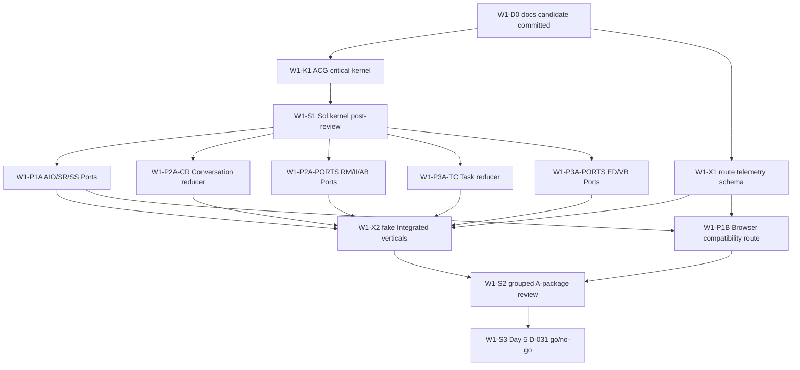

# Live Voice Week 1 Sol execution plan

> Planning date: 2026-08-03
> Historical execution contract: **Week 1 is complete**. The package boundaries, dependencies and scenario oracles remain useful reference material, but this file is not the current queue.
> Freeze-state snapshot at plan creation: **SOL DESIGN COMPLETE / IMPLEMENTATION NOT STARTED**; consult STATUS for the completed implementation facts.
> Original delivery window: the five working days after the documentation candidate was committed; this is historical timing, not a current schedule.
> Current progress authority: [STATUS.md](../STATUS.md)
> Current risk tiers and review cadence: root [TESTING.md](../../TESTING.md). Historical product ordering in this file is not current status.
> Shared contract authority: [ARCHITECTURE_CONTRACT_GATE_V1.md](../architecture/ARCHITECTURE_CONTRACT_GATE_V1.md)
> Ownership update: [D-049](../decisions/DECISIONS.md) replaces this snapshot's W1-K1 non-Sol owner with direct Sol implementation after five unsuccessful candidate reviews. The original owner text below is retained as dated history; see [the review record](../W1_K1_IMPLEMENTATION_REVIEWS_2026-08-03.md) and STATUS for current action.
> Execution-policy history: [D-052](../decisions/DECISIONS.md) ended switching work to DeepSeek; [D-060](../decisions/DECISIONS.md) later created a bounded four-lane Alpha exception. Historical owner/model fields below no longer assign work; STATUS and the Alpha parallel plan own current allocation, while package boundaries, dependencies, risk tiers and scenario oracles remain valid.
> Product-carrier update: [D-055](../decisions/DECISIONS.md) replaces historical Windows/X-WIN productization with Web/X-WEB. Windows wording below remains part of this dated plan and does not define the current Alpha carrier.

This is the dated, execution-level handoff required by D-041, D-046, and D-048. It freezes priority, dependencies, code ownership, package boundaries, scenario oracles, target files, and verification commands for Week 1. It does not report implementation progress. `STATUS.md` remains the only mutable source for package state, tested SHA, blockers, and current next action.

An executor must start from the committed documentation candidate, record its actual start SHA, and work only on a package marked `READY` or whose stated Gate has actually passed. Empty implementation evidence means not started. A package definition is not permission to invent missing architecture.

## 1. Week 1 outcome and exclusions

Week 1 succeeds when:

1. the ACG critical kernel has Python/TypeScript fixture parity and grouped Sol post-review;
2. route telemetry can distinguish `formal`, `fallback`, `demo_substitute`, `unsupported`, and `unknown` without claiming unimplemented capability;
3. P1, P2, and P3alpha each have at least one pure A-package/fake path built on the shared kernel;
4. at least one real compatibility path, preferably Browser Speech behind the P1 Ports, begins replacing a V0 shortcut in the cumulative route;
5. feature-off and existing V0/task regressions remain unchanged;
6. Sol performs the Day 5 D-031 go/no-go using actual TC/Event progress rather than the old D-031-first plan.

Week 1 does **not** promise the Week 2 90% Gate, a real streaming Provider, real Realtime Media, full TC-B persistence/outbox, production authentication, D1/D2, full P3, or cleanup of the legacy Demo implementation. Those remain later or conditional packages.

## 2. Whole-project execution priority

The labels below are execution priorities and must not be confused with product planes P1/P2/P3.

| Execution priority | Why it comes here | Scope | Exit condition |
|---|---|---|---|
| `E0 — unblock parallel work` | every formal track consumes the same identity, authority, commit, lifecycle, cancel, fence, error, capability, and feature-off facts | ACG critical kernel; route taxonomy; formal source namespaces | grouped kernel review passes; no v1 relabeling or legacy authority growth |
| `E1 — establish three formal tracks` | Week 2 cannot reach 90% if only one plane has real ownership | P1 AIO/SR/SS A packages; P2 CR/RM/II/AB A packages; P3alpha TC/ED/VB A packages; fake verticals | each track compiles, passes its scoped conformance, and exposes a truthful route |
| `E2 — replace Demo shortcuts continuously` | module completion without cumulative integration does not earn Demo credit | Browser/Agent/AutoHarness compatibility Adapters, Integrated route wiring, X-OBS/X-E2E | formal/fallback/substitute owner is visible; flag-off path unchanged |
| `E3 — Week 2 Gate and remaining B/C` | the Demo target is an evidence-bearing cumulative journey | real P1/P2/P3alpha B/C wiring, fault injection, Windows and provider/executor evidence | Replacement Ledger `>=90/100` and every mandatory invariant passes |
| `E4 — Week 3–4 Alpha` | real vertical and joint behavior, not Demo scoring, closes the commitment | consumer-specific ACG extensions, three real verticals, P2/P3alpha joint Gate, immutable candidate | Integrated Windows Alpha acceptance passes |
| `E5 — stretch/later` | these do not block the four-week committed Alpha | complete P3, D1/D2, multi-platform, production auth/SLO/privacy/hardening | separately approved milestone and evidence |

P2 has the largest Week 2 journey weight, but it cannot bypass E0. P1 and P3alpha should not wait for all P2 extensions; after the consumed kernel is reviewed, the three planes proceed in parallel.

## 3. Authority and module boundary map

| Module / package family | Sole authority or owned fact | Week 1 output | Explicit non-goal / forbidden takeover |
|---|---|---|---|
| ACG shared contract | versioned identity/scope/envelope/state/cancel/fence/error/capability semantics | v2 critical-kernel types, fixtures, validators, pure fakes | no Provider, transport, runtime, task store, UI, credentials, or production auth |
| AIO | physical capture/playout, mute, local playback cursor/ACK | Audio Port and deterministic fake | must not choose response/round/task cancel or claim queued audio was heard |
| SR | recognition session and immutable hypothesis facts | provider-neutral Port/fake and critical-token decision shape | final hypothesis is not TurnCommit; no Agent/Tool/Task dispatch |
| SS | synthesis session, render request, audio-chunk provenance | provider-neutral Port/fake and span mapping | no Chat text rewrite, presented claim, or lifecycle ownership |
| RM | connection/frame/ACK/backpressure facts | Media Port/fake | no interaction/response/task state and no cancel-policy decision |
| CR | canonical interaction/turn/response/generation and notification arbitration | server reducer plus frontend validating replica | no Harness round or task lifecycle ownership; no direct Provider-specific types |
| II | proposes InteractionAction under declared capability | Engine Port/fake and action validation | does not own lifecycle, Session History, Agent dispatch, or TaskCommand |
| AB | maps committed turns and authoritative Harness facts | Bridge Port/fake and provenance-preserving mapping | never fabricates progress/outcome or emits TaskCommand |
| TC | canonical task/command/event/attempt/reconciliation record | pure reducer/fake for P3alpha operations | no legacy schedule row as authority; no full-P3 operations or side-effect rollback |
| ED | actual attempt execution and truthful status/cancel events | Executor Port/fake | cannot mutate canonical task directly or claim exactly-once/D1/D2 |
| VB | committed natural-language task-intent resolution | committed-intent mapper/fake | no partial command, direct TTS, persistence, or task authority |
| X-OBS/X-E2E/Integrated route | route/trace evidence and cumulative composition | route ledger and fake vertical evidence | route labels never upgrade a substitute into formal capability |
| Legacy V0/task path | compatibility, fallback, or Demo substitute only | unchanged regression baseline; one optional thin route Adapter | no new formal authority, generalized recovery, persistence, multi-task platform, or parallel v2 contract |

Formal server code belongs under `jiuwenswarm/server/live_voice/`; shared wire validation belongs in `jiuwenswarm/common/schema/live_voice_contract_v2.py`; formal frontend code belongs under `jiuwenswarm/channels/web/frontend/src/features/live-voice/formal/`. Existing Demo files are not the implementation location for CR, TC, ED, or v2.

## 4. Dependency DAG and parallel lanes



Recommended lanes after `W1-S1`:

- Lane A: `W1-P1A` then `W1-P1B`;
- Lane B: `W1-P2A-CR` and `W1-P2A-PORTS`;
- Lane C: `W1-P3A-TC` and `W1-P3A-PORTS`;
- Integration lane: `W1-X1` can start beside K1; `W1-X2` consumes the landed A packages.

If only one executor is available, use this order: `K1 → X1 → P2A-CR → P3A-TC → P1A → P2A-PORTS → P3A-PORTS → X2 → P1B`. Do not interpret this fallback order as a new architecture dependency.

## 5. Execution and handoff protocol

At this Week 1 execution snapshot, D-052 made the current GPT/Sol task the only implementation and review lane. D-060 later superseded that allocation only for its bounded Alpha window; it did not restore DeepSeek switching or change this plan's historical package evidence.

For every package: record the start SHA and dependency Gate, read only routed sources, keep changes uncommitted until approval, report exact commands/results and exclusions, and stop if the package requires an unaccepted semantic change. No package permits weakening an assertion, hiding a mismatch with a snapshot, inferring success from an error string, or broadening scope because current Demo code is easier to reuse.

## 6. Week 1 detailed work packages

### W1-D0 — documentation candidate and clean execution baseline

- **Owner:** Sol + user Git approval.
- **Risk:** Tier 0 documentation.
- **State:** implementation for this package is the current documentation work; commit remains approval-gated.
- **Goal:** make README/STATUS/decisions/roadmap/ACG/acceptance records and this execution plan one coherent committed handoff.
- **Verification:** `git diff --check`, all relative Markdown links, no tracked `docs/zh/live-voice/` duplicate, stale-order scan, documentation-only changed scope.
- **Exit:** exact documentation scope and commit message approved and committed. Code execution starts from that commit, not from an uncommitted mixed worktree.

### W1-K1 — ACG critical kernel v2

- **Owner:** non-Sol executor; Sol performs `W1-S1`.
- **Priority / window:** E0, Day 1–2.
- **Risk:** Tier 3 shared protocol/authority.
- **Readiness:** `READY` after W1-D0 is committed.
- **Goal:** implement only the ACG critical-kernel subset in language-neutral fixtures plus Python and TypeScript validators/pure helpers.
- **Required behavior:** exact opaque IDs and parent/scope validation; `ScopeRef`; minimal closed Command/Query/Result/Event envelopes; core interaction/turn/response/task/attempt states and terminal outcomes; four cancel scopes; committed-input zero-side-effect gate; response-generation stale fence; Capability/Error distinctions; canonical JSON/fingerprint comparison helper; v1/v2 separation. The helper returns/compares canonical UTF-8 bytes and does not select a new digest algorithm. `context_refs` remains a required envelope field but the kernel accepts only an empty list; a non-empty value returns `UNSUPPORTED` until the ContextRef consumer Gate, rather than accepting an unvalidated reference.
- **Excluded ACG extensions:** full ContextRef, rich WorkProgress, presentation cursor/ledger, atomic store/outbox, restart reconciliation, real Provider/Executor/transport, runtime dispatch, and UI.
- **Target files:**
  - `jiuwenswarm/common/schema/live_voice_contract_v2.py` (new);
  - `jiuwenswarm/server/live_voice/__init__.py` (new, namespace only);
  - `jiuwenswarm/channels/web/frontend/src/features/live-voice/formal/liveVoiceContractV2.ts` (new);
  - `tests/fixtures/live_voice_contract_v2/critical_kernel.valid.json` (new);
  - `tests/fixtures/live_voice_contract_v2/critical_kernel.invalid.json` (new);
  - `tests/fixtures/live_voice_contract_v2/compatibility.v1.json` (new);
  - `tests/unit_tests/common/test_live_voice_contract_v2.py` (new);
  - `jiuwenswarm/channels/web/frontend/tests/liveVoiceContractV2.test.mjs` (new).
- **Must not modify:** `live_voice_contract.py`, Demo hooks, Chat/WebSocket, scheduler/store/service, Session History, feature flags, or public APIs.
- **Scenario oracle:**
  - `K-P01` valid fixture round-trips identically in Python/TypeScript;
  - `K-N01` empty/wrong-kind/cross-parent/cross-scope identity rejects before disclosure or mutation;
  - `K-N02` unknown fields/enums, v1-as-v2, invalid Result exclusivity, and error-as-success reject;
  - `K-S01` every allowed core transition applies; forbidden/backward/post-terminal transition rejects;
  - `K-C01` four cancel values remain exact and cannot normalize/escalate;
  - `K-B01` partial/uncommitted input invokes zero Agent/Tool/Task effect spy calls;
  - `K-T01` stale response generation invokes zero projection/history/audio/dispatch effect spy calls;
  - `K-I01` same command/fingerprint replays; conflicting fingerprint produces conflict and zero mutation;
  - `K-F01` unsupported, unavailable, unknown, timeout, and internal remain distinct;
  - `K-X01` existing v1 tests and serialization stay byte/behavior compatible.
- **Verification commands:**

```powershell
python -m pytest -q tests/unit_tests/common/test_live_voice_contract.py tests/unit_tests/common/test_live_voice_contract_v2.py
Set-Location jiuwenswarm/channels/web/frontend
npm run test:live-voice-contract-v2
npm run build
```

- **Return to Sol if:** a new identity/state/outcome/error/cancel is needed; Python and TypeScript cannot share the fixture meaning; canonicalization needs lossy normalization; v1 must change; or any validator requires runtime/Provider-specific data.

### W1-X1 — truthful route telemetry schema

- **Owner:** non-Sol executor.
- **Priority / window:** E0, Day 1–2; may proceed beside K1 using the frozen route vocabulary.
- **Risk:** Tier 1 ordinary instrumentation; route truthfulness is later release evidence.
- **Readiness:** `READY` after W1-D0 is committed.
- **Goal:** add a pure, side-effect-free route record/ledger for cumulative Demo segments.
- **Required fields:** segment ID, implementation class (`formal|fallback|demo_substitute|unsupported|unknown`), owner module, capability/provider provenance when known, contract version when formal, correlation ID, timestamp supplied by caller, and safe reason for non-formal routes.
- **Consumer Gate:** W1-X1 has no logger/exporter. Before persistence or external telemetry is wired, the consumer must restrict or redact `safe_reason` so free text, credentials, user content, and raw audio cannot leave the process.
- **Target files:**
  - `jiuwenswarm/channels/web/frontend/src/features/live-voice/formal/liveVoiceRouteTelemetry.ts` (new);
  - `jiuwenswarm/channels/web/frontend/tests/liveVoiceRouteTelemetry.test.mjs` (new).
- **Must not modify:** `useLiveVoiceDemo.ts`, UI, feature flags, network handlers, scoring documents, or replacement credit.
- **Scenario oracle:** valid records are immutable and queryable by segment; missing owner/provenance becomes `unknown`, never `formal`; fallback/substitute stays visible; invalid class/segment rejects; an empty/disabled ledger creates no timer/network/storage/Chat effect.
- **Verification commands:**

```powershell
Set-Location jiuwenswarm/channels/web/frontend
npx tsc src/features/live-voice/formal/liveVoiceRouteTelemetry.ts --target ES2020 --module ES2020 --moduleResolution Bundler --rootDir src --outDir node_modules/.cache/live-voice-route-telemetry --skipLibCheck --noEmitOnError
node --test tests/liveVoiceRouteTelemetry.test.mjs
```

- **Return to Sol if:** route telemetry would become lifecycle authority, requires PII/secrets/raw audio, changes acceptance weights, or cannot distinguish formal from substitute.

### W1-S1 — grouped Sol critical-kernel post-review

- **Owner:** Sol only.
- **Priority / window:** E0, immediately after K1.
- **Risk:** Tier 3 judgment.
- **State:** `BLOCKED` until K1 returns an uncommitted diff and test evidence.
- **Review:** compare actual schema/fixtures/tests against ACG §§2–7, 10–12, and conformance items 1–8/12/14; verify v1 untouched, forbidden effects are asserted as zero, and no consumer-specific extension was pulled into the kernel.
- **Exit:** sign `CLOSED`, `PARTIAL`, or `BLOCKED`. Only `CLOSED` unlocks the consumed kernel for A packages. Findings return as one bounded correction list rather than an implementation rewrite by Sol.

### W1-P1A — AIO-A/SR-A/SS-A Ports and fakes

- **Owner:** non-Sol executor; grouped Sol review in W1-S2.
- **Priority / window:** E1, Day 3–5.
- **Risk:** Tier 2 because commit/cancel/playback facts cross side-effect boundaries.
- **Readiness:** `CONDITIONAL` on W1-S1 `CLOSED`.
- **Goal:** implement provider-neutral Audio, Recognition, and Synthesis Ports with deterministic fakes; no real Adapter wiring.
- **Target files:**
  - `jiuwenswarm/server/live_voice/speech_ports.py` (new);
  - `tests/unit_tests/live_voice/test_speech_ports.py` (new);
  - `jiuwenswarm/channels/web/frontend/src/features/live-voice/formal/audioPort.ts` (new);
  - `jiuwenswarm/channels/web/frontend/tests/liveVoiceAudioPort.test.mjs` (new).
- **Scenario oracle:** batch/stream capability is explicit; raw hypotheses and display text remain immutable; partial/final/cancel ordering is exact; unknown confidence stays unknown; SR final creates zero TurnCommit/Agent/Tool/Task effect; render span mapping preserves display text; stale synthesis chunks and wrong-response playback have zero effect; local stop does not escalate cancel scope; fallback provenance remains visible.
- **Must not modify:** `useSpeech.ts`, `speechRecognitionLifecycle.ts`, TTS utilities, Demo hook/UI, Chat store, Gateway, or choose a Provider.
- **Verification commands:**

```powershell
python -m pytest -q tests/unit_tests/common/test_live_voice_contract_v2.py tests/unit_tests/live_voice/test_speech_ports.py
Set-Location jiuwenswarm/channels/web/frontend
npx tsc src/features/live-voice/formal/audioPort.ts --target ES2020 --module ES2020 --moduleResolution Bundler --rootDir src --outDir node_modules/.cache/live-voice-audio-port --skipLibCheck --noEmitOnError
node --test tests/liveVoiceAudioPort.test.mjs
```

- **Return to Sol if:** Provider types must cross the Port, recognition final must commit work, playback API cannot separate queued from presented, or a fifth business cancel scope appears necessary.

### W1-P2A-CR — CR-A canonical reducer and validating replica

- **Owner:** non-Sol executor; grouped Sol review in W1-S2.
- **Priority / window:** E1, Day 3–5.
- **Risk:** Tier 2 state/concurrency/cancel/fence.
- **Readiness:** `CONDITIONAL` on W1-S1 `CLOSED`.
- **Goal:** implement the Week 1 core subset of the pure server canonical interaction/turn/response reducer and a frontend validating replica/effect selector. This is not full D-043 CR-A closure: surface PresentationAck/cursor/history repair remains a P2 consumer Gate before real presentation wiring.
- **Target files:**
  - `jiuwenswarm/server/live_voice/conversation_runtime.py` (new);
  - `tests/unit_tests/live_voice/test_conversation_runtime.py` (new);
  - `jiuwenswarm/channels/web/frontend/src/features/live-voice/formal/conversationRuntimeReplica.ts` (new);
  - `jiuwenswarm/channels/web/frontend/tests/liveVoiceConversationRuntime.test.mjs` (new).
- **Scenario oracle:** allowed and forbidden transitions; one immutable TurnCommit; generation monotonicity; exact response cancel routing; ACK not terminal; stale/late outputs produce zero UI/history/audio/Agent/Tool/Task effects; interaction close does not cancel task; server/replica fixture parity; feature-off has no runtime effect because this package is not wired.
- **Must not modify:** current `liveVoiceCore.ts`, `liveVoiceTurnLifecycle.ts`, `useLiveVoiceDemo.ts`, WebSocket/chatStore, Provider cancel, Session History, or UI.
- **Verification commands:**

```powershell
python -m pytest -q tests/unit_tests/common/test_live_voice_contract_v2.py tests/unit_tests/live_voice/test_conversation_runtime.py
Set-Location jiuwenswarm/channels/web/frontend
npx tsc src/features/live-voice/formal/conversationRuntimeReplica.ts --target ES2020 --module ES2020 --moduleResolution Bundler --rootDir src --outDir node_modules/.cache/live-voice-conversation-runtime --skipLibCheck --noEmitOnError
node --test tests/liveVoiceConversationRuntime.test.mjs
```

- **Return to Sol if:** deployment requires a different canonical owner, legacy IDs must be promoted to formal identity, ACK must advance terminal state, or a UI/Provider callback needs authority.

### W1-P2A-PORTS — RM-A/II-A/AB-A Ports and fakes

- **Owner:** non-Sol executor; grouped Sol review in W1-S2.
- **Priority / window:** E1, Day 3–5.
- **Risk:** Tier 2 where cancel/progress mapping applies; otherwise Tier 1 Port mechanics.
- **Readiness:** `CONDITIONAL` on W1-S1 `CLOSED`.
- **Goal:** implement pure Realtime Media, Interaction Engine, and Agent Bridge Ports/fakes using the shared contract.
- **Target files:**
  - `jiuwenswarm/server/live_voice/realtime_media.py` (new);
  - `jiuwenswarm/server/live_voice/interaction_engine.py` (new);
  - `jiuwenswarm/server/live_voice/agent_bridge.py` (new);
  - `tests/unit_tests/live_voice/test_realtime_media.py` (new);
  - `tests/unit_tests/live_voice/test_interaction_engine.py` (new);
  - `tests/unit_tests/live_voice/test_agent_bridge.py` (new).
- **Scenario oracle:** bounded media queue and explicit overflow; frame/ACK ordering; Transport owns no conversation state; Engine actions validate capability and never mutate lifecycle; AB accepts committed turns only, preserves IDs/seq/source provenance and capability/error facts, invokes no TaskCommand, and never synchronously waits for the fake slow Harness. Rich WorkProgress projection remains the AB-B/CR-C consumer Gate.
- **Must not modify:** Gateway transport, WebSocket protocol, real Harness, current Chat API, speech Provider, or legacy Demo code.
- **Verification commands:**

```powershell
python -m pytest -q tests/unit_tests/common/test_live_voice_contract_v2.py tests/unit_tests/live_voice/test_realtime_media.py tests/unit_tests/live_voice/test_interaction_engine.py tests/unit_tests/live_voice/test_agent_bridge.py
```

- **Return to Sol if:** transport must own interaction state, Engine must write history/dispatch tasks, Harness cannot expose authoritative provenance, or backpressure requires an unreviewed lifecycle transition.

### W1-P3A-TC — TC-A canonical Task reducer and fake Core

- **Owner:** non-Sol executor; grouped Sol review in W1-S2.
- **Priority / window:** E1, Day 3–5.
- **Risk:** Tier 3 task authority/durability contract.
- **Readiness:** `CONDITIONAL` on W1-S1 `CLOSED`.
- **Goal:** implement pure P3alpha TaskCommand/TaskEvent/attempt records, canonical reducer, command replay/conflict logic, and deterministic fake Core.
- **Target files:**
  - `jiuwenswarm/server/live_voice/task_core.py` (new);
  - `tests/unit_tests/live_voice/test_task_core.py` (new).
- **Scenario oracle:** exact `create/cancel` commands and read-only `get/list/status/events`; legal/illegal task and attempt transitions; terminal outcome required/irreversible; stable command replay; fingerprint conflict zero mutation; exact-task/scope/authorization-context rejection before disclosure/mutation; cancel ACK not terminal; WorkProgress projection cannot mutate Core; unsupported full-P3 operations remain unsupported.
- **Must not modify:** AutoHarness scheduler/service/store, task Bridge/client/card, add a database, create an outbox, expose an API, or claim restart behavior.
- **Verification commands:**

```powershell
python -m pytest -q tests/unit_tests/common/test_live_voice_contract_v2.py tests/unit_tests/live_voice/test_task_core.py tests/unit_tests/auto_harness/test_schedule_task_service.py tests/unit_tests/agentserver/test_schedule_request.py
```

- **Return to Sol if:** a new operation/state/outcome is needed, authorization must be derived from client payload, reducer atomicity requires selecting a Store, or legacy scheduler status must become canonical.

### W1-P3A-PORTS — ED-A/VB-A Ports and fakes

- **Owner:** non-Sol executor; grouped Sol review in W1-S2.
- **Priority / window:** E1, Day 3–5.
- **Risk:** Tier 2 mutation/cancel/intent boundary.
- **Readiness:** `CONDITIONAL` on W1-S1 `CLOSED`.
- **Goal:** implement Executor Port/fake and committed natural-language intent mapper/fake against TC-A shapes.
- **Target files:**
  - `jiuwenswarm/server/live_voice/executor_port.py` (new);
  - `jiuwenswarm/server/live_voice/voice_task_bridge.py` (new);
  - `tests/unit_tests/live_voice/test_executor_port.py` (new);
  - `tests/unit_tests/live_voice/test_voice_task_bridge.py` (new).
- **Scenario oracle:** attempt start/status/cancel and capabilities are truthful; duplicate attempt delivery is idempotent in fake; unknown actual state never reports running/completed; partial/uncommitted intent produces zero command/store/executor effect; ambiguous/cross-scope/destructive intent clarifies or rejects; Bridge emits no TTS and owns no task state.
- **Must not modify:** real AutoHarness, schedule APIs, current TaskBridge, UI, NLU Provider, task persistence, or create a production authorization claim.
- **Verification commands:**

```powershell
python -m pytest -q tests/unit_tests/common/test_live_voice_contract_v2.py tests/unit_tests/live_voice/test_task_core.py tests/unit_tests/live_voice/test_executor_port.py tests/unit_tests/live_voice/test_voice_task_bridge.py
```

- **Return to Sol if:** an Executor cannot accept stable attempt identity, Bridge needs ambient/last-task targeting, a partial can create a command, or a real adapter requires store/outbox/restart semantics.

### W1-X2 — three fake Integrated verticals

- **Owner:** non-Sol executor; grouped Sol review in W1-S2.
- **Priority / window:** E1/E2, Day 4–5.
- **Risk:** Tier 2 cumulative state/effect integration.
- **Readiness:** `CONDITIONAL` on the A packages used by each vertical; a completed track may land before the other tracks, but no absent track is reported as formal.
- **Goal:** compose deterministic fake P1, P2, and P3alpha verticals and emit truthful route telemetry. This is an automated harness, not a user-facing Demo.
- **Target files:**
  - `jiuwenswarm/server/live_voice/fake_verticals.py` (new);
  - `tests/integration/live_voice/test_fake_verticals.py` (new);
  - `jiuwenswarm/channels/web/frontend/src/features/live-voice/formal/fakeP1Vertical.ts` (new);
  - `jiuwenswarm/channels/web/frontend/tests/liveVoiceFakeP1Vertical.test.mjs` (new).
- **Scenario oracle:** P1 committed text traverses fake SR/current-text boundary/fake SS without partial side effects; P2 committed turn remains responsive while fake Harness is delayed and stale response is fenced; P3alpha command targets exact task/attempt and progress returns without direct TTS; faults remain isolated; unavailable tracks are labeled unavailable/unknown, not silently substituted; legacy feature-off tests remain unchanged.
- **Verification commands:**

```powershell
python -m pytest -q tests/integration/live_voice/test_fake_verticals.py tests/unit_tests/live_voice
Set-Location jiuwenswarm/channels/web/frontend
npx tsc src/features/live-voice/formal/fakeP1Vertical.ts --target ES2020 --module ES2020 --moduleResolution Bundler --rootDir src --outDir node_modules/.cache/live-voice-fake-p1 --skipLibCheck --noEmitOnError
node --test tests/liveVoiceFakeP1Vertical.test.mjs tests/liveVoiceRouteTelemetry.test.mjs
```

- **Return to Sol if:** composition requires a second lifecycle authority, a fake is being used as real evidence, or a missing track must be hardcoded to make the harness green.

### W1-P1B — Browser Speech compatibility route

- **Owner:** non-Sol executor; Sol reviews before cumulative Demo credit.
- **Priority / window:** E2, Day 4–5 if P1A is ready; otherwise move unchanged to the next rolling window.
- **Risk:** Tier 1 Adapter plus Tier 2 commit/playback boundary.
- **Readiness:** `CONDITIONAL` on W1-P1A tests passing and its applicable W1-S2 review; do not start merely because Browser Speech already exists.
- **Goal:** place existing Browser Speech recognition/synthesis behind formal P1 compatibility Adapters and expose an opt-in Integrated route without broad Demo refactoring.
- **Target files:**
  - `jiuwenswarm/channels/web/frontend/src/features/live-voice/formal/adapters/browserSpeechRecognitionAdapter.ts` (new);
  - `jiuwenswarm/channels/web/frontend/src/features/live-voice/formal/adapters/browserSpeechSynthesisAdapter.ts` (new);
  - `jiuwenswarm/channels/web/frontend/src/features/live-voice/formal/integratedP1Route.ts` (new);
  - `jiuwenswarm/channels/web/frontend/tests/liveVoiceBrowserSpeechAdapters.test.mjs` (new);
  - `jiuwenswarm/channels/web/frontend/src/featureFlags.ts` (add one opt-in Integrated P1 flag only);
  - `jiuwenswarm/channels/web/frontend/src/vite-env.d.ts` (declare that flag);
  - `jiuwenswarm/channels/web/frontend/src/features/live-voice/useLiveVoiceDemo.ts` (thin route selection only; no new lifecycle state);
  - `jiuwenswarm/channels/web/frontend/src/components/ChatPanel/LiveVoiceDemoBar.tsx` (show truthful route label only).
- **Scenario oracle:** normal Browser path uses formal Port shapes but reports `fallback`; unsupported streaming/chunk cursor remains explicit; final still requires existing commit gate; stale callbacks and wrong response produce zero effects; flag off is byte/behavior-equivalent to current route with no extra timers/listeners/network/store; route telemetry identifies owner and fallback; existing V0 tests pass.
- **Verification commands:**

```powershell
Set-Location jiuwenswarm/channels/web/frontend
npx tsc src/features/live-voice/formal/integratedP1Route.ts --target ES2020 --module ES2020 --moduleResolution Bundler --skipLibCheck --noEmit
npx esbuild src/features/live-voice/formal/integratedP1Route.ts --bundle --platform=node --format=esm --outfile=node_modules/.cache/live-voice-browser-adapters/integratedP1Route.mjs
node --test tests/liveVoiceBrowserSpeechAdapters.test.mjs
npm run test:speech-recognition-lifecycle
npm run test:live-voice-core
npm run test:live-voice-turn-lifecycle
npm run test:live-voice-streaming-speech
npm run test:live-voice-tts-text
npm run test:tts-output-ownership
npm run test:live-voice-message-gate
npm run test:supplement-output-quarantine
npm run build
```

- **Return to Sol if:** thin wiring requires moving CR/TC authority into `useLiveVoiceDemo`, Browser callbacks are presented facts, existing text/flag-off behavior changes, or Adapter limitations would be hidden to gain Demo credit.

### W1-S2 — grouped A-package and cumulative-route Sol review

- **Owner:** Sol only.
- **Priority / window:** end of Day 4–5, repeated only for coherent returned batches.
- **State:** `BLOCKED` until at least one A-package returns an uncommitted diff/evidence.
- **Review:** actual diff against module authority/non-goals; consumed ACG subset; applicable scenario oracle; forbidden effects; v1/legacy compatibility; route labels; file overlap and accidental platform building.
- **Exit:** per package `CLOSED/PARTIAL/BLOCKED`, correction list, and which B/C package is now execution-ready. One closed track does not imply the other tracks are closed.

### W1-S3 — Day 5 D-031 go/no-go

- **Owner:** Sol only; user approves any resulting new execution package.
- **Priority / window:** Day 5 after reviewing actual TC-A/ED/VB and integration progress.
- **Decision evidence:** whether TC-B plus TaskEvent projection has a credible, dependency-complete path into the cumulative Demo by Day 7; actual executor capacity; current Integrated route; unresolved AuthorizationContext/store/outbox/restart gates.
- **Go outcomes:**
  - `SKIP`: formal projection is on track; do not implement D-031;
  - `REDUCE`: only a smaller display/reconciliation seam is missing; write a new bounded package;
  - `TIMEBOX`: formal projection cannot land by Day 7; authorize a 1–2 day minimal single-task poll Adapter using roadmap §9.
- **Forbidden outcome:** automatically executing historical `D031-B1..B4` or expanding legacy polling into multi-task/replay/recovery/Task Core.

## 7. Planned commit grouping after implementation starts

This section guides later commit proposals; it grants no Git approval.

1. **Kernel group:** W1-K1 plus its corrections after W1-S1.
2. **Independent A groups:** P1, P2, and P3alpha may each use one coherent commit after the relevant grouped review; do not force one commit per tiny file/package.
3. **Integration group:** X1/X2 and thin route wiring may share a commit only when their evidence is coherent and no unfinished track is represented as formal.
4. **D-031:** separate only if W1-S3 authorizes it, because its disposable Adapter boundary and rollback decision are independent.

Every proposed commit must again show exact status, diff/test summary, exclusions, and message; every push requires separate approval.

## 8. Environment and capacity blockers

- At plan creation, the workspace check found no repository `.venv` and no frontend `node_modules`; that historical observation is not current environment state. Verification setup failures remain blockers rather than product test evidence.
- No real streaming Speech Provider, Realtime Media transport, or Windows device baseline is selected in Git. Week 1 A packages and fakes can proceed; Provider/device B/C closure cannot.
- The four-week plan assumes at least three useful implementation lanes. With one lane, preserve E0, one A path per plane, truthful integration, and Day 5 evidence; re-estimate scope instead of silently dropping review or safety.
- Machine-private credentials, endpoints, project registration, runtime data, browser permission, and devices stay outside this plan and Git.

## 9. Sol sign-off

Sol signs the priority, dependency, authority, package boundary, target-file, scenario-oracle, and return-condition definitions above as the Week 1 implementation handoff. This sign-off does not approve code, tests, a commit, a push, a Provider, Demo credit, module closure, or release. The first non-Sol implementation package is `W1-K1`; `W1-X1` may run in parallel when a separate lane is available. All other packages remain conditional on their explicit Gates.
