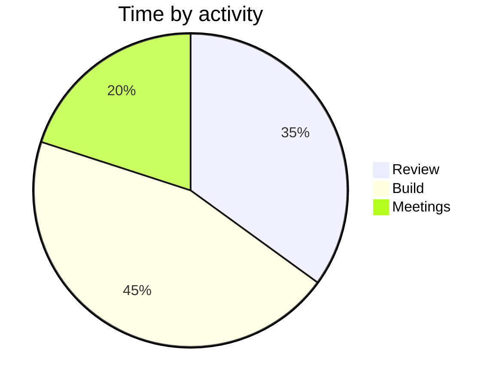
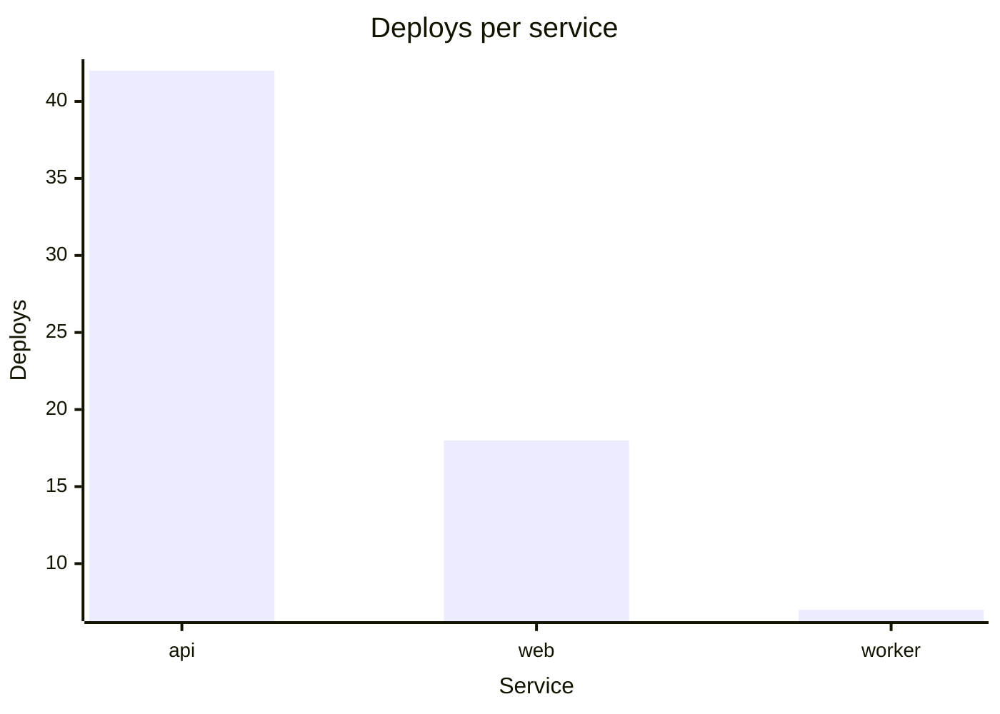

# Channel render surfaces

A chat reply is not limited to prose. The renderer turns a handful of specific
things into real rendered blocks — tables, charts — and leaves everything else
as text. This skill exists to say **which surfaces are available and how to hand
content over to each one**, because a surface you do not know about is one you
will never choose.

It teaches availability, not languages. mermaid and Vega-Lite are widely known
and you already know them; there is no grammar reference here, only one worked
example per surface and the exact limits of what maps.

## The surfaces

| Write this | You get | Reach |
| --- | --- | --- |
| a Markdown table | a rendered table block — **no fence needed** | any tabular data |
| ` ```mermaid ` | a chart | `pie`; `xychart-beta` for `bar` and `line` |
| ` ```vega-lite ` | a chart | `bar`, `area`, `line`, `pie` — the widest set |
| ` ```blockkit ` | the blocks as written | anything Block Kit can express |
| ` ```slack-raw ` | the source, deliberately shown | escape hatch |
| ` ``` ` (unnamed) | the source | ordinary code |

**The fence language is the entire request.** There is no marker to add beside
it, no second word in the info string, and no reply-level switch. A fence naming
`mermaid`, `vega-lite` or `blockkit` renders; every other fence is source.

`mermaid` and `vega-lite` are the portable pair — a reader on any other renderer
still sees a diagram, or at worst a near-prose description of one. `blockkit` is
this channel only. Prefer a portable fence unless the exact block shape matters.

## A Markdown table is usually the right answer

Reach for a table first, and reach for a chart only when **shape carries the
meaning** — a trend that should be seen rising, a split that should be seen as
proportions, a comparison whose gaps matter more than its numbers.

A table costs nothing: no fence, it converts on its own, it survives anywhere as
readable text, it has no chart caps, and it shows exact values a chart can only
approximate. A short table renders whole. A longer one becomes a paged table
that **sorts and filters in the client** — the row count at which that kicks in
is an operator setting, so write the table and let the renderer decide.

In that paged kind, a column whose cells are all numbers is detected and sorts
as a number rather than as a string, so write plain unadorned numbers in any
column you want sorted correctly.

## What happens when a fence cannot be rendered

**It is shown as source. This is designed behaviour, not a failure.** The rule
throughout is *an unrecognised shape is declined, never guessed at* — a chart
that disagrees with its own specification is worse than a specification on
screen.

So a `mermaid` flowchart, a sequence diagram, a Gantt, or a Vega-Lite spec using
a mark that does not map all reach the reader as the source you wrote, visibly
undrawn. Nothing is lost and nothing is mangled. **Choose a fence without
fearing a broken message.**

One consequence worth knowing: when a message breaches a hard limit — a third
chart, too many blocks, too many table characters — the fallback is
all-or-nothing for that *message*, and the whole thing posts as plain text. The
content is intact; only the formatting is gone. Staying inside the caps below is
what avoids it.

## The caps

These decide whether a thing is feasible at all. Check them before designing the
chart, not after.

| Cap | Value |
| --- | --- |
| charts per message | **2** (a third costs the whole message its rendering) |
| pie segments | 12 |
| series per bar/area/line chart | 12 |
| x-axis categories | 20 |
| chart title | 50 characters |
| segment / category / series labels | 20 characters |
| axis titles (`x_label`, `y_label`) | 50 characters |

Titles and labels are **clamped** to their limit rather than declined — a
shortened label still says which slice is which. But two labels that become
identical once clamped decline the chart, because a data point is matched to its
category by label and merging them would draw a wrong chart.

Every series must hold **exactly one value for every category**. A gap is
refused rather than filled with a zero nobody wrote, so make the data
rectangular before charting it. `color` is what makes it non-rectangular most
often: in Vega-Lite `color` splits the data into series, so a `color` used as
decoration rather than as a genuine second dimension asks for a grid that is
almost all gaps. Give `color` a real second field or leave it out — a
one-colour bar chart is what a single series looks like, and is not a defect.

Pie values must be greater than zero.

## Worked examples

One per surface. These are shape references, not syntax tuition.

### Markdown table — no fence

```
| Service | Deploys | Failures |
| --- | ---: | ---: |
| api | 42 | 1 |
| web | 18 | 0 |
| worker | 7 | 2 |
```

### mermaid — pie

````

````

### mermaid — bar or line

`xychart-beta` is the only mermaid diagram that reaches a bar or line chart.
Swap the `bar` keyword for `line` to get a line chart; a plot may name itself,
and that name becomes the series name.

````

````

Declined here, each for a reason the channel cannot express: `horizontal`
orientation (charts draw vertically only), an `x-axis` given a numeric range
instead of a category list, `bar` and `line` plots mixed in one diagram, a plot
whose value count disagrees with the category count, and mermaid 11.16's
per-point labels. The bare `xychart` alias is accepted alongside `xychart-beta`.

### vega-lite — the widest set

A second series comes from a `color` channel, as here. Drop it for one series.

````
```vega-lite
{
  "title": "Deploys and failures",
  "mark": "bar",
  "data": {"values": [
    {"service": "api", "kind": "deploys", "count": 42},
    {"service": "web", "kind": "deploys", "count": 18},
    {"service": "api", "kind": "failures", "count": 1},
    {"service": "web", "kind": "failures", "count": 0}
  ]},
  "encoding": {
    "x": {"field": "service", "type": "nominal", "title": "Service"},
    "y": {"field": "count", "type": "quantitative", "title": "Count"},
    "color": {"field": "kind"}
  }
}
```
````

For a pie, use `"mark": "arc"` with a `theta` channel for the value and a
`color` channel for the label. **Both are required** — an `arc` missing either
has nothing to size or nothing to name its slices, and declines.

### blockkit — when the exact block shape matters

````
```blockkit
[{"type": "section", "text": {"type": "mrkdwn", "text": "*Exactly this block.*"}}]
```
````

Use this only when neither portable fence can say what you mean; it travels
nowhere else. **Field names, types and limits are not in this skill** — see
`slack-block-kit-reference` before hand-writing a payload.

Interactive elements — buttons, selects, inputs, anything carrying an
`action_id` — are refused by default, whatever else is permitted. A reader
cannot tell a block you wrote from a real approval prompt, so this does not
depend on which block types are allowed.

### slack-raw — show the source on purpose

Because rendering is the default, showing a reader what a chart or block looks
like *as source* needs its own word. A bare unnamed fence says the same thing.

````
```slack-raw
pie title This is shown as text, not drawn
```
````

## Which Vega-Lite marks map

The mapping is deliberately strict: **a mark absent from this table is declined,
never approximated by the nearest one present.**

| Mark | Renders as |
| --- | --- |
| `bar` | bar chart |
| `area` | area chart |
| `line` | line chart |
| `arc` | pie chart (Vega-Lite has no `pie` mark; recognised by its `theta` encoding) |

Declined, each because there is no comparable mark to draw it with:

- `point`, `circle`, `square`, `tick` — a scatter needs a continuous x-axis, and
  there isn't one.
- `rect` — a heatmap.
- `rule`, `trail`, `text`, `geoshape`, `image`.
- `boxplot`, `errorbar`, `errorband` — the statistics cannot be shown at all.

Also declined at the spec level, so check these before writing one:

- Anything that makes the spec **more than one chart**: `layer`, `facet`,
  `repeat`, `concat`, `hconcat`, `vconcat`, `spec`, and a `row`, `column` or
  `facet` encoding channel. One block is one chart, and drawing a single panel
  would silently drop the rest.
- Anything that **computes** the values rather than reading them: `transform`,
  and `aggregate`, `bin`, `timeUnit` or `stack` on a channel. Aggregate your data
  yourself and put the results in `data.values`.
- A `sort` anywhere but on `x`, and on `x` any `sort` but an **explicit array**
  of the categories in the order you want them drawn. `["Mon", "Tue", "Wed"]`
  is read and honoured; `"ascending"`, `"-y"` and a sort object are declined,
  because each orders the categories by something that has to be computed first.
  An array may name categories the data does not hold — they are skipped — but
  one that leaves a category out declines, since there is no saying where the
  rest go.
- Data that is not inline: only `data.values` is read, so a `url`, a named
  source or a generated `sequence` all decline.
- A **quantitative `x`**. The x-axis is a list of categories, not a scale, so a
  continuous x would be redrawn at equal spacing. Use `nominal`, `ordinal` or
  `temporal`. A spec with no declared `x.type` whose x values are all numbers is
  treated as the quantitative one it would be inferred to be — declare the type.
- A **non-quantitative `y`**, which is Vega-Lite's horizontal bar chart. Charts
  draw vertically only.
- An `encoding` channel that is neither read nor inert. Read: `x`, `y`, `color`,
  `theta`. Inert and therefore harmless: `tooltip`, `description`, `href`,
  `key`. Anything else declines.

Note that `area` is reachable from `vega-lite` or `blockkit` only — mermaid has
no area chart of any kind.

## Not in this skill

- **mermaid and Vega-Lite syntax.** You know both. Only the limits of what maps
  are recorded above.
- **Block Kit field names, types and limits.** Those are
  `slack-block-kit-reference`, which is where to go before hand-writing a
  `blockkit` payload.
- **Purpose-built skills' output.** A skill that already emits its own validated
  fenced output has decided how its data is presented; that decision is its own,
  and this skill does not override it.
